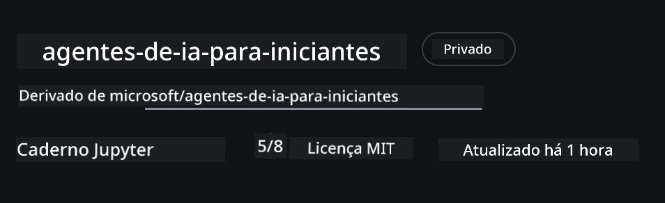
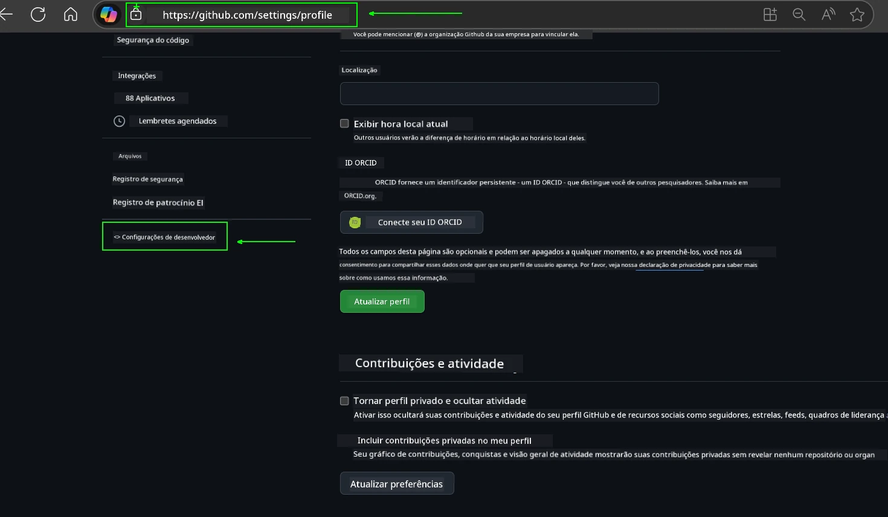
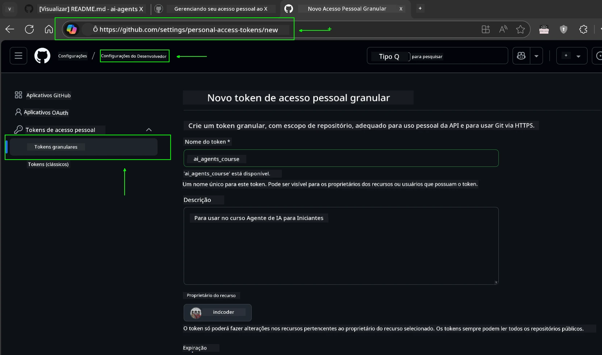
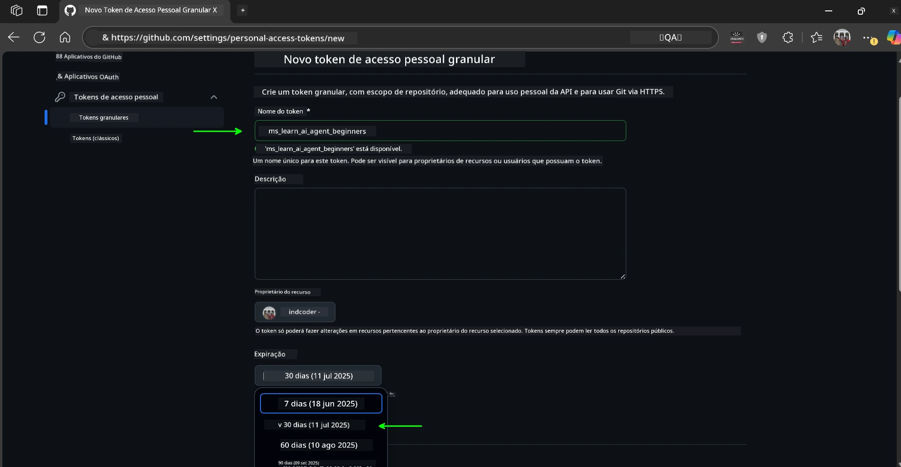
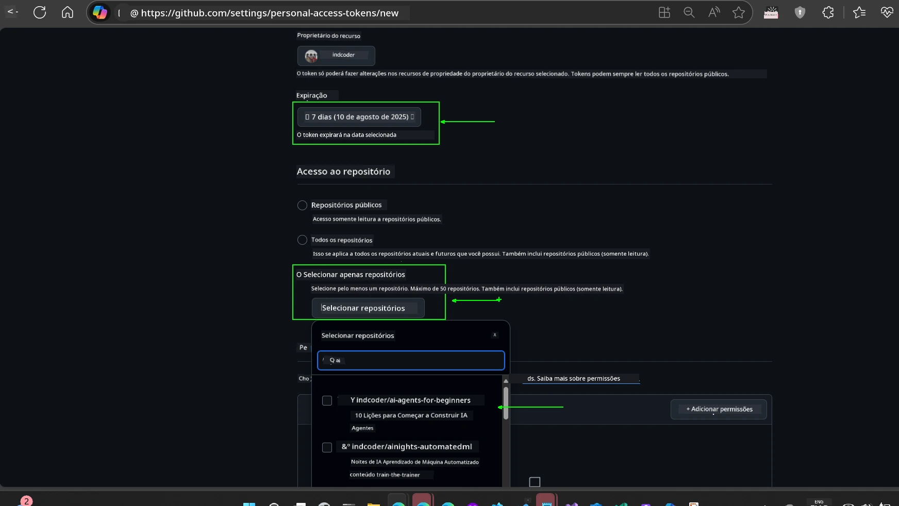
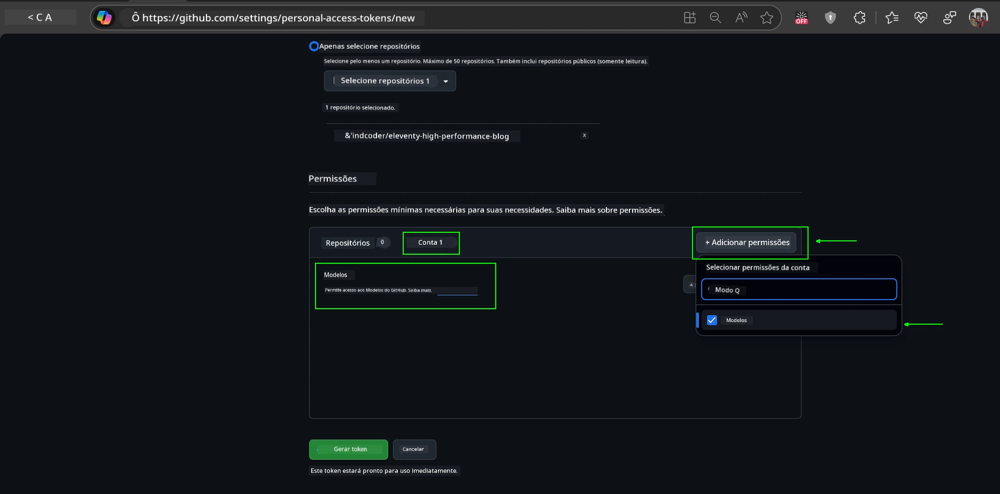
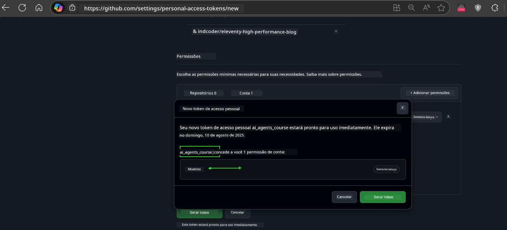
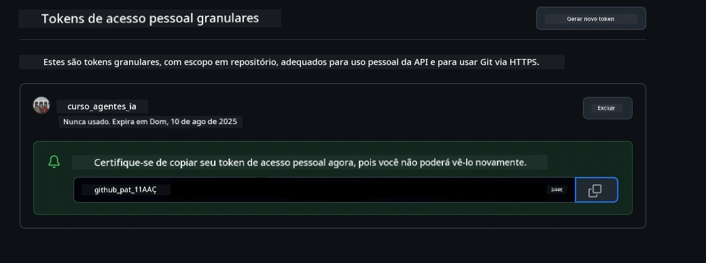
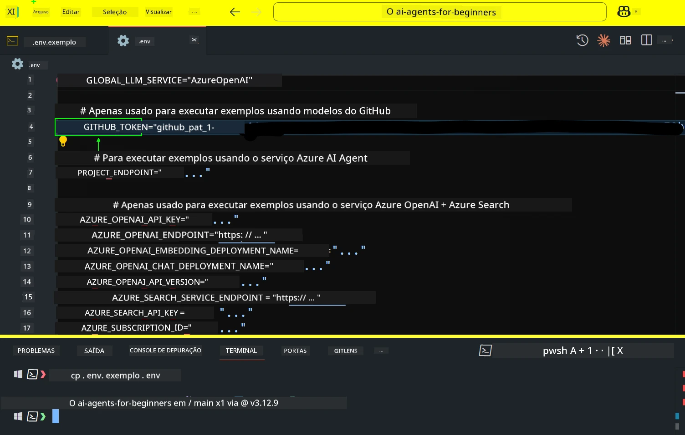
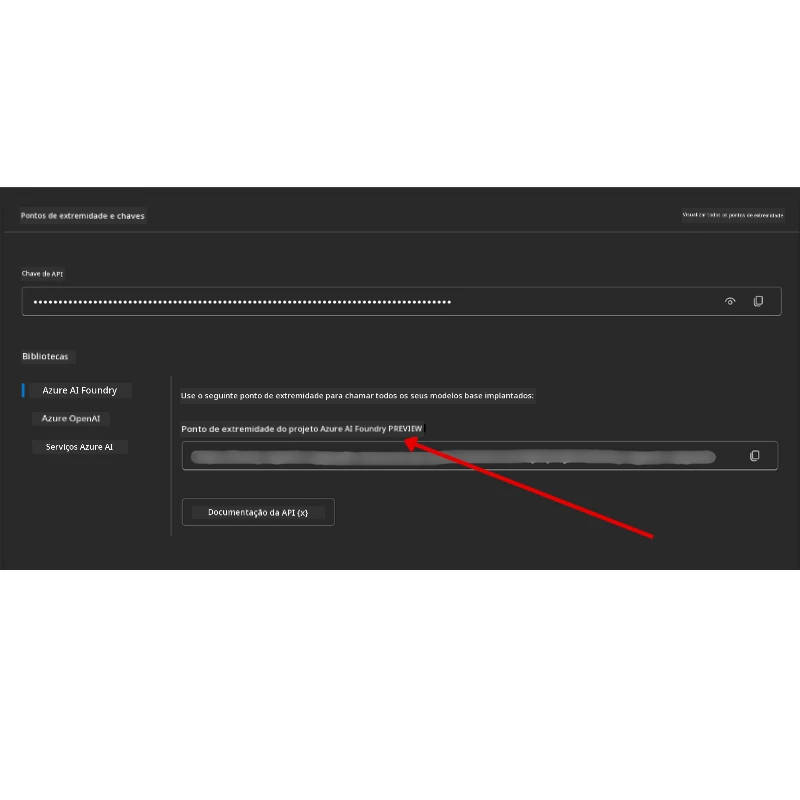

<!--
CO_OP_TRANSLATOR_METADATA:
{
  "original_hash": "63b1a8f6e840df15934935b728e569f0",
  "translation_date": "2025-12-03T14:18:51+00:00",
  "source_file": "00-course-setup/README.md",
  "language_code": "br"
}
-->
# Configuração do Curso

## Introdução

Esta lição abordará como executar os exemplos de código deste curso.

## Junte-se a Outros Estudantes e Obtenha Ajuda

Antes de começar a clonar seu repositório, junte-se ao [canal do Discord AI Agents For Beginners](https://aka.ms/ai-agents/discord) para obter ajuda com a configuração, tirar dúvidas sobre o curso ou se conectar com outros estudantes.

## Clone ou Faça um Fork deste Repositório

Para começar, por favor, clone ou faça um fork do Repositório GitHub. Isso criará sua própria versão do material do curso para que você possa executar, testar e ajustar o código!

Isso pode ser feito clicando no link para <a href="https://github.com/microsoft/ai-agents-for-beginners/fork" target="_blank">fazer o fork do repositório</a>.

Agora você deve ter sua própria versão do curso no seguinte link:



### Clone Superficial (recomendado para workshop / Codespaces)

  >O repositório completo pode ser grande (~3 GB) ao baixar todo o histórico e todos os arquivos. Se você está apenas participando do workshop ou precisa de apenas algumas pastas de lições, um clone superficial (ou esparso) evita a maior parte desse download, truncando o histórico e/ou ignorando blobs.

#### Clone superficial rápido — histórico mínimo, todos os arquivos

Substitua `<your-username>` nos comandos abaixo pelo URL do seu fork (ou o URL upstream, se preferir).

Para clonar apenas o histórico do commit mais recente (download pequeno):

```bash|powershell
git clone --depth 1 https://github.com/<your-username>/ai-agents-for-beginners.git
```

Para clonar um branch específico:

```bash|powershell
git clone --depth 1 --branch <branch-name> https://github.com/<your-username>/ai-agents-for-beginners.git
```

#### Clone parcial (esparso) — blobs mínimos + apenas pastas selecionadas

Isso utiliza clone parcial e checkout esparso (requer Git 2.25+ e Git moderno com suporte a clone parcial recomendado):

```bash|powershell
git clone --depth 1 --filter=blob:none --sparse https://github.com/<your-username>/ai-agents-for-beginners.git
```

Acesse a pasta do repositório:

```bash|powershell
cd ai-agents-for-beginners
```

Depois, especifique quais pastas você deseja (o exemplo abaixo mostra duas pastas):

```bash|powershell
git sparse-checkout set 00-course-setup 01-intro-to-ai-agents
```

Após clonar e verificar os arquivos, se você precisar apenas dos arquivos e quiser liberar espaço (sem histórico do Git), exclua os metadados do repositório (💀irreversível — você perderá toda a funcionalidade do Git: sem commits, pulls, pushes ou acesso ao histórico).

```bash
# zsh/bash
rm -rf .git
```

```powershell
# PowerShell
Remove-Item -Recurse -Force .git
```

#### Usando GitHub Codespaces (recomendado para evitar downloads locais grandes)

- Crie um novo Codespace para este repositório via a [interface do GitHub](https://github.com/codespaces).  

- No terminal do Codespace recém-criado, execute um dos comandos de clone superficial/esparso acima para trazer apenas as pastas de lições que você precisa para o espaço de trabalho do Codespace.
- Opcional: após clonar dentro do Codespaces, remova o .git para recuperar espaço extra (veja os comandos de remoção acima).
- Nota: Se preferir abrir o repositório diretamente no Codespaces (sem um clone extra), esteja ciente de que o Codespaces construirá o ambiente devcontainer e ainda pode provisionar mais do que você precisa. Clonar uma cópia superficial dentro de um Codespace novo dá mais controle sobre o uso do disco.

#### Dicas

- Sempre substitua o URL do clone pelo seu fork se quiser editar/commitar.
- Se mais tarde precisar de mais histórico ou arquivos, você pode buscá-los ou ajustar o checkout esparso para incluir pastas adicionais.

## Executando o Código

Este curso oferece uma série de Jupyter Notebooks que você pode executar para obter experiência prática na construção de Agentes de IA.

Os exemplos de código utilizam:

**Requer Conta no GitHub - Gratuito**:

1) Framework Semantic Kernel + Marketplace de Modelos do GitHub. Identificado como (semantic-kernel.ipynb)
2) Framework AutoGen + Marketplace de Modelos do GitHub. Identificado como (autogen.ipynb)

**Requer Assinatura do Azure**:

3) Azure AI Foundry + Serviço de Agente de IA do Azure. Identificado como (azureaiagent.ipynb)

Incentivamos você a experimentar os três tipos de exemplos para ver qual funciona melhor para você.

Qualquer que seja a opção escolhida, ela determinará quais etapas de configuração você precisará seguir abaixo:

## Requisitos

- Python 3.12+
  - **NOTA**: Se você não tiver o Python 3.12 instalado, certifique-se de instalá-lo. Em seguida, crie seu venv usando python3.12 para garantir que as versões corretas sejam instaladas a partir do arquivo requirements.txt.
  
    >Exemplo

    Crie o diretório do ambiente virtual Python:

    ```bash|powershell
    python -m venv venv
    ```

    Em seguida, ative o ambiente venv para:

    ```bash
    # zsh/bash
    source venv/bin/activate
    ```
  
    ```dos
    # Command Prompt for Windows
    venv\Scripts\activate
    ```

- .NET 10+: Para os códigos de exemplo que utilizam .NET, certifique-se de instalar o [.NET 10 SDK](https://dotnet.microsoft.com/download/dotnet/10.0) ou posterior. Depois, verifique a versão do SDK .NET instalada:

    ```bash|powershell
    dotnet --list-sdks
    ```

- Uma Conta no GitHub - Para acesso ao Marketplace de Modelos do GitHub
- Assinatura do Azure - Para acesso ao Azure AI Foundry
- Conta do Azure AI Foundry - Para acesso ao Serviço de Agente de IA do Azure

Incluímos um arquivo `requirements.txt` na raiz deste repositório que contém todos os pacotes Python necessários para executar os exemplos de código.

Você pode instalá-los executando o seguinte comando no terminal na raiz do repositório:

```bash|powershell
pip install -r requirements.txt
```

Recomendamos criar um ambiente virtual Python para evitar conflitos e problemas.

## Configuração do VSCode

Certifique-se de que está usando a versão correta do Python no VSCode.


## Configuração para Exemplos usando Modelos do GitHub 

### Passo 1: Recupere Seu Token de Acesso Pessoal (PAT) do GitHub

Este curso utiliza o Marketplace de Modelos do GitHub, fornecendo acesso gratuito a Modelos de Linguagem de Grande Escala (LLMs) que você usará para construir Agentes de IA.

Para usar os Modelos do GitHub, você precisará criar um [Token de Acesso Pessoal do GitHub](https://docs.github.com/en/authentication/keeping-your-account-and-data-secure/managing-your-personal-access-tokens).

Isso pode ser feito acessando as <a href="https://github.com/settings/personal-access-tokens" target="_blank">configurações de Tokens de Acesso Pessoal</a> na sua conta do GitHub.

Por favor, siga o [Princípio do Menor Privilégio](https://docs.github.com/en/get-started/learning-to-code/storing-your-secrets-safely) ao criar seu token. Isso significa que você deve conceder ao token apenas as permissões necessárias para executar os exemplos de código deste curso.

1. Selecione a opção `Fine-grained tokens` no lado esquerdo da tela, navegando até as **Configurações do Desenvolvedor**.

   

   Em seguida, selecione `Generate new token`.

   

2. Insira um nome descritivo para seu token que reflita seu propósito, facilitando sua identificação posteriormente.

    🔐 Recomendação de Duração do Token

    Duração recomendada: 30 dias  
    Para uma postura mais segura, você pode optar por um período mais curto — como 7 dias 🛡️  
    É uma ótima maneira de definir uma meta pessoal e concluir o curso enquanto sua motivação está alta 🚀.

    

3. Limite o escopo do token ao seu fork deste repositório.

    

4. Restrinja as permissões do token: Em **Permissions**, clique na aba **Account** e no botão "+ Add permissions". Um menu suspenso aparecerá. Procure por **Models** e marque a caixa correspondente.

    

5. Verifique as permissões necessárias antes de gerar o token. 

6. Antes de gerar o token, certifique-se de estar pronto para armazená-lo em um local seguro, como um gerenciador de senhas, pois ele não será exibido novamente após sua criação. 

Copie seu novo token que acabou de criar. Agora você o adicionará ao arquivo `.env` incluído neste curso.

### Passo 2: Crie Seu Arquivo `.env`

Para criar seu arquivo `.env`, execute o seguinte comando no terminal.

```bash
# zsh/bash
cp .env.example .env
```

```powershell
# PowerShell
Copy-Item .env.example .env
```

Isso copiará o arquivo de exemplo e criará um `.env` no seu diretório, onde você preencherá os valores das variáveis de ambiente.

Com seu token copiado, abra o arquivo `.env` no seu editor de texto favorito e cole seu token no campo `GITHUB_TOKEN`.



Agora você deve conseguir executar os exemplos de código deste curso.

## Configuração para Exemplos usando Azure AI Foundry e Serviço de Agente de IA do Azure

### Passo 1: Recupere o Endpoint do Seu Projeto no Azure

Siga os passos para criar um hub e projeto no Azure AI Foundry encontrados aqui: [Visão geral dos recursos do Hub](https://learn.microsoft.com/azure/ai-foundry/concepts/ai-resources)

Depois de criar seu projeto, você precisará recuperar a string de conexão do seu projeto.

Isso pode ser feito acessando a página **Visão Geral** do seu projeto no portal do Azure AI Foundry.



### Passo 2: Crie Seu Arquivo `.env`

Para criar seu arquivo `.env`, execute o seguinte comando no terminal.

```bash
# zsh/bash
cp .env.example .env
```

```powershell
# PowerShell
Copy-Item .env.example .env
```

Isso copiará o arquivo de exemplo e criará um `.env` no seu diretório, onde você preencherá os valores das variáveis de ambiente.

Com seu token copiado, abra o arquivo `.env` no seu editor de texto favorito e cole seu token no campo `PROJECT_ENDPOINT`.

### Passo 3: Faça Login no Azure

Como uma prática recomendada de segurança, usaremos [autenticação sem chave](https://learn.microsoft.com/azure/developer/ai/keyless-connections?tabs=csharp%2Cazure-cli?WT.mc_id=academic-105485-koreyst) para autenticar no Azure OpenAI com o Microsoft Entra ID. 

Em seguida, abra um terminal e execute `az login --use-device-code` para fazer login na sua conta do Azure.

Depois de fazer login, selecione sua assinatura no terminal.

## Variáveis de Ambiente Adicionais - Azure Search e Azure OpenAI 

Para a Lição Agentic RAG - Lição 5 - há exemplos que utilizam Azure Search e Azure OpenAI.

Se você quiser executar esses exemplos, precisará adicionar as seguintes variáveis de ambiente ao seu arquivo `.env`:

### Página de Visão Geral (Projeto)

- `AZURE_SUBSCRIPTION_ID` - Verifique **Detalhes do Projeto** na página **Visão Geral** do seu projeto.

- `AZURE_AI_PROJECT_NAME` - Veja no topo da página **Visão Geral** do seu projeto.

- `AZURE_OPENAI_SERVICE` - Encontre isso na aba **Capacidades Incluídas** para **Serviço Azure OpenAI** na página **Visão Geral**.

### Centro de Gerenciamento

- `AZURE_OPENAI_RESOURCE_GROUP` - Vá para **Propriedades do Projeto** na página **Visão Geral** do **Centro de Gerenciamento**.

- `GLOBAL_LLM_SERVICE` - Em **Recursos Conectados**, encontre o nome da conexão **Azure AI Services**. Se não listado, verifique no **portal do Azure** em seu grupo de recursos o nome do recurso de AI Services.

### Página de Modelos + Endpoints

- `AZURE_OPENAI_EMBEDDING_DEPLOYMENT_NAME` - Selecione seu modelo de embedding (ex.: `text-embedding-ada-002`) e anote o **Nome do Deployment** nos detalhes do modelo.

- `AZURE_OPENAI_CHAT_DEPLOYMENT_NAME` - Selecione seu modelo de chat (ex.: `gpt-4o-mini`) e anote o **Nome do Deployment** nos detalhes do modelo.

### Portal do Azure

- `AZURE_OPENAI_ENDPOINT` - Procure por **Azure AI services**, clique nele, depois vá para **Gerenciamento de Recursos**, **Chaves e Endpoint**, role para baixo até "Endpoints do Azure OpenAI" e copie o que diz "APIs de Linguagem".

- `AZURE_OPENAI_API_KEY` - Na mesma tela, copie a CHAVE 1 ou CHAVE 2.

- `AZURE_SEARCH_SERVICE_ENDPOINT` - Encontre seu recurso **Azure AI Search**, clique nele e veja **Visão Geral**.

- `AZURE_SEARCH_API_KEY` - Depois vá para **Configurações** e depois **Chaves** para copiar a chave de administrador primária ou secundária.

### Página Externa

- `AZURE_OPENAI_API_VERSION` - Visite a página [Ciclo de vida da versão da API](https://learn.microsoft.com/azure/ai-services/openai/api-version-deprecation#latest-ga-api-release) em **Última versão GA da API**.

### Configuração de autenticação sem chave

Em vez de codificar suas credenciais, usaremos uma conexão sem chave com o Azure OpenAI. Para isso, importaremos `DefaultAzureCredential` e posteriormente chamaremos a função `DefaultAzureCredential` para obter a credencial.

```python
# Python
from azure.identity import DefaultAzureCredential, InteractiveBrowserCredential
```

## Travado em Algum Lugar?
Se você tiver algum problema ao executar esta configuração, entre no nosso <a href="https://discord.gg/kzRShWzttr" target="_blank">Discord da Comunidade Azure AI</a> ou <a href="https://github.com/microsoft/ai-agents-for-beginners/issues?WT.mc_id=academic-105485-koreyst" target="_blank">crie um problema</a>.

## Próxima Aula

Agora você está pronto para executar o código deste curso. Aproveite para aprender mais sobre o mundo dos Agentes de IA!

[Introdução aos Agentes de IA e Casos de Uso de Agentes](../01-intro-to-ai-agents/README.md)

---

<!-- CO-OP TRANSLATOR DISCLAIMER START -->
**Aviso Legal**:  
Este documento foi traduzido utilizando o serviço de tradução por IA [Co-op Translator](https://github.com/Azure/co-op-translator). Embora nos esforcemos para garantir a precisão, esteja ciente de que traduções automáticas podem conter erros ou imprecisões. O documento original em seu idioma nativo deve ser considerado a fonte oficial. Para informações críticas, recomenda-se a tradução profissional humana. Não nos responsabilizamos por quaisquer mal-entendidos ou interpretações incorretas decorrentes do uso desta tradução.
<!-- CO-OP TRANSLATOR DISCLAIMER END -->