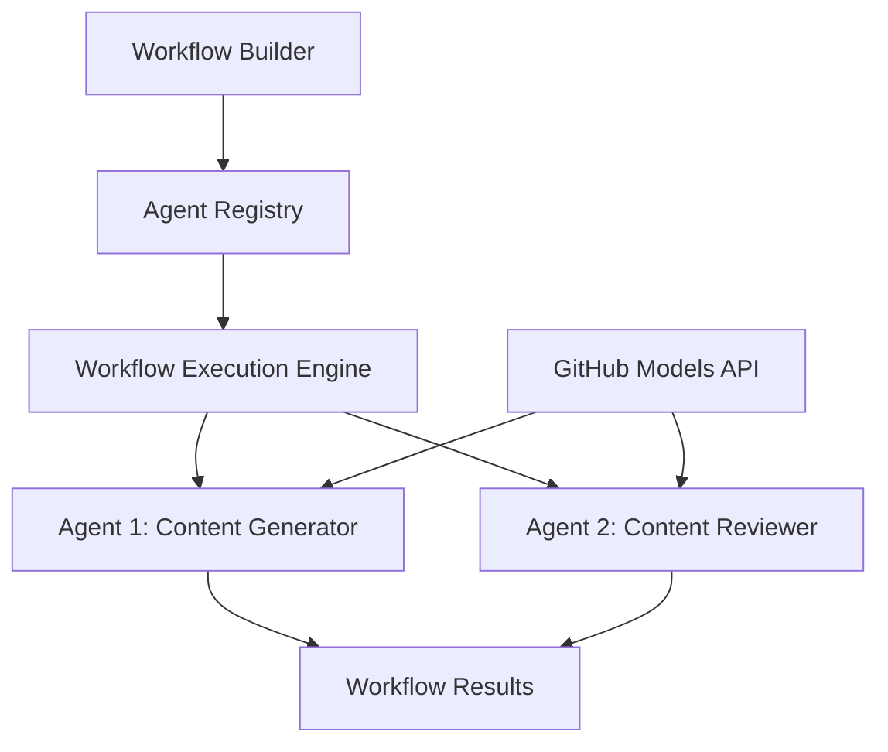

<!--
CO_OP_TRANSLATOR_METADATA:
{
  "original_hash": "034158688d0a45aae06dcbb21b0da5ae",
  "translation_date": "2025-11-11T12:47:50+00:00",
  "source_file": "08-multi-agent/code_samples/workflows-agent-framework/dotNET/01.dotnet-agent-framework-workflow-ghmodel-basic.md",
  "language_code": "br"
}
-->
# 🔄 Fluxos de Trabalho Básicos com Modelos do GitHub (.NET)

## 📋 Tutorial de Orquestração de Fluxos de Trabalho

Este notebook demonstra como construir fluxos de trabalho sofisticados de **agentes** usando o Microsoft Agent Framework para .NET e Modelos do GitHub. Você aprenderá a criar processos empresariais de múltiplas etapas onde agentes de IA colaboram para realizar tarefas complexas por meio de padrões estruturados de orquestração.

## 🎯 Objetivos de Aprendizagem

### 🏗️ **Fundamentos da Arquitetura de Fluxos de Trabalho**
- **Workflow Builder**: Projetar e orquestrar processos de IA complexos e de múltiplas etapas
- **Coordenação de Agentes**: Coordenar múltiplos agentes especializados dentro dos fluxos de trabalho
- **Integração com Modelos do GitHub**: Utilizar o serviço de inferência de modelos de IA do GitHub nos fluxos de trabalho
- **Design Visual de Fluxos de Trabalho**: Criar e visualizar estruturas de fluxos de trabalho para melhor compreensão

### 🔄 **Padrões de Orquestração de Processos**
- **Processamento Sequencial**: Encadear múltiplas tarefas de agentes em ordem lógica
- **Gerenciamento de Estado**: Manter o contexto e o fluxo de dados entre as etapas do fluxo de trabalho
- **Tratamento de Erros**: Implementar recuperação robusta de erros e resiliência nos fluxos de trabalho
- **Otimização de Desempenho**: Projetar fluxos de trabalho eficientes para operações em escala empresarial

### 🏢 **Aplicações de Fluxos de Trabalho Empresariais**
- **Automação de Processos de Negócios**: Automatizar fluxos de trabalho organizacionais complexos
- **Pipeline de Produção de Conteúdo**: Fluxos editoriais com etapas de revisão e aprovação
- **Automação de Atendimento ao Cliente**: Resolução de consultas de clientes em múltiplas etapas
- **Fluxos de Trabalho de Processamento de Dados**: ETL com transformação impulsionada por IA

## ⚙️ Pré-requisitos e Configuração

### 📦 **Pacotes NuGet Necessários**

Esta demonstração de fluxo de trabalho utiliza vários pacotes-chave do .NET:

```xml
<!-- Core AI Framework -->
<PackageReference Include="Microsoft.Extensions.AI" Version="9.9.0" />

<!-- Agent Framework (Local Development) -->
<!-- Microsoft.Agents.AI.dll - Core agent abstractions -->
<!-- Microsoft.Agents.AI.OpenAI.dll - OpenAI/GitHub Models integration -->

<!-- Configuration and Environment -->
<PackageReference Include="DotNetEnv" Version="3.1.1" />
```

### 🔑 **Configuração dos Modelos do GitHub**

**Configuração do Ambiente (arquivo .env):**
```env
GITHUB_TOKEN=your_github_personal_access_token
GITHUB_ENDPOINT=https://models.inference.ai.azure.com
GITHUB_MODEL_ID=gpt-4o-mini
```

**Acesso aos Modelos do GitHub:**
1. Inscreva-se nos Modelos do GitHub (atualmente em preview)
2. Gere um token de acesso pessoal com permissões para acesso aos modelos
3. Configure as variáveis de ambiente conforme mostrado acima

### 🏗️ **Visão Geral da Arquitetura de Fluxos de Trabalho**



**Componentes Principais:**
- **WorkflowBuilder**: Motor principal de orquestração para projetar fluxos de trabalho
- **AIAgent**: Agentes especializados individuais com capacidades específicas
- **GitHub Models Client**: Integração com o serviço de inferência de modelos de IA
- **Execution Context**: Gerencia o estado e o fluxo de dados entre as etapas do fluxo de trabalho

## 🎨 **Padrões de Design de Fluxos de Trabalho Empresariais**

### 📝 **Fluxo de Trabalho de Produção de Conteúdo**
```
User Request → Content Generation → Quality Review → Final Output
```

### 🔍 **Pipeline de Processamento de Documentos**
```
Document Input → Analysis → Extraction → Validation → Structured Output
```

### 💼 **Fluxo de Trabalho de Inteligência Empresarial**
```
Data Collection → Processing → Analysis → Report Generation → Distribution
```

### 🤝 **Automação de Atendimento ao Cliente**
```
Customer Inquiry → Classification → Processing → Response Generation → Follow-up
```

## 🏢 **Benefícios Empresariais**

### 🎯 **Confiabilidade e Escalabilidade**
- **Execução Determinística**: Resultados consistentes e repetíveis nos fluxos de trabalho
- **Recuperação de Erros**: Tratamento eficaz de falhas em qualquer etapa do fluxo de trabalho
- **Monitoramento de Desempenho**: Acompanhar métricas de execução e oportunidades de otimização
- **Gerenciamento de Recursos**: Alocação e utilização eficiente de recursos de modelos de IA

### 🔒 **Segurança e Conformidade**
- **Autenticação Segura**: Autenticação baseada em token do GitHub para acesso à API
- **Trilhas de Auditoria**: Registro completo da execução do fluxo de trabalho e pontos de decisão
- **Controle de Acesso**: Permissões granulares para execução e monitoramento de fluxos de trabalho
- **Privacidade de Dados**: Manipulação segura de informações sensíveis ao longo dos fluxos de trabalho

### 📊 **Observabilidade e Gerenciamento**
- **Design Visual de Fluxos de Trabalho**: Representação clara dos fluxos de processo e dependências
- **Monitoramento de Execução**: Rastreamento em tempo real do progresso e desempenho dos fluxos de trabalho
- **Relatórios de Erros**: Análise detalhada de erros e capacidades de depuração
- **Análise de Desempenho**: Métricas para otimização e planejamento de capacidade

Vamos construir seu primeiro fluxo de trabalho de IA pronto para empresas! 🚀

## 💻 Executando o Código

A implementação completa está disponível em `01.dotnet-agent-framework-workflow-ghmodel-basic.cs`. Este arquivo demonstra:

1. **Configuração do Ambiente** - Carregando credenciais dos Modelos do GitHub a partir do arquivo `.env`
2. **Configuração do Cliente OpenAI** - Configurando o cliente para usar o endpoint dos Modelos do GitHub
3. **Criação de Agentes** - Definindo agentes especializados (Recepção e Concierge)
4. **Workflow Builder** - Criando um fluxo de trabalho de múltiplos agentes com processamento sequencial
5. **Execução do Fluxo de Trabalho** - Executando o fluxo de trabalho com resultados em streaming

### 🚀 Executando o Exemplo

```bash
# Make the script executable (Unix/Linux/macOS)
chmod +x 01.dotnet-agent-framework-workflow-ghmodel-basic.cs

# Run the workflow
./01.dotnet-agent-framework-workflow-ghmodel-basic.cs
```

Ou no Windows:
```powershell
dotnet run 01.dotnet-agent-framework-workflow-ghmodel-basic.cs
```

### 📝 Saída Esperada

O fluxo de trabalho irá:
1. Aceitar sua solicitação de destino de viagem ("Eu gostaria de ir para Paris")
2. O agente da Recepção fornece uma recomendação inicial
3. O agente Concierge revisa e refina a recomendação
4. A saída final exibe o fluxo completo da conversa

### 🔧 Personalização

Você pode personalizar o fluxo de trabalho:
- Modificando as instruções dos agentes para alterar seu comportamento
- Adicionando mais agentes para criar fluxos de trabalho complexos de múltiplas etapas
- Alterando a mensagem do usuário para testar diferentes cenários
- Ajustando as conexões do fluxo de trabalho para criar diferentes padrões de execução

---

<!-- CO-OP TRANSLATOR DISCLAIMER START -->
**Aviso Legal**:  
Este documento foi traduzido utilizando o serviço de tradução por IA [Co-op Translator](https://github.com/Azure/co-op-translator). Embora nos esforcemos para garantir a precisão, esteja ciente de que traduções automáticas podem conter erros ou imprecisões. O documento original em seu idioma nativo deve ser considerado a fonte autoritativa. Para informações críticas, recomenda-se a tradução profissional humana. Não nos responsabilizamos por quaisquer mal-entendidos ou interpretações incorretas decorrentes do uso desta tradução.
<!-- CO-OP TRANSLATOR DISCLAIMER END -->