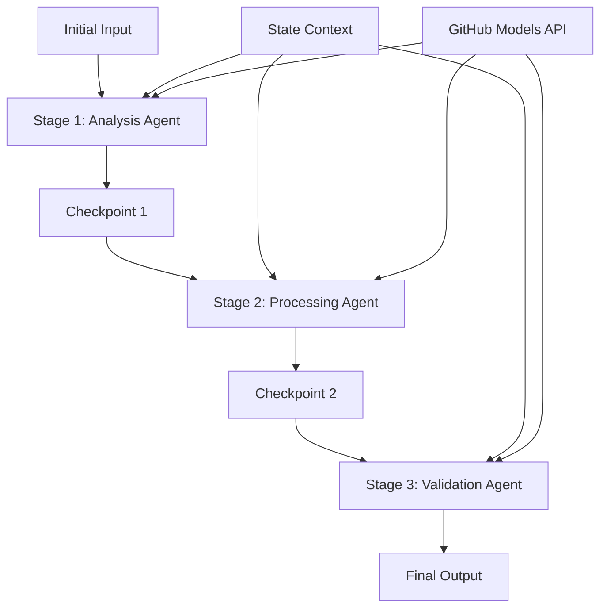

<!--
CO_OP_TRANSLATOR_METADATA:
{
  "original_hash": "1be9c8dcbd79a02d33d2c138684c1394",
  "translation_date": "2025-11-11T13:50:19+00:00",
  "source_file": "08-multi-agent/code_samples/workflows-agent-framework/dotNET/02.dotnet-agent-framework-workflow-ghmodel-sequential.md",
  "language_code": "br"
}
-->
# ⏩ Fluxos de Trabalho Sequenciais com Modelos do GitHub (.NET)

## 📋 Tutorial Avançado de Processamento Sequencial

Este notebook demonstra **padrões de fluxo de trabalho sequenciais** usando o Microsoft Agent Framework para .NET e Modelos do GitHub. Você aprenderá a construir pipelines de processamento sofisticados, passo a passo, onde os agentes executam em uma ordem específica, com cada etapa se baseando nos resultados da etapa anterior.

## 🎯 Objetivos de Aprendizagem

### 🔄 **Arquitetura de Processamento Sequencial**
- **Design de Fluxo de Trabalho Linear**: Crie pipelines de processamento passo a passo com dependências claras
- **Gerenciamento de Estado**: Mantenha o contexto e o fluxo de dados entre as etapas do fluxo de trabalho sequencial
- **Integração com Modelos do GitHub**: Aproveite os modelos de IA do GitHub em fluxos de trabalho .NET de múltiplas etapas
- **Padrões de Pipeline Empresarial**: Construa sistemas de processamento sequencial prontos para produção

### 🏗️ **Padrões Avançados de Sequenciamento**
- **Processamento com Portões de Etapas**: Implemente pontos de validação entre as etapas do fluxo de trabalho
- **Preservação de Contexto**: Mantenha o estado e o conhecimento acumulado em todas as etapas
- **Propagação de Erros**: Lide com falhas de forma eficiente em cadeias de processamento sequencial
- **Otimização de Desempenho**: Execução sequencial eficiente com sobrecarga mínima

### 🏢 **Aplicações Sequenciais Empresariais**
- **Pipeline de Processamento de Documentos**: Análise, transformação e validação de documentos em múltiplas etapas
- **Fluxos de Trabalho de Garantia de Qualidade**: Revisão, validação e processos de aprovação sequenciais
- **Pipeline de Produção de Conteúdo**: Pesquisa → Escrita → Edição → Revisão → Publicação
- **Automação de Processos de Negócios**: Fluxos de trabalho empresariais em várias etapas com dependências claras

## ⚙️ Pré-requisitos e Configuração

### 📦 **Pacotes NuGet Necessários**

Pacotes essenciais para fluxos de trabalho sequenciais em .NET:

```xml
<!-- Core AI Framework -->
<PackageReference Include="Microsoft.Extensions.AI" Version="9.9.0" />

<!-- Client Model Abstractions -->
<PackageReference Include="System.ClientModel" Version="1.6.1.0" />

<!-- Azure Identity and Async LINQ Support -->
<PackageReference Include="Azure.Identity" Version="1.15.0" />
<PackageReference Include="System.Linq.Async" Version="6.0.3" />

<!-- Local Agent Framework References -->
<!-- Microsoft.Agents.AI.dll - Core agent abstractions -->
<!-- Microsoft.Agents.AI.OpenAI.dll - GitHub Models integration -->
```

### 🔑 **Configuração de Modelos do GitHub**

**Configuração de Ambiente (.env file):**
```env
GITHUB_TOKEN=your_github_personal_access_token
GITHUB_ENDPOINT=https://models.inference.ai.azure.com
GITHUB_MODEL_ID=gpt-4o-mini
```

**Gerenciamento de Configuração:**
```csharp
// Load environment variables securely
Env.Load("../../../.env");
var githubToken = Environment.GetEnvironmentVariable("GITHUB_TOKEN");
var githubEndpoint = Environment.GetEnvironmentVariable("GITHUB_ENDPOINT");
var modelId = Environment.GetEnvironmentVariable("GITHUB_MODEL_ID");
```

### 🏗️ **Arquitetura de Fluxo de Trabalho Sequencial**



**Componentes Principais:**
- **Agentes Sequenciais**: Agentes especializados para cada etapa de processamento
- **Contexto de Estado**: Mantém dados acumulados e decisões entre as etapas
- **Pontos de Verificação**: Pontos de validação entre as etapas para garantir qualidade e consistência
- **Cliente de Modelos do GitHub**: Acesso consistente aos modelos de IA em todas as etapas do fluxo de trabalho

## 🎨 **Padrões de Design de Fluxo de Trabalho Sequencial**

### 📝 **Pipeline de Processamento de Documentos**
```
Raw Document → Content Extraction → Analysis → Validation → Structured Output
```

### 🎯 **Fluxo de Trabalho de Criação de Conteúdo**
```
Brief/Requirements → Research → Content Creation → Review → Final Polish
```

### 🔍 **Pipeline de Garantia de Qualidade**
```
Initial Review → Technical Validation → Compliance Check → Final Approval
```

### 💼 **Fluxo de Trabalho de Inteligência Empresarial**
```
Data Collection → Processing → Analysis → Report Generation → Distribution
```

## 🏢 **Benefícios Sequenciais Empresariais**

### 🎯 **Confiabilidade e Qualidade**
- **Processamento Determinístico**: Resultados consistentes e repetíveis através de etapas estruturadas
- **Portões de Qualidade**: Pontos de validação garantem qualidade em cada etapa
- **Isolamento de Erros**: Problemas em uma etapa não se propagam para etapas subsequentes
- **Rastreabilidade**: Rastreamento completo de decisões e transformações em cada etapa

### 📈 **Escalabilidade e Desempenho**
- **Design Modular**: Cada etapa pode ser otimizada de forma independente
- **Gerenciamento de Recursos**: Alocação eficiente de recursos de modelos de IA entre as etapas
- **Otimização de Estado**: Transferência mínima de estado entre etapas para desempenho ideal
- **Grupos de Etapas Paralelas**: Múltiplos fluxos de trabalho sequenciais podem ser executados em paralelo

### 🔒 **Segurança e Conformidade**
- **Segurança por Etapa**: Políticas de segurança diferentes para diferentes etapas de processamento
- **Validação de Dados**: Garantir integridade e conformidade dos dados em cada ponto de verificação
- **Controle de Acesso**: Permissões granulares para diferentes etapas do fluxo de trabalho
- **Conformidade Regulamentar**: Atender aos requisitos regulatórios através de processamento estruturado

### 📊 **Monitoramento e Análise**
- **Métricas por Etapa**: Monitoramento de desempenho para cada etapa do fluxo de trabalho
- **Identificação de Gargalos**: Identificar e otimizar etapas lentas
- **Métricas de Qualidade**: Acompanhar qualidade e taxas de sucesso em cada etapa
- **Otimização de Processos**: Melhoria contínua baseada em análises por etapa

Vamos construir pipelines robustos de processamento de IA sequencial! 🚀

## 💻 Executando o Código

A implementação completa está disponível em `02.dotnet-agent-framework-workflow-ghmodel-sequential.cs`. Este arquivo demonstra um **fluxo de trabalho de análise de móveis em três etapas**:

1. **Etapa 1 - Agente de Vendas**: Analisa imagens de móveis e fornece sugestões de compra
2. **Etapa 2 - Agente de Preços**: Fornece detalhamento de preços e opções de orçamento
3. **Etapa 3 - Agente de Cotação**: Gera um documento de cotação profissional em formato Markdown

### 🏗️ **Arquitetura do Fluxo de Trabalho**

```
Image Input → Sales Analysis → Price Estimation → Quote Generation → Final Output
```

Cada agente:
- Recebe a saída da etapa anterior como contexto
- Baseia-se na análise anterior com expertise especializada
- Mantém a continuidade do fluxo de trabalho através do gerenciamento de estado

### 🚀 Executando o Exemplo

**Pré-requisitos:**
- Coloque uma imagem de móveis em `../imgs/home.png` (ou atualize a variável `imgPath`)
- Configure seu arquivo `.env` com credenciais dos Modelos do GitHub

```bash
# Make the script executable (Unix/Linux/macOS)
chmod +x 02.dotnet-agent-framework-workflow-ghmodel-sequential.cs

# Run the sequential workflow
./02.dotnet-agent-framework-workflow-ghmodel-sequential.cs
```

Ou no Windows:
```powershell
dotnet run 02.dotnet-agent-framework-workflow-ghmodel-sequential.cs
```

### 📝 Saída Esperada

O fluxo de trabalho irá:
1. **Agente de Vendas**: Identificar itens de móveis na imagem e fornecer recomendações
2. **Agente de Preços**: Adicionar análise detalhada de preços com faixas de orçamento e recomendações de compra
3. **Agente de Cotação**: Gerar um documento de cotação formatado com todas as informações sintetizadas

A saída final será uma cotação de móveis abrangente e profissional baseada na análise da imagem.

### 🔧 Opções de Personalização

**Modificar Comportamento do Agente:**
```csharp
// Adjust agent instructions to change their focus
const string SalesAgentInstructions = "Your custom instructions...";
```

**Alterar Fluxo Sequencial:**
```csharp
// Add or reorder workflow stages
var workflow = new WorkflowBuilder(salesagent)
    .AddEdge(salesagent, priceagent)
    .AddEdge(priceagent, quoteagent)
    .AddEdge(quoteagent, newAgent)  // Add another stage
    .Build();
```

**Usar Entrada Diferente:**
```csharp
// Process text instead of images
ChatMessage userMessage = new ChatMessage(ChatRole.User, [
    new TextContent("Analyze pricing for a modern living room set")
]);
```

### 🎯 Aplicações no Mundo Real

Este padrão sequencial é ideal para:
- **E-commerce**: Análise de produtos → Precificação → Geração de cotação
- **Imóveis**: Análise de propriedades → Avaliação → Criação de anúncios
- **Seguros**: Análise de sinistros → Avaliação → Geração de cotação
- **Criação de Conteúdo**: Pesquisa → Escrita → Edição → Publicação

### 🔍 Entendendo o Fluxo de Estado

Cada agente na sequência recebe:
- **Entrada Original**: A mensagem inicial do usuário (imagem + texto)
- **Saídas dos Agentes Anteriores**: Todas as respostas anteriores dos agentes no histórico da conversa
- **Contexto Acumulado**: Estado completo mantido ao longo do fluxo de trabalho

Isso permite um processamento sofisticado em múltiplas etapas, onde cada agente se baseia em um contexto abrangente de todas as etapas anteriores.

---

<!-- CO-OP TRANSLATOR DISCLAIMER START -->
**Aviso Legal**:  
Este documento foi traduzido usando o serviço de tradução por IA [Co-op Translator](https://github.com/Azure/co-op-translator). Embora nos esforcemos para garantir a precisão, esteja ciente de que traduções automatizadas podem conter erros ou imprecisões. O documento original em seu idioma nativo deve ser considerado a fonte autoritativa. Para informações críticas, recomenda-se a tradução profissional humana. Não nos responsabilizamos por quaisquer mal-entendidos ou interpretações incorretas decorrentes do uso desta tradução.
<!-- CO-OP TRANSLATOR DISCLAIMER END -->