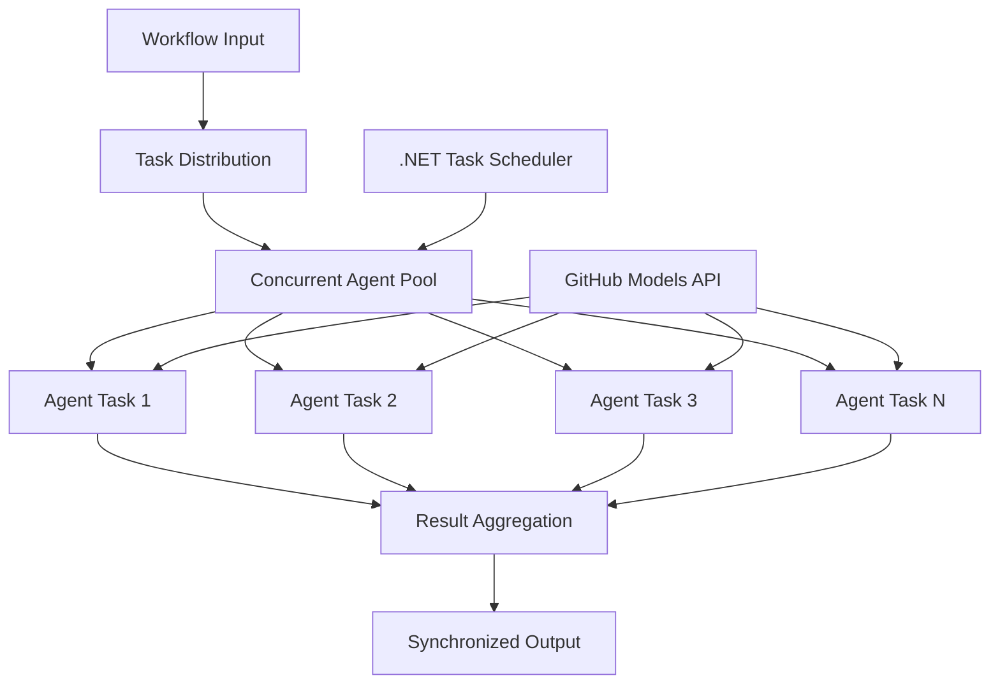

<!--
CO_OP_TRANSLATOR_METADATA:
{
  "original_hash": "b9c6e32c9b5f2fed20b6916984440d88",
  "translation_date": "2025-11-11T13:16:50+00:00",
  "source_file": "08-multi-agent/code_samples/workflows-agent-framework/dotNET/03.dotnet-agent-framework-workflow-ghmodel-concurrent.md",
  "language_code": "br"
}
-->
# ⚡ Fluxos de Trabalho Concorrentes com Modelos do GitHub (.NET)

## 📋 Tutorial de Processamento Paralelo de Alta Performance

Este notebook demonstra **padrões de fluxos de trabalho concorrentes** usando o Microsoft Agent Framework para .NET e Modelos do GitHub. Você aprenderá a construir fluxos de trabalho de processamento paralelo de alta performance que maximizam a capacidade ao executar múltiplos agentes de IA simultaneamente, mantendo a coordenação e a consistência dos dados.

## 🎯 Objetivos de Aprendizado

### 🚀 **Fundamentos do Processamento Concorrente**
- **Execução Paralela de Agentes**: Execute múltiplos agentes de IA simultaneamente para obter o máximo desempenho
- **Padrões Async/Await**: Aproveite o modelo de programação assíncrona do .NET para uma concorrência eficiente
- **Integração com Modelos do GitHub**: Coordene múltiplas chamadas concorrentes ao serviço de inferência de modelos de IA do GitHub
- **Gerenciamento de Recursos**: Gerencie eficientemente os recursos dos modelos de IA em operações concorrentes

### 🏗️ **Arquitetura Avançada de Concorrência**
- **Paralelismo Baseado em Tarefas**: Utilize a Biblioteca de Paralelismo de Tarefas do .NET para execução concorrente otimizada
- **Padrões de Sincronização**: Coordene agentes concorrentes evitando condições de corrida
- **Balanceamento de Carga**: Distribua o trabalho eficientemente entre a capacidade de processamento concorrente disponível
- **Tolerância a Falhas**: Lide com falhas individuais de agentes sem interromper todo o fluxo de trabalho

### 🏢 **Aplicações Empresariais Concorrentes**
- **Processamento de Documentos em Alta Volume**: Processe múltiplos documentos simultaneamente
- **Análise de Conteúdo em Tempo Real**: Analise fluxos de dados em tempo real de forma concorrente
- **Otimização de Processamento em Lote**: Maximize a capacidade em operações de processamento de dados em larga escala
- **Análise Multimodal**: Processamento paralelo de diferentes tipos e formatos de conteúdo

## ⚙️ Pré-requisitos e Configuração

### 📦 **Pacotes NuGet Necessários**

Pacotes essenciais para fluxos de trabalho concorrentes de alta performance:

```xml
<!-- Core AI Framework with Async Support -->
<PackageReference Include="Microsoft.Extensions.AI" Version="9.9.0" />

<!-- Client Model Abstractions for API Communication -->
<PackageReference Include="System.ClientModel" Version="1.6.1.0" />

<!-- Azure Identity and Async LINQ for Advanced Operations -->
<PackageReference Include="Azure.Identity" Version="1.15.0" />
<PackageReference Include="System.Linq.Async" Version="6.0.3" />

<!-- Local Agent Framework References -->
<!-- Microsoft.Agents.AI.dll - Core agent abstractions with async support -->
<!-- Microsoft.Agents.AI.OpenAI.dll - GitHub Models integration with concurrency -->
```

### 🔑 **Configuração dos Modelos do GitHub**

**Configuração do Ambiente (arquivo .env):**
```env
GITHUB_TOKEN=your_github_personal_access_token
GITHUB_ENDPOINT=https://models.inference.ai.azure.com
GITHUB_MODEL_ID=gpt-4o-mini
```

**Considerações sobre Processamento Concorrente:**
```csharp
// Configure for concurrent operations
var clientOptions = new OpenAIClientOptions()
{
    Endpoint = new Uri(githubEndpoint),
    // Configure connection pooling for concurrent requests
    NetworkTimeout = TimeSpan.FromMinutes(5)
};
```

### 🏗️ **Arquitetura de Fluxo de Trabalho Concorrente**



**Componentes Principais:**
- **Biblioteca de Paralelismo de Tarefas**: Suporte integrado do .NET para operações concorrentes
- **Pool de Agentes**: Múltiplas instâncias de agentes para processamento paralelo
- **Agregação de Resultados**: Coordenação e fusão dos resultados dos agentes concorrentes
- **Pontos de Sincronização**: Garantir a consistência dos dados em operações concorrentes

## 🎨 **Padrões de Design de Fluxos de Trabalho Concorrentes**

### 🔍 **Pesquisa e Análise Paralela**
```
Research Topic → Concurrent Research Agents → Result Synthesis → Final Report
```

### 📊 **Processamento de Dados de Múltiplas Fontes**
```
Data Sources → Parallel Processing Agents → Data Integration → Unified Output
```

### 🎭 **Pipeline de Geração de Conteúdo**
```
Content Requirements → Concurrent Content Generators → Quality Review → Final Content
```

### 🔄 **Processamento Fan-Out/Fan-In**
```
Single Input → Multiple Concurrent Processors → Result Aggregation → Single Output
```

## 🏢 **Benefícios de Performance Empresarial**

### ⚡ **Capacidade e Escalabilidade**
- **Escalabilidade Linear de Desempenho**: Adicione mais agentes concorrentes para aumentar a capacidade
- **Utilização de Recursos**: Máxima eficiência da capacidade disponível dos modelos de IA
- **Redução do Tempo de Processamento**: Redução significativa do tempo por meio de execução paralela
- **Escalabilidade Elástica**: Ajuste dinamicamente o número de agentes concorrentes com base na carga de trabalho

### 🛡️ **Confiabilidade e Resiliência**
- **Isolamento de Falhas**: Falhas individuais de agentes não afetam outras operações concorrentes
- **Degradação Gradual**: O sistema continua operando com capacidade reduzida de agentes
- **Recuperação de Erros**: Mecanismos automáticos de repetição para operações concorrentes que falharam
- **Distribuição de Carga**: Distribuição uniforme do trabalho entre os agentes disponíveis

### 📊 **Monitoramento de Performance**
- **Métricas de Execução Concorrente**: Acompanhe o desempenho de todas as operações paralelas
- **Análise de Uso de Recursos**: Monitore o uso de CPU, memória e rede
- **Análise de Capacidade**: Meça os ganhos de eficiência com o processamento concorrente
- **Detecção de Gargalos**: Identifique e resolva restrições de desempenho

### 🔧 **Desenvolvimento e Operações**
- **Modelo de Programação Assíncrona**: Aproveite os padrões maduros de async/await do .NET
- **Coordenação de Tarefas**: Capacidades integradas de gerenciamento e coordenação de tarefas
- **Tratamento de Exceções**: Tratamento abrangente de erros em operações concorrentes
- **Suporte para Depuração**: Ferramentas de depuração do Visual Studio para fluxos de trabalho concorrentes

Vamos construir fluxos de trabalho de IA concorrentes de alta performance com .NET! 🚀

## 💻 Executando o Código

A implementação completa está disponível em `03.dotnet-agent-framework-workflow-ghmodel-concurrent.cs`. Este arquivo demonstra um **fluxo de trabalho concorrente Fan-Out/Fan-In** para planejamento de viagens:

### 🏗️ **Arquitetura do Fluxo de Trabalho**

```
User Request → ConcurrentStartExecutor → [Researcher Agent || Planner Agent] → ConcurrentAggregationExecutor → Final Output
```

**Componentes Principais:**

1. **ConcurrentStartExecutor**: Transmite a solicitação do usuário para todos os agentes simultaneamente
2. **Agente Pesquisador**: Analisa destinos e atrações de forma concorrente
3. **Agente Planejador**: Cria planos de viagem detalhados de forma concorrente
4. **ConcurrentAggregationExecutor**: Coleta e mescla os resultados de ambos os agentes

### 🎯 **Padrão Fan-Out/Fan-In**

Este fluxo de trabalho demonstra o clássico padrão **Fan-Out/Fan-In**:
- **Fan-Out**: Uma mensagem de entrada é transmitida para múltiplos agentes simultaneamente
- **Processamento Concorrente**: Múltiplos agentes trabalham em paralelo na mesma tarefa
- **Fan-In**: Resultados de todos os agentes são coletados e agregados em uma única saída

### 🚀 Executando o Exemplo

```bash
# Make the script executable (Unix/Linux/macOS)
chmod +x 03.dotnet-agent-framework-workflow-ghmodel-concurrent.cs

# Run the concurrent workflow
./03.dotnet-agent-framework-workflow-ghmodel-concurrent.cs
```

Ou no Windows:
```powershell
dotnet run 03.dotnet-agent-framework-workflow-ghmodel-concurrent.cs
```

### 📝 Saída Esperada

O fluxo de trabalho irá:
1. **Transmitir Solicitação**: Enviar "Planeje uma viagem para Seattle em dezembro" para ambos os agentes
2. **Processamento Concorrente**: Ambos os agentes trabalham simultaneamente:
   - Pesquisador identifica atrações e detalhes
   - Planejador cria itinerário e logística
3. **Agregação**: Combinar ambas as respostas em uma saída abrangente
4. **Exibir Resultados**: Mostrar o plano de viagem mesclado com todas as informações

### 🔧 Opções de Personalização

**Adicionar Mais Agentes Concorrentes:**
```csharp
// Create additional specialized agents
AIAgent budgetAgent = openAIClient.GetChatClient(github_model_id).CreateAIAgent(
    name: "Budget-Agent", instructions: "Calculate travel costs...");

// Add to fan-out
var workflow = new WorkflowBuilder(startExecutor)
    .AddFanOutEdge(startExecutor, targets: [researcherAgent, plannerAgent, budgetAgent])
    .AddFanInEdge(aggregationExecutor, sources: [researcherAgent, plannerAgent, budgetAgent])
    .WithOutputFrom(aggregationExecutor)
    .Build();

// Update aggregation count
if (this._messages.Count == 3) { ... }
```

**Modificar Instruções dos Agentes:**
```csharp
const string ResearcherAgentInstructions = "Your custom instructions for research...";
const string PlanAgentInstructions = "Your custom instructions for planning...";
```

**Alterar a Tarefa:**
```csharp
StreamingRun run = await InProcessExecution.StreamAsync(
    workflow, 
    "Plan a European vacation for 2 weeks in summer"
);
```

### 🎯 Aplicações no Mundo Real

Este padrão concorrente é ideal para:
- **Criação de Conteúdo**: Múltiplos escritores criando diferentes seções simultaneamente
- **Revisão de Código**: Múltiplos revisores analisando código de diferentes perspectivas
- **Pesquisa de Mercado**: Análise paralela de diferentes segmentos de mercado
- **Processamento de Documentos**: Extração, análise e validação concorrentes
- **Análise Multiperspectiva**: Obtenção de diferentes pontos de vista sobre a mesma entrada

### 🔍 Entendendo os Executores Personalizados

**ConcurrentStartExecutor:**
- Implementa `IMessageHandler<string>` para aceitar entrada de texto
- Transmite mensagens para todos os agentes conectados
- Envia `TurnToken` para acionar o processamento concorrente

**ConcurrentAggregationExecutor:**
- Implementa `IMessageHandler<ChatMessage>` para receber respostas dos agentes
- Coleta mensagens de forma segura para threads
- Agrega quando todas as respostas esperadas chegam
- Gera a saída final usando `context.YieldOutputAsync()`

### ⚡ Benefícios de Performance

**Concorrente vs Sequencial:**
- Sequencial: Agente1 (30s) → Agente2 (30s) = **60 segundos no total**
- Concorrente: Agente1 (30s) || Agente2 (30s) = **30 segundos no total**

**Melhoria de Capacidade**: Até N× mais rápido para N agentes concorrentes (dependendo da carga de trabalho e dos recursos)

### 🛡️ Tratamento de Erros

O fluxo de trabalho lida com falhas individuais de agentes de forma eficiente:
- Se um agente falhar, os outros continuam processando
- O agregador pode implementar lógica de timeout
- Resultados parciais podem ser retornados, se necessário

### 📊 Recursos Avançados

**Quantidade Dinâmica de Agentes:**
Modifique a lógica de agregação para suportar contagens variáveis de agentes:

```csharp
private int _expectedAgentCount;
private readonly List<ChatMessage> _messages = [];

public async ValueTask HandleAsync(ChatMessage message, IWorkflowContext context)
{
    this._messages.Add(message);
    if (this._messages.Count == _expectedAgentCount)
    {
        // Process aggregation
    }
}
```

Este padrão de fluxo de trabalho concorrente é essencial para construir sistemas de agentes de IA escaláveis e de alta performance!

---

<!-- CO-OP TRANSLATOR DISCLAIMER START -->
**Aviso Legal**:  
Este documento foi traduzido utilizando o serviço de tradução por IA [Co-op Translator](https://github.com/Azure/co-op-translator). Embora nos esforcemos para garantir a precisão, esteja ciente de que traduções automatizadas podem conter erros ou imprecisões. O documento original em seu idioma nativo deve ser considerado a fonte autoritativa. Para informações críticas, recomenda-se a tradução profissional humana. Não nos responsabilizamos por quaisquer mal-entendidos ou interpretações incorretas decorrentes do uso desta tradução.
<!-- CO-OP TRANSLATOR DISCLAIMER END -->