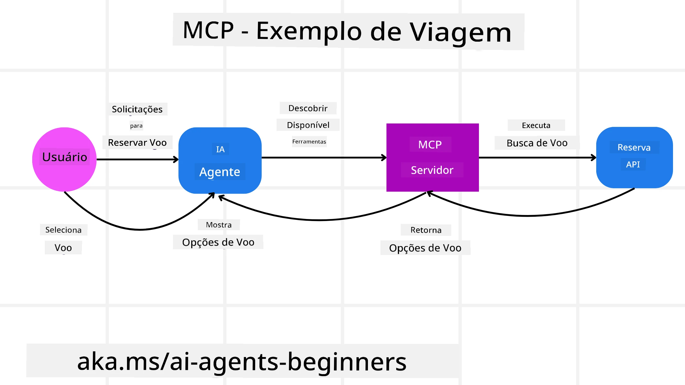
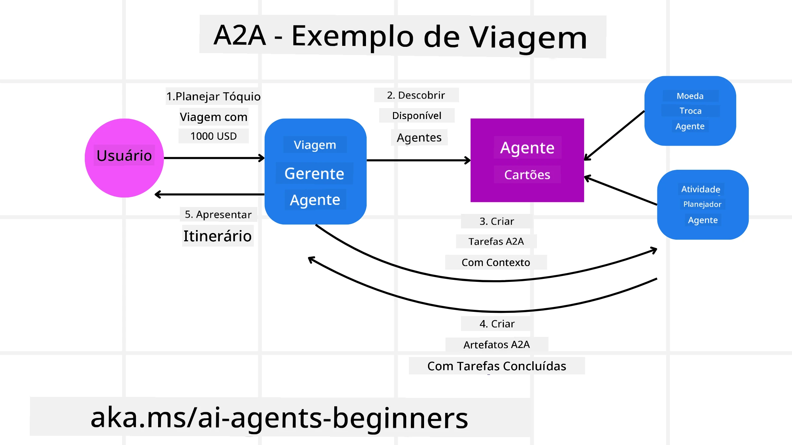
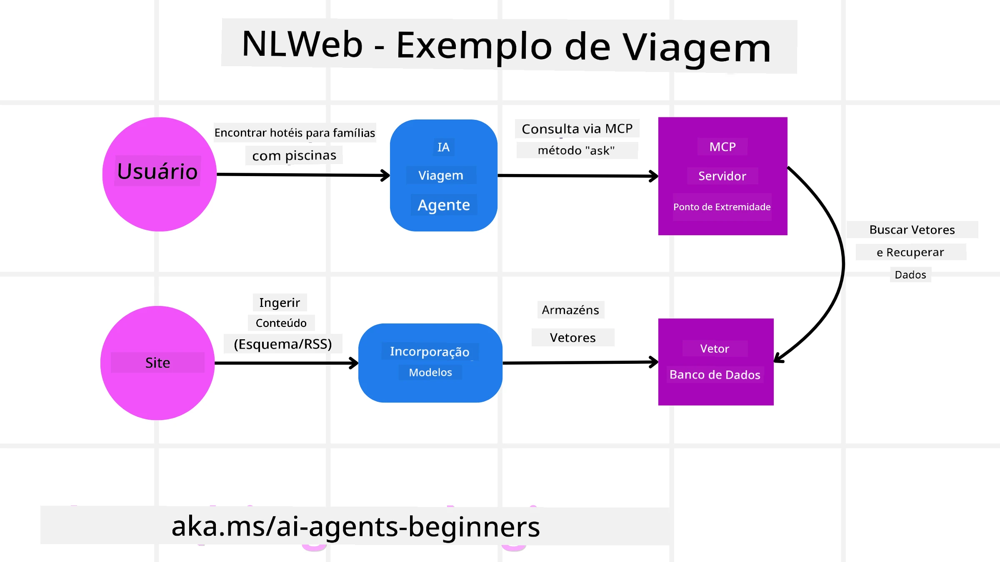

<!--
CO_OP_TRANSLATOR_METADATA:
{
  "original_hash": "aff92c6f019b4627ca9399c6e3882e17",
  "translation_date": "2025-09-18T14:46:35+00:00",
  "source_file": "11-agentic-protocols/README.md",
  "language_code": "br"
}
-->
# Usando Protocolos Agênticos (MCP, A2A e NLWeb)

> _(Clique na imagem acima para assistir ao vídeo desta lição)_

À medida que o uso de agentes de IA cresce, também aumenta a necessidade de protocolos que garantam padronização, segurança e incentivem a inovação aberta. Nesta lição, abordaremos 3 protocolos que buscam atender a essa necessidade: Model Context Protocol (MCP), Agent to Agent (A2A) e Natural Language Web (NLWeb).

## Introdução

Nesta lição, vamos abordar:

• Como o **MCP** permite que agentes de IA acessem ferramentas e dados externos para realizar tarefas dos usuários.

• Como o **A2A** possibilita a comunicação e colaboração entre diferentes agentes de IA.

• Como o **NLWeb** traz interfaces de linguagem natural para qualquer site, permitindo que agentes de IA descubram e interajam com o conteúdo.

## Objetivos de Aprendizado

• **Identificar** o propósito principal e os benefícios do MCP, A2A e NLWeb no contexto de agentes de IA.

• **Explicar** como cada protocolo facilita a comunicação e interação entre LLMs, ferramentas e outros agentes.

• **Reconhecer** os papéis distintos que cada protocolo desempenha na construção de sistemas agênticos complexos.

## Model Context Protocol

O **Model Context Protocol (MCP)** é um padrão aberto que fornece uma maneira padronizada para que aplicativos ofereçam contexto e ferramentas aos LLMs. Isso possibilita um "adaptador universal" para diferentes fontes de dados e ferramentas que agentes de IA podem conectar de forma consistente.

Vamos explorar os componentes do MCP, os benefícios em comparação ao uso direto de APIs e um exemplo de como agentes de IA podem usar um servidor MCP.

### Componentes Centrais do MCP

O MCP opera em uma **arquitetura cliente-servidor**, e seus componentes principais são:

• **Hosts** são aplicativos de LLM (por exemplo, um editor de código como o VSCode) que iniciam conexões com um servidor MCP.

• **Clientes** são componentes dentro do aplicativo host que mantêm conexões individuais com servidores.

• **Servidores** são programas leves que expõem capacidades específicas.

Incluídos no protocolo estão três primitivas centrais que representam as capacidades de um servidor MCP:

• **Ferramentas**: São ações ou funções discretas que um agente de IA pode chamar para realizar uma ação. Por exemplo, um serviço de clima pode oferecer uma ferramenta "obter clima", ou um servidor de e-commerce pode oferecer uma ferramenta "comprar produto". Servidores MCP anunciam o nome, descrição e esquema de entrada/saída de cada ferramenta em sua lista de capacidades.

• **Recursos**: São itens de dados ou documentos somente leitura que um servidor MCP pode fornecer, e os clientes podem recuperá-los sob demanda. Exemplos incluem conteúdos de arquivos, registros de banco de dados ou arquivos de log. Recursos podem ser texto (como código ou JSON) ou binários (como imagens ou PDFs).

• **Prompts**: São modelos pré-definidos que fornecem sugestões de prompts, permitindo fluxos de trabalho mais complexos.

### Benefícios do MCP

O MCP oferece vantagens significativas para agentes de IA:

• **Descoberta Dinâmica de Ferramentas**: Agentes podem receber dinamicamente uma lista de ferramentas disponíveis de um servidor, junto com descrições do que elas fazem. Isso contrasta com APIs tradicionais, que frequentemente exigem codificação estática para integrações, significando que qualquer mudança na API requer atualizações no código. O MCP oferece uma abordagem "integrar uma vez", proporcionando maior adaptabilidade.

• **Interoperabilidade Entre LLMs**: O MCP funciona com diferentes LLMs, oferecendo flexibilidade para trocar modelos principais e avaliar melhor desempenho.

• **Segurança Padronizada**: O MCP inclui um método de autenticação padrão, melhorando a escalabilidade ao adicionar acesso a servidores MCP adicionais. Isso é mais simples do que gerenciar diferentes chaves e tipos de autenticação para várias APIs tradicionais.

### Exemplo de MCP

Imagine que um usuário deseja reservar um voo usando um assistente de IA alimentado pelo MCP.

1. **Conexão**: O assistente de IA (o cliente MCP) conecta-se a um servidor MCP fornecido por uma companhia aérea.

2. **Descoberta de Ferramentas**: O cliente pergunta ao servidor MCP da companhia aérea: "Quais ferramentas você tem disponíveis?" O servidor responde com ferramentas como "buscar voos" e "reservar voos".

3. **Invocação de Ferramentas**: Você então pede ao assistente de IA: "Por favor, busque um voo de Portland para Honolulu." O assistente de IA, usando seu LLM, identifica que precisa chamar a ferramenta "buscar voos" e passa os parâmetros relevantes (origem, destino) para o servidor MCP.

4. **Execução e Resposta**: O servidor MCP, atuando como um intermediário, faz a chamada real para a API interna de reservas da companhia aérea. Ele então recebe as informações do voo (por exemplo, dados em JSON) e as envia de volta ao assistente de IA.

5. **Interação Adicional**: O assistente de IA apresenta as opções de voo. Uma vez que você seleciona um voo, o assistente pode invocar a ferramenta "reservar voo" no mesmo servidor MCP, concluindo a reserva.

## Protocolo Agente-para-Agente (A2A)

Enquanto o MCP foca em conectar LLMs a ferramentas, o **Protocolo Agente-para-Agente (A2A)** vai além, permitindo comunicação e colaboração entre diferentes agentes de IA. O A2A conecta agentes de IA de diferentes organizações, ambientes e tecnologias para realizar uma tarefa compartilhada.

Vamos examinar os componentes e benefícios do A2A, junto com um exemplo de como ele poderia ser aplicado em nosso aplicativo de viagens.

### Componentes Centrais do A2A

O A2A foca em habilitar a comunicação entre agentes e fazê-los trabalhar juntos para realizar uma subtarefa do usuário. Cada componente do protocolo contribui para isso:

#### Cartão do Agente

Semelhante à forma como um servidor MCP compartilha uma lista de ferramentas, um Cartão do Agente contém:
- O Nome do Agente.
- Uma **descrição das tarefas gerais** que ele realiza.
- Uma **lista de habilidades específicas** com descrições para ajudar outros agentes (ou até mesmo usuários humanos) a entenderem quando e por que chamar esse agente.
- O **URL atual do Endpoint** do agente.
- A **versão** e **capacidades** do agente, como respostas em streaming e notificações push.

#### Executor do Agente

O Executor do Agente é responsável por **passar o contexto do chat do usuário para o agente remoto**, que precisa disso para entender a tarefa que deve ser realizada. Em um servidor A2A, um agente usa seu próprio LLM para interpretar solicitações recebidas e executar tarefas usando suas próprias ferramentas internas.

#### Artefato

Uma vez que um agente remoto conclui a tarefa solicitada, seu produto de trabalho é criado como um artefato. Um artefato **contém o resultado do trabalho do agente**, uma **descrição do que foi realizado** e o **contexto textual** enviado pelo protocolo. Após o envio do artefato, a conexão com o agente remoto é encerrada até que seja necessária novamente.

#### Fila de Eventos

Este componente é usado para **gerenciar atualizações e passar mensagens**. É particularmente importante em sistemas agênticos de produção para evitar que a conexão entre agentes seja encerrada antes que uma tarefa seja concluída, especialmente quando os tempos de conclusão podem ser mais longos.

### Benefícios do A2A

• **Colaboração Aprimorada**: Permite que agentes de diferentes fornecedores e plataformas interajam, compartilhem contexto e trabalhem juntos, facilitando a automação entre sistemas tradicionalmente desconectados.

• **Flexibilidade na Seleção de Modelos**: Cada agente A2A pode decidir qual LLM usar para atender às solicitações, permitindo modelos otimizados ou ajustados por agente, ao contrário de uma conexão única de LLM em alguns cenários MCP.

• **Autenticação Integrada**: A autenticação é integrada diretamente ao protocolo A2A, fornecendo uma estrutura de segurança robusta para interações entre agentes.

### Exemplo de A2A

Vamos expandir nosso cenário de reserva de viagem, mas desta vez usando o A2A.

1. **Solicitação do Usuário para Multi-Agente**: Um usuário interage com um "Agente de Viagem" cliente/agente A2A, talvez dizendo: "Por favor, reserve uma viagem completa para Honolulu na próxima semana, incluindo voos, hotel e carro alugado."

2. **Orquestração pelo Agente de Viagem**: O Agente de Viagem recebe essa solicitação complexa. Ele usa seu LLM para raciocinar sobre a tarefa e determinar que precisa interagir com outros agentes especializados.

3. **Comunicação Entre Agentes**: O Agente de Viagem então usa o protocolo A2A para se conectar a agentes especializados, como um "Agente de Companhia Aérea", um "Agente de Hotel" e um "Agente de Aluguel de Carros" criados por diferentes empresas.

4. **Execução de Tarefas Delegadas**: O Agente de Viagem envia tarefas específicas para esses agentes especializados (por exemplo, "Encontrar voos para Honolulu", "Reservar um hotel", "Alugar um carro"). Cada um desses agentes especializados, executando seus próprios LLMs e utilizando suas próprias ferramentas (que podem ser servidores MCP), realiza sua parte específica da reserva.

5. **Resposta Consolidada**: Uma vez que todos os agentes especializados concluem suas tarefas, o Agente de Viagem compila os resultados (detalhes do voo, confirmação do hotel, reserva do carro) e envia uma resposta abrangente, em estilo de chat, de volta ao usuário.

## Natural Language Web (NLWeb)

Os sites há muito tempo são a principal forma de os usuários acessarem informações e dados na internet.

Vamos explorar os diferentes componentes do NLWeb, os benefícios do NLWeb e um exemplo de como o NLWeb funciona em nosso aplicativo de viagens.

### Componentes do NLWeb

- **Aplicativo NLWeb (Código de Serviço Central)**: O sistema que processa perguntas em linguagem natural. Ele conecta as diferentes partes da plataforma para criar respostas. Você pode pensar nele como o **motor que alimenta os recursos de linguagem natural** de um site.

- **Protocolo NLWeb**: Este é um **conjunto básico de regras para interação em linguagem natural** com um site. Ele envia respostas em formato JSON (frequentemente usando Schema.org). Seu propósito é criar uma base simples para a “Web de IA”, da mesma forma que o HTML tornou possível compartilhar documentos online.

- **Servidor MCP (Endpoint do Model Context Protocol)**: Cada configuração NLWeb também funciona como um **servidor MCP**. Isso significa que pode **compartilhar ferramentas (como um método “ask”) e dados** com outros sistemas de IA. Na prática, isso torna o conteúdo e as capacidades do site utilizáveis por agentes de IA, permitindo que o site se torne parte do ecossistema mais amplo de “agentes”.

- **Modelos de Embedding**: Esses modelos são usados para **converter o conteúdo do site em representações numéricas chamadas vetores** (embeddings). Esses vetores capturam significado de uma forma que os computadores podem comparar e buscar. Eles são armazenados em um banco de dados especial, e os usuários podem escolher qual modelo de embedding desejam usar.

- **Banco de Dados de Vetores (Mecanismo de Recuperação)**: Este banco de dados **armazena os embeddings do conteúdo do site**. Quando alguém faz uma pergunta, o NLWeb verifica o banco de dados de vetores para encontrar rapidamente as informações mais relevantes. Ele fornece uma lista rápida de possíveis respostas, classificadas por similaridade. O NLWeb funciona com diferentes sistemas de armazenamento de vetores, como Qdrant, Snowflake, Milvus, Azure AI Search e Elasticsearch.

### NLWeb por Exemplo

Considere novamente nosso site de reservas de viagem, mas desta vez, ele é alimentado pelo NLWeb.

1. **Ingestão de Dados**: Os catálogos de produtos existentes do site de viagens (por exemplo, listagens de voos, descrições de hotéis, pacotes de turismo) são formatados usando Schema.org ou carregados via feeds RSS. As ferramentas do NLWeb ingerem esses dados estruturados, criam embeddings e os armazenam em um banco de dados de vetores local ou remoto.

2. **Consulta em Linguagem Natural (Humano)**: Um usuário visita o site e, em vez de navegar por menus, digita em uma interface de chat: "Encontre um hotel familiar em Honolulu com piscina para a próxima semana".

3. **Processamento NLWeb**: O aplicativo NLWeb recebe essa consulta. Ele envia a consulta para um LLM para interpretação e, simultaneamente, busca em seu banco de dados de vetores por listagens de hotéis relevantes.

4. **Resultados Precisos**: O LLM ajuda a interpretar os resultados da busca no banco de dados, identifica as melhores correspondências com base nos critérios "familiar", "piscina" e "Honolulu", e então formata uma resposta em linguagem natural. Crucialmente, a resposta refere-se a hotéis reais do catálogo do site, evitando informações inventadas.

5. **Interação com Agentes de IA**: Como o NLWeb funciona como um servidor MCP, um agente de viagem externo de IA também poderia se conectar à instância NLWeb deste site. O agente de IA poderia então usar o método `ask` do MCP para consultar diretamente o site: `ask("Existem restaurantes veganos recomendados na área de Honolulu pelo hotel?")`. A instância NLWeb processaria isso, aproveitando seu banco de dados de informações sobre restaurantes (se carregado), e retornaria uma resposta estruturada em JSON.

### Tem Mais Perguntas sobre MCP/A2A/NLWeb?

Participe do [Discord do Azure AI Foundry](https://aka.ms/ai-agents/discord) para se conectar com outros aprendizes, participar de horários de atendimento e tirar suas dúvidas sobre agentes de IA.

## Recursos

- [MCP para Iniciantes](https://aka.ms/mcp-for-beginners)  
- [Documentação do MCP](https://github.com/microsoft/semantic-kernel/tree/main/python/semantic-kernel/semantic_kernel/connectors/mcp)
- [Repositório NLWeb](https://github.com/nlweb-ai/NLWeb)
- [Guias do Semantic Kernel](https://learn.microsoft.com/semantic-kernel/)

---

**Aviso Legal**:  
Este documento foi traduzido utilizando o serviço de tradução por IA [Co-op Translator](https://github.com/Azure/co-op-translator). Embora nos esforcemos para garantir a precisão, esteja ciente de que traduções automatizadas podem conter erros ou imprecisões. O documento original em seu idioma nativo deve ser considerado a fonte autoritativa. Para informações críticas, recomenda-se a tradução profissional realizada por humanos. Não nos responsabilizamos por quaisquer mal-entendidos ou interpretações equivocadas decorrentes do uso desta tradução.