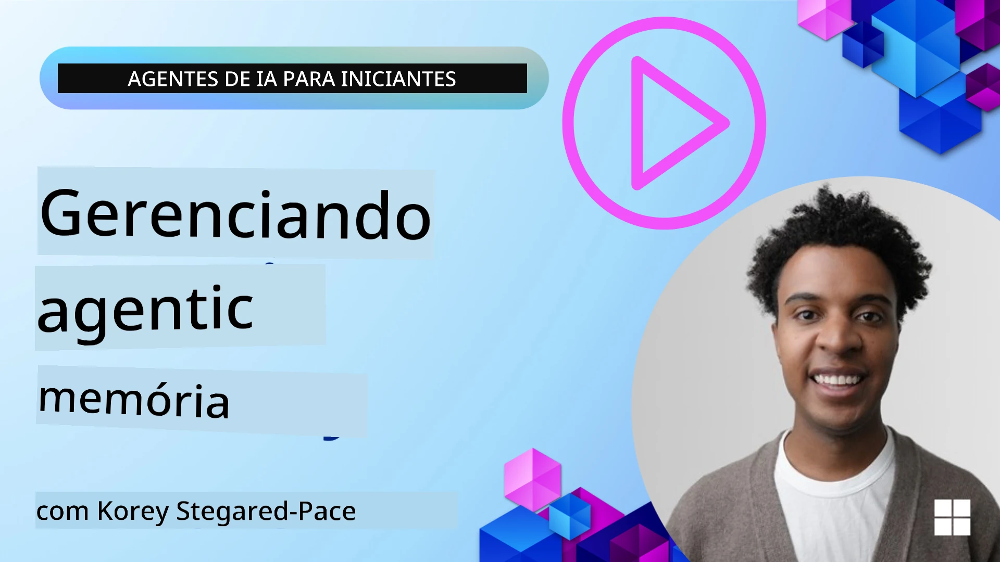

<!--
CO_OP_TRANSLATOR_METADATA:
{
  "original_hash": "a1d90991499ad697c4ad24decaf36968",
  "translation_date": "2025-12-09T12:15:54+00:00",
  "source_file": "13-agent-memory/README.md",
  "language_code": "br"
}
-->
# Memória para Agentes de IA 

Ao discutir os benefícios únicos de criar Agentes de IA, dois pontos principais são abordados: a capacidade de utilizar ferramentas para realizar tarefas e a habilidade de melhorar com o tempo. A memória é a base para criar agentes autossuficientes que proporcionam melhores experiências para nossos usuários.

Nesta lição, vamos explorar o que é memória para Agentes de IA e como podemos gerenciá-la e utilizá-la para beneficiar nossas aplicações.

## Introdução

Esta lição abordará:

• **Entendendo a Memória de Agentes de IA**: O que é memória e por que ela é essencial para os agentes.

• **Implementando e Armazenando Memória**: Métodos práticos para adicionar capacidades de memória aos seus agentes de IA, com foco em memória de curto e longo prazo.

• **Tornando os Agentes de IA Autossuficientes**: Como a memória permite que os agentes aprendam com interações passadas e melhorem com o tempo.

## Implementações Disponíveis

Esta lição inclui dois tutoriais completos em notebooks:

• **[13-agent-memory.ipynb](./13-agent-memory.ipynb)**: Implementa memória usando Mem0 e Azure AI Search com o framework Semantic Kernel.

• **[13-agent-memory-cognee.ipynb](./13-agent-memory-cognee.ipynb)**: Implementa memória estruturada usando Cognee, construindo automaticamente um gráfico de conhecimento baseado em embeddings, visualizando o gráfico e realizando recuperação inteligente.

## Objetivos de Aprendizado

Após concluir esta lição, você saberá como:

• **Diferenciar entre os vários tipos de memória de agentes de IA**, incluindo memória de trabalho, curto prazo e longo prazo, além de formas especializadas como memória de persona e episódica.

• **Implementar e gerenciar memória de curto e longo prazo para agentes de IA** usando o framework Semantic Kernel, aproveitando ferramentas como Mem0, Cognee, memória de quadro branco e integração com Azure AI Search.

• **Compreender os princípios por trás de agentes de IA autossuficientes** e como sistemas robustos de gerenciamento de memória contribuem para aprendizado contínuo e adaptação.

## Entendendo a Memória de Agentes de IA

No essencial, **memória para agentes de IA refere-se aos mecanismos que permitem que eles retenham e recuperem informações**. Essas informações podem incluir detalhes específicos de uma conversa, preferências do usuário, ações passadas ou até padrões aprendidos.

Sem memória, aplicações de IA geralmente são sem estado, o que significa que cada interação começa do zero. Isso leva a uma experiência repetitiva e frustrante, onde o agente "esquece" o contexto ou as preferências anteriores.

### Por que a Memória é Importante?

A inteligência de um agente está profundamente ligada à sua capacidade de lembrar e utilizar informações passadas. A memória permite que os agentes sejam:

• **Reflexivos**: Aprendendo com ações e resultados anteriores.

• **Interativos**: Mantendo o contexto ao longo de uma conversa contínua.

• **Proativos e Reativos**: Antecipando necessidades ou respondendo adequadamente com base em dados históricos.

• **Autônomos**: Operando de forma mais independente ao utilizar conhecimento armazenado.

O objetivo de implementar memória é tornar os agentes mais **confiáveis e capazes**.

### Tipos de Memória

#### Memória de Trabalho

Pense nisso como um pedaço de papel usado pelo agente durante uma única tarefa ou processo de pensamento. Ele mantém informações imediatas necessárias para calcular o próximo passo.

Para agentes de IA, a memória de trabalho frequentemente captura as informações mais relevantes de uma conversa, mesmo que o histórico completo do chat seja longo ou truncado. Ela foca em extrair elementos-chave como requisitos, propostas, decisões e ações.

**Exemplo de Memória de Trabalho**

Em um agente de reserva de viagens, a memória de trabalho pode capturar o pedido atual do usuário, como "Quero reservar uma viagem para Paris". Esse requisito específico é mantido no contexto imediato do agente para guiar a interação atual.

#### Memória de Curto Prazo

Esse tipo de memória retém informações durante uma única conversa ou sessão. É o contexto do chat atual, permitindo que o agente se refira a interações anteriores no diálogo.

**Exemplo de Memória de Curto Prazo**

Se um usuário pergunta: "Quanto custaria um voo para Paris?" e depois segue com "E sobre hospedagem lá?", a memória de curto prazo garante que o agente saiba que "lá" se refere a "Paris" dentro da mesma conversa.

#### Memória de Longo Prazo

Essa é a informação que persiste ao longo de várias conversas ou sessões. Permite que os agentes lembrem preferências do usuário, interações históricas ou conhecimento geral por períodos prolongados. Isso é importante para personalização.

**Exemplo de Memória de Longo Prazo**

Uma memória de longo prazo pode armazenar que "Ben gosta de esquiar e atividades ao ar livre, prefere café com vista para montanhas e quer evitar pistas de esqui avançadas devido a uma lesão anterior". Essas informações, aprendidas em interações anteriores, influenciam recomendações em futuras sessões de planejamento de viagens, tornando-as altamente personalizadas.

#### Memória de Persona

Esse tipo de memória especializada ajuda o agente a desenvolver uma "personalidade" ou "persona" consistente. Permite que o agente lembre detalhes sobre si mesmo ou seu papel pretendido, tornando as interações mais fluidas e focadas.

**Exemplo de Memória de Persona**
Se o agente de viagens foi projetado para ser um "especialista em planejamento de esqui", a memória de persona pode reforçar esse papel, influenciando suas respostas para alinhar-se ao tom e conhecimento de um especialista.

#### Memória de Fluxo/Episódica

Essa memória armazena a sequência de passos que um agente realiza durante uma tarefa complexa, incluindo sucessos e falhas. É como lembrar "episódios" específicos ou experiências passadas para aprender com eles.

**Exemplo de Memória Episódica**

Se o agente tentou reservar um voo específico, mas falhou devido à indisponibilidade, a memória episódica pode registrar essa falha, permitindo que o agente tente voos alternativos ou informe o usuário sobre o problema de forma mais informada em uma tentativa subsequente.

#### Memória de Entidade

Isso envolve extrair e lembrar entidades específicas (como pessoas, lugares ou coisas) e eventos de conversas. Permite que o agente construa uma compreensão estruturada dos elementos-chave discutidos.

**Exemplo de Memória de Entidade**

De uma conversa sobre uma viagem passada, o agente pode extrair "Paris", "Torre Eiffel" e "jantar no restaurante Le Chat Noir" como entidades. Em uma interação futura, o agente pode lembrar "Le Chat Noir" e oferecer-se para fazer uma nova reserva lá.

#### RAG Estruturado (Geração Aumentada por Recuperação)

Embora o RAG seja uma técnica mais ampla, o "RAG Estruturado" é destacado como uma tecnologia de memória poderosa. Ele extrai informações densas e estruturadas de várias fontes (conversas, e-mails, imagens) e as utiliza para melhorar a precisão, recuperação e velocidade nas respostas. Diferentemente do RAG clássico que depende apenas de similaridade semântica, o RAG Estruturado trabalha com a estrutura inerente das informações.

**Exemplo de RAG Estruturado**

Em vez de apenas combinar palavras-chave, o RAG Estruturado pode analisar detalhes de voos (destino, data, horário, companhia aérea) de um e-mail e armazená-los de forma estruturada. Isso permite consultas precisas como "Qual voo eu reservei para Paris na terça-feira?"

## Implementando e Armazenando Memória

Implementar memória para agentes de IA envolve um processo sistemático de **gerenciamento de memória**, que inclui gerar, armazenar, recuperar, integrar, atualizar e até "esquecer" (ou deletar) informações. A recuperação é um aspecto particularmente crucial.

### Ferramentas Especializadas de Memória

#### Mem0

Uma maneira de armazenar e gerenciar memória de agentes é usando ferramentas especializadas como Mem0. Mem0 funciona como uma camada de memória persistente, permitindo que os agentes recuperem interações relevantes, armazenem preferências do usuário e contexto factual, e aprendam com sucessos e falhas ao longo do tempo. A ideia aqui é transformar agentes sem estado em agentes com estado.

Ele opera por meio de um **pipeline de memória em duas fases: extração e atualização**. Primeiro, mensagens adicionadas ao thread do agente são enviadas ao serviço Mem0, que usa um Modelo de Linguagem Grande (LLM) para resumir o histórico de conversas e extrair novas memórias. Posteriormente, uma fase de atualização orientada por LLM determina se deve adicionar, modificar ou excluir essas memórias, armazenando-as em um banco de dados híbrido que pode incluir vetores, gráficos e bancos de dados chave-valor. Este sistema também suporta vários tipos de memória e pode incorporar memória gráfica para gerenciar relações entre entidades.

#### Cognee

Outra abordagem poderosa é usar **Cognee**, uma memória semântica de código aberto para agentes de IA que transforma dados estruturados e não estruturados em gráficos de conhecimento consultáveis, apoiados por embeddings. Cognee fornece uma **arquitetura de armazenamento duplo** que combina busca por similaridade vetorial com relações gráficas, permitindo que os agentes entendam não apenas o que é semelhante, mas como os conceitos se relacionam.

Ele se destaca em **recuperação híbrida**, que mistura similaridade vetorial, estrutura gráfica e raciocínio LLM - desde a busca de fragmentos brutos até respostas a perguntas conscientes do gráfico. O sistema mantém uma **memória viva** que evolui e cresce enquanto permanece consultável como um gráfico conectado, suportando tanto o contexto de sessão de curto prazo quanto a memória persistente de longo prazo.

O tutorial em notebook Cognee ([13-agent-memory-cognee.ipynb](./13-agent-memory-cognee.ipynb)) demonstra a construção dessa camada de memória unificada, com exemplos práticos de ingestão de diversas fontes de dados, visualização do gráfico de conhecimento e consulta com diferentes estratégias de busca adaptadas às necessidades específicas do agente.

### Armazenando Memória com RAG

Além de ferramentas especializadas de memória como Mem0, você pode aproveitar serviços de busca robustos como **Azure AI Search como backend para armazenar e recuperar memórias**, especialmente para RAG estruturado.

Isso permite que você baseie as respostas do agente em seus próprios dados, garantindo respostas mais relevantes e precisas. O Azure AI Search pode ser usado para armazenar memórias específicas de usuários sobre viagens, catálogos de produtos ou qualquer outro conhecimento específico de domínio.

O Azure AI Search suporta capacidades como **RAG Estruturado**, que se destaca em extrair e recuperar informações densas e estruturadas de grandes conjuntos de dados como históricos de conversas, e-mails ou até imagens. Isso proporciona "precisão e recuperação sobre-humanas" em comparação com abordagens tradicionais de fragmentação de texto e embeddings.

## Tornando os Agentes de IA Autossuficientes

Um padrão comum para agentes autossuficientes envolve introduzir um **"agente de conhecimento"**. Este agente separado observa a conversa principal entre o usuário e o agente primário. Seu papel é:

1. **Identificar informações valiosas**: Determinar se alguma parte da conversa vale a pena ser salva como conhecimento geral ou uma preferência específica do usuário.

2. **Extrair e resumir**: Destilar o aprendizado ou preferência essencial da conversa.

3. **Armazenar em uma base de conhecimento**: Persistir essa informação extraída, frequentemente em um banco de dados vetorial, para que possa ser recuperada posteriormente.

4. **Aumentar consultas futuras**: Quando o usuário inicia uma nova consulta, o agente de conhecimento recupera informações armazenadas relevantes e as adiciona ao prompt do usuário, fornecendo contexto crucial ao agente primário (semelhante ao RAG).

### Otimizações para Memória

• **Gerenciamento de Latência**: Para evitar atrasos nas interações do usuário, um modelo mais barato e rápido pode ser usado inicialmente para verificar rapidamente se a informação é valiosa para armazenar ou recuperar, invocando o processo de extração/recuperação mais complexo apenas quando necessário.

• **Manutenção da Base de Conhecimento**: Para uma base de conhecimento em crescimento, informações menos utilizadas podem ser movidas para "armazenamento frio" para gerenciar custos.

## Tem Mais Perguntas Sobre Memória de Agentes?

Participe do [Discord do Azure AI Foundry](https://aka.ms/ai-agents/discord) para se conectar com outros aprendizes, participar de horários de atendimento e tirar suas dúvidas sobre Agentes de IA.

---

<!-- CO-OP TRANSLATOR DISCLAIMER START -->
**Aviso Legal**:  
Este documento foi traduzido utilizando o serviço de tradução por IA [Co-op Translator](https://github.com/Azure/co-op-translator). Embora nos esforcemos para garantir a precisão, esteja ciente de que traduções automatizadas podem conter erros ou imprecisões. O documento original em seu idioma nativo deve ser considerado a fonte autoritativa. Para informações críticas, recomenda-se a tradução profissional feita por humanos. Não nos responsabilizamos por quaisquer mal-entendidos ou interpretações equivocadas decorrentes do uso desta tradução.
<!-- CO-OP TRANSLATOR DISCLAIMER END -->