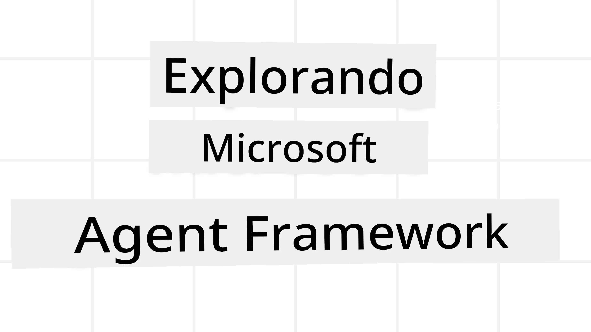
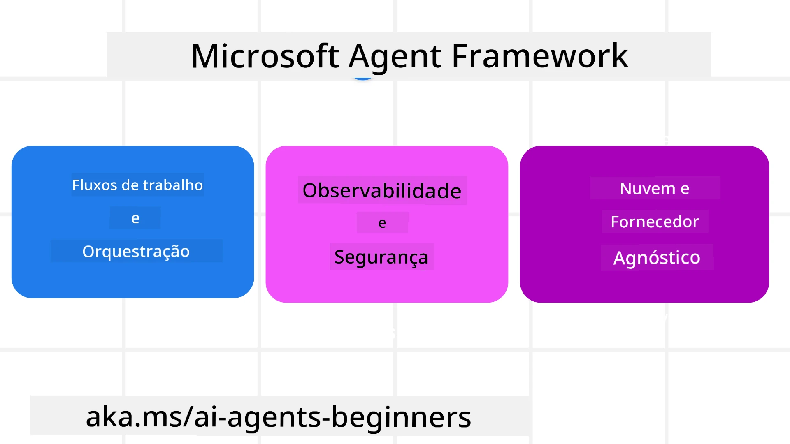

<!--
CO_OP_TRANSLATOR_METADATA:
{
  "original_hash": "19c4dab375acbc733855cc7f2f04edbc",
  "translation_date": "2025-10-02T14:04:44+00:00",
  "source_file": "14-microsoft-agent-framework/README.md",
  "language_code": "br"
}
-->
# Explorando o Microsoft Agent Framework



### Introdução

Esta lição abordará:

- Compreendendo o Microsoft Agent Framework: Principais Recursos e Valor  
- Explorando os Conceitos Fundamentais do Microsoft Agent Framework
- Comparando o MAF com Semantic Kernel e AutoGen: Guia de Migração

## Objetivos de Aprendizagem

Após concluir esta lição, você saberá como:

- Construir Agentes de IA prontos para produção usando o Microsoft Agent Framework
- Aplicar os principais recursos do Microsoft Agent Framework aos seus casos de uso de agentes
- Migrar e integrar frameworks e ferramentas de agentes existentes  

## Exemplos de Código 

Exemplos de código para [Microsoft Agent Framework (MAF)](https://aka.ms/ai-agents-beginners/agent-framewrok) podem ser encontrados neste repositório nos arquivos `xx-python-agent-framework` e `xx-dotnet-agent-framework`.

## Compreendendo o Microsoft Agent Framework



O [Microsoft Agent Framework (MAF)](https://aka.ms/ai-agents-beginners/agent-framewrok) é baseado na experiência e nos aprendizados do Semantic Kernel e AutoGen. Ele oferece flexibilidade para atender à ampla variedade de casos de uso de agentes observados em ambientes de produção e pesquisa, incluindo:

- **Orquestração Sequencial de Agentes** em cenários onde fluxos de trabalho passo a passo são necessários.
- **Orquestração Concorrente** em cenários onde agentes precisam concluir tarefas ao mesmo tempo.
- **Orquestração de Chat em Grupo** em cenários onde agentes podem colaborar juntos em uma única tarefa.
- **Orquestração de Transferência** em cenários onde agentes transferem a tarefa entre si à medida que as subtarefas são concluídas.
- **Orquestração Magnética** em cenários onde um agente gerente cria e modifica uma lista de tarefas e coordena os subagentes para concluir a tarefa.

Para entregar Agentes de IA em Produção, o MAF também inclui recursos para:

- **Observabilidade** por meio do uso do OpenTelemetry, onde cada ação do Agente de IA, incluindo invocação de ferramentas, etapas de orquestração, fluxos de raciocínio e monitoramento de desempenho, é rastreada por meio de dashboards do Azure AI Foundry.
- **Segurança** ao hospedar agentes nativamente no Azure AI Foundry, que inclui controles de segurança como acesso baseado em função, manipulação de dados privados e segurança de conteúdo integrada.
- **Durabilidade** já que threads e fluxos de trabalho de agentes podem pausar, retomar e se recuperar de erros, permitindo processos de longa duração.
- **Controle** com suporte a fluxos de trabalho com intervenção humana, onde tarefas são marcadas como exigindo aprovação humana.

O Microsoft Agent Framework também se concentra em ser interoperável por:

- **Ser independente de nuvem** - Agentes podem ser executados em contêineres, no local e em várias nuvens diferentes.
- **Ser independente de provedor** - Agentes podem ser criados por meio do SDK de sua preferência, incluindo Azure OpenAI e OpenAI.
- **Integrar padrões abertos** - Agentes podem utilizar protocolos como Agent-to-Agent (A2A) e Model Context Protocol (MCP) para descobrir e usar outros agentes e ferramentas.
- **Plugins e Conectores** - Conexões podem ser feitas com serviços de dados e memória, como Microsoft Fabric, SharePoint, Pinecone e Qdrant.

Vamos ver como esses recursos são aplicados a alguns dos conceitos fundamentais do Microsoft Agent Framework.

## Conceitos Fundamentais do Microsoft Agent Framework

### Agentes


**Criando Agentes**

A criação de agentes é feita definindo o serviço de inferência (Provedor LLM), um conjunto de instruções para o Agente de IA seguir e um `nome` atribuído:

```python
agent = AzureOpenAIChatClient(credential=AzureCliCredential()).create_agent( instructions="You are good at recommending trips to customers based on their preferences.", name="TripRecommender" )
```

O exemplo acima usa `Azure OpenAI`, mas agentes podem ser criados usando uma variedade de serviços, incluindo `Azure AI Foundry Agent Service`:

```python
AzureAIAgentClient(async_credential=credential).create_agent( name="HelperAgent", instructions="You are a helpful assistant." ) as agent
```

APIs de `Responses` e `ChatCompletion` do OpenAI

```python
agent = OpenAIResponsesClient().create_agent( name="WeatherBot", instructions="You are a helpful weather assistant.", )
```

```python
agent = OpenAIChatClient().create_agent( name="HelpfulAssistant", instructions="You are a helpful assistant.", )
```

ou agentes remotos usando o protocolo A2A:

```python
agent = A2AAgent( name=agent_card.name, description=agent_card.description, agent_card=agent_card, url="https://your-a2a-agent-host" )
```

**Executando Agentes**

Os agentes são executados usando os métodos `.run` ou `.run_stream` para respostas não-streaming ou streaming.

```python
result = await agent.run("What are good places to visit in Amsterdam?")
print(result.text)
```

```python
async for update in agent.run_stream("What are the good places to visit in Amsterdam?"):
    if update.text:
        print(update.text, end="", flush=True)

```

Cada execução de agente também pode ter opções para personalizar parâmetros, como `max_tokens` usados pelo agente, `tools` que o agente pode chamar e até mesmo o próprio `model` usado pelo agente.

Isso é útil em casos onde modelos ou ferramentas específicas são necessárias para concluir a tarefa do usuário.

**Ferramentas**

Ferramentas podem ser definidas tanto ao definir o agente:

```python
def get_attractions( location: Annotated[str, Field(description="The location to get the top tourist attractions for")], ) -> str: """Get the top tourist attractions for a given location.""" return f"The top attractions for {location} are." 


# When creating a ChatAgent directly 

agent = ChatAgent( chat_client=OpenAIChatClient(), instructions="You are a helpful assistant", tools=[get_attractions]

```

quanto ao executar o agente:

```python

result1 = await agent.run( "What's the best place to visit in Seattle?", tools=[get_attractions] # Tool provided for this run only )
```

**Threads de Agentes**

Threads de Agentes são usados para lidar com conversas de múltiplas interações. Threads podem ser criados de duas formas:

- Usando `get_new_thread()`, que permite que o thread seja salvo ao longo do tempo.
- Criando um thread automaticamente ao executar um agente, com o thread durando apenas durante a execução atual.

Para criar um thread, o código é assim:

```python
# Create a new thread. 
thread = agent.get_new_thread() # Run the agent with the thread. 
response = await agent.run("Hello, I am here to help you book travel. Where would you like to go?", thread=thread)

```

Você pode então serializar o thread para ser armazenado para uso posterior:

```python
# Create a new thread. 
thread = agent.get_new_thread() 

# Run the agent with the thread. 

response = await agent.run("Hello, how are you?", thread=thread) 

# Serialize the thread for storage. 

serialized_thread = await thread.serialize() 

# Deserialize the thread state after loading from storage. 

resumed_thread = await agent.deserialize_thread(serialized_thread)
```

**Middleware de Agentes**

Agentes interagem com ferramentas e LLMs para concluir as tarefas dos usuários. Em certos cenários, queremos executar ou rastrear ações entre essas interações. O middleware de agentes nos permite fazer isso por meio de:

*Middleware de Função*

Este middleware nos permite executar uma ação entre o agente e uma função/ferramenta que ele chamará. Um exemplo de uso seria quando você deseja registrar informações sobre a chamada da função.

No código abaixo, `next` define se o próximo middleware ou a função real deve ser chamado.

```python
async def logging_function_middleware(
    context: FunctionInvocationContext,
    next: Callable[[FunctionInvocationContext], Awaitable[None]],
) -> None:
    """Function middleware that logs function execution."""
    # Pre-processing: Log before function execution
    print(f"[Function] Calling {context.function.name}")

    # Continue to next middleware or function execution
    await next(context)

    # Post-processing: Log after function execution
    print(f"[Function] {context.function.name} completed")
```

*Middleware de Chat*

Este middleware nos permite executar ou registrar uma ação entre o agente e as solicitações entre o LLM.

Isso contém informações importantes, como as `messages` que estão sendo enviadas ao serviço de IA.

```python
async def logging_chat_middleware(
    context: ChatContext,
    next: Callable[[ChatContext], Awaitable[None]],
) -> None:
    """Chat middleware that logs AI interactions."""
    # Pre-processing: Log before AI call
    print(f"[Chat] Sending {len(context.messages)} messages to AI")

    # Continue to next middleware or AI service
    await next(context)

    # Post-processing: Log after AI response
    print("[Chat] AI response received")

```

**Memória de Agentes**

Como abordado na lição de `Agentic Memory`, a memória é um elemento importante para permitir que o agente opere em diferentes contextos. O MAF oferece vários tipos de memórias:

*Armazenamento em Memória*

Esta é a memória armazenada em threads durante o tempo de execução da aplicação.

```python
# Create a new thread. 
thread = agent.get_new_thread() # Run the agent with the thread. 
response = await agent.run("Hello, I am here to help you book travel. Where would you like to go?", thread=thread)
```

*Mensagens Persistentes*

Esta memória é usada ao armazenar o histórico de conversas entre diferentes sessões. É definida usando o `chat_message_store_factory`:

```python
from agent_framework import ChatMessageStore

# Create a custom message store
def create_message_store():
    return ChatMessageStore()

agent = ChatAgent(
    chat_client=OpenAIChatClient(),
    instructions="You are a Travel assistant.",
    chat_message_store_factory=create_message_store
)

```

*Memória Dinâmica*

Esta memória é adicionada ao contexto antes de os agentes serem executados. Essas memórias podem ser armazenadas em serviços externos, como mem0:

```python
from agent_framework.mem0 import Mem0Provider

# Using Mem0 for advanced memory capabilities
memory_provider = Mem0Provider(
    api_key="your-mem0-api-key",
    user_id="user_123",
    application_id="my_app"
)

agent = ChatAgent(
    chat_client=OpenAIChatClient(),
    instructions="You are a helpful assistant with memory.",
    context_providers=memory_provider
)

```

**Observabilidade de Agentes**

A observabilidade é importante para construir sistemas de agentes confiáveis e fáceis de manter. O MAF integra-se ao OpenTelemetry para fornecer rastreamento e medidores para melhor observabilidade.

```python
from agent_framework.observability import get_tracer, get_meter

tracer = get_tracer()
meter = get_meter()
with tracer.start_as_current_span("my_custom_span"):
    # do something
    pass
counter = meter.create_counter("my_custom_counter")
counter.add(1, {"key": "value"})
```

### Fluxos de Trabalho

O MAF oferece fluxos de trabalho que são etapas pré-definidas para concluir uma tarefa e incluem agentes de IA como componentes nessas etapas.

Os fluxos de trabalho são compostos por diferentes componentes que permitem melhor controle de fluxo. Eles também possibilitam **orquestração de múltiplos agentes** e **checkpointing** para salvar estados de fluxo de trabalho.

Os componentes principais de um fluxo de trabalho são:

**Executores**

Executores recebem mensagens de entrada, realizam suas tarefas atribuídas e produzem uma mensagem de saída. Isso move o fluxo de trabalho em direção à conclusão da tarefa maior. Os executores podem ser agentes de IA ou lógica personalizada.

**Edges**

Edges são usados para definir o fluxo de mensagens em um fluxo de trabalho. Eles podem ser:

*Edges Diretos* - Conexões simples de um para um entre executores:

```python
from agent_framework import WorkflowBuilder

builder = WorkflowBuilder()
builder.add_edge(source_executor, target_executor)
builder.set_start_executor(source_executor)
workflow = builder.build()
```

*Edges Condicionais* - Ativados após uma condição específica ser atendida. Por exemplo, quando quartos de hotel estão indisponíveis, um executor pode sugerir outras opções.

*Edges Switch-case* - Roteiam mensagens para diferentes executores com base em condições definidas. Por exemplo, se um cliente de viagem tem acesso prioritário, suas tarefas serão tratadas por outro fluxo de trabalho.

*Edges Fan-out* - Enviam uma mensagem para vários destinos.

*Edges Fan-in* - Coletam várias mensagens de diferentes executores e enviam para um único destino.

**Eventos**

Para oferecer melhor observabilidade nos fluxos de trabalho, o MAF oferece eventos integrados para execução, incluindo:

- `WorkflowStartedEvent`  - Execução do fluxo de trabalho começa
- `WorkflowOutputEvent` - Fluxo de trabalho produz uma saída
- `WorkflowErrorEvent` - Fluxo de trabalho encontra um erro
- `ExecutorInvokeEvent`  - Executor começa a processar
- `ExecutorCompleteEvent`  - Executor termina de processar
- `RequestInfoEvent` - Uma solicitação é emitida

## Migrando de Outros Frameworks (Semantic Kernel e AutoGen)

### Diferenças entre MAF e Semantic Kernel

**Criação Simplificada de Agentes**

O Semantic Kernel exige a criação de uma instância de Kernel para cada agente. O MAF utiliza uma abordagem simplificada por meio de extensões para os principais provedores.

```python
agent = AzureOpenAIChatClient(credential=AzureCliCredential()).create_agent( instructions="You are good at reccomending trips to customers based on their preferences.", name="TripRecommender" )
```

**Criação de Threads de Agentes**

O Semantic Kernel exige que os threads sejam criados manualmente. No MAF, o agente é diretamente atribuído a um thread.

```python
thread = agent.get_new_thread() # Run the agent with the thread. 
```

**Registro de Ferramentas**

No Semantic Kernel, as ferramentas são registradas no Kernel, que é então passado para o agente. No MAF, as ferramentas são registradas diretamente durante o processo de criação do agente.

```python
agent = ChatAgent( chat_client=OpenAIChatClient(), instructions="You are a helpful assistant", tools=[get_attractions]
```

### Diferenças entre MAF e AutoGen

**Equipes vs Fluxos de Trabalho**

`Teams` são a estrutura de eventos para atividades orientadas por eventos com agentes no AutoGen. O MAF usa `Workflows`, que roteiam dados para executores por meio de uma arquitetura baseada em gráficos.

**Criação de Ferramentas**

O AutoGen usa `FunctionTool` para encapsular funções que os agentes podem chamar. O MAF usa @ai_function, que opera de forma semelhante, mas também infere automaticamente os esquemas para cada função.

**Comportamento de Agentes**

Os agentes são agentes de uma única interação por padrão no AutoGen, a menos que `max_tool_iterations` seja configurado para um valor maior. No MAF, o `ChatAgent` é multi-interação por padrão, o que significa que continuará chamando ferramentas até que a tarefa do usuário seja concluída.

## Exemplos de Código 

Exemplos de código para o Microsoft Agent Framework podem ser encontrados neste repositório nos arquivos `xx-python-agent-framework` e `xx-dotnet-agent-framework`.

## Tem Mais Perguntas Sobre o Microsoft Agent Framework?

Participe do [Discord do Azure AI Foundry](https://aka.ms/ai-agents/discord) para se conectar com outros aprendizes, participar de horários de atendimento e tirar suas dúvidas sobre Agentes de IA.

---

**Aviso Legal**:  
Este documento foi traduzido utilizando o serviço de tradução por IA [Co-op Translator](https://github.com/Azure/co-op-translator). Embora nos esforcemos para garantir a precisão, esteja ciente de que traduções automatizadas podem conter erros ou imprecisões. O documento original em seu idioma nativo deve ser considerado a fonte autoritativa. Para informações críticas, recomenda-se a tradução profissional realizada por humanos. Não nos responsabilizamos por quaisquer mal-entendidos ou interpretações equivocadas decorrentes do uso desta tradução.