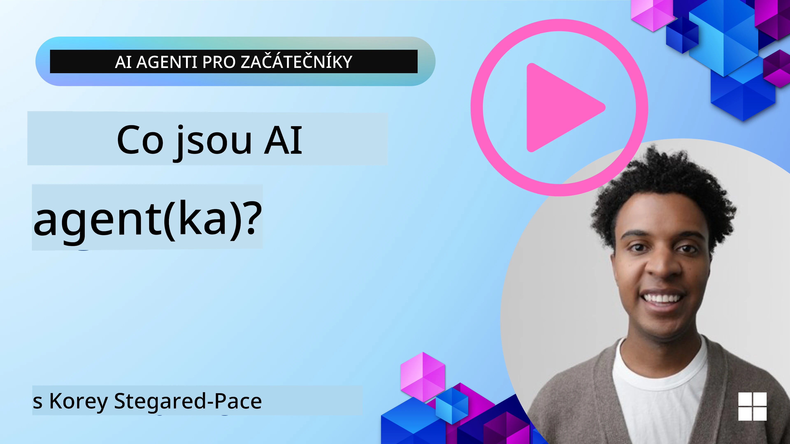
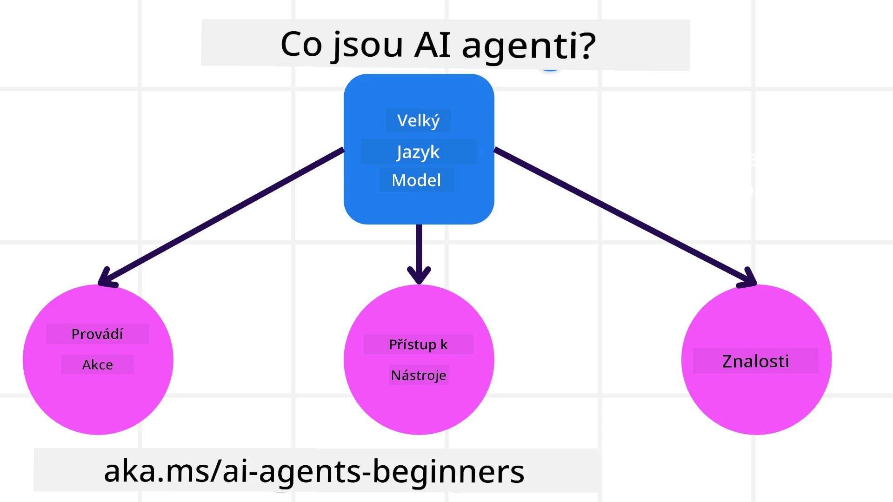
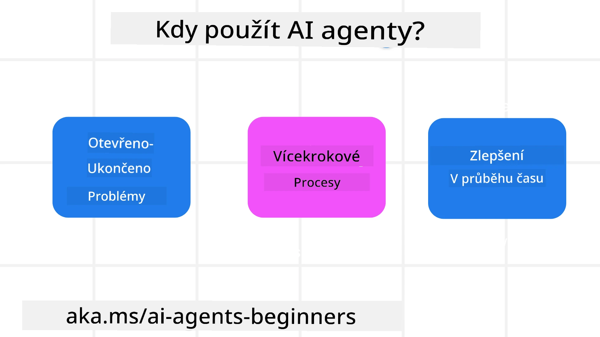

<!--
CO_OP_TRANSLATOR_METADATA:
{
  "original_hash": "cdd28bc00816d2773bb2b5968d782abc",
  "translation_date": "2025-11-11T11:35:05+00:00",
  "source_file": "01-intro-to-ai-agents/README.md",
  "language_code": "cs"
}
-->

> _(Klikněte na obrázek výše pro zhlédnutí videa této lekce)_

# Úvod do AI agentů a jejich využití

Vítejte v kurzu "AI agenti pro začátečníky"! Tento kurz poskytuje základní znalosti a praktické příklady pro tvorbu AI agentů.

Připojte se ke <a href="https://discord.gg/kzRShWzttr" target="_blank">komunitě Azure AI na Discordu</a>, kde se můžete setkat s dalšími studenty a tvůrci AI agentů a klást jakékoliv dotazy ohledně tohoto kurzu.

Na začátku kurzu se zaměříme na lepší pochopení toho, co jsou AI agenti a jak je můžeme využít v aplikacích a pracovních postupech, které vytváříme.

## Úvod

Tato lekce zahrnuje:

- Co jsou AI agenti a jaké jsou jejich různé typy?
- Jaké případy použití jsou pro AI agenty nejvhodnější a jak nám mohou pomoci?
- Jaké jsou základní stavební bloky při navrhování agentních řešení?

## Cíle učení
Po dokončení této lekce byste měli být schopni:

- Porozumět konceptům AI agentů a jak se liší od jiných AI řešení.
- Efektivně využívat AI agenty.
- Produktivně navrhovat agentní řešení pro uživatele i zákazníky.

## Definice AI agentů a typy AI agentů

### Co jsou AI agenti?

AI agenti jsou **systémy**, které umožňují **velkým jazykovým modelům (LLMs)** **provádět akce** tím, že rozšiřují jejich schopnosti a poskytují jim **přístup k nástrojům** a **znalostem**.

Rozložme tuto definici na menší části:

- **Systém** - Je důležité vnímat agenty ne jako jeden samostatný komponent, ale jako systém mnoha komponent. Na základní úrovni jsou komponenty AI agenta:
  - **Prostředí** - Definovaný prostor, ve kterém AI agent operuje. Například pokud bychom měli AI agenta pro rezervaci cest, prostředím by mohl být systém pro rezervaci cest, který agent používá k plnění úkolů.
  - **Senzory** - Prostředí obsahuje informace a poskytuje zpětnou vazbu. AI agenti používají senzory k získávání a interpretaci těchto informací o aktuálním stavu prostředí. V příkladu agenta pro rezervaci cest může systém poskytovat informace, jako je dostupnost hotelů nebo ceny letů.
  - **Aktuátory** - Jakmile AI agent obdrží aktuální stav prostředí, určí, jakou akci provést, aby změnil prostředí. V případě agenta pro rezervaci cest by to mohlo být rezervování dostupného pokoje pro uživatele.

**Velké jazykové modely** - Koncept agentů existoval již před vytvořením LLMs. Výhodou budování AI agentů s LLMs je jejich schopnost interpretovat lidský jazyk a data. Tato schopnost umožňuje LLMs interpretovat informace z prostředí a definovat plán pro změnu prostředí.

**Provádění akcí** - Mimo systémy AI agentů jsou LLMs omezeny na situace, kdy akce spočívá v generování obsahu nebo informací na základě uživatelského požadavku. Uvnitř systémů AI agentů mohou LLMs plnit úkoly interpretací uživatelského požadavku a využíváním nástrojů dostupných v jejich prostředí.

**Přístup k nástrojům** - Jaké nástroje má LLM k dispozici, je definováno 1) prostředím, ve kterém operuje, a 2) vývojářem AI agenta. V našem příkladu cestovního agenta jsou nástroje agenta omezeny operacemi dostupnými v rezervačním systému, a/nebo vývojář může omezit přístup agenta k nástrojům na lety.

**Paměť + znalosti** - Paměť může být krátkodobá v kontextu konverzace mezi uživatelem a agentem. Dlouhodobě, mimo informace poskytované prostředím, mohou AI agenti také získávat znalosti z jiných systémů, služeb, nástrojů a dokonce i od jiných agentů. V příkladu cestovního agenta by tyto znalosti mohly zahrnovat informace o preferencích uživatele uložené v zákaznické databázi.

### Různé typy agentů

Nyní, když máme obecnou definici AI agentů, podívejme se na některé konkrétní typy agentů a jak by se aplikovaly na AI agenta pro rezervaci cest.

| **Typ agenta**                | **Popis**                                                                                                                       | **Příklad**                                                                                                                                                                                                                   |
| ----------------------------- | ------------------------------------------------------------------------------------------------------------------------------------- | ----------------------------------------------------------------------------------------------------------------------------------------------------------------------------------------------------------------------------- |
| **Jednoduchý reflexní agent**      | Provádí okamžité akce na základě předem definovaných pravidel.                                                                                  | Cestovní agent interpretuje kontext e-mailu a přeposílá stížnosti na cestování zákaznickému servisu.                                                                                                                          |
| **Modelově založený reflexní agent** | Provádí akce na základě modelu světa a změn v tomto modelu.                                                              | Cestovní agent upřednostňuje trasy s významnými změnami cen na základě přístupu k historickým datům o cenách.                                                                                                             |
| **Agent založený na cílech**         | Vytváří plány k dosažení konkrétních cílů interpretací cíle a určením akcí k jeho dosažení.                                  | Cestovní agent rezervuje cestu určením potřebných cestovních opatření (auto, veřejná doprava, lety) z aktuálního místa do cílové destinace.                                                                                |
| **Agent založený na užitku**      | Zvažuje preference a numericky vyhodnocuje kompromisy, aby určil, jak dosáhnout cílů.                                               | Cestovní agent maximalizuje užitek tím, že zvažuje pohodlí vs. náklady při rezervaci cestování.                                                                                                                                          |
| **Učící se agent**           | Zlepšuje se v průběhu času reakcí na zpětnou vazbu a úpravou akcí.                                                        | Cestovní agent se zlepšuje pomocí zpětné vazby od zákazníků z dotazníků po cestě, aby provedl úpravy budoucích rezervací.                                                                                                               |
| **Hierarchický agent**       | Obsahuje více agentů v hierarchickém systému, kde agenti na vyšší úrovni rozdělují úkoly na podúkoly, které dokončují agenti na nižší úrovni. | Cestovní agent ruší cestu rozdělením úkolu na podúkoly (například zrušení konkrétních rezervací) a nechává je dokončit agenty na nižší úrovni, kteří podávají zprávu agentovi na vyšší úrovni.                                     |
| **Systémy více agentů (MAS)** | Agenti plní úkoly nezávisle, buď kooperativně, nebo konkurenčně.                                                           | Kooperativní: Více agentů rezervuje konkrétní cestovní služby, jako jsou hotely, lety a zábava. Konkurenční: Více agentů spravuje a soutěží o sdílený kalendář rezervací hotelu, aby rezervovali zákazníky do hotelu. |

## Kdy používat AI agenty

V předchozí části jsme použili příklad cestovního agenta k vysvětlení, jak různé typy agentů mohou být použity v různých scénářích rezervace cest. Tento příklad budeme používat i v průběhu kurzu.

Podívejme se na typy případů použití, pro které jsou AI agenti nejvhodnější:

- **Problémy s otevřeným koncem** - umožnění LLM určit potřebné kroky k dokončení úkolu, protože je nelze vždy pevně zakódovat do pracovního postupu.
- **Vícekrokové procesy** - úkoly, které vyžadují určitou úroveň složitosti, při níž AI agent potřebuje používat nástroje nebo informace během více kroků místo jednorázového získání.
- **Zlepšení v průběhu času** - úkoly, kde se agent může zlepšovat v průběhu času díky zpětné vazbě od svého prostředí nebo uživatelů, aby poskytoval lepší užitek.

Další úvahy o používání AI agentů pokryjeme v lekci Budování důvěryhodných AI agentů.

## Základy agentních řešení

### Vývoj agentů

Prvním krokem při navrhování systému AI agenta je definování nástrojů, akcí a chování. V tomto kurzu se zaměřujeme na použití **Azure AI Agent Service** k definování našich agentů. Nabízí funkce jako:

- Výběr otevřených modelů, jako jsou OpenAI, Mistral a Llama
- Použití licencovaných dat prostřednictvím poskytovatelů, jako je Tripadvisor
- Použití standardizovaných nástrojů OpenAPI 3.0

### Agentní vzory

Komunikace s LLM probíhá prostřednictvím promptů. Vzhledem k poloautonomní povaze AI agentů není vždy možné nebo nutné ručně znovu promptovat LLM po změně prostředí. Používáme **agentní vzory**, které nám umožňují promptovat LLM během více kroků škálovatelnějším způsobem.

Tento kurz je rozdělen do některých aktuálně populárních agentních vzorů.

### Agentní rámce

Agentní rámce umožňují vývojářům implementovat agentní vzory prostřednictvím kódu. Tyto rámce nabízejí šablony, pluginy a nástroje pro lepší spolupráci AI agentů. Tyto výhody poskytují schopnosti pro lepší pozorovatelnost a řešení problémů systémů AI agentů.

V tomto kurzu prozkoumáme výzkumem podložený rámec AutoGen a produkčně připravený rámec Agent od Semantic Kernel.

## Ukázkové kódy

- Python: [Agentní rámec](./code_samples/01-python-agent-framework.ipynb)
- .NET: [Agentní rámec](./code_samples/01-dotnet-agent-framework.md)

## Máte další otázky ohledně AI agentů?

Připojte se k [Azure AI Foundry Discord](https://aka.ms/ai-agents/discord), kde se můžete setkat s dalšími studenty, zúčastnit se konzultačních hodin a získat odpovědi na vaše otázky ohledně AI agentů.

## Předchozí lekce

[Nastavení kurzu](../00-course-setup/README.md)

## Další lekce

[Prozkoumání agentních rámců](../02-explore-agentic-frameworks/README.md)

---

<!-- CO-OP TRANSLATOR DISCLAIMER START -->
**Prohlášení**:  
Tento dokument byl přeložen pomocí služby AI pro překlady [Co-op Translator](https://github.com/Azure/co-op-translator). Ačkoli se snažíme o přesnost, mějte prosím na paměti, že automatizované překlady mohou obsahovat chyby nebo nepřesnosti. Původní dokument v jeho rodném jazyce by měl být považován za autoritativní zdroj. Pro důležité informace se doporučuje profesionální lidský překlad. Neodpovídáme za žádná nedorozumění nebo nesprávné interpretace vyplývající z použití tohoto překladu.
<!-- CO-OP TRANSLATOR DISCLAIMER END -->