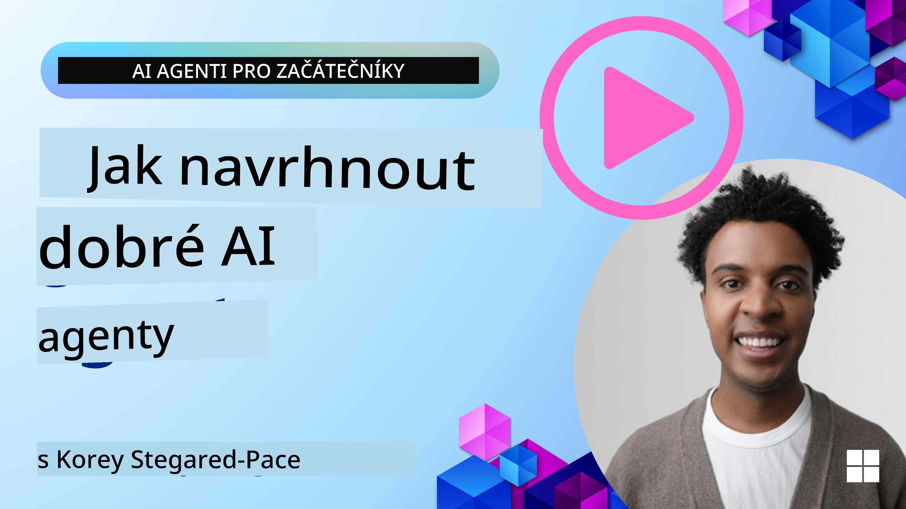
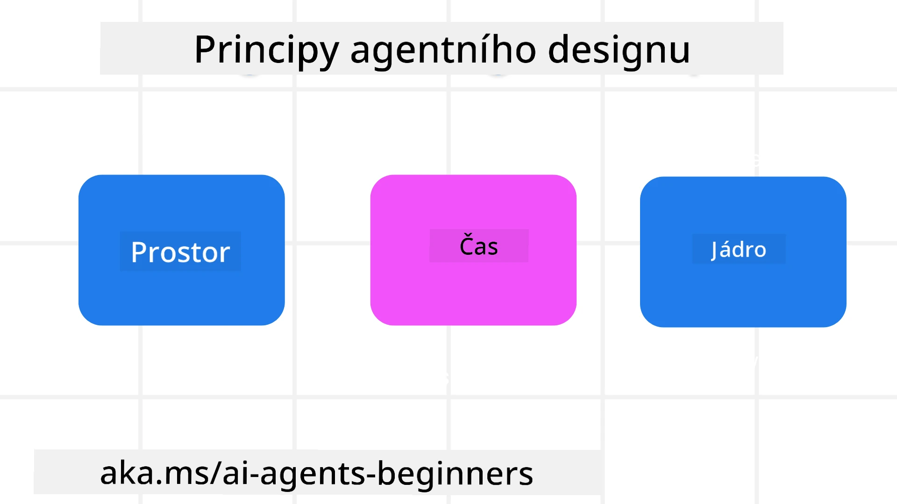

<!--
CO_OP_TRANSLATOR_METADATA:
{
  "original_hash": "d71524fe83a23829ae7a23b4031aaac8",
  "translation_date": "2025-11-13T13:50:56+00:00",
  "source_file": "03-agentic-design-patterns/README.md",
  "language_code": "cs"
}
-->

> _(Klikněte na obrázek výše pro zhlédnutí videa této lekce)_
# Principy návrhu agentů AI

## Úvod

Existuje mnoho způsobů, jak přemýšlet o budování agentních systémů AI. Vzhledem k tomu, že nejednoznačnost je v návrhu generativní AI spíše vlastností než chybou, je pro inženýry někdy obtížné zjistit, kde vůbec začít. Vytvořili jsme sadu principů návrhu UX zaměřených na člověka, které umožňují vývojářům budovat systémy zaměřené na zákazníka, aby splnily jejich obchodní potřeby. Tyto principy návrhu nejsou předepsanou architekturou, ale spíše výchozím bodem pro týmy, které definují a vytvářejí agentní zkušenosti.

Obecně by agenti měli:

- Rozšiřovat a škálovat lidské schopnosti (brainstorming, řešení problémů, automatizace atd.)
- Vyplňovat mezery ve znalostech (rychlé seznámení s novými oblastmi, překlady atd.)
- Usnadňovat a podporovat spolupráci způsoby, které jednotlivcům vyhovují při práci s ostatními
- Pomáhat nám stát se lepší verzí sebe sama (např. životní kouč/organizátor úkolů, pomoc s učením emoční regulace a dovedností mindfulness, budování odolnosti atd.)

## Tato lekce pokryje

- Co jsou principy návrhu agentů
- Jaké jsou pokyny pro implementaci těchto principů
- Příklady použití těchto principů návrhu

## Cíle učení

Po dokončení této lekce budete schopni:

1. Vysvětlit, co jsou principy návrhu agentů
2. Vysvětlit pokyny pro použití principů návrhu agentů
3. Pochopit, jak vytvořit agenta pomocí principů návrhu agentů

## Principy návrhu agentů

### Agent (Prostor)

Toto je prostředí, ve kterém agent funguje. Tyto principy informují o tom, jak navrhovat agenty pro zapojení do fyzických a digitálních světů.

- **Spojovat, ne rozdělovat** – pomáhat spojovat lidi s jinými lidmi, událostmi a akčními znalostmi, aby se umožnila spolupráce a propojení.
- Agenti pomáhají spojovat události, znalosti a lidi.
- Agenti přibližují lidi k sobě. Nejsou navrženi tak, aby nahrazovali nebo snižovali hodnotu lidí.
- **Snadno přístupní, ale občas neviditelní** – agent funguje převážně na pozadí a upozorňuje nás pouze tehdy, když je to relevantní a vhodné.
  - Agent je snadno objevitelný a přístupný pro autorizované uživatele na jakémkoli zařízení nebo platformě.
  - Agent podporuje multimodální vstupy a výstupy (zvuk, hlas, text atd.).
  - Agent může plynule přecházet mezi popředím a pozadím; mezi proaktivním a reaktivním přístupem, v závislosti na potřebách uživatele.
  - Agent může fungovat v neviditelné formě, ale jeho procesy na pozadí a spolupráce s jinými agenty jsou pro uživatele transparentní a kontrolovatelné.

### Agent (Čas)

Toto je způsob, jakým agent funguje v čase. Tyto principy informují o tom, jak navrhovat agenty, kteří interagují napříč minulostí, přítomností a budoucností.

- **Minulost**: Reflexe historie zahrnující stav i kontext.
  - Agent poskytuje relevantnější výsledky na základě analýzy bohatších historických dat, nejen událostí, lidí nebo stavů.
  - Agent vytváří spojení z minulých událostí a aktivně reflektuje paměť, aby se zapojil do aktuálních situací.
- **Přítomnost**: Spíše podněcování než upozorňování.
  - Agent ztělesňuje komplexní přístup k interakci s lidmi. Když se něco stane, agent jde nad rámec statického upozornění nebo jiné formality. Agent může zjednodušit procesy nebo dynamicky generovat podněty, aby nasměroval pozornost uživatele ve správný okamžik.
  - Agent poskytuje informace na základě kontextuálního prostředí, sociálních a kulturních změn a přizpůsobené záměru uživatele.
  - Interakce s agentem může být postupná, vyvíjející se/rostoucí v komplexnosti, aby dlouhodobě posilovala uživatele.
- **Budoucnost**: Přizpůsobování a vývoj.
  - Agent se přizpůsobuje různým zařízením, platformám a modalitám.
  - Agent se přizpůsobuje chování uživatele, potřebám přístupnosti a je volně přizpůsobitelný.
  - Agent je formován a vyvíjí se prostřednictvím kontinuální interakce s uživatelem.

### Agent (Jádro)

Toto jsou klíčové prvky v jádru návrhu agenta.

- **Přijmout nejistotu, ale budovat důvěru**.
  - Určitá úroveň nejistoty agenta je očekávaná. Nejistota je klíčovým prvkem návrhu agenta.
  - Důvěra a transparentnost jsou základní vrstvy návrhu agenta.
  - Lidé mají kontrolu nad tím, kdy je agent zapnutý/vypnutý, a stav agenta je vždy jasně viditelný.

## Pokyny pro implementaci těchto principů

Při používání výše uvedených principů návrhu použijte následující pokyny:

1. **Transparentnost**: Informujte uživatele, že je zapojena AI, jak funguje (včetně minulých akcí) a jak poskytnout zpětnou vazbu a upravit systém.
2. **Kontrola**: Umožněte uživateli přizpůsobit, specifikovat preference a personalizovat, a mít kontrolu nad systémem a jeho atributy (včetně možnosti zapomenout).
3. **Konzistence**: Usilujte o konzistentní, multimodální zkušenosti napříč zařízeními a koncovými body. Používejte známé prvky UI/UX, kde je to možné (např. ikona mikrofonu pro hlasovou interakci), a co nejvíce snižte kognitivní zátěž zákazníka (např. usilujte o stručné odpovědi, vizuální pomůcky a obsah „Zjistit více“).

## Jak navrhnout cestovního agenta pomocí těchto principů a pokynů

Představte si, že navrhujete cestovního agenta, zde je, jak byste mohli přemýšlet o použití principů návrhu a pokynů:

1. **Transparentnost** – Informujte uživatele, že cestovní agent je agentem s podporou AI. Poskytněte základní instrukce, jak začít (např. zpráva „Ahoj“, ukázkové příkazy). Jasně to zdokumentujte na produktové stránce. Zobrazte seznam příkazů, které uživatel v minulosti zadal. Uveďte jasně, jak poskytnout zpětnou vazbu (palec nahoru a dolů, tlačítko „Poslat zpětnou vazbu“ atd.). Jasně vysvětlete, zda má agent omezení v používání nebo tématech.
2. **Kontrola** – Ujistěte se, že je jasné, jak může uživatel agenta upravit po jeho vytvoření, například pomocí systémového příkazu. Umožněte uživateli zvolit, jak podrobný má agent být, jeho styl psaní a jakékoliv výhrady k tomu, o čem by agent neměl mluvit. Umožněte uživateli zobrazit a smazat jakékoliv přidružené soubory nebo data, příkazy a minulé konverzace.
3. **Konzistence** – Ujistěte se, že ikony pro sdílení příkazu, přidání souboru nebo fotografie a označení někoho nebo něčeho jsou standardní a rozpoznatelné. Použijte ikonu kancelářské sponky pro označení nahrávání/sdílení souborů s agentem a ikonu obrázku pro označení nahrávání grafiky.

## Ukázkové kódy

- Python: [Agent Framework](./code_samples/03-python-agent-framework.ipynb)
- .NET: [Agent Framework](./code_samples/03-dotnet-agent-framework.md)

## Máte další otázky ohledně návrhových vzorů agentů AI?

Připojte se k [Azure AI Foundry Discord](https://aka.ms/ai-agents/discord), kde se můžete setkat s dalšími studenty, zúčastnit se konzultačních hodin a získat odpovědi na své otázky ohledně agentů AI.

## Další zdroje

- <a href="https://openai.com" target="_blank">Postupy pro řízení agentních AI systémů | OpenAI</a>
- <a href="https://microsoft.com" target="_blank">Projekt HAX Toolkit - Microsoft Research</a>
- <a href="https://responsibleaitoolbox.ai" target="_blank">Responsible AI Toolbox</a>

## Předchozí lekce

[Zkoumání agentních rámců](../02-explore-agentic-frameworks/README.md)

## Další lekce

[Vzor návrhu pro použití nástrojů](../04-tool-use/README.md)

---

<!-- CO-OP TRANSLATOR DISCLAIMER START -->
**Prohlášení**:  
Tento dokument byl přeložen pomocí služby AI pro překlady [Co-op Translator](https://github.com/Azure/co-op-translator). I když se snažíme o přesnost, mějte prosím na paměti, že automatizované překlady mohou obsahovat chyby nebo nepřesnosti. Původní dokument v jeho původním jazyce by měl být považován za autoritativní zdroj. Pro důležité informace se doporučuje profesionální lidský překlad. Neodpovídáme za žádná nedorozumění nebo nesprávné interpretace vyplývající z použití tohoto překladu.
<!-- CO-OP TRANSLATOR DISCLAIMER END -->