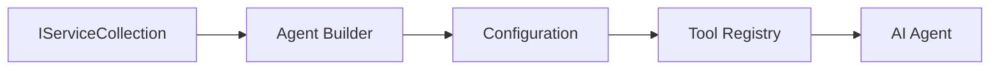

<!--
CO_OP_TRANSLATOR_METADATA:
{
  "original_hash": "bcc874e190347bd6a095aed56dc16de8",
  "translation_date": "2025-11-13T13:51:59+00:00",
  "source_file": "03-agentic-design-patterns/code_samples/03-dotnet-agent-framework.md",
  "language_code": "cs"
}
-->
# 🎨 Agentické návrhové vzory s GitHub modely (.NET)

## 📋 Cíle učení

Tento příklad ukazuje návrhové vzory na podnikové úrovni pro vytváření inteligentních agentů pomocí Microsoft Agent Framework v .NET s integrací GitHub modelů. Naučíte se profesionální vzory a architektonické přístupy, které činí agenty připravené pro produkci, snadno udržovatelné a škálovatelné.

### Podnikové návrhové vzory

- 🏭 **Factory Pattern**: Standardizované vytváření agentů s využitím dependency injection
- 🔧 **Builder Pattern**: Plynulá konfigurace a nastavení agentů
- 🧵 **Thread-Safe Patterns**: Správa konverzací v konkurenčním prostředí
- 📋 **Repository Pattern**: Organizovaná správa nástrojů a schopností

## 🎯 Architektonické výhody .NET

### Podnikové funkce

- **Silné typování**: Validace při kompilaci a podpora IntelliSense
- **Dependency Injection**: Integrovaná podpora DI kontejneru
- **Správa konfigurace**: Vzory IConfiguration a Options
- **Async/Await**: Prvotřídní podpora asynchronního programování

### Vzory připravené pro produkci

- **Integrace logování**: Podpora ILogger a strukturovaného logování
- **Kontroly stavu**: Vestavěné monitorování a diagnostika
- **Validace konfigurace**: Silné typování s datovými anotacemi
- **Zpracování chyb**: Strukturovaná správa výjimek

## 🔧 Technická architektura

### Základní komponenty .NET

- **Microsoft.Extensions.AI**: Jednotné abstrakce AI služeb
- **Microsoft.Agents.AI**: Rámec pro orchestraci podnikových agentů
- **Integrace GitHub modelů**: Vzory API klientů s vysokým výkonem
- **Systém konfigurace**: Integrace appsettings.json a prostředí

### Implementace návrhových vzorů



## 🏗️ Ukázané podnikové vzory

### 1. **Vzory pro vytváření**

- **Agent Factory**: Centralizované vytváření agentů s konzistentní konfigurací
- **Builder Pattern**: Plynulé API pro komplexní konfiguraci agentů
- **Singleton Pattern**: Sdílené zdroje a správa konfigurace
- **Dependency Injection**: Volné propojení a testovatelnost

### 2. **Behaviorální vzory**

- **Strategy Pattern**: Zaměnitelné strategie provádění nástrojů
- **Command Pattern**: Zapouzdřené operace agentů s možností vrácení
- **Observer Pattern**: Správa životního cyklu agentů řízená událostmi
- **Template Method**: Standardizované pracovní postupy agentů

### 3. **Strukturální vzory**

- **Adapter Pattern**: Vrstva integrace API GitHub modelů
- **Decorator Pattern**: Rozšíření schopností agentů
- **Facade Pattern**: Zjednodušené rozhraní pro interakci s agenty
- **Proxy Pattern**: Lazy loading a caching pro výkon

## 📚 Návrhové principy .NET

### SOLID principy

- **Single Responsibility**: Každá komponenta má jeden jasný účel
- **Open/Closed**: Rozšiřitelné bez modifikace
- **Liskov Substitution**: Implementace nástrojů založené na rozhraní
- **Interface Segregation**: Zaměřená, soudržná rozhraní
- **Dependency Inversion**: Závislost na abstrakcích, ne na konkrétních implementacích

### Čistá architektura

- **Doménová vrstva**: Základní abstrakce agentů a nástrojů
- **Aplikační vrstva**: Orchestrace agentů a pracovní postupy
- **Infrastrukturní vrstva**: Integrace GitHub modelů a externích služeb
- **Prezentační vrstva**: Interakce s uživatelem a formátování odpovědí

## 🔒 Podnikové úvahy

### Bezpečnost

- **Správa přihlašovacích údajů**: Bezpečné zacházení s API klíči pomocí IConfiguration
- **Validace vstupů**: Silné typování a validace datovými anotacemi
- **Sanitace výstupů**: Bezpečné zpracování a filtrování odpovědí
- **Audit logování**: Komplexní sledování operací

### Výkon

- **Asynchronní vzory**: Neblokující I/O operace
- **Pooling připojení**: Efektivní správa HTTP klientů
- **Caching**: Ukládání odpovědí pro zlepšení výkonu
- **Správa zdrojů**: Správné uvolňování a čištění

### Škálovatelnost

- **Bezpečnost vláken**: Podpora konkurenčního provádění agentů
- **Pooling zdrojů**: Efektivní využití zdrojů
- **Správa zátěže**: Omezení rychlosti a řízení zpětného tlaku
- **Monitorování**: Metriky výkonu a kontroly stavu

## 🚀 Nasazení do produkce

- **Správa konfigurace**: Nastavení specifická pro prostředí
- **Strategie logování**: Strukturované logování s korelačními ID
- **Zpracování chyb**: Globální správa výjimek s odpovídající obnovou
- **Monitorování**: Application Insights a výkonové čítače
- **Testování**: Jednotkové testy, integrační testy a vzory zátěžového testování

Připraveni vytvořit inteligentní agenty na podnikové úrovni s .NET? Pojďme navrhnout něco robustního! 🏢✨

## 🚀 Začínáme

### Předpoklady

- [.NET 10 SDK](https://dotnet.microsoft.com/download/dotnet/10.0) nebo vyšší
- [Přístupový token API GitHub modelů](https://docs.github.com/github-models/github-models-at-scale/using-your-own-api-keys-in-github-models)

### Požadované proměnné prostředí

```bash
# zsh/bash
export GH_TOKEN=<your_github_token>
export GH_ENDPOINT=https://models.github.ai/inference
export GH_MODEL_ID=openai/gpt-5-mini
```

```powershell
# PowerShell
$env:GH_TOKEN = "<your_github_token>"
$env:GH_ENDPOINT = "https://models.github.ai/inference"
$env:GH_MODEL_ID = "openai/gpt-5-mini"
```

### Ukázkový kód

Pro spuštění ukázkového kódu,

```bash
# zsh/bash
chmod +x ./03-dotnet-agent-framework.cs
./03-dotnet-agent-framework.cs
```

Nebo pomocí dotnet CLI:

```bash
dotnet run ./03-dotnet-agent-framework.cs
```

Podívejte se na [`03-dotnet-agent-framework.cs`](../../../../03-agentic-design-patterns/code_samples/03-dotnet-agent-framework.cs) pro kompletní kód.

```csharp
#!/usr/bin/dotnet run

#:package Microsoft.Extensions.AI@10.*
#:package Microsoft.Agents.AI.OpenAI@1.*-*

using System.ClientModel;
using System.ComponentModel;

using Microsoft.Agents.AI;
using Microsoft.Extensions.AI;

using OpenAI;

// Tool Function: Random Destination Generator
// This static method will be available to the agent as a callable tool
// The [Description] attribute helps the AI understand when to use this function
// This demonstrates how to create custom tools for AI agents
[Description("Provides a random vacation destination.")]
static string GetRandomDestination()
{
    // List of popular vacation destinations around the world
    // The agent will randomly select from these options
    var destinations = new List<string>
    {
        "Paris, France",
        "Tokyo, Japan",
        "New York City, USA",
        "Sydney, Australia",
        "Rome, Italy",
        "Barcelona, Spain",
        "Cape Town, South Africa",
        "Rio de Janeiro, Brazil",
        "Bangkok, Thailand",
        "Vancouver, Canada"
    };

    // Generate random index and return selected destination
    // Uses System.Random for simple random selection
    var random = new Random();
    int index = random.Next(destinations.Count);
    return destinations[index];
}

// Extract configuration from environment variables
// Retrieve the GitHub Models API endpoint, defaults to https://models.github.ai/inference if not specified
// Retrieve the model ID, defaults to openai/gpt-5-mini if not specified
// Retrieve the GitHub token for authentication, throws exception if not specified
var github_endpoint = Environment.GetEnvironmentVariable("GH_ENDPOINT") ?? "https://models.github.ai/inference";
var github_model_id = Environment.GetEnvironmentVariable("GH_MODEL_ID") ?? "openai/gpt-5-mini";
var github_token = Environment.GetEnvironmentVariable("GH_TOKEN") ?? throw new InvalidOperationException("GH_TOKEN is not set.");

// Configure OpenAI Client Options
// Create configuration options to point to GitHub Models endpoint
// This redirects OpenAI client calls to GitHub's model inference service
var openAIOptions = new OpenAIClientOptions()
{
    Endpoint = new Uri(github_endpoint)
};

// Initialize OpenAI Client with GitHub Models Configuration
// Create OpenAI client using GitHub token for authentication
// Configure it to use GitHub Models endpoint instead of OpenAI directly
var openAIClient = new OpenAIClient(new ApiKeyCredential(github_token), openAIOptions);

// Define Agent Identity and Comprehensive Instructions
// Agent name for identification and logging purposes
var AGENT_NAME = "TravelAgent";

// Detailed instructions that define the agent's personality, capabilities, and behavior
// This system prompt shapes how the agent responds and interacts with users
var AGENT_INSTRUCTIONS = """
You are a helpful AI Agent that can help plan vacations for customers.

Important: When users specify a destination, always plan for that location. Only suggest random destinations when the user hasn't specified a preference.

When the conversation begins, introduce yourself with this message:
"Hello! I'm your TravelAgent assistant. I can help plan vacations and suggest interesting destinations for you. Here are some things you can ask me:
1. Plan a day trip to a specific location
2. Suggest a random vacation destination
3. Find destinations with specific features (beaches, mountains, historical sites, etc.)
4. Plan an alternative trip if you don't like my first suggestion

What kind of trip would you like me to help you plan today?"

Always prioritize user preferences. If they mention a specific destination like "Bali" or "Paris," focus your planning on that location rather than suggesting alternatives.
""";

// Create AI Agent with Advanced Travel Planning Capabilities
// Initialize complete agent pipeline: OpenAI client → Chat client → AI agent
// Configure agent with name, detailed instructions, and available tools
// This demonstrates the .NET agent creation pattern with full configuration
AIAgent agent = openAIClient
    .GetChatClient(github_model_id)
    .CreateAIAgent(
        name: AGENT_NAME,
        instructions: AGENT_INSTRUCTIONS,
        tools: [AIFunctionFactory.Create(GetRandomDestination)]
    );

// Create New Conversation Thread for Context Management
// Initialize a new conversation thread to maintain context across multiple interactions
// Threads enable the agent to remember previous exchanges and maintain conversational state
// This is essential for multi-turn conversations and contextual understanding
AgentThread thread = agent.GetNewThread();

// Execute Agent: First Travel Planning Request
// Run the agent with an initial request that will likely trigger the random destination tool
// The agent will analyze the request, use the GetRandomDestination tool, and create an itinerary
// Using the thread parameter maintains conversation context for subsequent interactions
await foreach (var update in agent.RunStreamingAsync("Plan me a day trip", thread))
{
    await Task.Delay(10);
    Console.Write(update);
}

Console.WriteLine();

// Execute Agent: Follow-up Request with Context Awareness
// Demonstrate contextual conversation by referencing the previous response
// The agent remembers the previous destination suggestion and will provide an alternative
// This showcases the power of conversation threads and contextual understanding in .NET agents
await foreach (var update in agent.RunStreamingAsync("I don't like that destination. Plan me another vacation.", thread))
{
    await Task.Delay(10);
    Console.Write(update);
}
```

---

<!-- CO-OP TRANSLATOR DISCLAIMER START -->
**Prohlášení**:  
Tento dokument byl přeložen pomocí služby AI pro překlady [Co-op Translator](https://github.com/Azure/co-op-translator). Ačkoli se snažíme o přesnost, mějte prosím na paměti, že automatizované překlady mohou obsahovat chyby nebo nepřesnosti. Původní dokument v jeho původním jazyce by měl být považován za autoritativní zdroj. Pro důležité informace se doporučuje profesionální lidský překlad. Neodpovídáme za žádná nedorozumění nebo nesprávné interpretace vyplývající z použití tohoto překladu.
<!-- CO-OP TRANSLATOR DISCLAIMER END -->