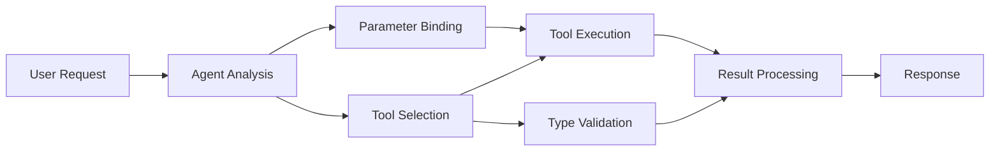

<!--
CO_OP_TRANSLATOR_METADATA:
{
  "original_hash": "91d6061e402489603f2ec8b528cae59b",
  "translation_date": "2025-11-18T18:11:49+00:00",
  "source_file": "04-tool-use/code_samples/04-dotnet-agent-framework.md",
  "language_code": "cs"
}
-->
# 🛠️ Pokročilé použití nástrojů s modely GitHub (.NET)

## 📋 Cíle učení

Tento notebook ukazuje vzory integrace nástrojů na podnikové úrovni pomocí Microsoft Agent Framework v .NET s modely GitHub. Naučíte se vytvářet sofistikované agenty s více specializovanými nástroji, využívajícími silné typování C# a podnikové funkce .NET.

### Pokročilé schopnosti nástrojů, které zvládnete

- 🔧 **Architektura více nástrojů**: Vytváření agentů s více specializovanými schopnostmi
- 🎯 **Bezpečné provádění nástrojů**: Využití ověření během kompilace v C#
- 📊 **Podnikové vzory nástrojů**: Návrh nástrojů připravených pro produkci a zpracování chyb
- 🔗 **Kompozice nástrojů**: Kombinace nástrojů pro komplexní obchodní procesy

## 🎯 Výhody architektury nástrojů v .NET

### Funkce podnikových nástrojů

- **Ověření během kompilace**: Silné typování zajišťuje správnost parametrů nástrojů
- **Dependency Injection**: Integrace IoC kontejneru pro správu nástrojů
- **Async/Await vzory**: Nezablokované provádění nástrojů s řádnou správou zdrojů
- **Strukturované logování**: Vestavěná integrace logování pro monitorování provádění nástrojů

### Vzory připravené pro produkci

- **Zpracování výjimek**: Komplexní správa chyb s typovanými výjimkami
- **Správa zdrojů**: Správné vzory pro uvolňování zdrojů a správu paměti
- **Monitorování výkonu**: Vestavěné metriky a ukazatele výkonu
- **Správa konfigurace**: Typově bezpečná konfigurace s ověřením

## 🔧 Technická architektura

### Základní komponenty nástrojů v .NET

- **Microsoft.Extensions.AI**: Jednotná abstrakční vrstva nástrojů
- **Microsoft.Agents.AI**: Orchestrace nástrojů na podnikové úrovni
- **Integrace modelů GitHub**: Vysoce výkonný API klient s poolingem připojení

### Pipeline pro provádění nástrojů



## 🛠️ Kategorie nástrojů a vzory

### 1. **Nástroje pro zpracování dat**

- **Ověření vstupu**: Silné typování s datovými anotacemi
- **Transformační operace**: Typově bezpečná konverze a formátování dat
- **Obchodní logika**: Nástroje pro výpočty a analýzy specifické pro danou doménu
- **Formátování výstupu**: Generování strukturovaných odpovědí

### 2. **Integrační nástroje**

- **API konektory**: Integrace RESTful služeb pomocí HttpClient
- **Nástroje pro databáze**: Integrace Entity Framework pro přístup k datům
- **Operace se soubory**: Bezpečné operace se souborovým systémem s ověřením
- **Externí služby**: Vzory integrace služeb třetích stran

### 3. **Pomocné nástroje**

- **Zpracování textu**: Manipulace a formátování řetězců
- **Operace s daty/časem**: Výpočty dat/času s ohledem na kulturní specifika
- **Matematické nástroje**: Přesné výpočty a statistické operace
- **Nástroje pro ověřování**: Ověřování obchodních pravidel a verifikace dat

Připraveni vytvářet agenty na podnikové úrovni s výkonnými, typově bezpečnými schopnostmi nástrojů v .NET? Pojďme navrhnout profesionální řešení! 🏢⚡

## 🚀 Začínáme

### Předpoklady

- [.NET 10 SDK](https://dotnet.microsoft.com/download/dotnet/10.0) nebo vyšší
- [Přístupový token API modelů GitHub](https://docs.github.com/github-models/github-models-at-scale/using-your-own-api-keys-in-github-models)

### Požadované proměnné prostředí

```bash
# zsh/bash
export GH_TOKEN=<your_github_token>
export GH_ENDPOINT=https://models.github.ai/inference
export GH_MODEL_ID=openai/gpt-5-mini
```

```powershell
# PowerShell
$env:GH_TOKEN = "<your_github_token>"
$env:GH_ENDPOINT = "https://models.github.ai/inference"
$env:GH_MODEL_ID = "openai/gpt-5-mini"
```

### Ukázkový kód

Pro spuštění ukázkového kódu,

```bash
# zsh/bash
chmod +x ./04-dotnet-agent-framework.cs
./04-dotnet-agent-framework.cs
```

Nebo pomocí dotnet CLI:

```bash
dotnet run ./04-dotnet-agent-framework.cs
```

Podívejte se na [`04-dotnet-agent-framework.cs`](../../../../04-tool-use/code_samples/04-dotnet-agent-framework.cs) pro kompletní kód.

```csharp
#!/usr/bin/dotnet run

#:package Microsoft.Extensions.AI@10.*
#:package Microsoft.Agents.AI.OpenAI@1.*-*

using System.ClientModel;
using System.ComponentModel;

using Microsoft.Agents.AI;
using Microsoft.Extensions.AI;

using OpenAI;

// Tool Function: Random Destination Generator
// This static method will be available to the agent as a callable tool
// The [Description] attribute helps the AI understand when to use this function
// This demonstrates how to create custom tools for AI agents
[Description("Provides a random vacation destination.")]
static string GetRandomDestination()
{
    // List of popular vacation destinations around the world
    // The agent will randomly select from these options
    var destinations = new List<string>
    {
        "Paris, France",
        "Tokyo, Japan",
        "New York City, USA",
        "Sydney, Australia",
        "Rome, Italy",
        "Barcelona, Spain",
        "Cape Town, South Africa",
        "Rio de Janeiro, Brazil",
        "Bangkok, Thailand",
        "Vancouver, Canada"
    };

    // Generate random index and return selected destination
    // Uses System.Random for simple random selection
    var random = new Random();
    int index = random.Next(destinations.Count);
    return destinations[index];
}

// Extract configuration from environment variables
// Retrieve the GitHub Models API endpoint, defaults to https://models.github.ai/inference if not specified
// Retrieve the model ID, defaults to openai/gpt-5-mini if not specified
// Retrieve the GitHub token for authentication, throws exception if not specified
var github_endpoint = Environment.GetEnvironmentVariable("GH_ENDPOINT") ?? "https://models.github.ai/inference";
var github_model_id = Environment.GetEnvironmentVariable("GH_MODEL_ID") ?? "openai/gpt-5-mini";
var github_token = Environment.GetEnvironmentVariable("GH_TOKEN") ?? throw new InvalidOperationException("GH_TOKEN is not set.");

// Configure OpenAI Client Options
// Create configuration options to point to GitHub Models endpoint
// This redirects OpenAI client calls to GitHub's model inference service
var openAIOptions = new OpenAIClientOptions()
{
    Endpoint = new Uri(github_endpoint)
};

// Initialize OpenAI Client with GitHub Models Configuration
// Create OpenAI client using GitHub token for authentication
// Configure it to use GitHub Models endpoint instead of OpenAI directly
var openAIClient = new OpenAIClient(new ApiKeyCredential(github_token), openAIOptions);

// Define Agent Identity and Comprehensive Instructions
// Agent name for identification and logging purposes
var AGENT_NAME = "TravelAgent";

// Detailed instructions that define the agent's personality, capabilities, and behavior
// This system prompt shapes how the agent responds and interacts with users
var AGENT_INSTRUCTIONS = """
You are a helpful AI Agent that can help plan vacations for customers.

Important: When users specify a destination, always plan for that location. Only suggest random destinations when the user hasn't specified a preference.

When the conversation begins, introduce yourself with this message:
"Hello! I'm your TravelAgent assistant. I can help plan vacations and suggest interesting destinations for you. Here are some things you can ask me:
1. Plan a day trip to a specific location
2. Suggest a random vacation destination
3. Find destinations with specific features (beaches, mountains, historical sites, etc.)
4. Plan an alternative trip if you don't like my first suggestion

What kind of trip would you like me to help you plan today?"

Always prioritize user preferences. If they mention a specific destination like "Bali" or "Paris," focus your planning on that location rather than suggesting alternatives.
""";

// Create AI Agent with Advanced Travel Planning Capabilities
// Initialize complete agent pipeline: OpenAI client → Chat client → AI agent
// Configure agent with name, detailed instructions, and available tools
// This demonstrates the .NET agent creation pattern with full configuration
AIAgent agent = openAIClient
    .GetChatClient(github_model_id)
    .CreateAIAgent(
        name: AGENT_NAME,
        instructions: AGENT_INSTRUCTIONS,
        tools: [AIFunctionFactory.Create(GetRandomDestination)]
    );

// Create New Conversation Thread for Context Management
// Initialize a new conversation thread to maintain context across multiple interactions
// Threads enable the agent to remember previous exchanges and maintain conversational state
// This is essential for multi-turn conversations and contextual understanding
AgentThread thread = agent.GetNewThread();

// Execute Agent: First Travel Planning Request
// Run the agent with an initial request that will likely trigger the random destination tool
// The agent will analyze the request, use the GetRandomDestination tool, and create an itinerary
// Using the thread parameter maintains conversation context for subsequent interactions
await foreach (var update in agent.RunStreamingAsync("Plan me a day trip", thread))
{
    await Task.Delay(10);
    Console.Write(update);
}

Console.WriteLine();

// Execute Agent: Follow-up Request with Context Awareness
// Demonstrate contextual conversation by referencing the previous response
// The agent remembers the previous destination suggestion and will provide an alternative
// This showcases the power of conversation threads and contextual understanding in .NET agents
await foreach (var update in agent.RunStreamingAsync("I don't like that destination. Plan me another vacation.", thread))
{
    await Task.Delay(10);
    Console.Write(update);
}
```

---

<!-- CO-OP TRANSLATOR DISCLAIMER START -->
**Prohlášení**:  
Tento dokument byl přeložen pomocí služby AI pro překlad [Co-op Translator](https://github.com/Azure/co-op-translator). I když se snažíme o přesnost, mějte prosím na paměti, že automatické překlady mohou obsahovat chyby nebo nepřesnosti. Původní dokument v jeho rodném jazyce by měl být považován za autoritativní zdroj. Pro důležité informace se doporučuje profesionální lidský překlad. Nejsme zodpovědní za jakékoli nedorozumění nebo nesprávné interpretace vyplývající z použití tohoto překladu.
<!-- CO-OP TRANSLATOR DISCLAIMER END -->