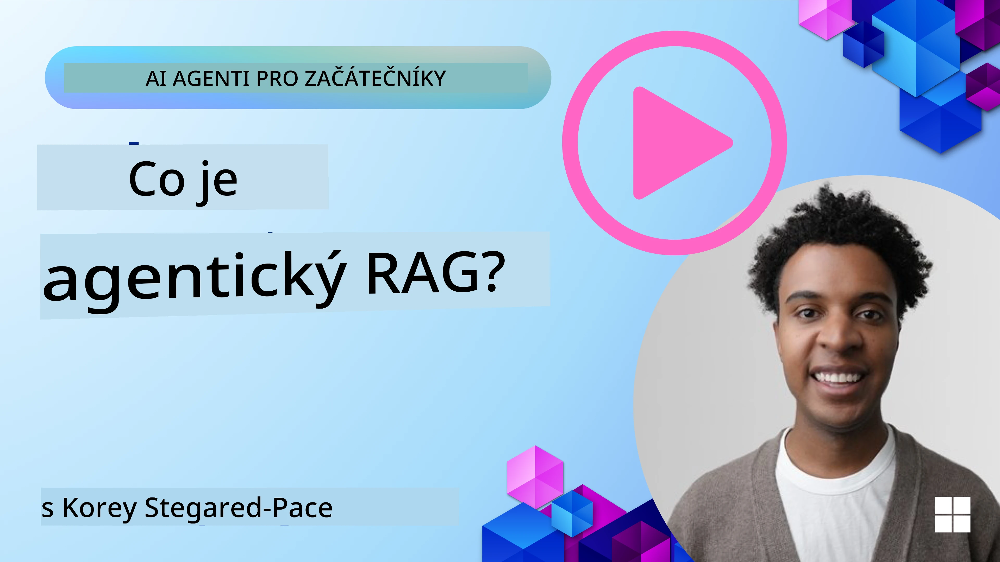
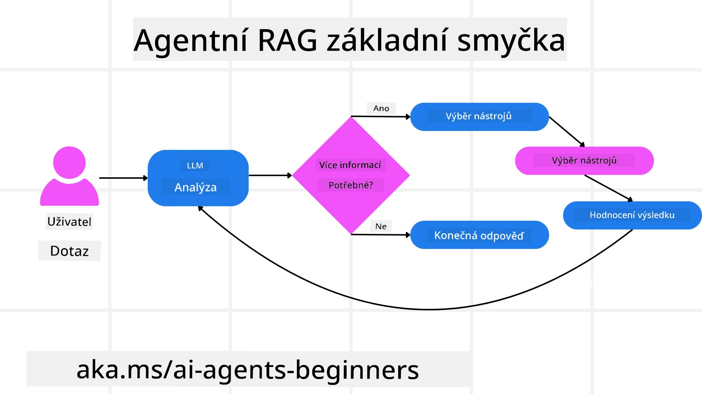
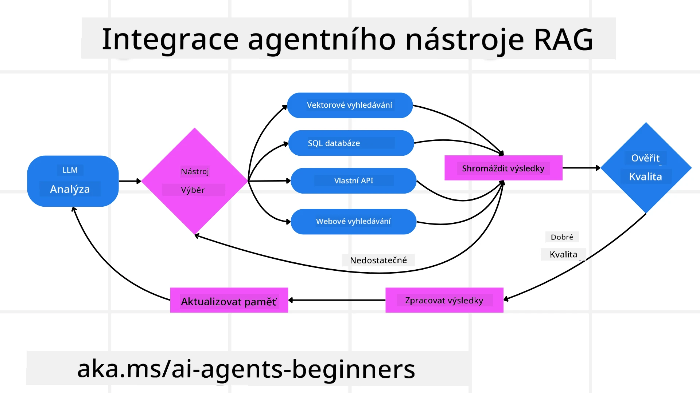
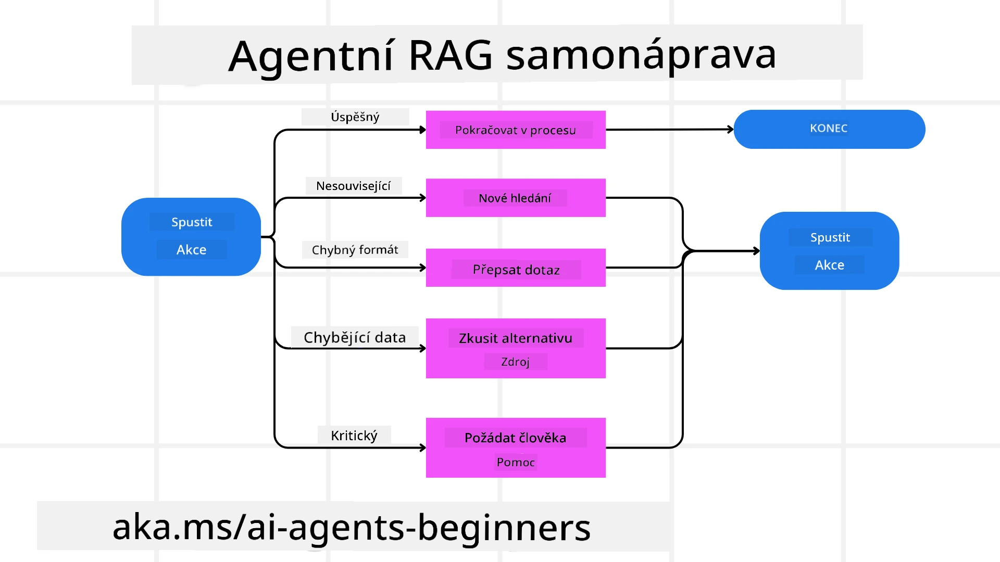
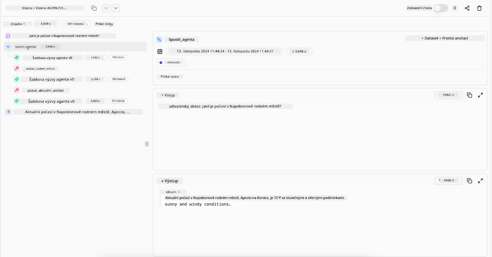

<!--
CO_OP_TRANSLATOR_METADATA:
{
  "original_hash": "0ebf6b2290db55dbf2d10cc49655523b",
  "translation_date": "2025-09-30T07:41:27+00:00",
  "source_file": "05-agentic-rag/README.md",
  "language_code": "cs"
}
-->

> _(Klikněte na obrázek výše pro zhlédnutí videa této lekce)_

# Agentic RAG

Tato lekce poskytuje komplexní přehled o Agentic Retrieval-Augmented Generation (Agentic RAG), nově vznikajícím AI paradigmatu, kde velké jazykové modely (LLMs) autonomně plánují své další kroky při získávání informací z externích zdrojů. Na rozdíl od statických vzorců „získat a přečíst“ Agentic RAG zahrnuje iterativní volání LLM, prokládané použitím nástrojů nebo funkcí a strukturovanými výstupy. Systém vyhodnocuje výsledky, zpřesňuje dotazy, v případě potřeby aktivuje další nástroje a pokračuje v tomto cyklu, dokud nedosáhne uspokojivého řešení.

## Úvod

Tato lekce pokryje:

- **Porozumění Agentic RAG:** Seznamte se s novým paradigmatem v AI, kde velké jazykové modely (LLMs) autonomně plánují své další kroky při získávání informací z externích datových zdrojů.
- **Pochopení iterativního stylu Maker-Checker:** Porozumějte smyčce iterativních volání LLM, prokládaných použitím nástrojů nebo funkcí a strukturovanými výstupy, navržené ke zlepšení správnosti a řešení chybných dotazů.
- **Prozkoumání praktických aplikací:** Identifikujte scénáře, kde Agentic RAG exceluje, jako jsou prostředí zaměřená na správnost, komplexní interakce s databázemi a rozšířené pracovní postupy.

## Cíle učení

Po dokončení této lekce budete vědět, jak/rozumět:

- **Porozumění Agentic RAG:** Seznamte se s novým paradigmatem v AI, kde velké jazykové modely (LLMs) autonomně plánují své další kroky při získávání informací z externích datových zdrojů.
- **Iterativní styl Maker-Checker:** Pochopte koncept smyčky iterativních volání LLM, prokládaných použitím nástrojů nebo funkcí a strukturovanými výstupy, navržené ke zlepšení správnosti a řešení chybných dotazů.
- **Vlastnictví procesu uvažování:** Porozumějte schopnosti systému vlastnit svůj proces uvažování, rozhodovat o tom, jak přistupovat k problémům, aniž by se spoléhal na předem definované cesty.
- **Pracovní postup:** Pochopte, jak agentický model nezávisle rozhoduje o získání zpráv o trendech na trhu, identifikaci dat o konkurenci, korelaci interních prodejních metrik, syntéze zjištění a vyhodnocení strategie.
- **Iterativní smyčky, integrace nástrojů a paměť:** Naučte se o závislosti systému na vzorci interakce ve smyčce, udržování stavu a paměti napříč kroky, aby se zabránilo opakovaným smyčkám a činila informovaná rozhodnutí.
- **Řešení režimů selhání a samokorekce:** Prozkoumejte robustní mechanismy samokorekce systému, včetně iterace a opětovného dotazování, použití diagnostických nástrojů a spoléhání na lidský dohled.
- **Hranice autonomie:** Pochopte omezení Agentic RAG, zaměřte se na autonomii specifickou pro danou doménu, závislost na infrastruktuře a respektování ochranných opatření.
- **Praktické případy použití a hodnota:** Identifikujte scénáře, kde Agentic RAG exceluje, jako jsou prostředí zaměřená na správnost, komplexní interakce s databázemi a rozšířené pracovní postupy.
- **Řízení, transparentnost a důvěra:** Naučte se o důležitosti řízení a transparentnosti, včetně vysvětlitelného uvažování, kontroly zaujatosti a lidského dohledu.

## Co je Agentic RAG?

Agentic Retrieval-Augmented Generation (Agentic RAG) je nově vznikající AI paradigma, kde velké jazykové modely (LLMs) autonomně plánují své další kroky při získávání informací z externích zdrojů. Na rozdíl od statických vzorců „získat a přečíst“ Agentic RAG zahrnuje iterativní volání LLM, prokládané použitím nástrojů nebo funkcí a strukturovanými výstupy. Systém vyhodnocuje výsledky, zpřesňuje dotazy, v případě potřeby aktivuje další nástroje a pokračuje v tomto cyklu, dokud nedosáhne uspokojivého řešení. Tento iterativní styl „maker-checker“ zlepšuje správnost, řeší chybné dotazy a zajišťuje vysoce kvalitní výsledky.

Systém aktivně vlastní svůj proces uvažování, přepisuje neúspěšné dotazy, volí různé metody získávání informací a integruje více nástrojů—například vektorové vyhledávání v Azure AI Search, SQL databáze nebo vlastní API—před dokončením své odpovědi. Rozlišující kvalitou agentického systému je jeho schopnost vlastnit svůj proces uvažování. Tradiční implementace RAG se spoléhají na předem definované cesty, ale agentický systém autonomně určuje sekvenci kroků na základě kvality informací, které najde.

## Definice Agentic Retrieval-Augmented Generation (Agentic RAG)

Agentic Retrieval-Augmented Generation (Agentic RAG) je nově vznikající paradigma ve vývoji AI, kde LLM nejen získávají informace z externích datových zdrojů, ale také autonomně plánují své další kroky. Na rozdíl od statických vzorců „získat a přečíst“ nebo pečlivě skriptovaných sekvencí promptů Agentic RAG zahrnuje smyčku iterativních volání LLM, prokládaných použitím nástrojů nebo funkcí a strukturovanými výstupy. Při každém kroku systém vyhodnocuje výsledky, které získal, rozhoduje, zda zpřesnit své dotazy, aktivuje další nástroje, pokud je to nutné, a pokračuje v tomto cyklu, dokud nedosáhne uspokojivého řešení.

Tento iterativní styl „maker-checker“ je navržen ke zlepšení správnosti, řešení chybných dotazů na strukturované databáze (např. NL2SQL) a zajištění vyvážených, vysoce kvalitních výsledků. Místo spoléhání se pouze na pečlivě navržené řetězce promptů systém aktivně vlastní svůj proces uvažování. Může přepisovat dotazy, které selhaly, volit různé metody získávání informací a integrovat více nástrojů—například vektorové vyhledávání v Azure AI Search, SQL databáze nebo vlastní API—před dokončením své odpovědi. To eliminuje potřebu příliš složitých orchestrálních rámců. Místo toho relativně jednoduchá smyčka „volání LLM → použití nástroje → volání LLM → …“ může přinést sofistikované a dobře podložené výstupy.

## Vlastnictví procesu uvažování

Rozlišující kvalitou, která činí systém „agentickým“, je jeho schopnost vlastnit svůj proces uvažování. Tradiční implementace RAG často závisí na tom, že lidé předem definují cestu pro model: řetězec myšlenek, který určuje, co získat a kdy.  
Ale když je systém skutečně agentický, rozhoduje interně, jak přistupovat k problému. Nejenže vykonává skript; autonomně určuje sekvenci kroků na základě kvality informací, které najde.  
Například pokud je požádán o vytvoření strategie uvedení produktu na trh, nespoléhá se pouze na prompt, který podrobně popisuje celý výzkumný a rozhodovací pracovní postup. Místo toho agentický model nezávisle rozhodne:

1. Získat aktuální zprávy o trendech na trhu pomocí Bing Web Grounding.
2. Identifikovat relevantní data o konkurenci pomocí Azure AI Search.
3. Korelovat historické interní prodejní metriky pomocí Azure SQL Database.
4. Syntetizovat zjištění do ucelené strategie orchestrované prostřednictvím Azure OpenAI Service.
5. Vyhodnotit strategii z hlediska mezer nebo nesrovnalostí, což může vyvolat další kolo získávání informací.

Všechny tyto kroky—zpřesňování dotazů, volba zdrojů, iterace, dokud není „spokojen“ s odpovědí—jsou rozhodnutím modelu, nikoli předem skriptované člověkem.

## Iterativní smyčky, integrace nástrojů a paměť

Agentický systém se spoléhá na vzorec interakce ve smyčce:

- **Počáteční volání:** Cíl uživatele (tj. uživatelský prompt) je představen LLM.
- **Použití nástroje:** Pokud model identifikuje chybějící informace nebo nejasné instrukce, vybere nástroj nebo metodu získávání informací—například dotaz na vektorovou databázi (např. Azure AI Search Hybrid search nad soukromými daty) nebo strukturované volání SQL—k získání více kontextu.
- **Hodnocení a zpřesnění:** Po přezkoumání vrácených dat model rozhodne, zda informace postačují. Pokud ne, zpřesní dotaz, vyzkouší jiný nástroj nebo upraví svůj přístup.
- **Opakování, dokud není spokojen:** Tento cyklus pokračuje, dokud model neurčí, že má dostatek jasnosti a důkazů k poskytnutí konečné, dobře odůvodněné odpovědi.
- **Paměť a stav:** Protože systém udržuje stav a paměť napříč kroky, může si pamatovat předchozí pokusy a jejich výsledky, čímž se vyhne opakovaným smyčkám a činí informovanější rozhodnutí, jak postupuje.

Postupem času to vytváří pocit vyvíjejícího se porozumění, což umožňuje modelu navigovat složité, vícekrokové úkoly, aniž by bylo nutné, aby člověk neustále zasahoval nebo upravoval prompt.

## Řešení režimů selhání a samokorekce

Autonomie Agentic RAG zahrnuje také robustní mechanismy samokorekce. Když systém narazí na slepé uličky—například získání irelevantních dokumentů nebo narazí na chybné dotazy—může:

- **Iterovat a opětovně dotazovat:** Místo vrácení odpovědí s nízkou hodnotou model zkouší nové strategie vyhledávání, přepisuje dotazy na databázi nebo se podívá na alternativní datové sady.
- **Použít diagnostické nástroje:** Systém může aktivovat další funkce navržené k tomu, aby mu pomohly ladit jeho kroky uvažování nebo potvrdit správnost získaných dat. Nástroje jako Azure AI Tracing budou důležité pro umožnění robustní pozorovatelnosti a monitorování.
- **Spoléhat na lidský dohled:** Pro scénáře s vysokými sázkami nebo opakovaně selhávající model může označit nejistotu a požádat o lidské vedení. Jakmile člověk poskytne korektivní zpětnou vazbu, model může tuto lekci začlenit do budoucna.

Tento iterativní a dynamický přístup umožňuje modelu neustále se zlepšovat, což zajišťuje, že není jen jednorázovým systémem, ale systémem, který se učí ze svých chyb během dané relace.

## Hranice autonomie

Navzdory své autonomii v rámci úkolu Agentic RAG není analogický umělé obecné inteligenci. Jeho „agentické“ schopnosti jsou omezeny na nástroje, datové zdroje a politiky poskytované lidskými vývojáři. Nemůže si vymýšlet vlastní nástroje nebo překračovat hranice domény, které byly nastaveny. Spíše exceluje v dynamickém orchestraci dostupných zdrojů.  
Klíčové rozdíly oproti pokročilejším formám AI zahrnují:

1. **Autonomie specifická pro doménu:** Systémy Agentic RAG se zaměřují na dosažení cílů definovaných uživatelem v rámci známé domény, používají strategie jako přepisování dotazů nebo výběr nástrojů ke zlepšení výsledků.
2. **Závislost na infrastruktuře:** Schopnosti systému závisí na nástrojích a datech integrovaných vývojáři. Nemůže překročit tyto hranice bez lidského zásahu.
3. **Respektování ochranných opatření:** Etické pokyny, pravidla dodržování předpisů a obchodní politiky zůstávají velmi důležité. Svoboda agenta je vždy omezena bezpečnostními opatřeními a mechanismy dohledu (snad?).

## Praktické případy použití a hodnota

Agentic RAG exceluje ve scénářích vyžadujících iterativní zpřesnění a přesnost:

1. **Prostředí zaměřená na správnost:** Při kontrolách shody, analýze regulací nebo právním výzkumu může agentický model opakovaně ověřovat fakta, konzultovat více zdrojů a přepisovat dotazy, dokud neposkytne důkladně ověřenou odpověď.
2. **Komplexní interakce s databázemi:** Při práci se strukturovanými daty, kde dotazy často selhávají nebo potřebují úpravy, může systém autonomně zpřesňovat své dotazy pomocí Azure SQL nebo Microsoft Fabric OneLake, což zajišťuje, že konečné získání odpovídá záměru uživatele.
3. **Rozšířené pracovní postupy:** Dlouhodobé relace se mohou vyvíjet, jak se objevují nové informace. Agentic RAG může neustále začleňovat nová data, měnit strategie, jak se dozvídá více o prostoru problému.

## Řízení, transparentnost a důvěra

Jak se tyto systémy stávají autonomnějšími ve svém uvažování, řízení a transparentnost jsou klíčové:

- **Vysvětlitelné uvažování:** Model může poskytnout auditní stopu dotazů, které provedl, zdrojů, které konzultoval, a kroků uvažování, které podnikl k dosažení svého závěru. Nástroje jako Azure AI Content Safety a Azure AI Tracing / GenAIOps mohou pomoci udržet transparentnost a zmírnit rizika.
- **Kontrola zaujatosti a vyvážené získávání:** Vývojáři mohou ladit strategie získávání informací, aby zajistili, že budou zvažovány vyvážené, reprezentativní datové zdroje, a pravidelně auditovat výstupy, aby detekovali zaujatost nebo zkreslené vzory pomocí vlastních modelů pro pokročilé datové vědecké organizace využívající Azure Machine Learning.
- **Lidský dohled a dodržování předpisů:** Pro citlivé úkoly zůstává lidská kontrola nezbytná. Agentic RAG nenahrazuje lidský úsudek při rozhodnutích s vysokými sázkami—doplní ho tím, že poskytne důkladněji ověřené možnosti.

Mít nástroje, které poskytují jasný záznam akcí, je zásadní. Bez nich může být ladění vícekrokového procesu velmi obtížné. Viz následující příklad od Literal AI (společnost za Chainlit) pro běh agenta:

## Závěr

Agentic RAG představuje přirozený vývoj v tom, jak AI systémy zvládají složité, datově náročné úkoly. Přijetím vzorce interakce ve smyčce, autonomním výběrem nástrojů a zpřesňováním dotazů, dokud nedosáhne vysoce kvalitního výsledku, systém překračuje statické sledování promptů a stává se adaptivnějším, kontextově uvědomělejším rozhodovacím činitelem. Přestože je stále omezen lidsky definovanými infrastrukturami a etickými pokyny, tyto agentické schopnosti umožňují bohatší, dynamičtější a nakonec užitečnější AI interakce pro podniky i koncové uživate
- <a href="https://ragaboutit.com/agentic-rag-a-complete-guide-to-agent-based-retrieval-augmented-generation/" target="_blank">Agentic RAG: Kompletní průvodce agentově založeným vyhledáváním a generováním – Novinky z generace RAG</a>
- <a href="https://huggingface.co/learn/cookbook/agent_rag" target="_blank">Agentic RAG: zrychlete svůj RAG pomocí reformulace dotazů a samostatného dotazování! Hugging Face Open-Source AI Cookbook</a>
- <a href="https://youtu.be/aQ4yQXeB1Ss?si=2HUqBzHoeB5tR04U" target="_blank">Přidávání agentních vrstev do RAG</a>
- <a href="https://www.youtube.com/watch?v=zeAyuLc_f3Q&t=244s" target="_blank">Budoucnost asistentů znalostí: Jerry Liu</a>
- <a href="https://www.youtube.com/watch?v=AOSjiXP1jmQ" target="_blank">Jak vytvořit systémy Agentic RAG</a>
- <a href="https://ignite.microsoft.com/sessions/BRK102?source=sessions" target="_blank">Použití služby Azure AI Foundry Agent k rozšíření vašich AI agentů</a>

### Akademické články

- <a href="https://arxiv.org/abs/2303.17651" target="_blank">2303.17651 Self-Refine: Iterativní zdokonalování pomocí zpětné vazby</a>
- <a href="https://arxiv.org/abs/2303.11366" target="_blank">2303.11366 Reflexion: Jazykoví agenti s verbálním posilovacím učením</a>
- <a href="https://arxiv.org/abs/2305.11738" target="_blank">2305.11738 CRITIC: Velké jazykové modely se mohou samy opravovat pomocí interaktivní kritiky</a>
- <a href="https://arxiv.org/abs/2501.09136" target="_blank">2501.09136 Agentic Retrieval-Augmented Generation: Přehled o Agentic RAG</a>

## Předchozí lekce

[Design Pattern pro použití nástrojů](../04-tool-use/README.md)

## Další lekce

[Budování důvěryhodných AI agentů](../06-building-trustworthy-agents/README.md)

---

**Prohlášení**:  
Tento dokument byl přeložen pomocí služby AI pro překlady [Co-op Translator](https://github.com/Azure/co-op-translator). I když se snažíme o přesnost, mějte prosím na paměti, že automatizované překlady mohou obsahovat chyby nebo nepřesnosti. Původní dokument v jeho původním jazyce by měl být považován za autoritativní zdroj. Pro důležité informace doporučujeme profesionální lidský překlad. Neodpovídáme za žádná nedorozumění nebo nesprávné interpretace vyplývající z použití tohoto překladu.