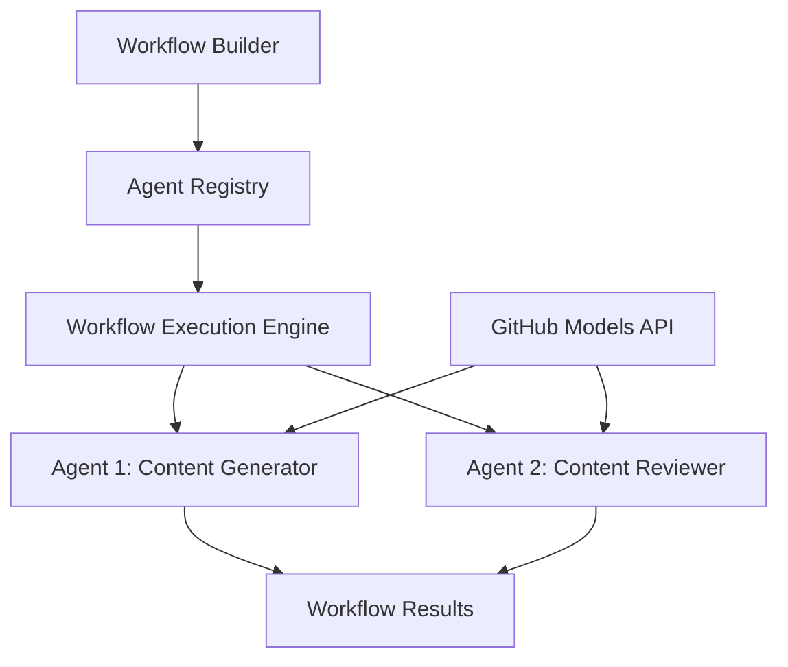

<!--
CO_OP_TRANSLATOR_METADATA:
{
  "original_hash": "034158688d0a45aae06dcbb21b0da5ae",
  "translation_date": "2025-11-11T12:57:09+00:00",
  "source_file": "08-multi-agent/code_samples/workflows-agent-framework/dotNET/01.dotnet-agent-framework-workflow-ghmodel-basic.md",
  "language_code": "cs"
}
-->
# 🔄 Základní pracovní postupy agentů s modely GitHub (.NET)

## 📋 Návod na orchestraci pracovních postupů

Tento notebook ukazuje, jak vytvořit sofistikované **pracovní postupy agentů** pomocí Microsoft Agent Framework pro .NET a modelů GitHub. Naučíte se vytvářet vícestupňové obchodní procesy, kde AI agenti spolupracují na plnění složitých úkolů prostřednictvím strukturovaných vzorců orchestrace.

## 🎯 Cíle učení

### 🏗️ **Základy architektury pracovních postupů**
- **Workflow Builder**: Navrhování a orchestrace složitých vícestupňových AI procesů
- **Koordinace agentů**: Koordinace více specializovaných agentů v rámci pracovních postupů
- **Integrace modelů GitHub**: Využití inference AI modelů GitHub v pracovních postupech
- **Vizualizace pracovních postupů**: Vytváření a vizualizace struktur pracovních postupů pro lepší pochopení

### 🔄 **Vzorce orchestrace procesů**
- **Sekvenční zpracování**: Řetězení více úkolů agentů v logickém pořadí
- **Správa stavu**: Udržování kontextu a toku dat mezi fázemi pracovního postupu
- **Zpracování chyb**: Implementace robustního zotavení z chyb a odolnosti pracovních postupů
- **Optimalizace výkonu**: Návrh efektivních pracovních postupů pro operace v měřítku podniků

### 🏢 **Podnikové aplikace pracovních postupů**
- **Automatizace obchodních procesů**: Automatizace složitých organizačních pracovních postupů
- **Obsahová produkční pipeline**: Redakční pracovní postupy s fázemi kontroly a schvalování
- **Automatizace zákaznického servisu**: Vícestupňové řešení zákaznických dotazů
- **Pracovní postupy zpracování dat**: ETL pracovní postupy s AI podporovanou transformací

## ⚙️ Předpoklady a nastavení

### 📦 **Požadované balíčky NuGet**

Tato demonstrace pracovního postupu využívá několik klíčových balíčků .NET:

```xml
<!-- Core AI Framework -->
<PackageReference Include="Microsoft.Extensions.AI" Version="9.9.0" />

<!-- Agent Framework (Local Development) -->
<!-- Microsoft.Agents.AI.dll - Core agent abstractions -->
<!-- Microsoft.Agents.AI.OpenAI.dll - OpenAI/GitHub Models integration -->

<!-- Configuration and Environment -->
<PackageReference Include="DotNetEnv" Version="3.1.1" />
```

### 🔑 **Konfigurace modelů GitHub**

**Nastavení prostředí (.env soubor):**
```env
GITHUB_TOKEN=your_github_personal_access_token
GITHUB_ENDPOINT=https://models.inference.ai.azure.com
GITHUB_MODEL_ID=gpt-4o-mini
```

**Přístup k modelům GitHub:**
1. Zaregistrujte se do modelů GitHub (aktuálně v preview)
2. Vygenerujte osobní přístupový token s oprávněními pro přístup k modelům
3. Nakonfigurujte proměnné prostředí, jak je uvedeno výše

### 🏗️ **Přehled architektury pracovního postupu**



**Klíčové komponenty:**
- **WorkflowBuilder**: Hlavní orchestrální engine pro návrh pracovních postupů
- **AIAgent**: Jednotliví specializovaní agenti s konkrétními schopnostmi
- **GitHub Models Client**: Integrace služby inference AI modelů
- **Execution Context**: Správa stavu a toku dat mezi fázemi pracovního postupu

## 🎨 **Vzorce návrhu podnikových pracovních postupů**

### 📝 **Pracovní postup produkce obsahu**
```
User Request → Content Generation → Quality Review → Final Output
```

### 🔍 **Pipeline zpracování dokumentů**
```
Document Input → Analysis → Extraction → Validation → Structured Output
```

### 💼 **Pracovní postup business intelligence**
```
Data Collection → Processing → Analysis → Report Generation → Distribution
```

### 🤝 **Automatizace zákaznického servisu**
```
Customer Inquiry → Classification → Processing → Response Generation → Follow-up
```

## 🏢 **Výhody pro podniky**

### 🎯 **Spolehlivost a škálovatelnost**
- **Deterministické provádění**: Konzistentní, opakovatelné výsledky pracovních postupů
- **Zotavení z chyb**: Elegantní zpracování selhání v jakékoli fázi pracovního postupu
- **Monitorování výkonu**: Sledování metrik provádění a příležitostí k optimalizaci
- **Správa zdrojů**: Efektivní alokace a využití zdrojů AI modelů

### 🔒 **Bezpečnost a shoda**
- **Bezpečné ověřování**: Ověřování na základě tokenů GitHub pro přístup k API
- **Auditní stopy**: Kompletní logování provádění pracovních postupů a rozhodovacích bodů
- **Řízení přístupu**: Granulární oprávnění pro provádění a monitorování pracovních postupů
- **Ochrana dat**: Bezpečné zpracování citlivých informací v průběhu pracovních postupů

### 📊 **Pozorovatelnost a správa**
- **Vizualizace pracovních postupů**: Jasné znázornění toků procesů a závislostí
- **Monitorování provádění**: Sledování průběhu a výkonu pracovních postupů v reálném čase
- **Zprávy o chybách**: Podrobná analýza chyb a možnosti ladění
- **Analýza výkonu**: Metriky pro optimalizaci a plánování kapacity

Pojďme vytvořit váš první podnikový AI pracovní postup! 🚀

## 💻 Spuštění kódu

Kompletní implementace je dostupná v `01.dotnet-agent-framework-workflow-ghmodel-basic.cs`. Tento soubor demonstruje:

1. **Konfigurace prostředí** - Načítání přihlašovacích údajů modelů GitHub ze souboru `.env`
2. **Nastavení klienta OpenAI** - Konfigurace klienta pro použití endpointu modelů GitHub
3. **Vytvoření agentů** - Definování specializovaných agentů (Front Desk a Concierge)
4. **Workflow Builder** - Vytvoření vícestupňového pracovního postupu s sekvenčním zpracováním
5. **Provádění pracovního postupu** - Spuštění pracovního postupu s výsledky ve streamu

### 🚀 Spuštění příkladu

```bash
# Make the script executable (Unix/Linux/macOS)
chmod +x 01.dotnet-agent-framework-workflow-ghmodel-basic.cs

# Run the workflow
./01.dotnet-agent-framework-workflow-ghmodel-basic.cs
```

Nebo na Windows:
```powershell
dotnet run 01.dotnet-agent-framework-workflow-ghmodel-basic.cs
```

### 📝 Očekávaný výstup

Pracovní postup:
1. Přijme váš požadavek na cestovní destinaci ("Chtěl bych jet do Paříže")
2. Agent Front Desk poskytne počáteční doporučení
3. Agent Concierge přezkoumá a upraví doporučení
4. Konečný výstup zobrazí kompletní konverzační tok

### 🔧 Přizpůsobení

Pracovní postup můžete přizpůsobit:
- Úpravou instrukcí agentů pro změnu jejich chování
- Přidáním dalších agentů pro vytvoření složitějších vícestupňových pracovních postupů
- Změnou uživatelské zprávy pro testování různých scénářů
- Úpravou hran pracovního postupu pro vytvoření různých vzorců provádění

---

<!-- CO-OP TRANSLATOR DISCLAIMER START -->
**Prohlášení**:  
Tento dokument byl přeložen pomocí služby AI pro překlady [Co-op Translator](https://github.com/Azure/co-op-translator). Ačkoliv se snažíme o přesnost, mějte prosím na paměti, že automatizované překlady mohou obsahovat chyby nebo nepřesnosti. Původní dokument v jeho původním jazyce by měl být považován za autoritativní zdroj. Pro důležité informace doporučujeme profesionální lidský překlad. Neodpovídáme za žádná nedorozumění nebo nesprávné interpretace vyplývající z použití tohoto překladu.
<!-- CO-OP TRANSLATOR DISCLAIMER END -->