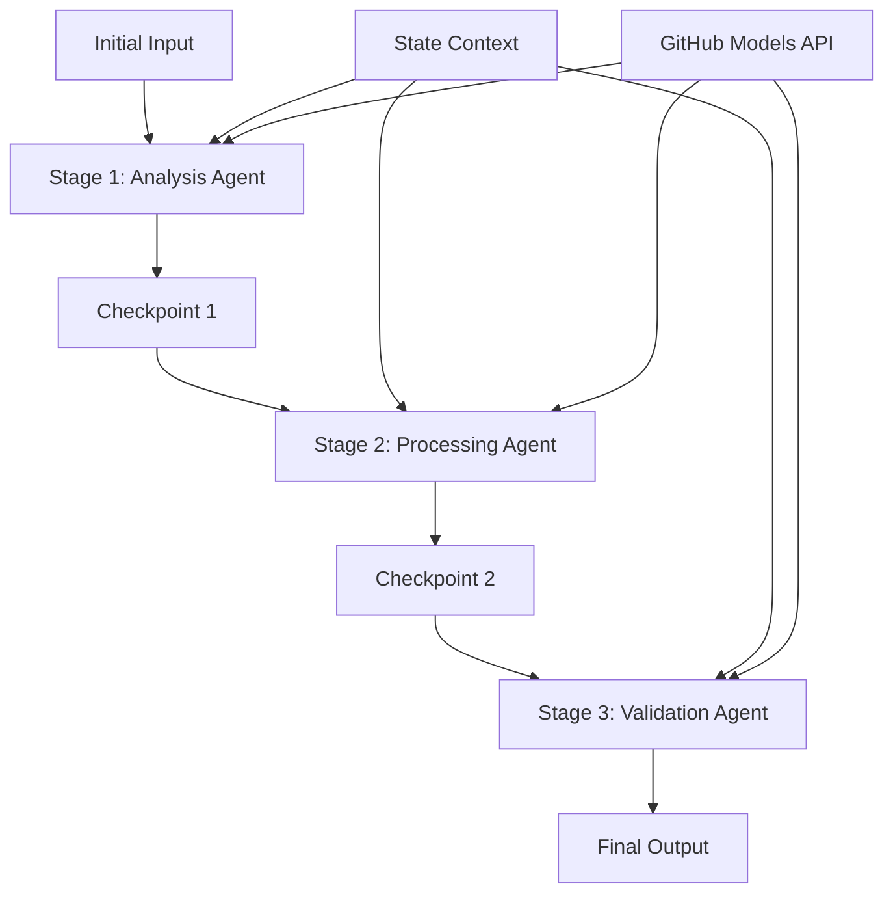

<!--
CO_OP_TRANSLATOR_METADATA:
{
  "original_hash": "1be9c8dcbd79a02d33d2c138684c1394",
  "translation_date": "2025-11-11T14:01:51+00:00",
  "source_file": "08-multi-agent/code_samples/workflows-agent-framework/dotNET/02.dotnet-agent-framework-workflow-ghmodel-sequential.md",
  "language_code": "cs"
}
-->
# ⏩ Sekvenční pracovní postupy agentů s modely GitHub (.NET)

## 📋 Pokročilý tutoriál sekvenčního zpracování

Tento notebook demonstruje **vzory sekvenčních pracovních postupů** pomocí Microsoft Agent Framework pro .NET a modelů GitHub. Naučíte se, jak vytvořit sofistikované zpracovatelské pipeline krok za krokem, kde agenti provádějí úkoly v konkrétním pořadí, přičemž každá fáze staví na výsledcích předchozí fáze.

## 🎯 Cíle učení

### 🔄 **Architektura sekvenčního zpracování**
- **Návrh lineárního pracovního postupu**: Vytvořte krok za krokem zpracovatelské pipeline s jasnými závislostmi
- **Správa stavu**: Udržujte kontext a tok dat napříč fázemi sekvenčního pracovního postupu
- **Integrace modelů GitHub**: Využijte AI modely GitHub v vícestupňových pracovních postupech .NET
- **Vzory podnikových pipeline**: Vytvořte produkčně připravené systémy sekvenčního zpracování

### 🏗️ **Pokročilé sekvenční vzory**
- **Zpracování Stage-Gate**: Implementujte validační kontrolní body mezi fázemi pracovního postupu
- **Zachování kontextu**: Udržujte stav a akumulované znalosti napříč všemi fázemi
- **Propagace chyb**: Elegantně zvládejte selhání v sekvenčních zpracovatelských řetězcích
- **Optimalizace výkonu**: Efektivní sekvenční provádění s minimálními náklady

### 🏢 **Podnikové sekvenční aplikace**
- **Pipeline zpracování dokumentů**: Vícefázová analýza, transformace a validace dokumentů
- **Pracovní postupy zajištění kvality**: Sekvenční revize, validace a schvalovací procesy
- **Pipeline produkce obsahu**: Výzkum → Psání → Editace → Revize → Publikace
- **Automatizace obchodních procesů**: Vícekrokové obchodní pracovní postupy s jasnými závislostmi mezi fázemi

## ⚙️ Předpoklady a nastavení

### 📦 **Požadované balíčky NuGet**

Nezbytné balíčky pro sekvenční pracovní postupy .NET:

```xml
<!-- Core AI Framework -->
<PackageReference Include="Microsoft.Extensions.AI" Version="9.9.0" />

<!-- Client Model Abstractions -->
<PackageReference Include="System.ClientModel" Version="1.6.1.0" />

<!-- Azure Identity and Async LINQ Support -->
<PackageReference Include="Azure.Identity" Version="1.15.0" />
<PackageReference Include="System.Linq.Async" Version="6.0.3" />

<!-- Local Agent Framework References -->
<!-- Microsoft.Agents.AI.dll - Core agent abstractions -->
<!-- Microsoft.Agents.AI.OpenAI.dll - GitHub Models integration -->
```

### 🔑 **Konfigurace modelů GitHub**

**Nastavení prostředí (.env soubor):**
```env
GITHUB_TOKEN=your_github_personal_access_token
GITHUB_ENDPOINT=https://models.inference.ai.azure.com
GITHUB_MODEL_ID=gpt-4o-mini
```

**Správa konfigurace:**
```csharp
// Load environment variables securely
Env.Load("../../../.env");
var githubToken = Environment.GetEnvironmentVariable("GITHUB_TOKEN");
var githubEndpoint = Environment.GetEnvironmentVariable("GITHUB_ENDPOINT");
var modelId = Environment.GetEnvironmentVariable("GITHUB_MODEL_ID");
```

### 🏗️ **Architektura sekvenčního pracovního postupu**



**Klíčové komponenty:**
- **Sekvenční agenti**: Specializovaní agenti pro každou fázi zpracování
- **Stavový kontext**: Udržuje akumulovaná data a rozhodnutí napříč fázemi
- **Kontrolní body**: Validační body mezi fázemi pro zajištění kvality a konzistence
- **Klient modelů GitHub**: Konzistentní přístup k AI modelům napříč všemi fázemi pracovního postupu

## 🎨 **Vzory návrhu sekvenčního pracovního postupu**

### 📝 **Pipeline zpracování dokumentů**
```
Raw Document → Content Extraction → Analysis → Validation → Structured Output
```

### 🎯 **Pracovní postup tvorby obsahu**
```
Brief/Requirements → Research → Content Creation → Review → Final Polish
```

### 🔍 **Pipeline zajištění kvality**
```
Initial Review → Technical Validation → Compliance Check → Final Approval
```

### 💼 **Pracovní postup business intelligence**
```
Data Collection → Processing → Analysis → Report Generation → Distribution
```

## 🏢 **Výhody podnikových sekvenčních procesů**

### 🎯 **Spolehlivost a kvalita**
- **Deterministické zpracování**: Konzistentní, opakovatelné výsledky díky strukturovaným fázím
- **Kontrolní body kvality**: Validační body zajišťují kvalitu v každé fázi
- **Izolace chyb**: Problémy v jedné fázi se nešíří do následujících fází
- **Auditní stopy**: Kompletní sledování rozhodnutí a transformací v každé fázi

### 📈 **Škálovatelnost a výkon**
- **Modulární návrh**: Každou fázi lze optimalizovat nezávisle
- **Správa zdrojů**: Efektivní alokace zdrojů AI modelů napříč fázemi
- **Optimalizace stavu**: Minimální přenos stavu mezi fázemi pro optimální výkon
- **Paralelní skupiny fází**: Více sekvenčních pracovních postupů může běžet paralelně

### 🔒 **Bezpečnost a shoda**
- **Bezpečnost na úrovni fází**: Různé bezpečnostní politiky pro různé fáze zpracování
- **Validace dat**: Zajištění integrity dat a shody na každém kontrolním bodě
- **Řízení přístupu**: Granulární oprávnění pro různé fáze pracovního postupu
- **Regulační shoda**: Splnění regulačních požadavků prostřednictvím strukturovaného zpracování

### 📊 **Monitoring a analýza**
- **Metriky na úrovni fází**: Monitoring výkonu pro každou fázi pracovního postupu
- **Identifikace úzkých míst**: Identifikace a optimalizace pomalých fází
- **Metriky kvality**: Sledování kvality a úspěšnosti v každé fázi
- **Optimalizace procesů**: Nepřetržité zlepšování na základě analýzy na úrovni fází

Pojďme vytvořit robustní sekvenční AI zpracovatelské pipeline! 🚀

## 💻 Spuštění kódu

Kompletní implementace je dostupná v `02.dotnet-agent-framework-workflow-ghmodel-sequential.cs`. Tento soubor demonstruje **třífázový pracovní postup analýzy nábytku**:

1. **Fáze 1 - Prodejní agent**: Analyzuje obrázky nábytku a poskytuje návrhy na nákup
2. **Fáze 2 - Cenový agent**: Poskytuje podrobné rozpisy cen a možnosti rozpočtu
3. **Fáze 3 - Nabídkový agent**: Generuje profesionální nabídku ve formátu Markdown

### 🏗️ **Architektura pracovního postupu**

```
Image Input → Sales Analysis → Price Estimation → Quote Generation → Final Output
```

Každý agent:
- Přijímá výstup z předchozí fáze jako kontext
- Staví na předchozí analýze s odbornými znalostmi
- Udržuje kontinuitu pracovního postupu prostřednictvím správy stavu

### 🚀 Spuštění příkladu

**Předpoklady:**
- Umístěte obrázek nábytku na `../imgs/home.png` (nebo aktualizujte proměnnou `imgPath`)
- Nakonfigurujte svůj `.env` soubor s přihlašovacími údaji modelů GitHub

```bash
# Make the script executable (Unix/Linux/macOS)
chmod +x 02.dotnet-agent-framework-workflow-ghmodel-sequential.cs

# Run the sequential workflow
./02.dotnet-agent-framework-workflow-ghmodel-sequential.cs
```

Nebo na Windows:
```powershell
dotnet run 02.dotnet-agent-framework-workflow-ghmodel-sequential.cs
```

### 📝 Očekávaný výstup

Pracovní postup provede:
1. **Prodejní agent**: Identifikuje položky nábytku z obrázku a poskytne doporučení
2. **Cenový agent**: Přidá podrobnou cenovou analýzu s rozpočtovými úrovněmi a nákupními doporučeními
3. **Nabídkový agent**: Vygeneruje formátovanou nabídku s veškerými syntetizovanými informacemi

Konečný výstup bude komplexní, profesionální nabídka nábytku založená na analýze obrázku.

### 🔧 Možnosti přizpůsobení

**Úprava chování agentů:**
```csharp
// Adjust agent instructions to change their focus
const string SalesAgentInstructions = "Your custom instructions...";
```

**Změna sekvenčního toku:**
```csharp
// Add or reorder workflow stages
var workflow = new WorkflowBuilder(salesagent)
    .AddEdge(salesagent, priceagent)
    .AddEdge(priceagent, quoteagent)
    .AddEdge(quoteagent, newAgent)  // Add another stage
    .Build();
```

**Použití jiného vstupu:**
```csharp
// Process text instead of images
ChatMessage userMessage = new ChatMessage(ChatRole.User, [
    new TextContent("Analyze pricing for a modern living room set")
]);
```

### 🎯 Reálné aplikace

Tento sekvenční vzor je ideální pro:
- **E-commerce**: Analýza produktů → Cenotvorba → Generování nabídek
- **Reality**: Analýza nemovitostí → Ocenění → Tvorba inzerátů
- **Pojištění**: Analýza nároků → Posouzení → Generování nabídek
- **Tvorba obsahu**: Výzkum → Psání → Editace → Publikace

### 🔍 Porozumění toku stavu

Každý agent v sekvenci přijímá:
- **Původní vstup**: Počáteční zprávu uživatele (obrázek + text)
- **Výstupy předchozích agentů**: Všechny předchozí odpovědi agentů v historii konverzace
- **Akumulovaný kontext**: Kompletní stav udržovaný během celého pracovního postupu

To umožňuje sofistikované vícestupňové zpracování, kde každý agent staví na komplexním kontextu ze všech předchozích fází.

---

<!-- CO-OP TRANSLATOR DISCLAIMER START -->
**Prohlášení**:  
Tento dokument byl přeložen pomocí služby AI pro překlad [Co-op Translator](https://github.com/Azure/co-op-translator). Ačkoli se snažíme o přesnost, mějte prosím na paměti, že automatizované překlady mohou obsahovat chyby nebo nepřesnosti. Původní dokument v jeho rodném jazyce by měl být považován za autoritativní zdroj. Pro důležité informace se doporučuje profesionální lidský překlad. Neodpovídáme za žádná nedorozumění nebo nesprávné interpretace vyplývající z použití tohoto překladu.
<!-- CO-OP TRANSLATOR DISCLAIMER END -->