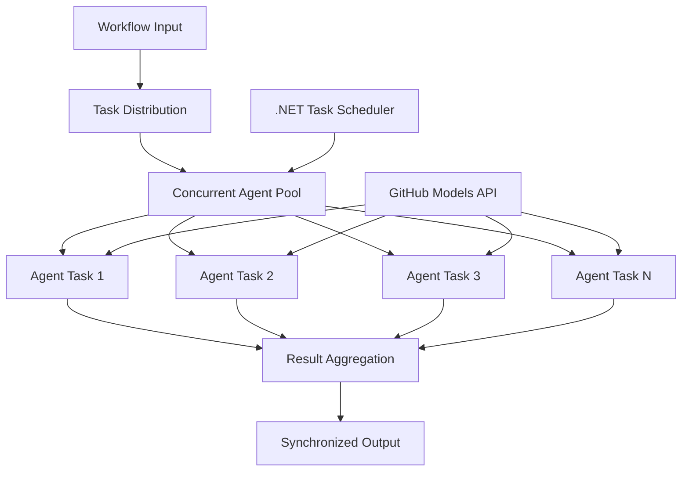

<!--
CO_OP_TRANSLATOR_METADATA:
{
  "original_hash": "b9c6e32c9b5f2fed20b6916984440d88",
  "translation_date": "2025-11-11T13:29:23+00:00",
  "source_file": "08-multi-agent/code_samples/workflows-agent-framework/dotNET/03.dotnet-agent-framework-workflow-ghmodel-concurrent.md",
  "language_code": "cs"
}
-->
# ⚡ Současné pracovní postupy agentů s modely GitHub (.NET)

## 📋 Návod na vysoce výkonné paralelní zpracování

Tento notebook demonstruje **vzory současných pracovních postupů** pomocí Microsoft Agent Framework pro .NET a modelů GitHub. Naučíte se, jak vytvořit vysoce výkonné pracovní postupy paralelního zpracování, které maximalizují propustnost prováděním více AI agentů současně při zachování koordinace a konzistence dat.

## 🎯 Cíle učení

### 🚀 **Základy současného zpracování**
- **Paralelní provádění agentů**: Spouštění více AI agentů současně pro maximální výkon
- **Vzory Async/Await**: Využití asynchronního programovacího modelu .NET pro efektivní souběžnost
- **Integrace modelů GitHub**: Koordinace více současných volání na inference službu modelů GitHub
- **Správa zdrojů**: Efektivní správa zdrojů AI modelů napříč současnými operacemi

### 🏗️ **Pokročilá architektura souběžnosti**
- **Paralelismus založený na úlohách**: Použití knihovny .NET Task Parallel Library pro optimální současné provádění
- **Vzory synchronizace**: Koordinace současných agentů při zamezení závodních podmínek
- **Vyvažování zátěže**: Efektivní rozdělení práce napříč dostupnou kapacitou současného zpracování
- **Odolnost proti chybám**: Řešení selhání jednotlivých agentů bez zastavení celého pracovního postupu

### 🏢 **Podnikové aplikace souběžnosti**
- **Zpracování dokumentů ve velkém objemu**: Současné zpracování více dokumentů
- **Analýza obsahu v reálném čase**: Současná analýza příchozích datových toků
- **Optimalizace dávkového zpracování**: Maximalizace propustnosti pro rozsáhlé operace zpracování dat
- **Multimodální analýza**: Paralelní zpracování různých typů a formátů obsahu

## ⚙️ Předpoklady a nastavení

### 📦 **Požadované balíčky NuGet**

Základní balíčky pro vysoce výkonné současné pracovní postupy:

```xml
<!-- Core AI Framework with Async Support -->
<PackageReference Include="Microsoft.Extensions.AI" Version="9.9.0" />

<!-- Client Model Abstractions for API Communication -->
<PackageReference Include="System.ClientModel" Version="1.6.1.0" />

<!-- Azure Identity and Async LINQ for Advanced Operations -->
<PackageReference Include="Azure.Identity" Version="1.15.0" />
<PackageReference Include="System.Linq.Async" Version="6.0.3" />

<!-- Local Agent Framework References -->
<!-- Microsoft.Agents.AI.dll - Core agent abstractions with async support -->
<!-- Microsoft.Agents.AI.OpenAI.dll - GitHub Models integration with concurrency -->
```

### 🔑 **Konfigurace modelů GitHub**

**Nastavení prostředí (soubor .env):**
```env
GITHUB_TOKEN=your_github_personal_access_token
GITHUB_ENDPOINT=https://models.inference.ai.azure.com
GITHUB_MODEL_ID=gpt-4o-mini
```

**Úvahy o současném zpracování:**
```csharp
// Configure for concurrent operations
var clientOptions = new OpenAIClientOptions()
{
    Endpoint = new Uri(githubEndpoint),
    // Configure connection pooling for concurrent requests
    NetworkTimeout = TimeSpan.FromMinutes(5)
};
```

### 🏗️ **Architektura současného pracovního postupu**



**Klíčové komponenty:**
- **Task Parallel Library**: Vestavěná podpora .NET pro současné operace
- **Agent Pool**: Více instancí agentů pro paralelní zpracování
- **Agregace výsledků**: Koordinace a slučování výsledků současných agentů
- **Synchronizační body**: Zajištění konzistence dat napříč současnými operacemi

## 🎨 **Vzory návrhu současných pracovních postupů**

### 🔍 **Paralelní výzkum a analýza**
```
Research Topic → Concurrent Research Agents → Result Synthesis → Final Report
```

### 📊 **Zpracování dat z více zdrojů**
```
Data Sources → Parallel Processing Agents → Data Integration → Unified Output
```

### 🎭 **Pipeline pro generování obsahu**
```
Content Requirements → Concurrent Content Generators → Quality Review → Final Content
```

### 🔄 **Fan-Out/Fan-In zpracování**
```
Single Input → Multiple Concurrent Processors → Result Aggregation → Single Output
```

## 🏢 **Výhody podnikové výkonnosti**

### ⚡ **Propustnost a škálovatelnost**
- **Lineární škálování výkonu**: Přidání více současných agentů pro zvýšení propustnosti
- **Využití zdrojů**: Maximální efektivita dostupné kapacity AI modelů
- **Zkrácení doby zpracování**: Významné zkrácení času díky paralelnímu provádění
- **Elastické škálování**: Dynamické přizpůsobení počtu současných agentů na základě pracovní zátěže

### 🛡️ **Spolehlivost a odolnost**
- **Izolace chyb**: Selhání jednotlivých agentů neovlivní ostatní současné operace
- **Postupná degradace**: Systém pokračuje v provozu se sníženou kapacitou agentů
- **Obnova chyb**: Automatické mechanismy opakování pro selhané současné operace
- **Rozdělení zátěže**: Rovnoměrné rozdělení práce mezi dostupné agenty

### 📊 **Monitorování výkonu**
- **Metriky současného provádění**: Sledování výkonu všech paralelních operací
- **Analýza využití zdrojů**: Monitorování CPU, paměti a využití sítě
- **Analýza propustnosti**: Měření efektivity dosažené současným zpracováním
- **Detekce úzkých míst**: Identifikace a řešení výkonových omezení

### 🔧 **Vývoj a provoz**
- **Asynchronní programovací model**: Využití zralých vzorů async/await v .NET
- **Koordinace úloh**: Vestavěné možnosti správy a koordinace úloh
- **Zpracování výjimek**: Komplexní zpracování chyb pro současné operace
- **Podpora ladění**: Nástroje pro ladění současných pracovních postupů ve Visual Studiu

Pojďme vytvořit vysoce výkonné současné AI pracovní postupy s .NET! 🚀

## 💻 Spuštění kódu

Kompletní implementace je dostupná v souboru `03.dotnet-agent-framework-workflow-ghmodel-concurrent.cs`. Tento soubor demonstruje **Fan-Out/Fan-In současný pracovní postup** pro plánování cest:

### 🏗️ **Architektura pracovního postupu**

```
User Request → ConcurrentStartExecutor → [Researcher Agent || Planner Agent] → ConcurrentAggregationExecutor → Final Output
```

**Klíčové komponenty:**

1. **ConcurrentStartExecutor**: Současně vysílá uživatelský požadavek všem agentům
2. **Researcher Agent**: Současně analyzuje destinace a atrakce
3. **Planner Agent**: Současně vytváří podrobné cestovní plány
4. **ConcurrentAggregationExecutor**: Sbírá a slučuje výsledky od obou agentů

### 🎯 **Vzorec Fan-Out/Fan-In**

Tento pracovní postup demonstruje klasický vzorec **Fan-Out/Fan-In**:
- **Fan-Out**: Jeden vstupní požadavek je současně vysílán více agentům
- **Současné zpracování**: Více agentů pracuje paralelně na stejném úkolu
- **Fan-In**: Výsledky od všech agentů jsou shromážděny a sloučeny do jednoho výstupu

### 🚀 Spuštění příkladu

```bash
# Make the script executable (Unix/Linux/macOS)
chmod +x 03.dotnet-agent-framework-workflow-ghmodel-concurrent.cs

# Run the concurrent workflow
./03.dotnet-agent-framework-workflow-ghmodel-concurrent.cs
```

Nebo na Windows:
```powershell
dotnet run 03.dotnet-agent-framework-workflow-ghmodel-concurrent.cs
```

### 📝 Očekávaný výstup

Pracovní postup provede:
1. **Vysílání požadavku**: Odeslání "Naplánuj výlet do Seattlu v prosinci" oběma agentům
2. **Současné zpracování**: Oba agenti pracují současně:
   - Výzkumník identifikuje atrakce a detaily
   - Plánovač vytváří itinerář a logistiku
3. **Agregace**: Kombinace obou odpovědí do komplexního výstupu
4. **Zobrazení výsledků**: Zobrazení sloučeného cestovního plánu se všemi informacemi

### 🔧 Možnosti přizpůsobení

**Přidání více současných agentů:**
```csharp
// Create additional specialized agents
AIAgent budgetAgent = openAIClient.GetChatClient(github_model_id).CreateAIAgent(
    name: "Budget-Agent", instructions: "Calculate travel costs...");

// Add to fan-out
var workflow = new WorkflowBuilder(startExecutor)
    .AddFanOutEdge(startExecutor, targets: [researcherAgent, plannerAgent, budgetAgent])
    .AddFanInEdge(aggregationExecutor, sources: [researcherAgent, plannerAgent, budgetAgent])
    .WithOutputFrom(aggregationExecutor)
    .Build();

// Update aggregation count
if (this._messages.Count == 3) { ... }
```

**Úprava pokynů pro agenty:**
```csharp
const string ResearcherAgentInstructions = "Your custom instructions for research...";
const string PlanAgentInstructions = "Your custom instructions for planning...";
```

**Změna úkolu:**
```csharp
StreamingRun run = await InProcessExecution.StreamAsync(
    workflow, 
    "Plan a European vacation for 2 weeks in summer"
);
```

### 🎯 Reálné aplikace

Tento současný vzorec je ideální pro:
- **Tvorbu obsahu**: Více autorů současně vytváří různé sekce
- **Kontrolu kódu**: Více recenzentů analyzuje kód z různých perspektiv
- **Průzkum trhu**: Paralelní analýza různých tržních segmentů
- **Zpracování dokumentů**: Současná extrakce, analýza a validace
- **Analýza z více perspektiv**: Získání různorodých pohledů na stejný vstup

### 🔍 Pochopení vlastních vykonavatelů

**ConcurrentStartExecutor:**
- Implementuje `IMessageHandler<string>` pro přijetí vstupu ve formě řetězce
- Vysílá zprávy všem připojeným agentům
- Odesílá `TurnToken` pro spuštění současného zpracování

**ConcurrentAggregationExecutor:**
- Implementuje `IMessageHandler<ChatMessage>` pro příjem odpovědí agentů
- Sbírá zprávy bezpečně pro více vláken
- Agreguje, když dorazí všechny očekávané odpovědi
- Poskytuje konečný výstup pomocí `context.YieldOutputAsync()`

### ⚡ Výhody výkonu

**Současné vs Sekvenční:**
- Sekvenční: Agent1 (30s) → Agent2 (30s) = **60 sekund celkem**
- Současné: Agent1 (30s) || Agent2 (30s) = **30 sekund celkem**

**Zlepšení propustnosti**: Až N× rychlejší pro N současných agentů (v závislosti na pracovní zátěži a zdrojích)

### 🛡️ Zpracování chyb

Pracovní postup zvládá selhání jednotlivých agentů elegantně:
- Pokud jeden agent selže, ostatní pokračují ve zpracování
- Agregátor může implementovat logiku časového limitu
- Mohou být vráceny částečné výsledky, pokud je to potřeba

### 📊 Pokročilé funkce

**Dynamický počet agentů:**
Upravte logiku agregace pro podporu proměnlivého počtu agentů:

```csharp
private int _expectedAgentCount;
private readonly List<ChatMessage> _messages = [];

public async ValueTask HandleAsync(ChatMessage message, IWorkflowContext context)
{
    this._messages.Add(message);
    if (this._messages.Count == _expectedAgentCount)
    {
        // Process aggregation
    }
}
```

Tento vzorec současného pracovního postupu je nezbytný pro budování vysoce výkonných, škálovatelných systémů AI agentů!

---

<!-- CO-OP TRANSLATOR DISCLAIMER START -->
**Prohlášení**:  
Tento dokument byl přeložen pomocí služby AI pro překlady [Co-op Translator](https://github.com/Azure/co-op-translator). I když se snažíme o přesnost, mějte prosím na paměti, že automatické překlady mohou obsahovat chyby nebo nepřesnosti. Původní dokument v jeho původním jazyce by měl být považován za autoritativní zdroj. Pro důležité informace se doporučuje profesionální lidský překlad. Neodpovídáme za žádná nedorozumění nebo nesprávné interpretace vyplývající z použití tohoto překladu.
<!-- CO-OP TRANSLATOR DISCLAIMER END -->