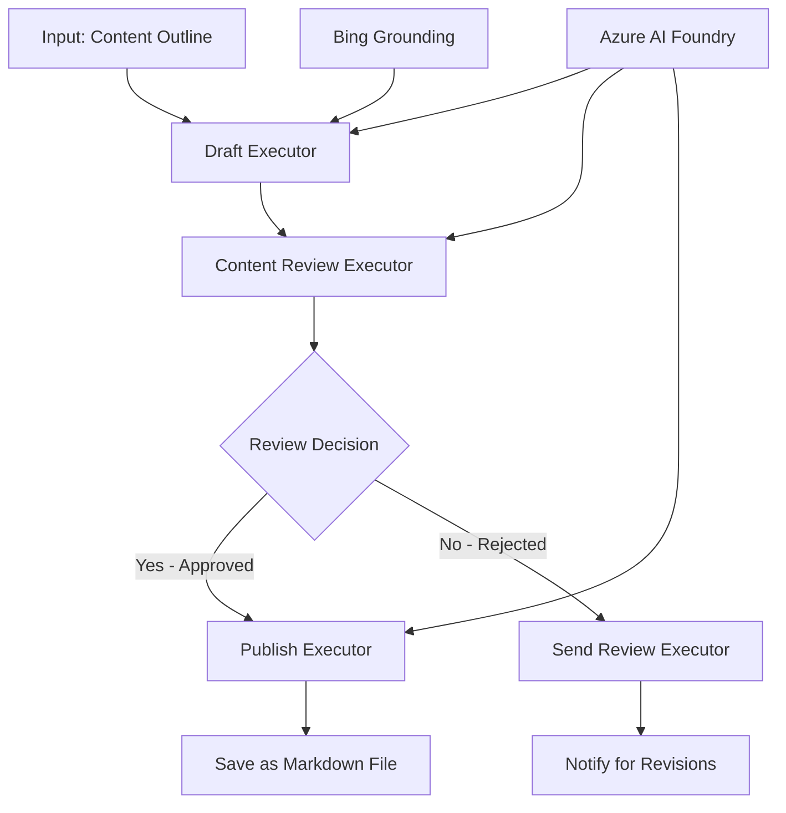

<!--
CO_OP_TRANSLATOR_METADATA:
{
  "original_hash": "8abd335151cee553293b637ee3d80d10",
  "translation_date": "2025-11-11T12:27:57+00:00",
  "source_file": "08-multi-agent/code_samples/workflows-agent-framework/dotNET/04.dotnet-agent-framework-workflow-aifoundry-condition.md",
  "language_code": "cs"
}
-->
# 🔀 Podmíněné pracovní postupy agentů s Azure AI Foundry (.NET)

## 📋 Návod na inteligentní pracovní postupy založené na rozhodování

Tento notebook demonstruje **vzory podmíněných pracovních postupů** pomocí Azure AI Foundry a Microsoft Agent Framework pro .NET. Naučíte se, jak vytvořit sofistikované pracovní postupy řízené rozhodováním, které inteligentně směrují zpracování na základě analýzy AI, obchodních pravidel a dynamických podmínek pro automatizaci na podnikové úrovni.

## 🎯 Cíle učení

### 🧠 **Architektura inteligentního rozhodování**
- **Implementace podmíněné logiky**: Vytvořte složité rozhodovací stromy s více body větvení
- **Směrování řízené AI**: Použijte modely Azure AI Foundry k inteligentnímu rozhodování o směrování
- **Dynamická adaptace pracovního postupu**: Upravte chování pracovního postupu na základě analýzy za běhu a podmínek
- **Integrace podnikových pravidel**: Zahrňte obchodní logiku a požadavky na dodržování předpisů do pracovních postupů

### 🔀 **Pokročilé vzory podmíněných pracovních postupů**
- **Rozhodování na základě více kritérií**: Vyhodnoťte více faktorů pro rozhodování o směrování
- **Zpracování s ohledem na kontext**: Rozhodujte na základě akumulovaného kontextu a historie pracovního postupu
- **Adaptivní úprava pracovního postupu**: Dynamicky upravujte cesty zpracování na základě podmínek v reálném čase
- **Integrace pravidlového enginu**: Implementujte sofistikované obchodní pravidlové enginy do pracovních postupů

### 🏢 **Podnikové aplikace podmíněných pracovních postupů**
- **Klasifikace a směrování dokumentů**: Automaticky klasifikujte a směrujte dokumenty do vhodných pracovních postupů
- **Třídění zákaznických služeb**: Inteligentní směrování dotazů zákazníků na specializované týmy
- **Zpracování souladu a rizik**: Použijte různé validační a kontrolní procesy na základě hodnocení rizik
- **Pracovní postupy zajištění kvality**: Směrujte obsah přes vhodné kontrolní procesy na základě kvalitativních metrik

## ⚙️ Předpoklady a nastavení

### 📦 **Požadované balíčky NuGet**

Pokročilé balíčky pro zpracování podmíněných pracovních postupů:

```xml
<!-- Core AI Framework -->
<PackageReference Include="Microsoft.Extensions.AI" Version="9.9.0" />

<!-- Azure AI Agents with Persistent State -->
<PackageReference Include="Azure.AI.Agents.Persistent" Version="1.2.0-beta.5" />

<!-- Azure Identity and Utilities -->
<PackageReference Include="Azure.Identity" Version="1.15.0" />
<PackageReference Include="System.Linq.Async" Version="6.0.3" />
<PackageReference Include="DotNetEnv" Version="3.1.1" />

<!-- Local Workflow Framework References -->
<!-- Microsoft.Agents.Workflows.dll - Advanced workflow orchestration -->
<!-- Microsoft.Agents.AI.AzureAI.dll - Azure AI Foundry integration -->
<!-- Microsoft.Agents.AI.dll - Core agent abstractions -->
```

### 🔑 **Konfigurace Azure AI Foundry**

**Požadované zdroje Azure:**
- Pracovní prostor Azure AI Foundry s modely pro podmíněné zpracování
- Předplatné Azure s odpovídajícími kvótami výpočetního výkonu a oprávněními
- Nasazené modely AI pro rozhodování a analýzu obsahu
- (Volitelné) Připojení k Bing Search API pro schopnosti zakotvení

**Konfigurace prostředí (.env soubor):**
```env
# Azure AI Foundry Configuration
AZURE_AI_PROJECT_ENDPOINT=https://your-project.cognitiveservices.azure.com/
BING_CONNECTION_ID=your-bing-connection-id
```

**Nastavení autentizace:**
```csharp
// Azure CLI or Managed Identity authentication
using Azure.Identity;
var credential = new AzureCliCredential();

// Load environment configuration
DotNetEnv.Env.Load("../../../.env");
```

### 🏗️ **Architektura podmíněného pracovního postupu**



**Klíčové komponenty:**
- **Draft Executor**: AI agent, který vytváří počáteční návrhy obsahu z osnov
- **Content Review Executor**: AI agent, který hodnotí kvalitu a soulad návrhu
- **Conditional Routing**: Logika rozhodování, která směruje na základě výsledků kontroly
- **Publish/Review Paths**: Oddělené cesty zpracování pro schválený vs. zamítnutý obsah
- **Správa stavu**: Udržuje kontext obsahu a kontroly během pracovního postupu

## 🎨 **Vzory návrhu podmíněných pracovních postupů**

### 📋 **Produkce obsahu s kontrolními branami kvality**
```
Outline → Draft Creation → Quality Review → {Approve: Publish | Reject: Revise}
```

### 🎯 **Zpracování dokumentů na základě rizik**
```
Document → Risk Assessment → {Low: Standard | High: Enhanced Review}
```

### 🔍 **Inteligentní směrování zákaznických služeb**
```
Customer Query → Analysis → {Simple: FAQ Bot | Complex: Human Agent}
```

### 💼 **Pracovní postupy řízené souladem**
```
Content → Compliance Check → {Pass: Publish | Fail: Legal Review}
```

## 🏢 **Výhody podmíněných pracovních postupů pro podniky**

### 🎯 **Inteligentní automatizace**
- **Chytré rozhodování**: Rozhodování o směrování řízené AI na základě analýzy obsahu a kontextu
- **Adaptivní zpracování**: Pracovní postupy, které se automaticky přizpůsobují měnícím se podmínkám
- **Prosazování obchodních pravidel**: Automatická aplikace složitých obchodních logik a politik
- **Směrování s ohledem na kontext**: Rozhodování na základě celé historie pracovního postupu a akumulovaného kontextu

### 📈 **Provozní dokonalost**
- **Optimalizované přidělování zdrojů**: Směrování práce na nejvhodnější specialisty a procesy
- **Snížení manuálního zásahu**: Automatizované rozhodování minimalizuje potřebu lidského směrování
- **Rychlejší doby řešení**: Přímé směrování na odpovídající odborné znalosti a schopnosti zpracování
- **Konzistentní aplikace**: Jednotná aplikace obchodních pravidel a rozhodovacích kritérií

### 🛡️ **Řízení rizik a dodržování předpisů**
- **Automatizované hodnocení rizik**: Hodnocení obsahu a úrovní rizik řízené AI
- **Prosazování souladu**: Automatické směrování přes požadované regulační procesy
- **Aplikace bezpečnostních protokolů**: Zlepšená bezpečnostní opatření aplikovaná na základě hodnocení rizik
- **Údržba auditní stopy**: Kompletní dokumentace rozhodnutí o směrování a jejich odůvodnění

### 📊 **Analytika a neustálé zlepšování**
- **Analytika rozhodování**: Sledování účinnosti a přesnosti rozhodnutí o směrování
- **Rozpoznávání vzorů**: Identifikace trendů a vzorů v rozhodnutích o směrování v průběhu času
- **Optimalizace výkonu**: Neustálé zlepšování rozhodovacích kritérií a efektivity směrování
- **Obchodní inteligence**: Přehledy o charakteristikách obsahu a požadavcích na zpracování

### 🔧 **Technická dokonalost**
- **Trvalá správa stavu**: Udržování složitého stavu během provádění pracovního postupu
- **Škálovatelná architektura**: Zvládání požadavků na zpracování podmíněných pracovních postupů ve velkém objemu
- **Schopnosti integrace**: Bezproblémová integrace s existujícími obchodními systémy a procesy
- **Monitoring a pozorovatelnost**: Komplexní sledování výkonu pracovního postupu a rozhodnutí

Pojďme vytvořit inteligentní, rozhodováním řízené podnikové pracovní postupy s .NET! 🚀

## 💻 Spuštění kódu

Kompletní implementace je dostupná v `04.dotnet-agent-framework-workflow-aifoundry-condition.cs`. Tento soubor demonstruje **pracovní postup produkce obsahu s kontrolními branami kvality**:

### 🏗️ **Architektura pracovního postupu**

```
Content Outline → Draft Creation → Quality Review → Conditional Routing:
                                                      ├─ Approved (>200 words) → Publish
                                                      └─ Rejected (<200 words) → Review Notification
```

**Agenti v pracovním postupu:**
1. **Evangelist Agent**: Vytváří návrhy tutoriálů z osnov s Bing zakotvením
2. **Content Reviewer Agent**: Hodnotí kvalitu návrhu (počet slov, úplnost)
3. **Publisher Agent**: Ukládá schválený obsah jako soubory Markdown s časovým razítkem

**Vlastní vykonavatelé:**
1. **DraftExecutor**: Orchestrace tvorby návrhu
2. **ContentReviewExecutor**: Provádí hodnocení kvality
3. **PublishExecutor**: Zpracovává publikaci schváleného obsahu
4. **SendReviewExecutor**: Spravuje oznámení o zamítnutém obsahu

### 🚀 Spuštění příkladu

**Předpoklady:**
- Konfigurovaný pracovní prostor Azure AI Foundry
- Autentizace Azure CLI (`az login`)
- (Volitelné) Připojení k Bing Search pro zakotvení

```bash
# Make the script executable (Unix/Linux/macOS)
chmod +x 04.dotnet-agent-framework-workflow-aifoundry-condition.cs

# Run the conditional workflow
./04.dotnet-agent-framework-workflow-aifoundry-condition.cs
```

Nebo na Windows:
```powershell
dotnet run 04.dotnet-agent-framework-workflow-aifoundry-condition.cs
```

### 📝 Očekávaný výstup

Pracovní postup provede:
1. **Vytvoření agentů**: Inicializace tří specializovaných agentů Azure AI Foundry
2. **Generování návrhu**: Agent Evangelist vytvoří návrh tutoriálu z osnovy
3. **Kontrola obsahu**: Content Reviewer hodnotí kvalitu návrhu
4. **Podmíněné směrování**:
   - **Pokud schváleno (>200 slov)**: Publish executor uloží jako soubor Markdown
   - **Pokud zamítnuto (<200 slov)**: Odeslání oznámení o kontrole
5. **Zobrazení výsledků**: Ukázání konečného výsledku pracovního postupu

### 🔧 Možnosti přizpůsobení

**Úprava kritérií kontroly:**
```csharp
const string ContentReviewerInstructions = @"
You are a content reviewer...
1. Check if content is more than 500 words (instead of 200)
2. Verify technical accuracy
3. Ensure proper formatting
...";
```

**Přidání dalších podmíněných cest:**
```csharp
var workflow = new WorkflowBuilder(draftExecutor)
    .AddEdge(draftExecutor, contentReviewerExecutor)
    .AddEdge(contentReviewerExecutor, publishExecutor, condition: GetCondition("Excellent"))
    .AddEdge(contentReviewerExecutor, editExecutor, condition: GetCondition("Good"))
    .AddEdge(contentReviewerExecutor, sendReviewerExecutor, condition: GetCondition("Poor"))
    .Build();
```

**Změna požadavků na obsah:**
```csharp
string OUTLINE_Content = @"
# Your Custom Topic
## Section 1
https://your-reference-url
## Section 2
...
";
```

### 🎯 Aplikace v reálném světě

Tento vzor podmíněného pracovního postupu je ideální pro:
- **Systémy správy obsahu**: Automatizované redakční pracovní postupy s kontrolními branami kvality
- **Zpracování dokumentů**: Směrování dokumentů na základě klasifikace a souladu
- **Zákaznická podpora**: Inteligentní směrování tiketů na základě složitosti a naléhavosti
- **Právní kontrola**: Směrování smluv na základě hodnocení rizik a hodnoty
- **HR procesy**: Směrování žádostí přes odpovídající screeningové pracovní postupy

### 🔍 Porozumění podmíněné logice

**Funkce podmínky:**
```csharp
public Func<object?, bool> GetCondition(string expectedResult) =>
    reviewResult => reviewResult is ReviewResult review && review.Result == expectedResult;
```

Tato funkce vytváří predikát, který:
1. Kontroluje, zda je výsledek typu `ReviewResult`
2. Porovnává vlastnost `Result` s očekávanou hodnotou
3. Vrací true/false pro určení směrování

**Hrany pracovního postupu s podmínkami:**
```csharp
.AddEdge(contentReviewerExecutor, publishExecutor, condition: GetCondition("Yes"))
.AddEdge(contentReviewerExecutor, sendReviewerExecutor, condition: GetCondition("No"))
```

### 📊 Pokročilé funkce

**Validace JSON schématu:**
Pracovní postup používá JSON schémata k zajištění strukturovaných odpovědí:

```csharp
// Define response structure
public class ReviewResult
{
    [JsonPropertyName("review_result")]
    public string Result { get; set; } = string.Empty;
    
    [JsonPropertyName("reason")]
    public string Reason { get; set; } = string.Empty;
    
    [JsonPropertyName("draft_content")]
    public string DraftContent { get; set; } = string.Empty;
}

// Apply to agent
ResponseFormat = ChatResponseFormat.ForJsonSchema(
    AIJsonUtilities.CreateJsonSchema(typeof(ReviewResult)), 
    "ReviewResult", 
    "Review Result From DraftContent"
)
```

**Integrace Bing zakotvení:**
Agent Evangelist používá Bing zakotvení k přístupu k aktuálním informacím:

```csharp
var bingGroundingConfig = new BingGroundingSearchConfiguration(bing_conn_id);
BingGroundingToolDefinition bingGroundingTool = new(
    new BingGroundingSearchToolParameters([bingGroundingConfig])
);
```

To umožňuje agentovi sledovat URL v osnově a extrahovat aktuální informace.

### 🛡️ Zpracování chyb

Pracovní postup zahrnuje robustní zpracování chyb pro zamítnutý obsah:
- Selhání kontroly spouští alternativní cestu
- Oznámení poskytují jasné důvody zamítnutí
- Obsah je zachován pro revizi

### 🔄 Rozšíření pracovního postupu

**Přidání smyčky revize:**
Vytvořte zpětnou vazbu, která automaticky přepracuje obsah:

```csharp
.AddEdge(contentReviewerExecutor, publishExecutor, condition: GetCondition("Yes"))
.AddEdge(contentReviewerExecutor, draftExecutor, condition: GetCondition("No")) // Loop back
```

**Implementace vícestupňové kontroly:**
Přidejte více kontrolních fází s různými kritérii:

```csharp
.AddEdge(draftExecutor, technicalReviewer)
.AddEdge(technicalReviewer, editorialReviewer, condition: GetCondition("TechPass"))
.AddEdge(editorialReviewer, publishExecutor, condition: GetCondition("EditPass"))
```

Tento vzor podmíněného pracovního postupu poskytuje základ pro budování sofistikovaných, inteligentních podnikových automatizačních systémů! 🚀

---

<!-- CO-OP TRANSLATOR DISCLAIMER START -->
**Prohlášení**:  
Tento dokument byl přeložen pomocí služby AI pro překlad [Co-op Translator](https://github.com/Azure/co-op-translator). Ačkoli se snažíme o přesnost, mějte prosím na paměti, že automatizované překlady mohou obsahovat chyby nebo nepřesnosti. Původní dokument v jeho rodném jazyce by měl být považován za autoritativní zdroj. Pro důležité informace se doporučuje profesionální lidský překlad. Neodpovídáme za žádná nedorozumění nebo nesprávné interpretace vyplývající z použití tohoto překladu.
<!-- CO-OP TRANSLATOR DISCLAIMER END -->