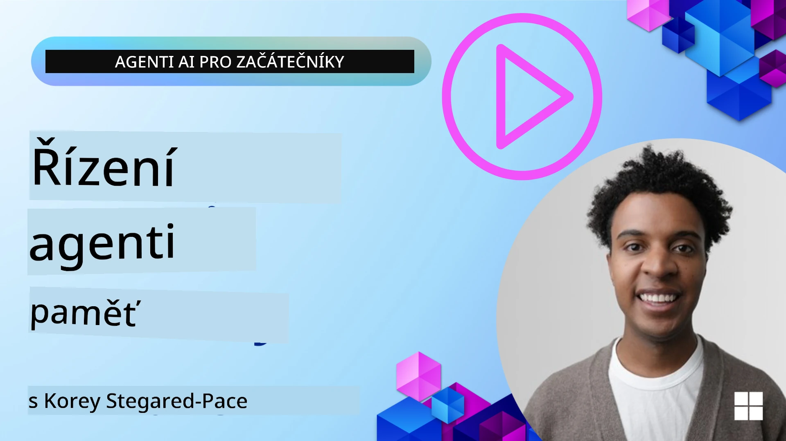

<!--
CO_OP_TRANSLATOR_METADATA:
{
  "original_hash": "a1d90991499ad697c4ad24decaf36968",
  "translation_date": "2025-12-09T12:42:39+00:00",
  "source_file": "13-agent-memory/README.md",
  "language_code": "cs"
}
-->
# Paměť pro AI agenty 

Při diskusi o unikátních výhodách vytváření AI agentů se nejčastěji zmiňují dvě věci: schopnost využívat nástroje k plnění úkolů a schopnost se zlepšovat v průběhu času. Paměť je základem pro vytvoření samo-zlepšujícího se agenta, který dokáže poskytovat lepší zážitky našim uživatelům.

V této lekci se podíváme na to, co je paměť pro AI agenty, jak ji můžeme spravovat a využívat ve prospěch našich aplikací.

## Úvod

Tato lekce pokryje:

• **Porozumění paměti AI agenta**: Co je paměť a proč je pro agenty nezbytná.

• **Implementace a ukládání paměti**: Praktické metody pro přidání paměťových schopností vašim AI agentům, se zaměřením na krátkodobou a dlouhodobou paměť.

• **Vytváření samo-zlepšujících se AI agentů**: Jak paměť umožňuje agentům učit se z minulých interakcí a zlepšovat se v průběhu času.

## Dostupné implementace

Tato lekce obsahuje dvě komplexní tutoriály v podobě notebooků:

• **[13-agent-memory.ipynb](./13-agent-memory.ipynb)**: Implementuje paměť pomocí Mem0 a Azure AI Search s frameworkem Semantic Kernel.

• **[13-agent-memory-cognee.ipynb](./13-agent-memory-cognee.ipynb)**: Implementuje strukturovanou paměť pomocí Cognee, automaticky vytváří znalostní graf podporovaný embeddingy, vizualizuje graf a inteligentně vyhledává.

## Cíle učení

Po dokončení této lekce budete vědět, jak:

• **Rozlišovat mezi různými typy paměti AI agenta**, včetně pracovní, krátkodobé a dlouhodobé paměti, stejně jako specializovaných forem, jako je paměť osobnosti a epizodická paměť.

• **Implementovat a spravovat krátkodobou a dlouhodobou paměť pro AI agenty** pomocí frameworku Semantic Kernel, využívat nástroje jako Mem0, Cognee, Whiteboard memory a integraci s Azure AI Search.

• **Porozumět principům samo-zlepšujících se AI agentů** a jak robustní systémy správy paměti přispívají k neustálému učení a adaptaci.

## Porozumění paměti AI agenta

V jádru **paměť AI agenta odkazuje na mechanismy, které mu umožňují uchovávat a vybavovat si informace**. Tyto informace mohou zahrnovat konkrétní detaily o konverzaci, uživatelské preference, minulé akce nebo dokonce naučené vzory.

Bez paměti jsou AI aplikace často bezstavové, což znamená, že každá interakce začíná od nuly. To vede k opakovanému a frustrujícímu uživatelskému zážitku, kdy agent "zapomíná" předchozí kontext nebo preference.

### Proč je paměť důležitá?

Inteligence agenta je úzce spjata s jeho schopností vybavovat si a využívat minulé informace. Paměť umožňuje agentům být:

• **Reflexivní**: Učit se z minulých akcí a výsledků.

• **Interaktivní**: Udržovat kontext během probíhající konverzace.

• **Proaktivní a reaktivní**: Předvídat potřeby nebo reagovat vhodně na základě historických dat.

• **Autonomní**: Fungovat více nezávisle díky využití uložených znalostí.

Cílem implementace paměti je učinit agenty více **spolehlivými a schopnými**.

### Typy paměti

#### Pracovní paměť

Představte si ji jako kus papíru, který agent používá během jednoho úkolu nebo myšlenkového procesu. Uchovává okamžité informace potřebné k výpočtu dalšího kroku.

Pro AI agenty pracovní paměť často zachycuje nejrelevantnější informace z konverzace, i když je celá historie chatu dlouhá nebo zkrácená. Zaměřuje se na klíčové prvky, jako jsou požadavky, návrhy, rozhodnutí a akce.

**Příklad pracovní paměti**

U agenta pro rezervaci cest může pracovní paměť zachytit aktuální požadavek uživatele, například "Chci si rezervovat výlet do Paříže". Tento konkrétní požadavek je držen v bezprostředním kontextu agenta, aby vedl aktuální interakci.

#### Krátkodobá paměť

Tento typ paměti uchovává informace po dobu jedné konverzace nebo relace. Je to kontext aktuálního chatu, který umožňuje agentovi odkazovat na předchozí kroky v dialogu.

**Příklad krátkodobé paměti**

Pokud se uživatel zeptá: "Kolik by stál let do Paříže?" a následně pokračuje: "A co ubytování tam?", krátkodobá paměť zajistí, že agent ví, že "tam" odkazuje na "Paříž" v rámci stejné konverzace.

#### Dlouhodobá paměť

Toto jsou informace, které přetrvávají napříč více konverzacemi nebo relacemi. Umožňuje agentům pamatovat si uživatelské preference, historické interakce nebo obecné znalosti po delší dobu. To je důležité pro personalizaci.

**Příklad dlouhodobé paměti**

Dlouhodobá paměť může uchovávat, že "Ben má rád lyžování a outdoorové aktivity, má rád kávu s výhledem na hory a chce se vyhnout pokročilým lyžařským svahům kvůli minulému zranění". Tyto informace, naučené z předchozích interakcí, ovlivňují doporučení v budoucích plánovacích relacích, což je činí vysoce personalizovanými.

#### Paměť osobnosti

Tento specializovaný typ paměti pomáhá agentovi rozvíjet konzistentní "osobnost" nebo "roli". Umožňuje agentovi pamatovat si detaily o sobě nebo své zamýšlené roli, což činí interakce plynulejšími a zaměřenějšími.

**Příklad paměti osobnosti**
Pokud je cestovní agent navržen jako "expert na plánování lyžařských výletů", paměť osobnosti může posílit tuto roli, ovlivňovat jeho odpovědi tak, aby odpovídaly tónu a znalostem experta.

#### Paměť pracovního postupu/epizodická paměť

Tato paměť uchovává sekvenci kroků, které agent podniká během složitého úkolu, včetně úspěchů a neúspěchů. Je to jako pamatovat si konkrétní "epizody" nebo minulé zkušenosti, aby se z nich mohl učit.

**Příklad epizodické paměti**

Pokud se agent pokusil rezervovat konkrétní let, ale neuspěl kvůli nedostupnosti, epizodická paměť by mohla zaznamenat tento neúspěch, což by agentovi umožnilo zkusit alternativní lety nebo informovat uživatele o problému při dalším pokusu.

#### Paměť entit

Tato paměť zahrnuje extrakci a zapamatování konkrétních entit (jako jsou lidé, místa nebo věci) a událostí z konverzací. Umožňuje agentovi vytvořit strukturované porozumění klíčovým prvkům, o kterých se diskutovalo.

**Příklad paměti entit**

Z konverzace o minulém výletu by agent mohl extrahovat "Paříž", "Eiffelova věž" a "večeře v restauraci Le Chat Noir" jako entity. Při budoucí interakci by si agent mohl vybavit "Le Chat Noir" a nabídnout rezervaci tam.

#### Strukturovaný RAG (Retrieval Augmented Generation)

Zatímco RAG je širší technika, "Strukturovaný RAG" je zdůrazněn jako výkonná paměťová technologie. Extrahuje husté, strukturované informace z různých zdrojů (konverzací, e-mailů, obrázků) a používá je ke zvýšení přesnosti, vybavení a rychlosti odpovědí. Na rozdíl od klasického RAG, který se spoléhá pouze na sémantickou podobnost, Strukturovaný RAG pracuje s inherentní strukturou informací.

**Příklad strukturovaného RAG**

Místo pouhého shody klíčových slov by Strukturovaný RAG mohl analyzovat detaily letu (destinace, datum, čas, letecká společnost) z e-mailu a uložit je strukturovaným způsobem. To umožňuje přesné dotazy, jako například "Jaký let jsem si rezervoval do Paříže na úterý?"

## Implementace a ukládání paměti

Implementace paměti pro AI agenty zahrnuje systematický proces **správy paměti**, který zahrnuje generování, ukládání, vyhledávání, integraci, aktualizaci a dokonce "zapomínání" (nebo mazání) informací. Vyhledávání je obzvláště klíčovým aspektem.

### Specializované nástroje pro paměť

#### Mem0

Jedním ze způsobů, jak ukládat a spravovat paměť agenta, je použití specializovaných nástrojů, jako je Mem0. Mem0 funguje jako vrstva trvalé paměti, která umožňuje agentům vybavovat si relevantní interakce, ukládat uživatelské preference a faktický kontext a učit se z úspěchů a neúspěchů v průběhu času. Myšlenka zde je, že bezstavoví agenti se mění na stavové.

Funguje prostřednictvím **dvoufázového paměťového procesu: extrakce a aktualizace**. Nejprve jsou zprávy přidané do vlákna agenta odeslány do služby Mem0, která používá velký jazykový model (LLM) k sumarizaci historie konverzace a extrakci nových pamětí. Následně fáze aktualizace řízená LLM určuje, zda tyto paměti přidat, upravit nebo smazat, a ukládá je do hybridního datového úložiště, které může zahrnovat vektorové, grafové a klíč-hodnota databáze. Tento systém také podporuje různé typy paměti a může zahrnovat grafovou paměť pro správu vztahů mezi entitami.

#### Cognee

Dalším výkonným přístupem je použití **Cognee**, open-source sémantické paměti pro AI agenty, která transformuje strukturovaná a nestrukturovaná data do dotazovatelného znalostního grafu podporovaného embeddingy. Cognee poskytuje **architekturu dvojího úložiště**, která kombinuje vyhledávání podle vektorové podobnosti s grafovými vztahy, což umožňuje agentům pochopit nejen to, jaké informace jsou podobné, ale také jak se koncepty vztahují k sobě navzájem.

Vyniká v **hybridním vyhledávání**, které kombinuje vektorovou podobnost, grafovou strukturu a LLM uvažování - od surového vyhledávání chunků až po dotazování s povědomím o grafu. Systém udržuje **živou paměť**, která se vyvíjí a roste, zatímco zůstává dotazovatelná jako jeden propojený graf, podporující jak krátkodobý kontext relace, tak dlouhodobou trvalou paměť.

Cognee tutoriál v notebooku ([13-agent-memory-cognee.ipynb](./13-agent-memory-cognee.ipynb)) demonstruje budování této sjednocené paměťové vrstvy, s praktickými příklady ingestování různých datových zdrojů, vizualizace znalostního grafu a dotazování s různými strategiemi vyhledávání přizpůsobenými specifickým potřebám agenta.

### Ukládání paměti pomocí RAG

Kromě specializovaných nástrojů pro paměť, jako je Mem0, můžete využít robustní vyhledávací služby, jako je **Azure AI Search jako backend pro ukládání a vyhledávání pamětí**, zejména pro strukturovaný RAG.

To vám umožní zakotvit odpovědi vašeho agenta ve vašich vlastních datech, což zajistí relevantnější a přesnější odpovědi. Azure AI Search lze použít k ukládání uživatelsky specifických cestovních pamětí, katalogů produktů nebo jakýchkoli jiných znalostí specifických pro danou oblast.

Azure AI Search podporuje schopnosti jako **Strukturovaný RAG**, který vyniká v extrakci a vyhledávání hustých, strukturovaných informací z velkých datových sad, jako jsou historie konverzací, e-maily nebo dokonce obrázky. To poskytuje "nadlidskou přesnost a vybavení" ve srovnání s tradičními přístupy chunkování textu a embeddingu.

## Vytváření samo-zlepšujících se AI agentů

Běžný vzor pro samo-zlepšující se agenty zahrnuje zavedení **"znalostního agenta"**. Tento samostatný agent sleduje hlavní konverzaci mezi uživatelem a primárním agentem. Jeho role je:

1. **Identifikovat hodnotné informace**: Určit, zda je nějaká část konverzace hodná uložení jako obecné znalosti nebo specifická uživatelská preference.

2. **Extrahovat a sumarizovat**: Destilovat podstatné učení nebo preference z konverzace.

3. **Uložit do znalostní databáze**: Uložit tyto extrahované informace, často do vektorové databáze, aby mohly být později vyhledány.

4. **Rozšířit budoucí dotazy**: Když uživatel zahájí nový dotaz, znalostní agent vyhledá relevantní uložené informace a připojí je k uživatelskému promptu, čímž poskytne klíčový kontext primárnímu agentovi (podobně jako RAG).

### Optimalizace pro paměť

• **Správa latence**: Aby se zabránilo zpomalení uživatelských interakcí, může být zpočátku použit levnější, rychlejší model k rychlému ověření, zda je informace hodná uložení nebo vyhledání, a složitější proces extrakce/vyhledávání se spustí pouze v případě potřeby.

• **Údržba znalostní databáze**: Pro rostoucí znalostní databázi mohou být méně často používané informace přesunuty do "chladného úložiště" pro správu nákladů.

## Máte další otázky ohledně paměti agenta?

Připojte se na [Azure AI Foundry Discord](https://aka.ms/ai-agents/discord), kde se můžete setkat s ostatními studenty, zúčastnit se konzultačních hodin a získat odpovědi na vaše otázky ohledně AI agentů.

---

<!-- CO-OP TRANSLATOR DISCLAIMER START -->
**Prohlášení**:  
Tento dokument byl přeložen pomocí služby AI pro překlady [Co-op Translator](https://github.com/Azure/co-op-translator). Ačkoli se snažíme o přesnost, mějte prosím na paměti, že automatizované překlady mohou obsahovat chyby nebo nepřesnosti. Původní dokument v jeho rodném jazyce by měl být považován za autoritativní zdroj. Pro důležité informace se doporučuje profesionální lidský překlad. Neodpovídáme za žádná nedorozumění nebo nesprávné interpretace vyplývající z použití tohoto překladu.
<!-- CO-OP TRANSLATOR DISCLAIMER END -->