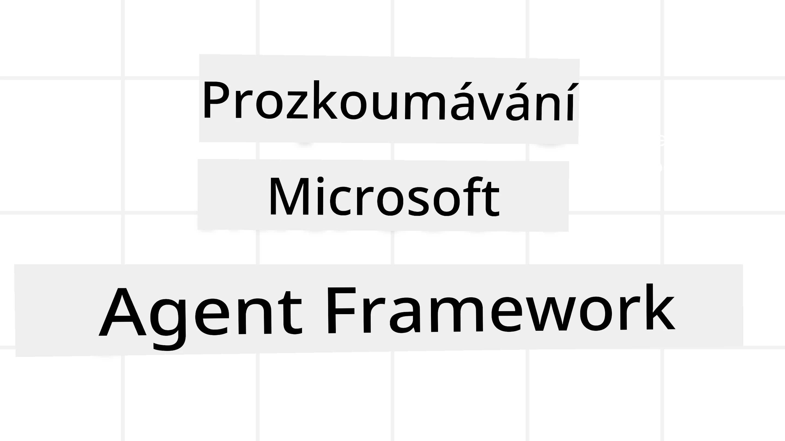
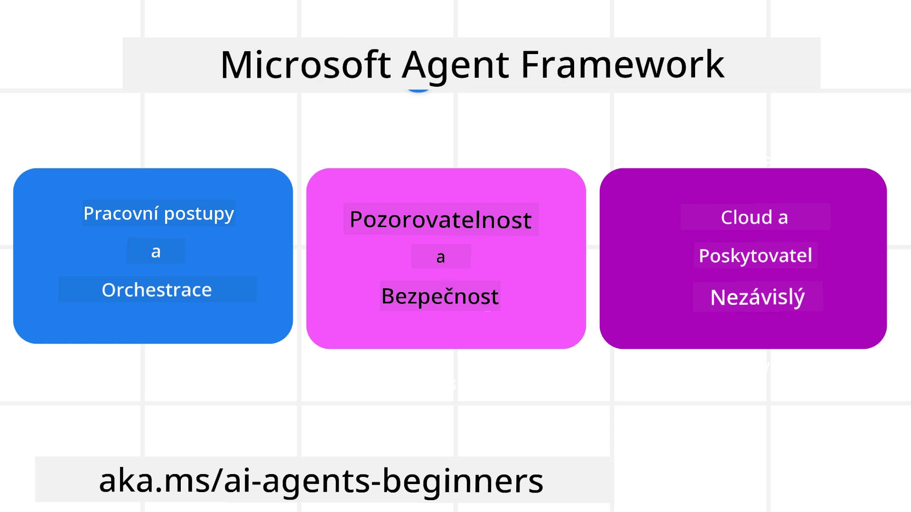
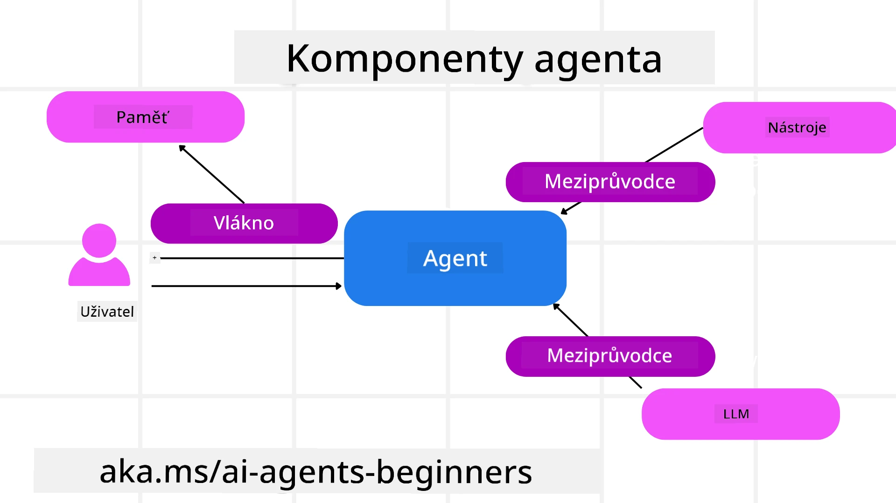

<!--
CO_OP_TRANSLATOR_METADATA:
{
  "original_hash": "19c4dab375acbc733855cc7f2f04edbc",
  "translation_date": "2025-10-02T09:00:03+00:00",
  "source_file": "14-microsoft-agent-framework/README.md",
  "language_code": "cs"
}
-->
# Prozkoumání Microsoft Agent Framework



### Úvod

Tato lekce pokryje:

- Porozumění Microsoft Agent Framework: Klíčové vlastnosti a přínosy  
- Prozkoumání klíčových konceptů Microsoft Agent Framework
- Porovnání MAF se Semantic Kernel a AutoGen: Průvodce migrací

## Cíle učení

Po dokončení této lekce budete umět:

- Vytvářet AI agenty připravené pro produkční prostředí pomocí Microsoft Agent Framework
- Aplikovat klíčové vlastnosti Microsoft Agent Framework na vaše agentické případy použití
- Migrovat a integrovat existující agentické frameworky a nástroje  

## Ukázky kódu 

Ukázky kódu pro [Microsoft Agent Framework (MAF)](https://aka.ms/ai-agents-beginners/agent-framewrok) najdete v tomto repozitáři pod soubory `xx-python-agent-framework` a `xx-dotnet-agent-framework`.

## Porozumění Microsoft Agent Framework



[Microsoft Agent Framework (MAF)](https://aka.ms/ai-agents-beginners/agent-framewrok) staví na zkušenostech a poznatcích ze Semantic Kernel a AutoGen. Nabízí flexibilitu pro řešení široké škály agentických případů použití, které se vyskytují jak v produkčním, tak výzkumném prostředí, včetně:

- **Sekvenční orchestrace agentů** ve scénářích, kde jsou potřeba krokové pracovní postupy.
- **Současná orchestrace** ve scénářích, kde agenti musí plnit úkoly současně.
- **Orchestrace skupinového chatu** ve scénářích, kde agenti mohou spolupracovat na jednom úkolu.
- **Předávání úkolů** ve scénářích, kde agenti předávají úkol jeden druhému, jakmile jsou dílčí úkoly dokončeny.
- **Magnetická orchestrace** ve scénářích, kde manažerský agent vytváří a upravuje seznam úkolů a koordinuje podagenty k jejich dokončení.

Pro nasazení AI agentů v produkčním prostředí MAF zahrnuje funkce pro:

- **Pozorovatelnost** prostřednictvím OpenTelemetry, kde každá akce AI agenta, včetně volání nástrojů, kroků orchestrace, toků uvažování a monitorování výkonu, je sledována pomocí dashboardů Azure AI Foundry.
- **Bezpečnost** díky nativnímu hostování agentů na Azure AI Foundry, které zahrnuje bezpečnostní kontroly, jako je role-based access, zpracování soukromých dat a vestavěná ochrana obsahu.
- **Odolnost** jako možnost pozastavení, obnovení a zotavení agentických vláken a pracovních postupů z chyb, což umožňuje dlouhodobé procesy.
- **Kontrola** díky podpoře workflowů s lidským schválením, kde úkoly vyžadují lidské potvrzení.

Microsoft Agent Framework se také zaměřuje na interoperabilitu díky:

- **Cloudové nezávislosti** - Agenti mohou běžet v kontejnerech, on-premise a napříč různými cloudy.
- **Nezávislosti na poskytovateli** - Agenti mohou být vytvořeni prostřednictvím preferovaného SDK, včetně Azure OpenAI a OpenAI.
- **Integraci otevřených standardů** - Agenti mohou využívat protokoly jako Agent-to-Agent (A2A) a Model Context Protocol (MCP) k objevování a používání jiných agentů a nástrojů.
- **Pluginy a konektory** - Připojení k datovým a paměťovým službám, jako jsou Microsoft Fabric, SharePoint, Pinecone a Qdrant.

Podívejme se, jak jsou tyto funkce aplikovány na některé z klíčových konceptů Microsoft Agent Framework.

## Klíčové koncepty Microsoft Agent Framework

### Agenti



**Vytváření agentů**

Vytvoření agenta se provádí definováním inference služby (LLM poskytovatele), sady instrukcí, které má AI agent dodržovat, a přiřazením `name`:

```python
agent = AzureOpenAIChatClient(credential=AzureCliCredential()).create_agent( instructions="You are good at recommending trips to customers based on their preferences.", name="TripRecommender" )
```

Výše uvedené používá `Azure OpenAI`, ale agenti mohou být vytvořeni pomocí různých služeb, včetně `Azure AI Foundry Agent Service`:

```python
AzureAIAgentClient(async_credential=credential).create_agent( name="HelperAgent", instructions="You are a helpful assistant." ) as agent
```

OpenAI `Responses`, `ChatCompletion` API

```python
agent = OpenAIResponsesClient().create_agent( name="WeatherBot", instructions="You are a helpful weather assistant.", )
```

```python
agent = OpenAIChatClient().create_agent( name="HelpfulAssistant", instructions="You are a helpful assistant.", )
```

nebo vzdálených agentů pomocí protokolu A2A:

```python
agent = A2AAgent( name=agent_card.name, description=agent_card.description, agent_card=agent_card, url="https://your-a2a-agent-host" )
```

**Spouštění agentů**

Agenti se spouštějí pomocí metod `.run` nebo `.run_stream` pro odpovědi bez streamování nebo se streamováním.

```python
result = await agent.run("What are good places to visit in Amsterdam?")
print(result.text)
```

```python
async for update in agent.run_stream("What are the good places to visit in Amsterdam?"):
    if update.text:
        print(update.text, end="", flush=True)

```

Každé spuštění agenta může mít také možnosti přizpůsobení parametrů, jako je `max_tokens`, které agent používá, `tools`, které může agent volat, a dokonce i samotný `model`, který agent používá.

To je užitečné v případech, kdy jsou pro splnění úkolu uživatele vyžadovány specifické modely nebo nástroje.

**Nástroje**

Nástroje mohou být definovány jak při definování agenta:

```python
def get_attractions( location: Annotated[str, Field(description="The location to get the top tourist attractions for")], ) -> str: """Get the top tourist attractions for a given location.""" return f"The top attractions for {location} are." 


# When creating a ChatAgent directly 

agent = ChatAgent( chat_client=OpenAIChatClient(), instructions="You are a helpful assistant", tools=[get_attractions]

```

tak i při jeho spuštění:

```python

result1 = await agent.run( "What's the best place to visit in Seattle?", tools=[get_attractions] # Tool provided for this run only )
```

**Agentická vlákna**

Agentická vlákna se používají k zpracování víceotáčkových konverzací. Vlákna mohou být vytvořena buď:

- Použitím `get_new_thread()`, což umožňuje vlákno uložit na delší dobu.
- Automatickým vytvořením vlákna při spuštění agenta, přičemž vlákno trvá pouze během aktuálního běhu.

Pro vytvoření vlákna vypadá kód takto:

```python
# Create a new thread. 
thread = agent.get_new_thread() # Run the agent with the thread. 
response = await agent.run("Hello, I am here to help you book travel. Where would you like to go?", thread=thread)

```

Vlákno pak můžete serializovat pro pozdější použití:

```python
# Create a new thread. 
thread = agent.get_new_thread() 

# Run the agent with the thread. 

response = await agent.run("Hello, how are you?", thread=thread) 

# Serialize the thread for storage. 

serialized_thread = await thread.serialize() 

# Deserialize the thread state after loading from storage. 

resumed_thread = await agent.deserialize_thread(serialized_thread)
```

**Agentické middleware**

Agenti interagují s nástroji a LLM, aby splnili úkoly uživatele. V určitých scénářích chceme provádět nebo sledovat akce mezi těmito interakcemi. Agentické middleware nám to umožňuje prostřednictvím:

*Function Middleware*

Toto middleware nám umožňuje provést akci mezi agentem a funkcí/nástrojem, který bude volat. Příkladem použití může být logování volání funkce.

V níže uvedeném kódu `next` definuje, zda by mělo být voláno další middleware nebo samotná funkce.

```python
async def logging_function_middleware(
    context: FunctionInvocationContext,
    next: Callable[[FunctionInvocationContext], Awaitable[None]],
) -> None:
    """Function middleware that logs function execution."""
    # Pre-processing: Log before function execution
    print(f"[Function] Calling {context.function.name}")

    # Continue to next middleware or function execution
    await next(context)

    # Post-processing: Log after function execution
    print(f"[Function] {context.function.name} completed")
```

*Chat Middleware*

Toto middleware nám umožňuje provést nebo logovat akci mezi agentem a požadavky mezi LLM.

Obsahuje důležité informace, jako jsou `messages`, které jsou odesílány AI službě.

```python
async def logging_chat_middleware(
    context: ChatContext,
    next: Callable[[ChatContext], Awaitable[None]],
) -> None:
    """Chat middleware that logs AI interactions."""
    # Pre-processing: Log before AI call
    print(f"[Chat] Sending {len(context.messages)} messages to AI")

    # Continue to next middleware or AI service
    await next(context)

    # Post-processing: Log after AI response
    print("[Chat] AI response received")

```

**Agentická paměť**

Jak bylo pokryto v lekci `Agentic Memory`, paměť je důležitým prvkem umožňujícím agentovi operovat v různých kontextech. MAF nabízí několik různých typů pamětí:

*Paměť v RAM*

Toto je paměť uložená ve vláknech během běhu aplikace.

```python
# Create a new thread. 
thread = agent.get_new_thread() # Run the agent with the thread. 
response = await agent.run("Hello, I am here to help you book travel. Where would you like to go?", thread=thread)
```

*Trvalé zprávy*

Tato paměť se používá při ukládání historie konverzací napříč různými relacemi. Je definována pomocí `chat_message_store_factory`:

```python
from agent_framework import ChatMessageStore

# Create a custom message store
def create_message_store():
    return ChatMessageStore()

agent = ChatAgent(
    chat_client=OpenAIChatClient(),
    instructions="You are a Travel assistant.",
    chat_message_store_factory=create_message_store
)

```

*Dynamická paměť*

Tato paměť je přidána do kontextu před spuštěním agentů. Tyto paměti mohou být uloženy v externích službách, jako je mem0:

```python
from agent_framework.mem0 import Mem0Provider

# Using Mem0 for advanced memory capabilities
memory_provider = Mem0Provider(
    api_key="your-mem0-api-key",
    user_id="user_123",
    application_id="my_app"
)

agent = ChatAgent(
    chat_client=OpenAIChatClient(),
    instructions="You are a helpful assistant with memory.",
    context_providers=memory_provider
)

```

**Agentická pozorovatelnost**

Pozorovatelnost je důležitá pro budování spolehlivých a udržovatelných agentických systémů. MAF se integruje s OpenTelemetry, aby poskytoval trasování a metry pro lepší pozorovatelnost.

```python
from agent_framework.observability import get_tracer, get_meter

tracer = get_tracer()
meter = get_meter()
with tracer.start_as_current_span("my_custom_span"):
    # do something
    pass
counter = meter.create_counter("my_custom_counter")
counter.add(1, {"key": "value"})
```

### Pracovní postupy

MAF nabízí pracovní postupy, které jsou předdefinovanými kroky k dokončení úkolu a zahrnují AI agenty jako součásti těchto kroků.

Pracovní postupy se skládají z různých komponent, které umožňují lepší kontrolu toku. Pracovní postupy také umožňují **orchestraci více agentů** a **checkpointing** pro ukládání stavů pracovního postupu.

Základní komponenty pracovního postupu jsou:

**Exekutoři**

Exekutoři přijímají vstupní zprávy, provádějí přiřazené úkoly a poté produkují výstupní zprávy. To posouvá pracovní postup směrem k dokončení většího úkolu. Exekutoři mohou být buď AI agenti nebo vlastní logika.

**Hrany**

Hrany se používají k definování toku zpráv v pracovním postupu. Mohou být:

*Přímé hrany* - Jednoduché spojení jeden na jednoho mezi exekutory:

```python
from agent_framework import WorkflowBuilder

builder = WorkflowBuilder()
builder.add_edge(source_executor, target_executor)
builder.set_start_executor(source_executor)
workflow = builder.build()
```

*Podmíněné hrany* - Aktivovány po splnění určité podmínky. Například když nejsou dostupné hotelové pokoje, exekutor může navrhnout jiné možnosti.

*Switch-case hrany* - Směrují zprávy na různé exekutory na základě definovaných podmínek. Například pokud má cestovní zákazník prioritní přístup, jeho úkoly budou zpracovány jiným pracovním postupem.

*Fan-out hrany* - Odesílají jednu zprávu na více cílů.

*Fan-in hrany* - Sbírají více zpráv od různých exekutorů a odesílají je na jeden cíl.

**Události**

Pro lepší pozorovatelnost pracovních postupů nabízí MAF vestavěné události pro exekuci, včetně:

- `WorkflowStartedEvent`  - Začátek exekuce pracovního postupu
- `WorkflowOutputEvent` - Pracovní postup produkuje výstup
- `WorkflowErrorEvent` - Pracovní postup narazí na chybu
- `ExecutorInvokeEvent`  - Exekutor začíná zpracování
- `ExecutorCompleteEvent`  - Exekutor dokončuje zpracování
- `RequestInfoEvent` - Vydán požadavek

## Migrace z jiných frameworků (Semantic Kernel a AutoGen)

### Rozdíly mezi MAF a Semantic Kernel

**Zjednodušené vytváření agentů**

Semantic Kernel vyžaduje vytvoření instance Kernel pro každého agenta. MAF používá zjednodušený přístup pomocí rozšíření pro hlavní poskytovatele.

```python
agent = AzureOpenAIChatClient(credential=AzureCliCredential()).create_agent( instructions="You are good at reccomending trips to customers based on their preferences.", name="TripRecommender" )
```

**Vytváření agentických vláken**

Semantic Kernel vyžaduje manuální vytvoření vláken. V MAF je agent přímo přiřazen vláknu.

```python
thread = agent.get_new_thread() # Run the agent with the thread. 
```

**Registrace nástrojů**

V Semantic Kernel jsou nástroje registrovány do Kernelu a Kernel je poté předán agentovi. V MAF jsou nástroje registrovány přímo během procesu vytváření agenta.

```python
agent = ChatAgent( chat_client=OpenAIChatClient(), instructions="You are a helpful assistant", tools=[get_attractions]
```

### Rozdíly mezi MAF a AutoGen

**Týmy vs Pracovní postupy**

`Týmy` jsou struktura událostí pro událostmi řízenou aktivitu s agenty v AutoGen. MAF používá `Pracovní postupy`, které směrují data na exekutory prostřednictvím architektury založené na grafech.

**Vytváření nástrojů**

AutoGen používá `FunctionTool` k obalení funkcí, které agenti volají. MAF používá @ai_function, který funguje podobně, ale také automaticky odvozuje schémata pro každou funkci.

**Chování agentů**

Agenti jsou v AutoGen standardně jednootáčkoví, pokud není `max_tool_iterations` nastaven na vyšší hodnotu. V MAF je `ChatAgent` standardně víceotáčkový, což znamená, že bude volat nástroje, dokud nebude úkol uživatele dokončen.

## Ukázky kódu 

Ukázky kódu pro Microsoft Agent Framework najdete v tomto repozitáři pod soubory `xx-python-agent-framework` a `xx-dotnet-agent-framework`.

## Máte další otázky ohledně Microsoft Agent Framework?

Připojte se na [Azure AI Foundry Discord](https://aka.ms/ai-agents/discord), kde se můžete setkat s dalšími studenty, zúčastnit se konzultačních hodin a získat odpovědi na vaše otázky ohledně AI agentů.

---

**Upozornění**:  
Tento dokument byl přeložen pomocí služby pro automatický překlad [Co-op Translator](https://github.com/Azure/co-op-translator). I když se snažíme o co největší přesnost, mějte prosím na paměti, že automatické překlady mohou obsahovat chyby nebo nepřesnosti. Za autoritativní zdroj by měl být považován původní dokument v jeho původním jazyce. Pro důležité informace doporučujeme profesionální lidský překlad. Neodpovídáme za žádná nedorozumění nebo nesprávné výklady vyplývající z použití tohoto překladu.