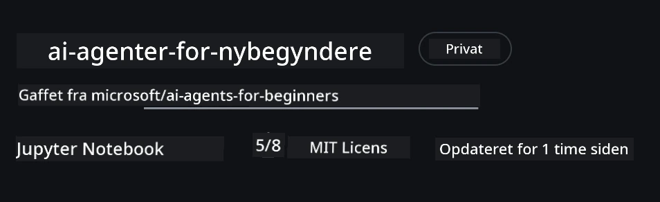
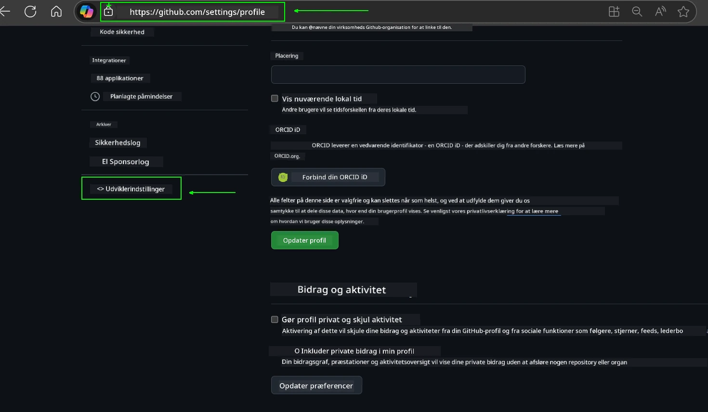
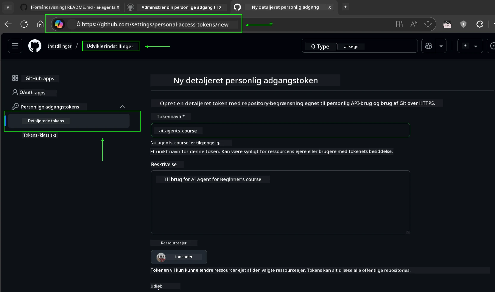
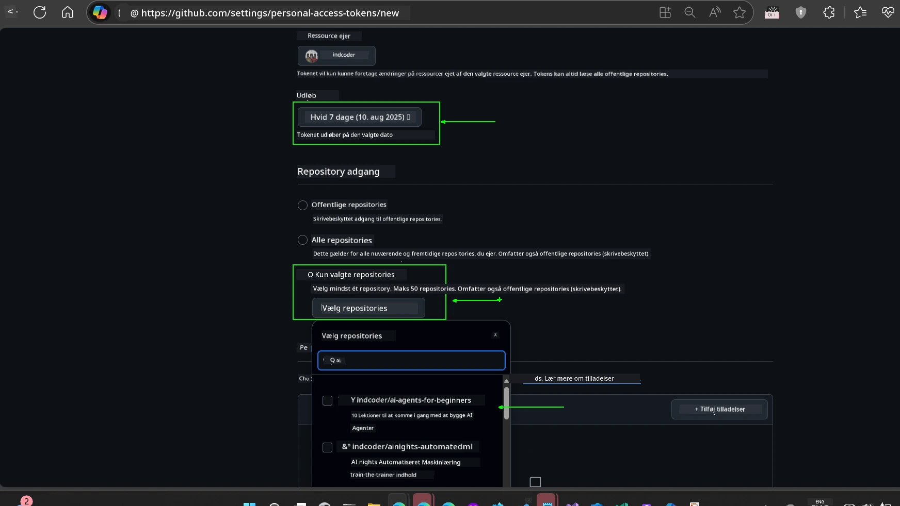
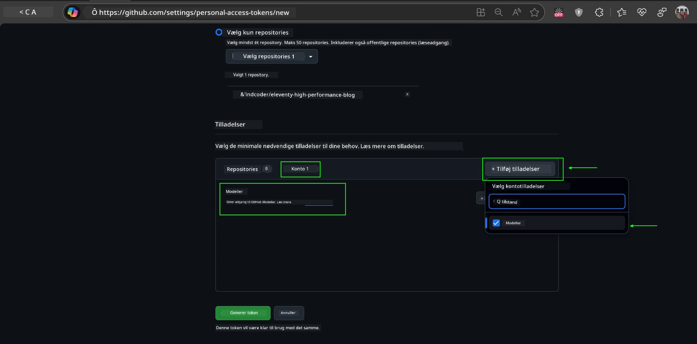
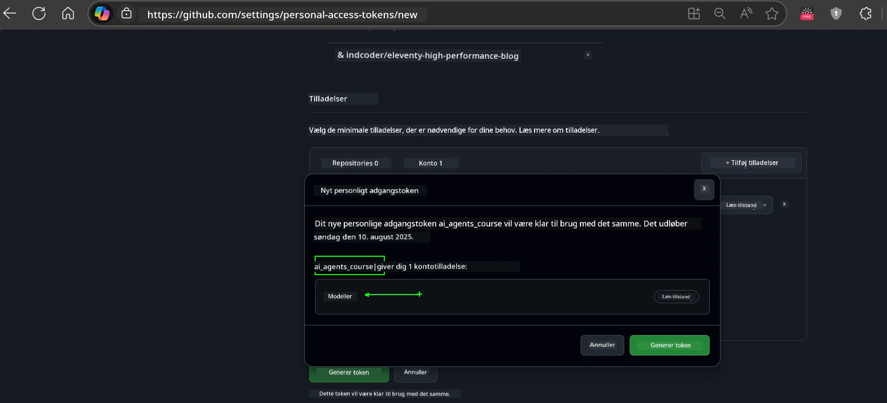
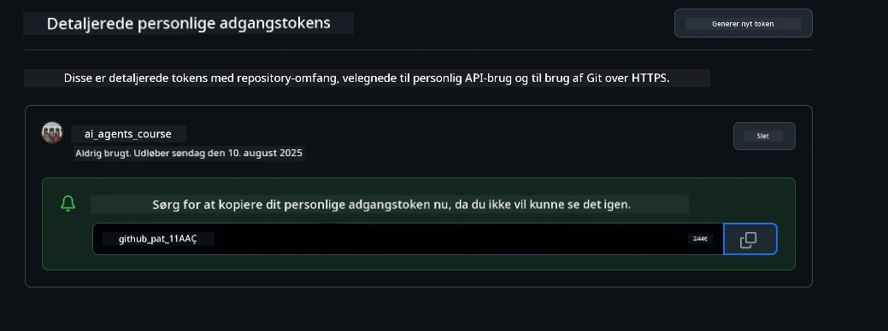
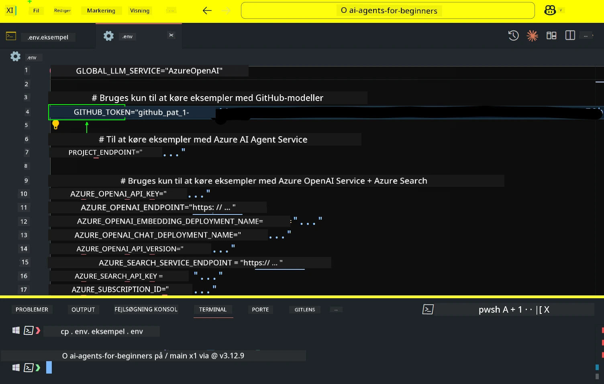
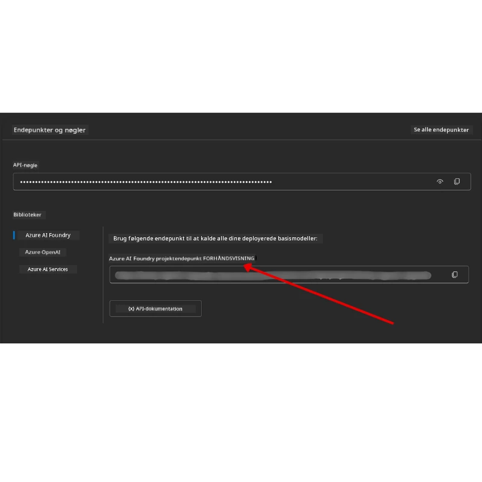

<!--
CO_OP_TRANSLATOR_METADATA:
{
  "original_hash": "63b1a8f6e840df15934935b728e569f0",
  "translation_date": "2025-12-03T14:31:37+00:00",
  "source_file": "00-course-setup/README.md",
  "language_code": "da"
}
-->
# Kursusopsætning

## Introduktion

Denne lektion vil dække, hvordan du kører kodeeksemplerne i dette kursus.

## Deltag med andre deltagere og få hjælp

Før du begynder at klone dit repo, skal du tilmelde dig [AI Agents For Beginners Discord-kanalen](https://aka.ms/ai-agents/discord) for at få hjælp til opsætning, stille spørgsmål om kurset eller forbinde med andre deltagere.

## Klon eller fork dette repo

For at komme i gang skal du klone eller forke GitHub-repositoriet. Dette vil give dig din egen version af kursusmaterialet, så du kan køre, teste og tilpasse koden!

Dette kan gøres ved at klikke på linket for at <a href="https://github.com/microsoft/ai-agents-for-beginners/fork" target="_blank">forke repoet</a>.

Du bør nu have din egen forkede version af dette kursus på følgende link:



### Shallow Clone (anbefales til workshop / Codespaces)

  >Det fulde repository kan være stort (~3 GB), når du downloader hele historikken og alle filer. Hvis du kun deltager i workshoppen eller kun har brug for nogle få lektionsmapper, undgår en shallow clone (eller en sparse clone) det meste af denne download ved at afkorte historikken og/eller springe blobs over.

#### Hurtig shallow clone — minimal historik, alle filer

Erstat `<your-username>` i nedenstående kommandoer med din fork-URL (eller upstream-URL, hvis du foretrækker det).

For kun at klone den seneste commit-historik (lille download):

```bash|powershell
git clone --depth 1 https://github.com/<your-username>/ai-agents-for-beginners.git
```

For at klone en specifik branch:

```bash|powershell
git clone --depth 1 --branch <branch-name> https://github.com/<your-username>/ai-agents-for-beginners.git
```

#### Delvis (sparse) clone — minimale blobs + kun udvalgte mapper

Dette bruger delvis kloning og sparse-checkout (kræver Git 2.25+ og anbefales moderne Git med delvis kloningssupport):

```bash|powershell
git clone --depth 1 --filter=blob:none --sparse https://github.com/<your-username>/ai-agents-for-beginners.git
```

Gå ind i repo-mappen:

```bash|powershell
cd ai-agents-for-beginners
```

Angiv derefter, hvilke mapper du vil have (eksemplet nedenfor viser to mapper):

```bash|powershell
git sparse-checkout set 00-course-setup 01-intro-to-ai-agents
```

Efter kloning og verificering af filerne, hvis du kun har brug for filerne og vil frigøre plads (ingen git-historik), skal du slette repository-metadata (💀irreversibelt — du mister al Git-funktionalitet: ingen commits, pulls, pushes eller adgang til historik).

```bash
# zsh/bash
rm -rf .git
```

```powershell
# PowerShell
Remove-Item -Recurse -Force .git
```

#### Brug af GitHub Codespaces (anbefales for at undgå store lokale downloads)

- Opret en ny Codespace til dette repo via [GitHub UI](https://github.com/codespaces).  

- I terminalen i den nyoprettede Codespace skal du køre en af shallow/sparse clone-kommandoerne ovenfor for kun at hente de lektionsmapper, du har brug for, ind i Codespace-arbejdsområdet.
- Valgfrit: Efter kloning i Codespaces kan du fjerne .git for at frigøre ekstra plads (se fjernelseskommandoer ovenfor).
- Bemærk: Hvis du foretrækker at åbne repoet direkte i Codespaces (uden en ekstra kloning), skal du være opmærksom på, at Codespaces vil oprette devcontainer-miljøet og muligvis stadig provisionere mere, end du har brug for. At klone en shallow kopi i en frisk Codespace giver dig mere kontrol over diskforbruget.

#### Tips

- Erstat altid klon-URL'en med din fork, hvis du vil redigere/committe.
- Hvis du senere har brug for mere historik eller flere filer, kan du hente dem eller justere sparse-checkout for at inkludere yderligere mapper.

## Kørsel af koden

Dette kursus tilbyder en række Jupyter Notebooks, som du kan køre for at få praktisk erfaring med at bygge AI-agenter.

Kodeeksemplerne bruger enten:

**Kræver GitHub-konto - Gratis**:

1) Semantic Kernel Agent Framework + GitHub Models Marketplace. Mærket som (semantic-kernel.ipynb)
2) AutoGen Framework + GitHub Models Marketplace. Mærket som (autogen.ipynb)

**Kræver Azure-abonnement**:

3) Azure AI Foundry + Azure AI Agent Service. Mærket som (azureaiagent.ipynb)

Vi opfordrer dig til at prøve alle tre typer eksempler for at se, hvilken der fungerer bedst for dig.

Uanset hvilken mulighed du vælger, vil det afgøre, hvilke opsætningsskridt du skal følge nedenfor:

## Krav

- Python 3.12+
  - **NOTE**: Hvis du ikke har Python3.12 installeret, skal du sørge for at installere det. Opret derefter din venv ved hjælp af python3.12 for at sikre, at de korrekte versioner installeres fra requirements.txt-filen.
  
    >Eksempel

    Opret Python venv-mappe:

    ```bash|powershell
    python -m venv venv
    ```

    Aktiver derefter venv-miljøet for:

    ```bash
    # zsh/bash
    source venv/bin/activate
    ```
  
    ```dos
    # Command Prompt for Windows
    venv\Scripts\activate
    ```

- .NET 10+: For eksempel koder, der bruger .NET, skal du sørge for at installere [.NET 10 SDK](https://dotnet.microsoft.com/download/dotnet/10.0) eller nyere. Tjek derefter din installerede .NET SDK-version:

    ```bash|powershell
    dotnet --list-sdks
    ```

- En GitHub-konto - For adgang til GitHub Models Marketplace
- Azure-abonnement - For adgang til Azure AI Foundry
- Azure AI Foundry-konto - For adgang til Azure AI Agent Service

Vi har inkluderet en `requirements.txt`-fil i roden af dette repository, som indeholder alle de nødvendige Python-pakker for at køre kodeeksemplerne.

Du kan installere dem ved at køre følgende kommando i din terminal i roden af repositoryet:

```bash|powershell
pip install -r requirements.txt
```

Vi anbefaler at oprette et Python-virtuelt miljø for at undgå konflikter og problemer.

## Opsætning af VSCode

Sørg for, at du bruger den rigtige version af Python i VSCode.


## Opsætning til eksempler, der bruger GitHub-modeller

### Trin 1: Hent din GitHub Personal Access Token (PAT)

Dette kursus udnytter GitHub Models Marketplace, som giver gratis adgang til Large Language Models (LLMs), som du vil bruge til at bygge AI-agenter.

For at bruge GitHub-modellerne skal du oprette en [GitHub Personal Access Token](https://docs.github.com/en/authentication/keeping-your-account-and-data-secure/managing-your-personal-access-tokens).

Dette kan gøres ved at gå til dine <a href="https://github.com/settings/personal-access-tokens" target="_blank">Indstillinger for personlige adgangstokens</a> i din GitHub-konto.

Følg venligst [Principle of Least Privilege](https://docs.github.com/en/get-started/learning-to-code/storing-your-secrets-safely), når du opretter din token. Det betyder, at du kun skal give token de tilladelser, det har brug for til at køre kodeeksemplerne i dette kursus.

1. Vælg `Fine-grained tokens`-muligheden i venstre side af din skærm ved at navigere til **Udviklerindstillinger**.

   

   Vælg derefter `Generate new token`.

   

2. Indtast et beskrivende navn til din token, der afspejler dens formål, så det er nemt at identificere senere.

    🔐 Anbefaling for tokenvarighed

    Anbefalet varighed: 30 dage  
    For en mere sikker tilgang kan du vælge en kortere periode—såsom 7 dage 🛡️  
    Det er en god måde at sætte et personligt mål og gennemføre kurset, mens din læringsmotivation er høj 🚀.

    

3. Begræns tokenens rækkevidde til din fork af dette repository.

    

4. Begræns tokenens tilladelser: Under **Tilladelser**, klik på **Konto**-fanen, og klik på knappen "+ Tilføj tilladelser". En dropdown-menu vil dukke op. Søg efter **Models** og marker boksen for det.

    

5. Bekræft de nødvendige tilladelser, før du genererer tokenet. 

6. Før du genererer tokenet, skal du sikre dig, at du er klar til at gemme tokenet et sikkert sted som en adgangskodehåndteringsboks, da det ikke vil blive vist igen efter oprettelsen. 

Kopiér dit nye token, som du lige har oprettet. Du vil nu tilføje dette til din `.env`-fil, der er inkluderet i dette kursus.

### Trin 2: Opret din `.env`-fil

For at oprette din `.env`-fil skal du køre følgende kommando i din terminal.

```bash
# zsh/bash
cp .env.example .env
```

```powershell
# PowerShell
Copy-Item .env.example .env
```

Dette vil kopiere eksempel-filen og oprette en `.env` i din mappe, hvor du udfylder værdierne for miljøvariablerne.

Med dit token kopieret, åbn `.env`-filen i din foretrukne teksteditor og indsæt dit token i `GITHUB_TOKEN`-feltet.



Du bør nu kunne køre kodeeksemplerne i dette kursus.

## Opsætning til eksempler, der bruger Azure AI Foundry og Azure AI Agent Service

### Trin 1: Hent din Azure-projekt-endpoint

Følg trinnene for at oprette en hub og et projekt i Azure AI Foundry, som findes her: [Hubressourcer oversigt](https://learn.microsoft.com/azure/ai-foundry/concepts/ai-resources)

Når du har oprettet dit projekt, skal du hente forbindelsesstrengen til dit projekt.

Dette kan gøres ved at gå til **Oversigt**-siden for dit projekt i Azure AI Foundry-portalen.



### Trin 2: Opret din `.env`-fil

For at oprette din `.env`-fil skal du køre følgende kommando i din terminal.

```bash
# zsh/bash
cp .env.example .env
```

```powershell
# PowerShell
Copy-Item .env.example .env
```

Dette vil kopiere eksempel-filen og oprette en `.env` i din mappe, hvor du udfylder værdierne for miljøvariablerne.

Med dit token kopieret, åbn `.env`-filen i din foretrukne teksteditor og indsæt dit token i `PROJECT_ENDPOINT`-feltet.

### Trin 3: Log ind på Azure

Som en sikkerhedsbedste praksis vil vi bruge [nøglefri autentificering](https://learn.microsoft.com/azure/developer/ai/keyless-connections?tabs=csharp%2Cazure-cli?WT.mc_id=academic-105485-koreyst) til at autentificere til Azure OpenAI med Microsoft Entra ID. 

Åbn derefter en terminal og kør `az login --use-device-code` for at logge ind på din Azure-konto.

Når du er logget ind, skal du vælge dit abonnement i terminalen.

## Yderligere miljøvariabler - Azure Search og Azure OpenAI 

Til Agentic RAG-lektionen - Lektion 5 - er der eksempler, der bruger Azure Search og Azure OpenAI.

Hvis du vil køre disse eksempler, skal du tilføje følgende miljøvariabler til din `.env`-fil:

### Oversigtsside (Projekt)

- `AZURE_SUBSCRIPTION_ID` - Tjek **Projektdetaljer** på **Oversigt**-siden for dit projekt.

- `AZURE_AI_PROJECT_NAME` - Se øverst på **Oversigt**-siden for dit projekt.

- `AZURE_OPENAI_SERVICE` - Find dette i fanen **Inkluderede kapaciteter** for **Azure OpenAI Service** på **Oversigt**-siden.

### Management Center

- `AZURE_OPENAI_RESOURCE_GROUP` - Gå til **Projektindstillinger** på **Oversigt**-siden for **Management Center**.

- `GLOBAL_LLM_SERVICE` - Under **Forbundne ressourcer**, find **Azure AI Services** forbindelsesnavnet. Hvis det ikke er angivet, skal du tjekke **Azure-portalen** under din ressourcegruppe for AI Services ressourcenavnet.

### Models + Endpoints Side

- `AZURE_OPENAI_EMBEDDING_DEPLOYMENT_NAME` - Vælg din embedding-model (f.eks. `text-embedding-ada-002`) og noter **Deploymentsnavnet** fra modeldetaljerne.

- `AZURE_OPENAI_CHAT_DEPLOYMENT_NAME` - Vælg din chat-model (f.eks. `gpt-4o-mini`) og noter **Deploymentsnavnet** fra modeldetaljerne.

### Azure Portal

- `AZURE_OPENAI_ENDPOINT` - Se efter **Azure AI services**, klik på det, gå derefter til **Ressourcestyring**, **Nøgler og Endpoint**, rul ned til "Azure OpenAI endpoints", og kopier den, der siger "Language APIs".

- `AZURE_OPENAI_API_KEY` - Fra samme skærm, kopier NØGLE 1 eller NØGLE 2.

- `AZURE_SEARCH_SERVICE_ENDPOINT` - Find din **Azure AI Search**-ressource, klik på den, og se **Oversigt**.

- `AZURE_SEARCH_API_KEY` - Gå derefter til **Indstillinger** og derefter **Nøgler** for at kopiere den primære eller sekundære admin-nøgle.

### Ekstern Webside

- `AZURE_OPENAI_API_VERSION` - Besøg siden [API-version livscyklus](https://learn.microsoft.com/azure/ai-services/openai/api-version-deprecation#latest-ga-api-release) under **Seneste GA API-udgivelse**.

### Opsætning af nøglefri autentificering

I stedet for at hardkode dine legitimationsoplysninger, vil vi bruge en nøglefri forbindelse med Azure OpenAI. For at gøre dette vil vi importere `DefaultAzureCredential` og senere kalde funktionen `DefaultAzureCredential` for at få legitimationsoplysningerne.

```python
# Python
from azure.identity import DefaultAzureCredential, InteractiveBrowserCredential
```

## Sidder du fast et sted?
Hvis du oplever problemer med at køre denne opsætning, så hop ind i vores <a href="https://discord.gg/kzRShWzttr" target="_blank">Azure AI Community Discord</a> eller <a href="https://github.com/microsoft/ai-agents-for-beginners/issues?WT.mc_id=academic-105485-koreyst" target="_blank">opret en issue</a>.

## Næste Lektion

Du er nu klar til at køre koden for dette kursus. God fornøjelse med at lære mere om AI-agenter!

[Introduktion til AI-agenter og anvendelsestilfælde](../01-intro-to-ai-agents/README.md)

---

<!-- CO-OP TRANSLATOR DISCLAIMER START -->
**Ansvarsfraskrivelse**:  
Dette dokument er blevet oversat ved hjælp af AI-oversættelsestjenesten [Co-op Translator](https://github.com/Azure/co-op-translator). Selvom vi bestræber os på nøjagtighed, skal du være opmærksom på, at automatiserede oversættelser kan indeholde fejl eller unøjagtigheder. Det originale dokument på dets oprindelige sprog bør betragtes som den autoritative kilde. For kritisk information anbefales professionel menneskelig oversættelse. Vi er ikke ansvarlige for misforståelser eller fejltolkninger, der opstår som følge af brugen af denne oversættelse.
<!-- CO-OP TRANSLATOR DISCLAIMER END -->