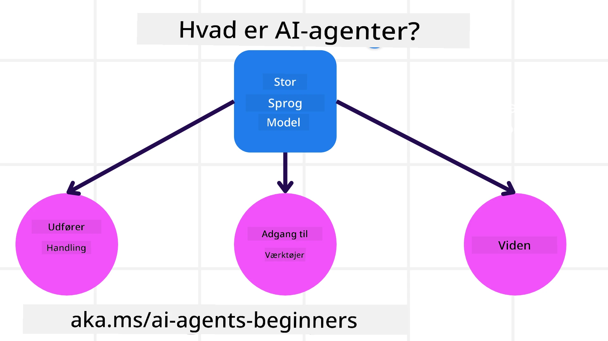
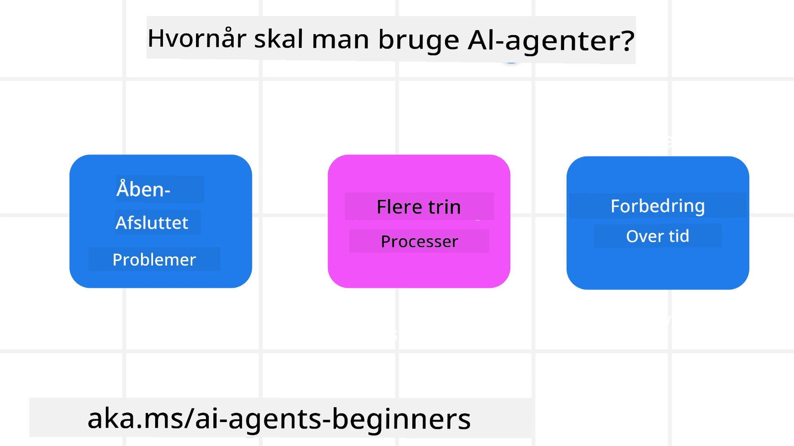

<!--
CO_OP_TRANSLATOR_METADATA:
{
  "original_hash": "cdd28bc00816d2773bb2b5968d782abc",
  "translation_date": "2025-11-11T11:20:53+00:00",
  "source_file": "01-intro-to-ai-agents/README.md",
  "language_code": "da"
}
-->

> _(Klik på billedet ovenfor for at se videoen til denne lektion)_

# Introduktion til AI-agenter og anvendelsesområder

Velkommen til kurset "AI-agenter for begyndere"! Dette kursus giver grundlæggende viden og praktiske eksempler på, hvordan man bygger AI-agenter.

Deltag i <a href="https://discord.gg/kzRShWzttr" target="_blank">Azure AI Discord-fællesskabet</a> for at møde andre lærende og AI-agentbyggere og stille spørgsmål om kurset.

For at starte dette kursus begynder vi med at få en bedre forståelse af, hvad AI-agenter er, og hvordan vi kan bruge dem i de applikationer og arbejdsgange, vi udvikler.

## Introduktion

Denne lektion dækker:

- Hvad er AI-agenter, og hvilke forskellige typer agenter findes der?
- Hvilke anvendelsesområder er bedst egnet til AI-agenter, og hvordan kan de hjælpe os?
- Hvad er nogle af de grundlæggende byggesten, når man designer agentbaserede løsninger?

## Læringsmål
Efter at have gennemført denne lektion, bør du kunne:

- Forstå AI-agentkonceptet og hvordan det adskiller sig fra andre AI-løsninger.
- Anvende AI-agenter mest effektivt.
- Produktivt designe agentbaserede løsninger for både brugere og kunder.

## Definition af AI-agenter og typer af AI-agenter

### Hvad er AI-agenter?

AI-agenter er **systemer**, der gør det muligt for **Large Language Models (LLMs)** at **udføre handlinger** ved at udvide deres kapaciteter gennem adgang til **værktøjer** og **viden**.

Lad os bryde denne definition ned i mindre dele:

- **System** - Det er vigtigt at tænke på agenter som et system af mange komponenter og ikke bare som en enkelt komponent. På det grundlæggende niveau består komponenterne i en AI-agent af:
  - **Miljø** - Det definerede rum, hvor AI-agenten opererer. For eksempel, hvis vi havde en rejsebooking-AI-agent, kunne miljøet være det rejsebookingsystem, som AI-agenten bruger til at udføre opgaver.
  - **Sensorer** - Miljøer har information og giver feedback. AI-agenter bruger sensorer til at indsamle og fortolke denne information om miljøets aktuelle tilstand. I eksemplet med rejsebooking-agenten kan rejsebookingsystemet give information som hoteltilgængelighed eller flypriser.
  - **Aktuatorer** - Når AI-agenten modtager miljøets aktuelle tilstand, bestemmer agenten, hvilken handling der skal udføres for at ændre miljøet. For rejsebooking-agenten kunne det være at booke et ledigt værelse til brugeren.

**Large Language Models** - Konceptet med agenter eksisterede før oprettelsen af LLMs. Fordelen ved at bygge AI-agenter med LLMs er deres evne til at fortolke menneskesprog og data. Denne evne gør det muligt for LLMs at fortolke miljøinformation og definere en plan for at ændre miljøet.

**Udføre handlinger** - Uden for AI-agent-systemer er LLMs begrænset til situationer, hvor handlingen er at generere indhold eller information baseret på en brugers prompt. Inden for AI-agent-systemer kan LLMs udføre opgaver ved at fortolke brugerens anmodning og bruge værktøjer, der er tilgængelige i deres miljø.

**Adgang til værktøjer** - Hvilke værktøjer LLM har adgang til, defineres af 1) det miljø, det opererer i, og 2) udvikleren af AI-agenten. For vores rejseagenteksempel er agentens værktøjer begrænset af de operationer, der er tilgængelige i bookingsystemet, og/eller udvikleren kan begrænse agentens værktøjsadgang til fly.

**Hukommelse+Viden** - Hukommelse kan være kortsigtet i konteksten af samtalen mellem brugeren og agenten. Langsigtet, uden for den information, der leveres af miljøet, kan AI-agenter også hente viden fra andre systemer, tjenester, værktøjer og endda andre agenter. I rejseagenteksemplet kunne denne viden være information om brugerens rejsepræferencer, der findes i en kundedatabase.

### De forskellige typer agenter

Nu hvor vi har en generel definition af AI-agenter, lad os se på nogle specifikke agenttyper og hvordan de kunne anvendes til en rejsebooking-AI-agent.

| **Agenttype**                 | **Beskrivelse**                                                                                                                       | **Eksempel**                                                                                                                                                                                                                   |
| ----------------------------- | ------------------------------------------------------------------------------------------------------------------------------------- | ----------------------------------------------------------------------------------------------------------------------------------------------------------------------------------------------------------------------------- |
| **Simple Reflex Agents**      | Udfører øjeblikkelige handlinger baseret på foruddefinerede regler.                                                                 | Rejseagenten fortolker konteksten af en e-mail og videresender rejseklager til kundeservice.                                                                                                                          |
| **Model-Based Reflex Agents** | Udfører handlinger baseret på en model af verden og ændringer i den model.                                                           | Rejseagenten prioriterer ruter med betydelige prisændringer baseret på adgang til historiske prisdata.                                                                                                             |
| **Goal-Based Agents**         | Skaber planer for at opnå specifikke mål ved at fortolke målet og bestemme handlinger for at nå det.                                  | Rejseagenten booker en rejse ved at bestemme nødvendige rejsearrangementer (bil, offentlig transport, fly) fra den aktuelle placering til destinationen.                                                                                |
| **Utility-Based Agents**      | Overvejer præferencer og afvejer kompromiser numerisk for at bestemme, hvordan mål opnås.                                            | Rejseagenten maksimerer nytteværdi ved at afveje bekvemmelighed mod omkostninger, når der bookes rejser.                                                                                                                                          |
| **Learning Agents**           | Forbedrer sig over tid ved at reagere på feedback og justere handlinger derefter.                                                    | Rejseagenten forbedrer sig ved at bruge kundefeedback fra efter-rejse-undersøgelser til at foretage justeringer af fremtidige bookinger.                                                                                                               |
| **Hierarchical Agents**       | Har flere agenter i et hierarkisk system, hvor højere niveau-agenter opdeler opgaver i delopgaver, som lavere niveau-agenter udfører. | Rejseagenten aflyser en rejse ved at opdele opgaven i delopgaver (for eksempel aflysning af specifikke bookinger) og lade lavere niveau-agenter udføre dem og rapportere tilbage til den højere niveau-agent.                                     |
| **Multi-Agent Systems (MAS)** | Agenter udfører opgaver uafhængigt, enten samarbejdende eller konkurrerende.                                                         | Samarbejdende: Flere agenter booker specifikke rejsetjenester som hoteller, fly og underholdning. Konkurrerende: Flere agenter administrerer og konkurrerer om en delt hotelbookingkalender for at booke kunder ind på hotellet. |

## Hvornår skal man bruge AI-agenter?

I det tidligere afsnit brugte vi rejseagentens anvendelsesområde til at forklare, hvordan de forskellige typer agenter kan bruges i forskellige scenarier for rejsebooking. Vi vil fortsætte med at bruge denne applikation gennem hele kurset.

Lad os se på de typer anvendelsesområder, som AI-agenter er bedst egnet til:

- **Åbne problemer** - giver LLM mulighed for at bestemme nødvendige trin for at fuldføre en opgave, fordi det ikke altid kan hardcodes i en arbejdsgang.
- **Flertrinsprocesser** - opgaver, der kræver en vis kompleksitet, hvor AI-agenten skal bruge værktøjer eller information over flere trin i stedet for enkeltstående hentning.  
- **Forbedring over tid** - opgaver, hvor agenten kan forbedre sig over tid ved at modtage feedback fra enten sit miljø eller brugere for at levere bedre nytteværdi.

Vi dækker flere overvejelser om brugen af AI-agenter i lektionen om opbygning af pålidelige AI-agenter.

## Grundlæggende om agentbaserede løsninger

### Agentudvikling

Det første skridt i designet af et AI-agent-system er at definere værktøjer, handlinger og adfærd. I dette kursus fokuserer vi på at bruge **Azure AI Agent Service** til at definere vores agenter. Det tilbyder funktioner som:

- Valg af åbne modeller som OpenAI, Mistral og Llama
- Brug af licenserede data gennem udbydere som Tripadvisor
- Brug af standardiserede OpenAPI 3.0-værktøjer

### Agentbaserede mønstre

Kommunikation med LLMs sker gennem prompts. Givet den semi-autonome natur af AI-agenter er det ikke altid muligt eller nødvendigt manuelt at gentage prompten til LLM efter en ændring i miljøet. Vi bruger **agentbaserede mønstre**, der giver os mulighed for at prompt LLM over flere trin på en mere skalerbar måde.

Dette kursus er opdelt i nogle af de nuværende populære agentbaserede mønstre.

### Agentbaserede frameworks

Agentbaserede frameworks giver udviklere mulighed for at implementere agentbaserede mønstre gennem kode. Disse frameworks tilbyder skabeloner, plugins og værktøjer til bedre samarbejde mellem AI-agenter. Disse fordele giver muligheder for bedre synlighed og fejlfinding af AI-agent-systemer.

I dette kursus vil vi udforske det forskningsdrevne AutoGen-framework og det produktionsklare Agent-framework fra Semantic Kernel.

## Eksempelkoder

- Python: [Agent Framework](./code_samples/01-python-agent-framework.ipynb)
- .NET: [Agent Framework](./code_samples/01-dotnet-agent-framework.md)

## Har du flere spørgsmål om AI-agenter?

Deltag i [Azure AI Foundry Discord](https://aka.ms/ai-agents/discord) for at møde andre lærende, deltage i kontortid og få svar på dine spørgsmål om AI-agenter.

## Forrige lektion

[Kursusopsætning](../00-course-setup/README.md)

## Næste lektion

[Udforskning af agentbaserede frameworks](../02-explore-agentic-frameworks/README.md)

---

<!-- CO-OP TRANSLATOR DISCLAIMER START -->
**Ansvarsfraskrivelse**:  
Dette dokument er blevet oversat ved hjælp af AI-oversættelsestjenesten [Co-op Translator](https://github.com/Azure/co-op-translator). Selvom vi bestræber os på nøjagtighed, skal du være opmærksom på, at automatiserede oversættelser kan indeholde fejl eller unøjagtigheder. Det originale dokument på dets oprindelige sprog bør betragtes som den autoritative kilde. For kritisk information anbefales professionel menneskelig oversættelse. Vi er ikke ansvarlige for eventuelle misforståelser eller fejltolkninger, der opstår som følge af brugen af denne oversættelse.
<!-- CO-OP TRANSLATOR DISCLAIMER END -->