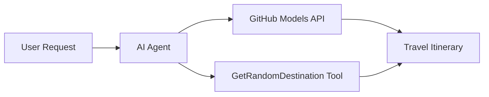

<!--
CO_OP_TRANSLATOR_METADATA:
{
  "original_hash": "5f351412e934f0833c8c821a0a60efaf",
  "translation_date": "2025-11-13T12:47:40+00:00",
  "source_file": "01-intro-to-ai-agents/code_samples/01-dotnet-agent-framework.md",
  "language_code": "da"
}
-->
# 🌍 AI Rejseagent med Microsoft Agent Framework (.NET)

## 📋 Scenarieoversigt

Dette eksempel viser, hvordan man opbygger en intelligent rejseplanlægningsagent ved hjælp af Microsoft Agent Framework for .NET. Agenten kan automatisk generere personlige dagsrejseplaner for tilfældige destinationer rundt om i verden.

### Nøglefunktioner:

- 🎲 **Tilfældig destinationsvalg**: Bruger et specialværktøj til at vælge feriesteder
- 🗺️ **Intelligent rejseplanlægning**: Skaber detaljerede dagsplaner
- 🔄 **Streaming i realtid**: Understøtter både øjeblikkelige og streamede svar
- 🛠️ **Integration af specialværktøj**: Viser, hvordan man udvider agentens funktioner

## 🔧 Teknisk arkitektur

### Kerne-teknologier

- **Microsoft Agent Framework**: Seneste .NET-implementering til udvikling af AI-agenter
- **GitHub Models Integration**: Bruger GitHubs AI-model inferenstjeneste
- **OpenAI API-kompatibilitet**: Udnytter OpenAI-klientbiblioteker med brugerdefinerede endpoints
- **Sikker konfiguration**: Miljøbaseret API-nøglehåndtering

### Centrale komponenter

1. **AIAgent**: Den primære agentorkestrator, der håndterer samtaleflow
2. **Specialværktøjer**: `GetRandomDestination()`-funktionen tilgængelig for agenten
3. **Chatklient**: GitHub Models-baseret samtalegrænseflade
4. **Streaming-understøttelse**: Evne til at generere svar i realtid

### Integrationsmønster



## 🚀 Kom godt i gang

### Forudsætninger

- [.NET 10 SDK](https://dotnet.microsoft.com/download/dotnet/10.0) eller nyere
- [GitHub Models API adgangstoken](https://docs.github.com/github-models/github-models-at-scale/using-your-own-api-keys-in-github-models)

### Påkrævede miljøvariabler

```bash
# zsh/bash
export GH_TOKEN=<your_github_token>
export GH_ENDPOINT=https://models.github.ai/inference
export GH_MODEL_ID=openai/gpt-5-mini
```

```powershell
# PowerShell
$env:GH_TOKEN = "<your_github_token>"
$env:GH_ENDPOINT = "https://models.github.ai/inference"
$env:GH_MODEL_ID = "openai/gpt-5-mini"
```

### Eksempelkode

For at køre kodeeksemplet,

```bash
# zsh/bash
chmod +x ./01-dotnet-agent-framework.cs
./01-dotnet-agent-framework.cs
```

Eller ved hjælp af dotnet CLI:

```bash
dotnet run ./01-dotnet-agent-framework.cs
```

Se [`01-dotnet-agent-framework.cs`](../../../../01-intro-to-ai-agents/code_samples/01-dotnet-agent-framework.cs) for den komplette kode.

```csharp
#!/usr/bin/dotnet run

#:package Microsoft.Extensions.AI@9.*
#:package Microsoft.Agents.AI.OpenAI@1.*-*

using System.ClientModel;
using System.ComponentModel;

using Microsoft.Agents.AI;
using Microsoft.Extensions.AI;

using OpenAI;

// Tool Function: Random Destination Generator
// This static method will be available to the agent as a callable tool
// The [Description] attribute helps the AI understand when to use this function
// This demonstrates how to create custom tools for AI agents
[Description("Provides a random vacation destination.")]
static string GetRandomDestination()
{
    // List of popular vacation destinations around the world
    // The agent will randomly select from these options
    var destinations = new List<string>
    {
        "Paris, France",
        "Tokyo, Japan",
        "New York City, USA",
        "Sydney, Australia",
        "Rome, Italy",
        "Barcelona, Spain",
        "Cape Town, South Africa",
        "Rio de Janeiro, Brazil",
        "Bangkok, Thailand",
        "Vancouver, Canada"
    };

    // Generate random index and return selected destination
    // Uses System.Random for simple random selection
    var random = new Random();
    int index = random.Next(destinations.Count);
    return destinations[index];
}

// Extract configuration from environment variables
// Retrieve the GitHub Models API endpoint, defaults to https://models.github.ai/inference if not specified
// Retrieve the model ID, defaults to openai/gpt-5-mini if not specified
// Retrieve the GitHub token for authentication, throws exception if not specified
var github_endpoint = Environment.GetEnvironmentVariable("GH_ENDPOINT") ?? "https://models.github.ai/inference";
var github_model_id = Environment.GetEnvironmentVariable("GH_MODEL_ID") ?? "openai/gpt-5-mini";
var github_token = Environment.GetEnvironmentVariable("GH_TOKEN") ?? throw new InvalidOperationException("GH_TOKEN is not set.");

// Configure OpenAI Client Options
// Create configuration options to point to GitHub Models endpoint
// This redirects OpenAI client calls to GitHub's model inference service
var openAIOptions = new OpenAIClientOptions()
{
    Endpoint = new Uri(github_endpoint)
};

// Initialize OpenAI Client with GitHub Models Configuration
// Create OpenAI client using GitHub token for authentication
// Configure it to use GitHub Models endpoint instead of OpenAI directly
var openAIClient = new OpenAIClient(new ApiKeyCredential(github_token), openAIOptions);

// Create AI Agent with Travel Planning Capabilities
// Initialize OpenAI client, get chat client for specified model, and create AI agent
// Configure agent with travel planning instructions and random destination tool
// The agent can now plan trips using the GetRandomDestination function
AIAgent agent = openAIClient
    .GetChatClient(github_model_id)
    .CreateAIAgent(
        instructions: "You are a helpful AI Agent that can help plan vacations for customers at random destinations",
        tools: [AIFunctionFactory.Create(GetRandomDestination)]
    );

// Execute Agent: Plan a Day Trip
// Run the agent with streaming enabled for real-time response display
// Shows the agent's thinking and response as it generates the content
// Provides better user experience with immediate feedback
await foreach (var update in agent.RunStreamingAsync("Plan me a day trip"))
{
    await Task.Delay(10);
    Console.Write(update);
}
```

## 🎓 Vigtige pointer

1. **Agentarkitektur**: Microsoft Agent Framework giver en ren, type-sikker tilgang til at bygge AI-agenter i .NET
2. **Værktøjsintegration**: Funktioner dekoreret med `[Description]` attributter bliver tilgængelige værktøjer for agenten
3. **Konfigurationshåndtering**: Miljøvariabler og sikker håndtering af legitimationsoplysninger følger .NET bedste praksis
4. **OpenAI-kompatibilitet**: GitHub Models integration fungerer problemfrit via OpenAI-kompatible API'er

## 🔗 Yderligere ressourcer

- [Microsoft Agent Framework Dokumentation](https://learn.microsoft.com/agent-framework)
- [GitHub Models Marketplace](https://github.com/marketplace?type=models)
- [Microsoft.Extensions.AI](https://learn.microsoft.com/dotnet/ai/microsoft-extensions-ai)
- [.NET Single File Apps](https://devblogs.microsoft.com/dotnet/announcing-dotnet-run-app)

---

<!-- CO-OP TRANSLATOR DISCLAIMER START -->
**Ansvarsfraskrivelse**:  
Dette dokument er blevet oversat ved hjælp af AI-oversættelsestjenesten [Co-op Translator](https://github.com/Azure/co-op-translator). Selvom vi bestræber os på nøjagtighed, skal det bemærkes, at automatiserede oversættelser kan indeholde fejl eller unøjagtigheder. Det originale dokument på dets oprindelige sprog bør betragtes som den autoritative kilde. For kritisk information anbefales professionel menneskelig oversættelse. Vi er ikke ansvarlige for eventuelle misforståelser eller fejltolkninger, der opstår som følge af brugen af denne oversættelse.
<!-- CO-OP TRANSLATOR DISCLAIMER END -->