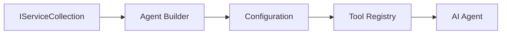

<!--
CO_OP_TRANSLATOR_METADATA:
{
  "original_hash": "bcc874e190347bd6a095aed56dc16de8",
  "translation_date": "2025-11-13T12:51:45+00:00",
  "source_file": "03-agentic-design-patterns/code_samples/03-dotnet-agent-framework.md",
  "language_code": "da"
}
-->
# 🎨 Agentiske Designmønstre med GitHub-modeller (.NET)

## 📋 Læringsmål

Dette eksempel demonstrerer designmønstre i virksomhedsklasse til opbygning af intelligente agenter ved hjælp af Microsoft Agent Framework i .NET med integration af GitHub-modeller. Du vil lære professionelle mønstre og arkitektoniske tilgange, der gør agenter klar til produktion, vedligeholdelsesvenlige og skalerbare.

### Designmønstre for virksomheder

- 🏭 **Factory Pattern**: Standardiseret agentoprettelse med dependency injection
- 🔧 **Builder Pattern**: Flydende agentkonfiguration og opsætning
- 🧵 **Thread-Safe Patterns**: Samtidig samtalestyring
- 📋 **Repository Pattern**: Organiseret værktøjs- og kapabilitetsstyring

## 🎯 .NET-specifikke arkitektoniske fordele

### Funktioner til virksomheder

- **Stærk typning**: Validering ved kompilering og IntelliSense-support
- **Dependency Injection**: Indbygget DI-containerintegration
- **Konfigurationsstyring**: IConfiguration og Options-mønstre
- **Async/Await**: Førsteklasses understøttelse af asynkron programmering

### Produktionsklare mønstre

- **Logningsintegration**: ILogger og struktureret logningssupport
- **Sundhedstjek**: Indbygget overvågning og diagnostik
- **Konfigurationsvalidering**: Stærk typning med dataannoteringer
- **Fejlhåndtering**: Struktureret undtagelseshåndtering

## 🔧 Teknisk arkitektur

### Kernekomponenter i .NET

- **Microsoft.Extensions.AI**: Enhedlige AI-serviceabstraktioner
- **Microsoft.Agents.AI**: Enterprise-agent orkestreringsframework
- **GitHub Models Integration**: Højtydende API-klientmønstre
- **Konfigurationssystem**: appsettings.json og miljøintegration

### Implementering af designmønstre



## 🏗️ Demonstrerede virksomhedsmønstre

### 1. **Skabelsesmønstre**

- **Agent Factory**: Centraliseret agentoprettelse med ensartet konfiguration
- **Builder Pattern**: Flydende API til kompleks agentkonfiguration
- **Singleton Pattern**: Delte ressourcer og konfigurationsstyring
- **Dependency Injection**: Løs kobling og testbarhed

### 2. **Adfærdsmønstre**

- **Strategy Pattern**: Udskiftelige værktøjsudførelsesstrategier
- **Command Pattern**: Indkapslede agentoperationer med fortryd/gendan
- **Observer Pattern**: Hændelsesdrevet agentlivscyklusstyring
- **Template Method**: Standardiserede agentudførelsesarbejdsgange

### 3. **Strukturelle mønstre**

- **Adapter Pattern**: GitHub Models API-integrationslag
- **Decorator Pattern**: Forbedring af agentkapabiliteter
- **Facade Pattern**: Forenklede agentinteraktionsgrænseflader
- **Proxy Pattern**: Lazy loading og caching for ydeevne

## 📚 .NET designprincipper

### SOLID-principper

- **Single Responsibility**: Hver komponent har ét klart formål
- **Open/Closed**: Udvidelig uden modifikation
- **Liskov Substitution**: Interface-baserede værktøjsimplementeringer
- **Interface Segregation**: Fokuserede, sammenhængende grænseflader
- **Dependency Inversion**: Afhæng af abstraktioner, ikke konkretiseringer

### Ren arkitektur

- **Domænelag**: Kerneagent- og værktøjsabstraktioner
- **Applikationslag**: Agentorkestrering og arbejdsgange
- **Infrastrukturlag**: GitHub Models integration og eksterne tjenester
- **Præsentationslag**: Brugerinteraktion og responsformatering

## 🔒 Overvejelser for virksomheder

### Sikkerhed

- **Credential Management**: Sikker håndtering af API-nøgler med IConfiguration
- **Inputvalidering**: Stærk typning og validering med dataannoteringer
- **Outputsanitering**: Sikker responsbehandling og filtrering
- **Audit Logging**: Omfattende sporingsoperationer

### Ydeevne

- **Async Patterns**: Ikke-blokerende I/O-operationer
- **Connection Pooling**: Effektiv HTTP-klientstyring
- **Caching**: Responscaching for forbedret ydeevne
- **Ressourcestyring**: Korrekt bortskaffelse og oprydningsmønstre

### Skalerbarhed

- **Thread Safety**: Understøttelse af samtidig agentudførelse
- **Resource Pooling**: Effektiv ressourceudnyttelse
- **Load Management**: Hastighedsbegrænsning og håndtering af modtryk
- **Monitoring**: Ydeevnemålinger og sundhedstjek

## 🚀 Produktionsudrulning

- **Konfigurationsstyring**: Miljøspecifikke indstillinger
- **Logningsstrategi**: Struktureret logning med korrelations-ID'er
- **Fejlhåndtering**: Global undtagelseshåndtering med korrekt genopretning
- **Overvågning**: Application Insights og ydeevnetællere
- **Testning**: Enhedstest, integrationstest og belastningstestmønstre

Klar til at bygge intelligente agenter i virksomhedsklasse med .NET? Lad os arkitektere noget robust! 🏢✨

## 🚀 Kom godt i gang

### Forudsætninger

- [.NET 10 SDK](https://dotnet.microsoft.com/download/dotnet/10.0) eller nyere
- [GitHub Models API adgangstoken](https://docs.github.com/github-models/github-models-at-scale/using-your-own-api-keys-in-github-models)

### Påkrævede miljøvariabler

```bash
# zsh/bash
export GH_TOKEN=<your_github_token>
export GH_ENDPOINT=https://models.github.ai/inference
export GH_MODEL_ID=openai/gpt-5-mini
```

```powershell
# PowerShell
$env:GH_TOKEN = "<your_github_token>"
$env:GH_ENDPOINT = "https://models.github.ai/inference"
$env:GH_MODEL_ID = "openai/gpt-5-mini"
```

### Eksempelkode

For at køre kodeeksemplet,

```bash
# zsh/bash
chmod +x ./03-dotnet-agent-framework.cs
./03-dotnet-agent-framework.cs
```

Eller ved hjælp af dotnet CLI:

```bash
dotnet run ./03-dotnet-agent-framework.cs
```

Se [`03-dotnet-agent-framework.cs`](../../../../03-agentic-design-patterns/code_samples/03-dotnet-agent-framework.cs) for den komplette kode.

```csharp
#!/usr/bin/dotnet run

#:package Microsoft.Extensions.AI@10.*
#:package Microsoft.Agents.AI.OpenAI@1.*-*

using System.ClientModel;
using System.ComponentModel;

using Microsoft.Agents.AI;
using Microsoft.Extensions.AI;

using OpenAI;

// Tool Function: Random Destination Generator
// This static method will be available to the agent as a callable tool
// The [Description] attribute helps the AI understand when to use this function
// This demonstrates how to create custom tools for AI agents
[Description("Provides a random vacation destination.")]
static string GetRandomDestination()
{
    // List of popular vacation destinations around the world
    // The agent will randomly select from these options
    var destinations = new List<string>
    {
        "Paris, France",
        "Tokyo, Japan",
        "New York City, USA",
        "Sydney, Australia",
        "Rome, Italy",
        "Barcelona, Spain",
        "Cape Town, South Africa",
        "Rio de Janeiro, Brazil",
        "Bangkok, Thailand",
        "Vancouver, Canada"
    };

    // Generate random index and return selected destination
    // Uses System.Random for simple random selection
    var random = new Random();
    int index = random.Next(destinations.Count);
    return destinations[index];
}

// Extract configuration from environment variables
// Retrieve the GitHub Models API endpoint, defaults to https://models.github.ai/inference if not specified
// Retrieve the model ID, defaults to openai/gpt-5-mini if not specified
// Retrieve the GitHub token for authentication, throws exception if not specified
var github_endpoint = Environment.GetEnvironmentVariable("GH_ENDPOINT") ?? "https://models.github.ai/inference";
var github_model_id = Environment.GetEnvironmentVariable("GH_MODEL_ID") ?? "openai/gpt-5-mini";
var github_token = Environment.GetEnvironmentVariable("GH_TOKEN") ?? throw new InvalidOperationException("GH_TOKEN is not set.");

// Configure OpenAI Client Options
// Create configuration options to point to GitHub Models endpoint
// This redirects OpenAI client calls to GitHub's model inference service
var openAIOptions = new OpenAIClientOptions()
{
    Endpoint = new Uri(github_endpoint)
};

// Initialize OpenAI Client with GitHub Models Configuration
// Create OpenAI client using GitHub token for authentication
// Configure it to use GitHub Models endpoint instead of OpenAI directly
var openAIClient = new OpenAIClient(new ApiKeyCredential(github_token), openAIOptions);

// Define Agent Identity and Comprehensive Instructions
// Agent name for identification and logging purposes
var AGENT_NAME = "TravelAgent";

// Detailed instructions that define the agent's personality, capabilities, and behavior
// This system prompt shapes how the agent responds and interacts with users
var AGENT_INSTRUCTIONS = """
You are a helpful AI Agent that can help plan vacations for customers.

Important: When users specify a destination, always plan for that location. Only suggest random destinations when the user hasn't specified a preference.

When the conversation begins, introduce yourself with this message:
"Hello! I'm your TravelAgent assistant. I can help plan vacations and suggest interesting destinations for you. Here are some things you can ask me:
1. Plan a day trip to a specific location
2. Suggest a random vacation destination
3. Find destinations with specific features (beaches, mountains, historical sites, etc.)
4. Plan an alternative trip if you don't like my first suggestion

What kind of trip would you like me to help you plan today?"

Always prioritize user preferences. If they mention a specific destination like "Bali" or "Paris," focus your planning on that location rather than suggesting alternatives.
""";

// Create AI Agent with Advanced Travel Planning Capabilities
// Initialize complete agent pipeline: OpenAI client → Chat client → AI agent
// Configure agent with name, detailed instructions, and available tools
// This demonstrates the .NET agent creation pattern with full configuration
AIAgent agent = openAIClient
    .GetChatClient(github_model_id)
    .CreateAIAgent(
        name: AGENT_NAME,
        instructions: AGENT_INSTRUCTIONS,
        tools: [AIFunctionFactory.Create(GetRandomDestination)]
    );

// Create New Conversation Thread for Context Management
// Initialize a new conversation thread to maintain context across multiple interactions
// Threads enable the agent to remember previous exchanges and maintain conversational state
// This is essential for multi-turn conversations and contextual understanding
AgentThread thread = agent.GetNewThread();

// Execute Agent: First Travel Planning Request
// Run the agent with an initial request that will likely trigger the random destination tool
// The agent will analyze the request, use the GetRandomDestination tool, and create an itinerary
// Using the thread parameter maintains conversation context for subsequent interactions
await foreach (var update in agent.RunStreamingAsync("Plan me a day trip", thread))
{
    await Task.Delay(10);
    Console.Write(update);
}

Console.WriteLine();

// Execute Agent: Follow-up Request with Context Awareness
// Demonstrate contextual conversation by referencing the previous response
// The agent remembers the previous destination suggestion and will provide an alternative
// This showcases the power of conversation threads and contextual understanding in .NET agents
await foreach (var update in agent.RunStreamingAsync("I don't like that destination. Plan me another vacation.", thread))
{
    await Task.Delay(10);
    Console.Write(update);
}
```

---

<!-- CO-OP TRANSLATOR DISCLAIMER START -->
**Ansvarsfraskrivelse**:  
Dette dokument er blevet oversat ved hjælp af AI-oversættelsestjenesten [Co-op Translator](https://github.com/Azure/co-op-translator). Selvom vi bestræber os på nøjagtighed, skal det bemærkes, at automatiserede oversættelser kan indeholde fejl eller unøjagtigheder. Det originale dokument på dets oprindelige sprog bør betragtes som den autoritative kilde. For kritisk information anbefales professionel menneskelig oversættelse. Vi er ikke ansvarlige for eventuelle misforståelser eller fejltolkninger, der opstår som følge af brugen af denne oversættelse.
<!-- CO-OP TRANSLATOR DISCLAIMER END -->