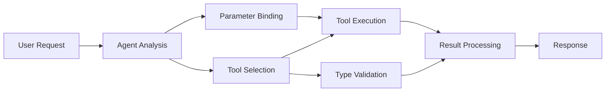

<!--
CO_OP_TRANSLATOR_METADATA:
{
  "original_hash": "91d6061e402489603f2ec8b528cae59b",
  "translation_date": "2025-11-18T17:42:04+00:00",
  "source_file": "04-tool-use/code_samples/04-dotnet-agent-framework.md",
  "language_code": "da"
}
-->
# 🛠️ Avanceret værktøjsbrug med GitHub-modeller (.NET)

## 📋 Læringsmål

Denne notebook demonstrerer mønstre for integration af værktøjer på virksomhedsniveau ved hjælp af Microsoft Agent Framework i .NET med GitHub-modeller. Du vil lære at bygge sofistikerede agenter med flere specialiserede værktøjer, der udnytter C#'s stærke typning og .NET's virksomhedsfunktioner.

### Avancerede værktøjsfunktioner, du vil mestre

- 🔧 **Multi-værktøjsarkitektur**: Bygge agenter med flere specialiserede funktioner
- 🎯 **Type-sikker værktøjsudførelse**: Udnytte C#'s validering ved kompilering
- 📊 **Virksomhedsværktøjsmønstre**: Produktionsklare værktøjsdesign og fejlhåndtering
- 🔗 **Værktøjssammensætning**: Kombinere værktøjer til komplekse forretningsarbejdsgange

## 🎯 Fordele ved .NET-værktøjsarkitektur

### Funktioner på virksomhedsniveau

- **Validering ved kompilering**: Stærk typning sikrer korrekthed af værktøjsparametre
- **Dependency Injection**: IoC-containerintegration til værktøjsstyring
- **Async/Await-mønstre**: Ikke-blokerende værktøjsudførelse med korrekt ressourcehåndtering
- **Struktureret logning**: Indbygget logningsintegration til overvågning af værktøjsudførelse

### Produktionsklare mønstre

- **Fejlhåndtering**: Omfattende fejlhåndtering med typede undtagelser
- **Ressourcehåndtering**: Korrekte mønstre for bortskaffelse og hukommelseshåndtering
- **Ydelsesovervågning**: Indbyggede metrikker og ydelsestællere
- **Konfigurationsstyring**: Type-sikker konfiguration med validering

## 🔧 Teknisk arkitektur

### Centrale .NET-værktøjskomponenter

- **Microsoft.Extensions.AI**: Enhedslag for værktøjsabstraktion
- **Microsoft.Agents.AI**: Værktøjsorkestrering på virksomhedsniveau
- **GitHub-modeller integration**: Højtydende API-klient med forbindelsespulje

### Værktøjsudførelsespipeline



## 🛠️ Værktøjskategorier og mønstre

### 1. **Databehandlingsværktøjer**

- **Inputvalidering**: Stærk typning med dataannoteringer
- **Transformationsoperationer**: Type-sikker datakonvertering og formatering
- **Forretningslogik**: Domænespecifikke beregnings- og analysetools
- **Outputformatering**: Generering af strukturerede svar

### 2. **Integrationsværktøjer**

- **API-forbindelser**: RESTful serviceintegration med HttpClient
- **Databaseværktøjer**: Entity Framework-integration til dataadgang
- **Filoperationer**: Sikker filsystemhåndtering med validering
- **Eksterne tjenester**: Mønstre for integration af tredjepartstjenester

### 3. **Hjælpeværktøjer**

- **Tekstbehandling**: Strengmanipulation og formateringsværktøjer
- **Dato-/tidsoperationer**: Kulturbevidste dato-/tidsberegninger
- **Matematiske værktøjer**: Præcisionsberegninger og statistiske operationer
- **Valideringsværktøjer**: Validering af forretningsregler og dataverifikation

Klar til at bygge agenter på virksomhedsniveau med kraftfulde, type-sikre værktøjsfunktioner i .NET? Lad os designe nogle professionelle løsninger! 🏢⚡

## 🚀 Kom godt i gang

### Forudsætninger

- [.NET 10 SDK](https://dotnet.microsoft.com/download/dotnet/10.0) eller nyere
- [GitHub Models API-adgangstoken](https://docs.github.com/github-models/github-models-at-scale/using-your-own-api-keys-in-github-models)

### Påkrævede miljøvariabler

```bash
# zsh/bash
export GH_TOKEN=<your_github_token>
export GH_ENDPOINT=https://models.github.ai/inference
export GH_MODEL_ID=openai/gpt-5-mini
```

```powershell
# PowerShell
$env:GH_TOKEN = "<your_github_token>"
$env:GH_ENDPOINT = "https://models.github.ai/inference"
$env:GH_MODEL_ID = "openai/gpt-5-mini"
```

### Eksempelkode

For at køre kodeeksemplet,

```bash
# zsh/bash
chmod +x ./04-dotnet-agent-framework.cs
./04-dotnet-agent-framework.cs
```

Eller ved hjælp af dotnet CLI:

```bash
dotnet run ./04-dotnet-agent-framework.cs
```

Se [`04-dotnet-agent-framework.cs`](../../../../04-tool-use/code_samples/04-dotnet-agent-framework.cs) for den komplette kode.

```csharp
#!/usr/bin/dotnet run

#:package Microsoft.Extensions.AI@10.*
#:package Microsoft.Agents.AI.OpenAI@1.*-*

using System.ClientModel;
using System.ComponentModel;

using Microsoft.Agents.AI;
using Microsoft.Extensions.AI;

using OpenAI;

// Tool Function: Random Destination Generator
// This static method will be available to the agent as a callable tool
// The [Description] attribute helps the AI understand when to use this function
// This demonstrates how to create custom tools for AI agents
[Description("Provides a random vacation destination.")]
static string GetRandomDestination()
{
    // List of popular vacation destinations around the world
    // The agent will randomly select from these options
    var destinations = new List<string>
    {
        "Paris, France",
        "Tokyo, Japan",
        "New York City, USA",
        "Sydney, Australia",
        "Rome, Italy",
        "Barcelona, Spain",
        "Cape Town, South Africa",
        "Rio de Janeiro, Brazil",
        "Bangkok, Thailand",
        "Vancouver, Canada"
    };

    // Generate random index and return selected destination
    // Uses System.Random for simple random selection
    var random = new Random();
    int index = random.Next(destinations.Count);
    return destinations[index];
}

// Extract configuration from environment variables
// Retrieve the GitHub Models API endpoint, defaults to https://models.github.ai/inference if not specified
// Retrieve the model ID, defaults to openai/gpt-5-mini if not specified
// Retrieve the GitHub token for authentication, throws exception if not specified
var github_endpoint = Environment.GetEnvironmentVariable("GH_ENDPOINT") ?? "https://models.github.ai/inference";
var github_model_id = Environment.GetEnvironmentVariable("GH_MODEL_ID") ?? "openai/gpt-5-mini";
var github_token = Environment.GetEnvironmentVariable("GH_TOKEN") ?? throw new InvalidOperationException("GH_TOKEN is not set.");

// Configure OpenAI Client Options
// Create configuration options to point to GitHub Models endpoint
// This redirects OpenAI client calls to GitHub's model inference service
var openAIOptions = new OpenAIClientOptions()
{
    Endpoint = new Uri(github_endpoint)
};

// Initialize OpenAI Client with GitHub Models Configuration
// Create OpenAI client using GitHub token for authentication
// Configure it to use GitHub Models endpoint instead of OpenAI directly
var openAIClient = new OpenAIClient(new ApiKeyCredential(github_token), openAIOptions);

// Define Agent Identity and Comprehensive Instructions
// Agent name for identification and logging purposes
var AGENT_NAME = "TravelAgent";

// Detailed instructions that define the agent's personality, capabilities, and behavior
// This system prompt shapes how the agent responds and interacts with users
var AGENT_INSTRUCTIONS = """
You are a helpful AI Agent that can help plan vacations for customers.

Important: When users specify a destination, always plan for that location. Only suggest random destinations when the user hasn't specified a preference.

When the conversation begins, introduce yourself with this message:
"Hello! I'm your TravelAgent assistant. I can help plan vacations and suggest interesting destinations for you. Here are some things you can ask me:
1. Plan a day trip to a specific location
2. Suggest a random vacation destination
3. Find destinations with specific features (beaches, mountains, historical sites, etc.)
4. Plan an alternative trip if you don't like my first suggestion

What kind of trip would you like me to help you plan today?"

Always prioritize user preferences. If they mention a specific destination like "Bali" or "Paris," focus your planning on that location rather than suggesting alternatives.
""";

// Create AI Agent with Advanced Travel Planning Capabilities
// Initialize complete agent pipeline: OpenAI client → Chat client → AI agent
// Configure agent with name, detailed instructions, and available tools
// This demonstrates the .NET agent creation pattern with full configuration
AIAgent agent = openAIClient
    .GetChatClient(github_model_id)
    .CreateAIAgent(
        name: AGENT_NAME,
        instructions: AGENT_INSTRUCTIONS,
        tools: [AIFunctionFactory.Create(GetRandomDestination)]
    );

// Create New Conversation Thread for Context Management
// Initialize a new conversation thread to maintain context across multiple interactions
// Threads enable the agent to remember previous exchanges and maintain conversational state
// This is essential for multi-turn conversations and contextual understanding
AgentThread thread = agent.GetNewThread();

// Execute Agent: First Travel Planning Request
// Run the agent with an initial request that will likely trigger the random destination tool
// The agent will analyze the request, use the GetRandomDestination tool, and create an itinerary
// Using the thread parameter maintains conversation context for subsequent interactions
await foreach (var update in agent.RunStreamingAsync("Plan me a day trip", thread))
{
    await Task.Delay(10);
    Console.Write(update);
}

Console.WriteLine();

// Execute Agent: Follow-up Request with Context Awareness
// Demonstrate contextual conversation by referencing the previous response
// The agent remembers the previous destination suggestion and will provide an alternative
// This showcases the power of conversation threads and contextual understanding in .NET agents
await foreach (var update in agent.RunStreamingAsync("I don't like that destination. Plan me another vacation.", thread))
{
    await Task.Delay(10);
    Console.Write(update);
}
```

---

<!-- CO-OP TRANSLATOR DISCLAIMER START -->
**Ansvarsfraskrivelse**:  
Dette dokument er blevet oversat ved hjælp af AI-oversættelsestjenesten [Co-op Translator](https://github.com/Azure/co-op-translator). Selvom vi bestræber os på nøjagtighed, skal det bemærkes, at automatiserede oversættelser kan indeholde fejl eller unøjagtigheder. Det originale dokument på dets oprindelige sprog bør betragtes som den autoritative kilde. For kritisk information anbefales professionel menneskelig oversættelse. Vi er ikke ansvarlige for misforståelser eller fejltolkninger, der opstår som følge af brugen af denne oversættelse.
<!-- CO-OP TRANSLATOR DISCLAIMER END -->