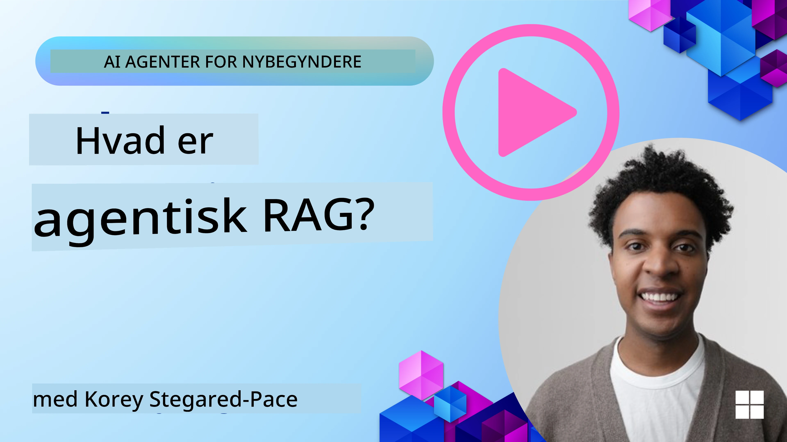
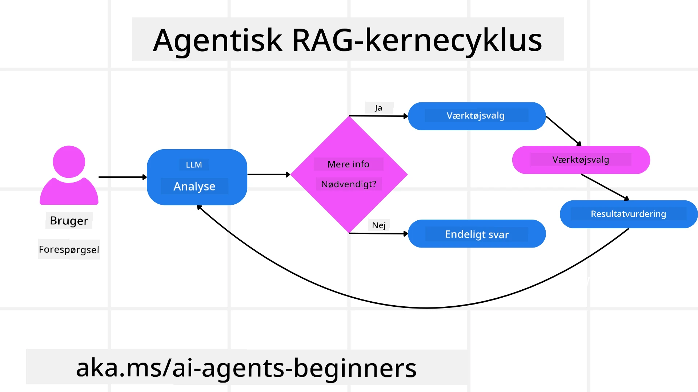
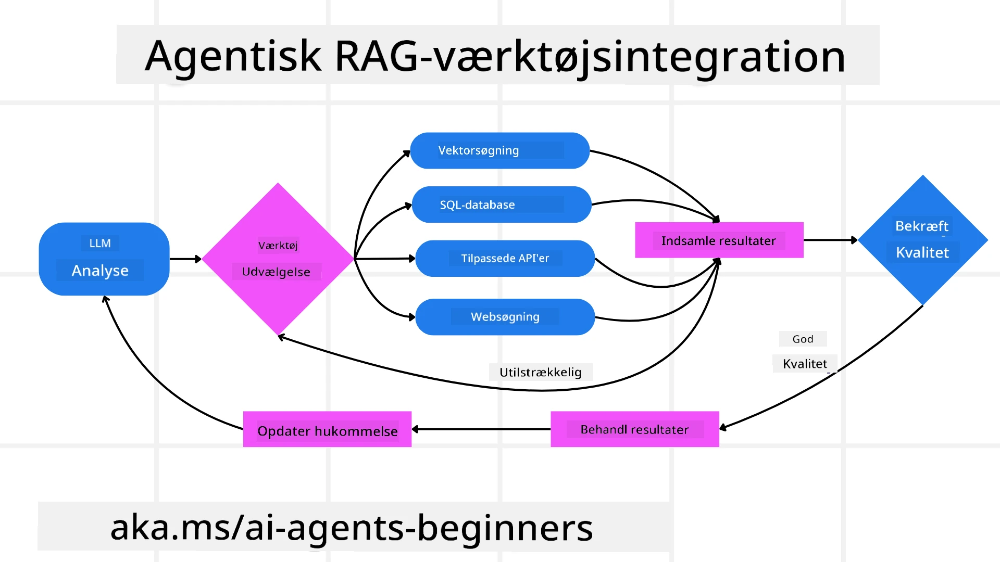
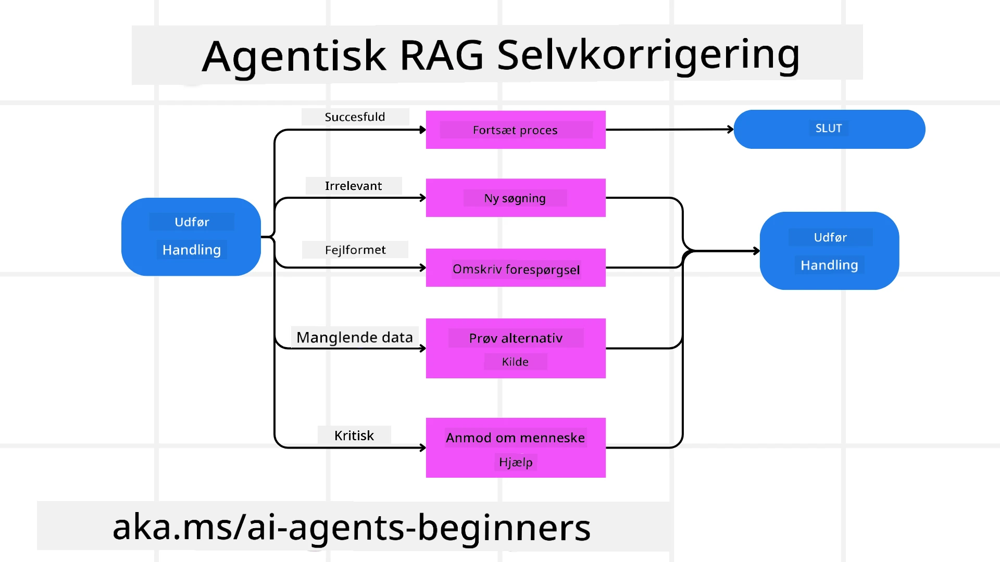
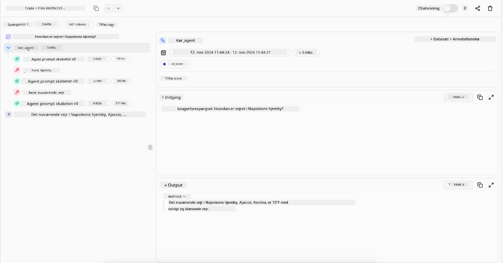

<!--
CO_OP_TRANSLATOR_METADATA:
{
  "original_hash": "0ebf6b2290db55dbf2d10cc49655523b",
  "translation_date": "2025-09-30T07:14:39+00:00",
  "source_file": "05-agentic-rag/README.md",
  "language_code": "da"
}
-->

> _(Klik på billedet ovenfor for at se videoen til denne lektion)_

# Agentic RAG

Denne lektion giver en omfattende introduktion til Agentic Retrieval-Augmented Generation (Agentic RAG), et nyt AI-paradigme, hvor store sprogmodeller (LLMs) autonomt planlægger deres næste skridt, mens de henter information fra eksterne kilder. I modsætning til statiske mønstre med "hent og læs" involverer Agentic RAG iterative kald til LLM, afbrudt af værktøjs- eller funktionskald og strukturerede outputs. Systemet evaluerer resultater, forfiner forespørgsler, anvender yderligere værktøjer efter behov og fortsætter denne cyklus, indtil en tilfredsstillende løsning er opnået.

## Introduktion

Denne lektion vil dække:

- **Forstå Agentic RAG:** Lær om det nye AI-paradigme, hvor store sprogmodeller (LLMs) autonomt planlægger deres næste skridt, mens de henter information fra eksterne datakilder.
- **Forstå Iterativ Maker-Checker Stil:** Forstå loopet af iterative kald til LLM, afbrudt af værktøjs- eller funktionskald og strukturerede outputs, designet til at forbedre korrekthed og håndtere fejlbehæftede forespørgsler.
- **Udforsk praktiske anvendelser:** Identificer scenarier, hvor Agentic RAG udmærker sig, såsom miljøer med fokus på korrekthed, komplekse databaseinteraktioner og udvidede arbejdsgange.

## Læringsmål

Efter at have gennemført denne lektion vil du kunne/forstå:

- **Forstå Agentic RAG:** Lær om det nye AI-paradigme, hvor store sprogmodeller (LLMs) autonomt planlægger deres næste skridt, mens de henter information fra eksterne datakilder.
- **Iterativ Maker-Checker Stil:** Forstå konceptet med et loop af iterative kald til LLM, afbrudt af værktøjs- eller funktionskald og strukturerede outputs, designet til at forbedre korrekthed og håndtere fejlbehæftede forespørgsler.
- **Ejerskab over beslutningsprocessen:** Forstå systemets evne til at tage ejerskab over sin beslutningsproces og træffe beslutninger om, hvordan problemer skal tackles uden at være afhængig af foruddefinerede veje.
- **Arbejdsgang:** Forstå, hvordan en agentisk model selvstændigt beslutter at hente markedsrapportering, identificere konkurrentdata, korrelere interne salgsmetrikker, syntetisere resultater og evaluere strategien.
- **Iterative loops, værktøjsintegration og hukommelse:** Lær om systemets afhængighed af et loopet interaktionsmønster, der opretholder tilstand og hukommelse på tværs af trin for at undgå gentagelser og træffe informerede beslutninger.
- **Håndtering af fejltilstande og selvkorrektion:** Udforsk systemets robuste selvkorrektionsmekanismer, herunder iteration og genforespørgsel, brug af diagnostiske værktøjer og tilbagefald til menneskelig overvågning.
- **Grænser for autonomi:** Forstå begrænsningerne ved Agentic RAG med fokus på domænespecifik autonomi, afhængighed af infrastruktur og respekt for sikkerhedsforanstaltninger.
- **Praktiske anvendelser og værdi:** Identificer scenarier, hvor Agentic RAG udmærker sig, såsom miljøer med fokus på korrekthed, komplekse databaseinteraktioner og udvidede arbejdsgange.
- **Styring, gennemsigtighed og tillid:** Lær om vigtigheden af styring og gennemsigtighed, herunder forklarlige beslutninger, kontrol af bias og menneskelig overvågning.

## Hvad er Agentic RAG?

Agentic Retrieval-Augmented Generation (Agentic RAG) er et nyt AI-paradigme, hvor store sprogmodeller (LLMs) autonomt planlægger deres næste skridt, mens de henter information fra eksterne kilder. I modsætning til statiske mønstre med "hent og læs" involverer Agentic RAG iterative kald til LLM, afbrudt af værktøjs- eller funktionskald og strukturerede outputs. Systemet evaluerer resultater, forfiner forespørgsler, anvender yderligere værktøjer efter behov og fortsætter denne cyklus, indtil en tilfredsstillende løsning er opnået. Denne iterative “maker-checker” stil forbedrer korrekthed, håndterer fejlbehæftede forespørgsler og sikrer resultater af høj kvalitet.

Systemet tager aktivt ejerskab over sin beslutningsproces, omskriver fejlede forespørgsler, vælger forskellige metoder til informationshentning og integrerer flere værktøjer—såsom vektorsøgning i Azure AI Search, SQL-databaser eller brugerdefinerede API'er—før det færdiggør sit svar. Det, der adskiller et agentisk system, er dets evne til at tage ejerskab over sin beslutningsproces. Traditionelle RAG-implementeringer er afhængige af foruddefinerede veje, men et agentisk system bestemmer autonomt rækkefølgen af trin baseret på kvaliteten af den information, det finder.

## Definition af Agentic Retrieval-Augmented Generation (Agentic RAG)

Agentic Retrieval-Augmented Generation (Agentic RAG) er et nyt paradigme inden for AI-udvikling, hvor LLMs ikke kun henter information fra eksterne datakilder, men også autonomt planlægger deres næste skridt. I modsætning til statiske mønstre med "hent og læs" eller nøje scriptede promptsekvenser involverer Agentic RAG et loop af iterative kald til LLM, afbrudt af værktøjs- eller funktionskald og strukturerede outputs. Ved hver iteration evaluerer systemet de opnåede resultater, beslutter om forespørgsler skal forfines, anvender yderligere værktøjer efter behov og fortsætter denne cyklus, indtil det opnår en tilfredsstillende løsning.

Denne iterative “maker-checker” stil er designet til at forbedre korrekthed, håndtere fejlbehæftede forespørgsler til strukturerede databaser (f.eks. NL2SQL) og sikre balancerede, resultater af høj kvalitet. I stedet for udelukkende at være afhængig af nøje designede promptkæder tager systemet aktivt ejerskab over sin beslutningsproces. Det kan omskrive forespørgsler, der fejler, vælge forskellige metoder til informationshentning og integrere flere værktøjer—såsom vektorsøgning i Azure AI Search, SQL-databaser eller brugerdefinerede API'er—før det færdiggør sit svar. Dette eliminerer behovet for alt for komplekse orkestreringsrammer. I stedet kan et relativt simpelt loop af “LLM-kald → værktøjsbrug → LLM-kald → …” give sofistikerede og velbegrundede outputs.

## Ejerskab over beslutningsprocessen

Det, der gør et system “agentisk,” er dets evne til at tage ejerskab over sin beslutningsproces. Traditionelle RAG-implementeringer er ofte afhængige af, at mennesker foruddefinerer en vej for modellen: en tankegang, der skitserer, hvad der skal hentes og hvornår. Men når et system er virkelig agentisk, beslutter det internt, hvordan det skal tackle problemet. Det udfører ikke bare et script; det bestemmer autonomt rækkefølgen af trin baseret på kvaliteten af den information, det finder.

For eksempel, hvis det bliver bedt om at skabe en produktlanceringsstrategi, er det ikke kun afhængigt af en prompt, der beskriver hele forsknings- og beslutningsprocessen. I stedet beslutter den agentiske model selvstændigt at:

1. Hente aktuelle markedsrapporteringer ved hjælp af Bing Web Grounding.
2. Identificere relevante konkurrentdata ved hjælp af Azure AI Search.
3. Korrelere historiske interne salgsmetrikker ved hjælp af Azure SQL Database.
4. Syntetisere resultaterne til en sammenhængende strategi orkestreret via Azure OpenAI Service.
5. Evaluere strategien for mangler eller inkonsistenser og igangsætte en ny runde med informationshentning, hvis nødvendigt.

Alle disse trin—forfining af forespørgsler, valg af kilder, iteration indtil modellen er “tilfreds” med svaret—besluttes af modellen og er ikke foruddefineret af en menneskelig bruger.

## Iterative loops, værktøjsintegration og hukommelse

Et agentisk system er afhængigt af et loopet interaktionsmønster:

- **Første kald:** Brugerens mål (dvs. brugerens prompt) præsenteres for LLM.
- **Værktøjsbrug:** Hvis modellen identificerer manglende information eller tvetydige instruktioner, vælger den et værktøj eller en metode til informationshentning—som en vektordatabaseforespørgsel (f.eks. Azure AI Search Hybrid search over privat data) eller et struktureret SQL-kald—for at indsamle mere kontekst.
- **Vurdering og forfining:** Efter at have gennemgået de returnerede data beslutter modellen, om informationen er tilstrækkelig. Hvis ikke, forfiner den forespørgslen, prøver et andet værktøj eller justerer sin tilgang.
- **Gentag indtil tilfreds:** Denne cyklus fortsætter, indtil modellen vurderer, at den har tilstrækkelig klarhed og evidens til at levere et endeligt, velbegrundet svar.
- **Hukommelse og tilstand:** Fordi systemet opretholder tilstand og hukommelse på tværs af trin, kan det huske tidligere forsøg og deres resultater, undgå gentagelser og træffe mere informerede beslutninger, mens det skrider frem.

Over tid skaber dette en følelse af udviklende forståelse, der gør det muligt for modellen at navigere komplekse, flertrinsopgaver uden behov for konstant menneskelig indgriben eller omformning af prompten.

## Håndtering af fejltilstande og selvkorrektion

Agentic RAG’s autonomi indebærer også robuste selvkorrektionsmekanismer. Når systemet støder på blindgyder—såsom at hente irrelevante dokumenter eller støde på fejlbehæftede forespørgsler—kan det:

- **Iterere og genforespørge:** I stedet for at returnere lavværdige svar forsøger modellen nye søgestrategier, omskriver databaseforespørgsler eller undersøger alternative datasæt.
- **Bruge diagnostiske værktøjer:** Systemet kan anvende yderligere funktioner designet til at hjælpe med at debugge sine beslutningstrin eller bekræfte korrektheden af hentede data. Værktøjer som Azure AI Tracing vil være vigtige for at muliggøre robust overvågelighed og monitorering.
- **Tilbagefald til menneskelig overvågning:** For scenarier med høj risiko eller gentagne fejl kan modellen markere usikkerhed og anmode om menneskelig vejledning. Når mennesket giver korrigerende feedback, kan modellen inkorporere den læring fremadrettet.

Denne iterative og dynamiske tilgang gør det muligt for modellen at forbedre sig kontinuerligt, hvilket sikrer, at den ikke bare er et engangssystem, men et system, der lærer af sine fejltrin under en given session.

## Grænser for autonomi

På trods af sin autonomi inden for en opgave er Agentic RAG ikke det samme som kunstig generel intelligens. Dens “agentiske” kapaciteter er begrænset til de værktøjer, datakilder og politikker, der er leveret af menneskelige udviklere. Den kan ikke opfinde sine egne værktøjer eller træde uden for de domænegrænser, der er blevet sat. I stedet udmærker den sig ved dynamisk at orkestrere de ressourcer, der er til rådighed.

Vigtige forskelle fra mere avancerede AI-former inkluderer:

1. **Domænespecifik autonomi:** Agentic RAG-systemer fokuserer på at opnå brugerdefinerede mål inden for et kendt domæne og anvender strategier som omskrivning af forespørgsler eller værktøjsvalg for at forbedre resultater.
2. **Afhængighed af infrastruktur:** Systemets kapaciteter afhænger af de værktøjer og data, der er integreret af udviklere. Det kan ikke overskride disse grænser uden menneskelig indgriben.
3. **Respekt for sikkerhedsforanstaltninger:** Etiske retningslinjer, overholdelsesregler og forretningspolitikker forbliver meget vigtige. Agentens frihed er altid begrænset af sikkerhedsforanstaltninger og overvågningsmekanismer (forhåbentlig?).

## Praktiske anvendelser og værdi

Agentic RAG udmærker sig i scenarier, der kræver iterativ forfining og præcision:

1. **Miljøer med fokus på korrekthed:** Ved overholdelseskontrol, regulatorisk analyse eller juridisk forskning kan den agentiske model gentagne gange verificere fakta, konsultere flere kilder og omskrive forespørgsler, indtil den producerer et grundigt gennemgået svar.
2. **Komplekse databaseinteraktioner:** Når der arbejdes med strukturerede data, hvor forespørgsler ofte kan fejle eller kræve justering, kan systemet autonomt forfine sine forespørgsler ved hjælp af Azure SQL eller Microsoft Fabric OneLake, hvilket sikrer, at den endelige hentning stemmer overens med brugerens intention.
3. **Udvidede arbejdsgange:** Længerevarende sessioner kan udvikle sig, efterhånden som ny information dukker op. Agentic RAG kan løbende inkorporere nye data og ændre strategier, efterhånden som den lærer mere om problemområdet.

## Styring, gennemsigtighed og tillid

Efterhånden som disse systemer bliver mere autonome i deres beslutningstagning, er styring og gennemsigtighed afgørende:

- **Forklarlige beslutninger:** Modellen kan give en revisionsspor af de forespørgsler, den har lavet, de kilder, den har konsulteret, og de beslutningstrin, den har taget for at nå sin konklusion. Værktøjer som Azure AI Content Safety og Azure AI Tracing / GenAIOps kan hjælpe med at opretholde gennemsigtighed og reducere risici.
- **Kontrol af bias og balanceret informationshentning:** Udviklere kan justere hentningsstrategier for at sikre, at balancerede og repræsentative datakilder overvejes, og regelmæssigt gennemgå outputs for at opdage bias eller skæve mønstre ved hjælp af brugerdefinerede modeller for avancerede data science-organisationer, der bruger Azure Machine Learning.
- **Menneskelig overvågning og overholdelse:** For følsomme opgaver forbliver menneskelig gennemgang essentiel. Agentic RAG erstatter ikke menneskelig dømmekraft i beslutninger med høj risiko—den supplerer den ved at levere mere grundigt gennemgåede muligheder.

At have værktøjer, der giver en klar registrering af handlinger, er afgørende. Uden dem kan det være meget vanskeligt at debugge en flertrinsproces. Se følgende eksempel fra Literal AI (firmaet bag Chainlit) for en Agent-run:

## Konklusion

Agentic RAG repræsenterer en naturlig udvikling i, hvordan AI-systemer håndterer komplekse, dataintensive opgaver. Ved at anvende et loopet interaktionsmønster, autonomt vælge værktøjer og forfine forespørgsler, indtil der opnås et resultat af høj kvalitet, bevæger systemet sig ud over statisk prompt-følgen til en mere adaptiv, kontekstbevidst beslutningstager. Selvom det stadig er begrænset af menneskedefinerede infrastrukturer og etiske retningslinjer, muliggør disse agentiske kapaciteter rigere, mere dynamiske og i sidste ende mere nyttige AI-interaktioner for både virksomheder og slutbrugere.

### Har du flere spørgsmål om Agentic RAG?

Deltag i [Azure AI Foundry Discord](https://aka.ms/ai-agents/discord) for at møde andre lærende, deltage i kontortid og få svar på dine spørgsmål om AI-agenter.

## Yderligere ressourcer

- <a href="https://learn.microsoft.com/training/modules/use-own-data-azure-openai" target="_blank">Implementer Retrieval Augmented Generation (RAG) med Azure OpenAI Service: Lær hvordan du bruger dine egne data med Azure OpenAI Service. Denne Microsoft Learn-modul giver en omfattende guide til implementering af RAG</a>
- <a href="https://learn.microsoft.com/azure/ai-studio/concepts/evaluation-approach-gen-ai" target="_blank">Evaluering af generative AI-applikationer med Azure AI Foundry: Denne artikel dækker evaluering og sammenligning af modeller på offentligt tilgængelige datasæt, herunder agentiske AI-applikationer og RAG-arkitekturer</a>
- <a href="https
- <a href="https://ragaboutit.com/agentic-rag-a-complete-guide-to-agent-based-retrieval-augmented-generation/" target="_blank">Agentic RAG: En komplet guide til agentbaseret retrieval-augmented generation – Nyheder fra generation RAG</a>
- <a href="https://huggingface.co/learn/cookbook/agent_rag" target="_blank">Agentic RAG: boost din RAG med forespørgselsreformulering og selv-forespørgsel! Hugging Face Open-Source AI Cookbook</a>
- <a href="https://youtu.be/aQ4yQXeB1Ss?si=2HUqBzHoeB5tR04U" target="_blank">Tilføj agentiske lag til RAG</a>
- <a href="https://www.youtube.com/watch?v=zeAyuLc_f3Q&t=244s" target="_blank">Fremtiden for vidensassistenter: Jerry Liu</a>
- <a href="https://www.youtube.com/watch?v=AOSjiXP1jmQ" target="_blank">Sådan bygger du agentiske RAG-systemer</a>
- <a href="https://ignite.microsoft.com/sessions/BRK102?source=sessions" target="_blank">Brug Azure AI Foundry Agent Service til at skalere dine AI-agenter</a>

### Akademiske artikler

- <a href="https://arxiv.org/abs/2303.17651" target="_blank">2303.17651 Self-Refine: Iterativ forfining med selv-feedback</a>
- <a href="https://arxiv.org/abs/2303.11366" target="_blank">2303.11366 Reflexion: Sproglige agenter med verbal forstærkningslæring</a>
- <a href="https://arxiv.org/abs/2305.11738" target="_blank">2305.11738 CRITIC: Store sprogmodeller kan selvkorrigere med værktøjsinteraktiv kritik</a>
- <a href="https://arxiv.org/abs/2501.09136" target="_blank">2501.09136 Agentic Retrieval-Augmented Generation: En undersøgelse af agentisk RAG</a>

## Forrige lektion

[Designmønster for værktøjsbrug](../04-tool-use/README.md)

## Næste lektion

[Bygning af troværdige AI-agenter](../06-building-trustworthy-agents/README.md)

---

**Ansvarsfraskrivelse**:  
Dette dokument er blevet oversat ved hjælp af AI-oversættelsestjenesten [Co-op Translator](https://github.com/Azure/co-op-translator). Selvom vi bestræber os på at sikre nøjagtighed, skal det bemærkes, at automatiserede oversættelser kan indeholde fejl eller unøjagtigheder. Det originale dokument på dets oprindelige sprog bør betragtes som den autoritative kilde. For kritisk information anbefales professionel menneskelig oversættelse. Vi påtager os ikke ansvar for misforståelser eller fejltolkninger, der måtte opstå som følge af brugen af denne oversættelse.