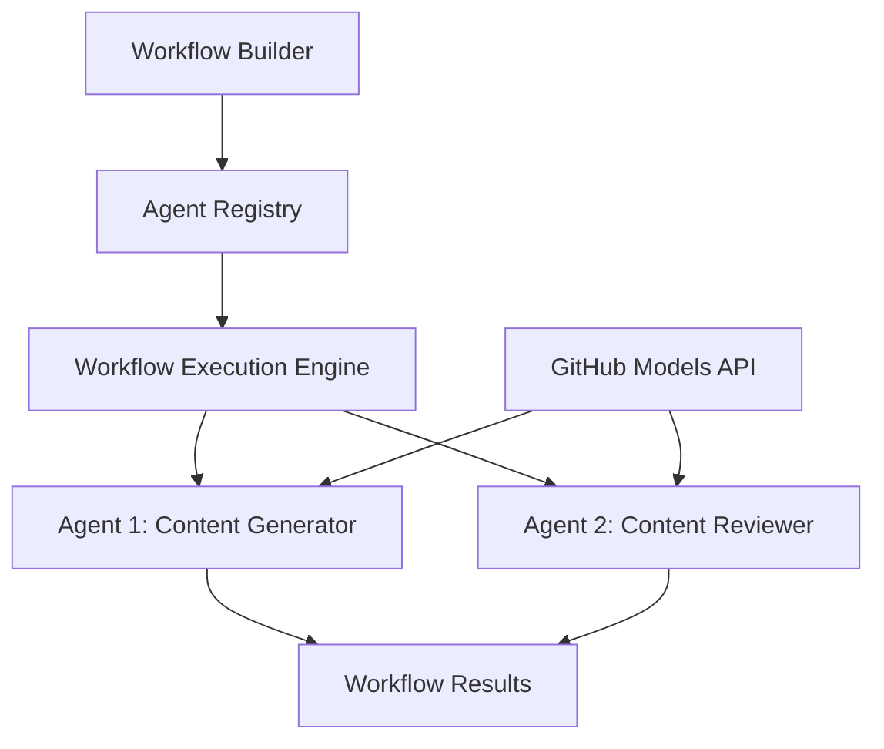

<!--
CO_OP_TRANSLATOR_METADATA:
{
  "original_hash": "034158688d0a45aae06dcbb21b0da5ae",
  "translation_date": "2025-11-11T12:51:23+00:00",
  "source_file": "08-multi-agent/code_samples/workflows-agent-framework/dotNET/01.dotnet-agent-framework-workflow-ghmodel-basic.md",
  "language_code": "da"
}
-->
# 🔄 Grundlæggende Agentarbejdsgange med GitHub-modeller (.NET)

## 📋 Tutorial om Arbejdsgangsorkestrering

Denne notebook viser, hvordan man opbygger avancerede **agentarbejdsgange** ved hjælp af Microsoft Agent Framework for .NET og GitHub-modeller. Du lærer at skabe flertrins forretningsprocesser, hvor AI-agenter samarbejder for at udføre komplekse opgaver gennem strukturerede orkestreringsmønstre.

## 🎯 Læringsmål

### 🏗️ **Grundlæggende Arbejdsgangsarkitektur**
- **Workflow Builder**: Design og orkestrer komplekse flertrins AI-processer
- **Agentkoordination**: Koordiner flere specialiserede agenter inden for arbejdsgange
- **GitHub-modeller Integration**: Udnyt GitHubs AI-model inferenstjeneste i arbejdsgange
- **Visuel Arbejdsgangsdesign**: Skab og visualiser arbejdsgangsstrukturer for bedre forståelse

### 🔄 **Processorkestreringsmønstre**
- **Sekventiel Behandling**: Kæd flere agentopgaver i logisk rækkefølge
- **Tilstandshåndtering**: Bevar kontekst og dataflow på tværs af arbejdsgangsstadier
- **Fejlhåndtering**: Implementer robust fejlgenopretning og arbejdsgangsmodstandsdygtighed
- **Ydelsesoptimering**: Design effektive arbejdsgange til operationer i virksomhedsskala

### 🏢 **Anvendelser i Virksomhedsarbejdsgange**
- **Automatisering af Forretningsprocesser**: Automatiser komplekse organisatoriske arbejdsgange
- **Indholdsproduktionspipeline**: Redaktionelle arbejdsgange med gennemgangs- og godkendelsesstadier
- **Automatisering af Kundeservice**: Flertrins løsning af kundehenvendelser
- **Databehandlingsarbejdsgange**: ETL-arbejdsgange med AI-drevet transformation

## ⚙️ Forudsætninger & Opsætning

### 📦 **Påkrævede NuGet-pakker**

Denne arbejdsgangsdemonstration bruger flere vigtige .NET-pakker:

```xml
<!-- Core AI Framework -->
<PackageReference Include="Microsoft.Extensions.AI" Version="9.9.0" />

<!-- Agent Framework (Local Development) -->
<!-- Microsoft.Agents.AI.dll - Core agent abstractions -->
<!-- Microsoft.Agents.AI.OpenAI.dll - OpenAI/GitHub Models integration -->

<!-- Configuration and Environment -->
<PackageReference Include="DotNetEnv" Version="3.1.1" />
```

### 🔑 **GitHub-modeller Konfiguration**

**Miljøopsætning (.env-fil):**
```env
GITHUB_TOKEN=your_github_personal_access_token
GITHUB_ENDPOINT=https://models.inference.ai.azure.com
GITHUB_MODEL_ID=gpt-4o-mini
```

**Adgang til GitHub-modeller:**
1. Tilmeld dig GitHub-modeller (i øjeblikket i preview)
2. Generer en personlig adgangstoken med modeladgangstilladelser
3. Konfigurer miljøvariabler som vist ovenfor

### 🏗️ **Oversigt over Arbejdsgangsarkitektur**



**Nøglekomponenter:**
- **WorkflowBuilder**: Hovedorkestreringsmotor til design af arbejdsgange
- **AIAgent**: Individuelle specialiserede agenter med specifikke kapaciteter
- **GitHub Models Client**: Integration af AI-model inferenstjeneste
- **Execution Context**: Håndterer tilstand og dataflow mellem arbejdsgangsstadier

## 🎨 **Designmønstre for Virksomhedsarbejdsgange**

### 📝 **Indholdsproduktionsarbejdsgang**
```
User Request → Content Generation → Quality Review → Final Output
```

### 🔍 **Dokumentbehandlingspipeline**
```
Document Input → Analysis → Extraction → Validation → Structured Output
```

### 💼 **Forretningsintelligensarbejdsgang**
```
Data Collection → Processing → Analysis → Report Generation → Distribution
```

### 🤝 **Automatisering af Kundeservice**
```
Customer Inquiry → Classification → Processing → Response Generation → Follow-up
```

## 🏢 **Fordele for Virksomheder**

### 🎯 **Pålidelighed & Skalerbarhed**
- **Deterministisk Udførelse**: Konsistente, gentagelige arbejdsgangsresultater
- **Fejlgenopretning**: Elegant håndtering af fejl på ethvert arbejdsgangsstadie
- **Ydelsesovervågning**: Spor udførelsesmetrikker og optimeringsmuligheder
- **Ressourcestyring**: Effektiv tildeling og udnyttelse af AI-modelressourcer

### 🔒 **Sikkerhed & Overholdelse**
- **Sikker Autentificering**: GitHub-tokenbaseret autentificering til API-adgang
- **Audit Trails**: Komplet logning af arbejdsgangsudførelse og beslutningspunkter
- **Adgangskontrol**: Granulære tilladelser til arbejdsgangsudførelse og overvågning
- **Databeskyttelse**: Sikker håndtering af følsomme oplysninger gennem arbejdsgange

### 📊 **Observabilitet & Administration**
- **Visuelt Arbejdsgangsdesign**: Klar repræsentation af procesflows og afhængigheder
- **Udførelsesovervågning**: Realtidssporing af arbejdsgangsfremskridt og ydeevne
- **Fejlrapportering**: Detaljeret fejlanalyse og fejlretning
- **Ydelsesanalyse**: Metrikker til optimering og kapacitetsplanlægning

Lad os bygge din første virksomhedsparate AI-arbejdsgang! 🚀

## 💻 Kørsel af Koden

Den komplette implementering findes i `01.dotnet-agent-framework-workflow-ghmodel-basic.cs`. Denne fil demonstrerer:

1. **Miljøkonfiguration** - Indlæsning af GitHub-modellers legitimationsoplysninger fra `.env`-filen
2. **OpenAI Client Opsætning** - Konfiguration af klienten til at bruge GitHub-modellers endpoint
3. **Agentoprettelse** - Definition af specialiserede agenter (Front Desk og Concierge)
4. **Workflow Builder** - Oprettelse af en fleragent arbejdsgang med sekventiel behandling
5. **Arbejdsgangsudførelse** - Kørsel af arbejdsgangen med streamingresultater

### 🚀 Kørsel af Eksemplet

```bash
# Make the script executable (Unix/Linux/macOS)
chmod +x 01.dotnet-agent-framework-workflow-ghmodel-basic.cs

# Run the workflow
./01.dotnet-agent-framework-workflow-ghmodel-basic.cs
```

Eller på Windows:
```powershell
dotnet run 01.dotnet-agent-framework-workflow-ghmodel-basic.cs
```

### 📝 Forventet Output

Arbejdsgangen vil:
1. Acceptere din rejsemålsanmodning ("Jeg vil gerne til Paris")
2. Front Desk-agenten giver en indledende anbefaling
3. Concierge-agenten gennemgår og forfiner anbefalingen
4. Endeligt output viser den komplette samtalestrøm

### 🔧 Tilpasning

Du kan tilpasse arbejdsgangen ved:
- At ændre agentinstruktioner for at ændre deres adfærd
- Tilføje flere agenter for at skabe komplekse flertrins arbejdsgange
- Ændre brugerbeskeden for at teste forskellige scenarier
- Justere arbejdsgangskanter for at skabe forskellige udførelsesmønstre

---

<!-- CO-OP TRANSLATOR DISCLAIMER START -->
**Ansvarsfraskrivelse**:  
Dette dokument er blevet oversat ved hjælp af AI-oversættelsestjenesten [Co-op Translator](https://github.com/Azure/co-op-translator). Selvom vi bestræber os på nøjagtighed, skal du være opmærksom på, at automatiserede oversættelser kan indeholde fejl eller unøjagtigheder. Det originale dokument på dets oprindelige sprog bør betragtes som den autoritative kilde. For kritisk information anbefales professionel menneskelig oversættelse. Vi er ikke ansvarlige for eventuelle misforståelser eller fejltolkninger, der opstår som følge af brugen af denne oversættelse.
<!-- CO-OP TRANSLATOR DISCLAIMER END -->