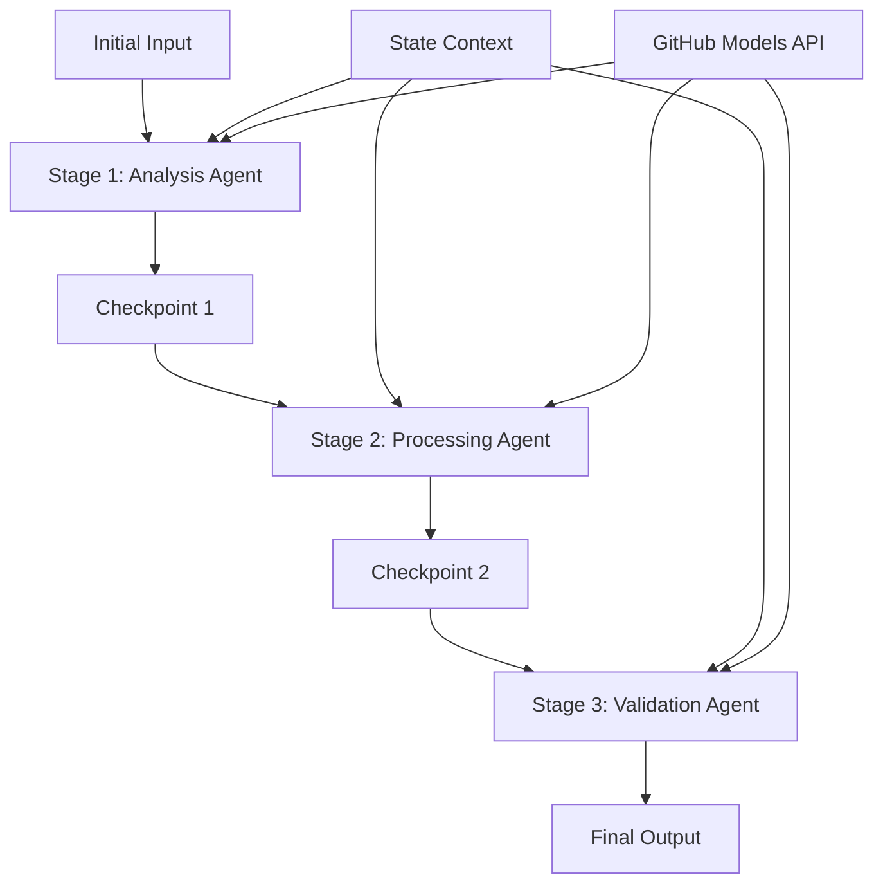

<!--
CO_OP_TRANSLATOR_METADATA:
{
  "original_hash": "1be9c8dcbd79a02d33d2c138684c1394",
  "translation_date": "2025-11-11T13:54:44+00:00",
  "source_file": "08-multi-agent/code_samples/workflows-agent-framework/dotNET/02.dotnet-agent-framework-workflow-ghmodel-sequential.md",
  "language_code": "da"
}
-->
# ⏩ Sekventielle Agentarbejdsgange med GitHub-modeller (.NET)

## 📋 Avanceret vejledning i sekventiel behandling

Denne notebook demonstrerer **sekventielle arbejdsgangsmønstre** ved brug af Microsoft Agent Framework for .NET og GitHub-modeller. Du lærer, hvordan man opbygger avancerede, trin-for-trin behandlingspipelines, hvor agenter udfører opgaver i en specifik rækkefølge, og hver fase bygger videre på resultaterne fra den foregående.

## 🎯 Læringsmål

### 🔄 **Arkitektur for sekventiel behandling**
- **Lineær arbejdsgangsdesign**: Opret trin-for-trin behandlingspipelines med klare afhængigheder
- **Tilstandshåndtering**: Bevar kontekst og dataflow på tværs af sekventielle arbejdsgangsfaser
- **Integration af GitHub-modeller**: Udnyt GitHubs AI-modeller i flertrins .NET-arbejdsgange
- **Enterprise-pipeline-mønstre**: Byg produktionsklare sekventielle behandlingssystemer

### 🏗️ **Avancerede sekventielle mønstre**
- **Stage-Gate-behandling**: Implementer valideringskontrolpunkter mellem arbejdsgangsfaser
- **Kontekstbevaring**: Bevar tilstand og akkumuleret viden på tværs af alle faser
- **Fejludbredelse**: Håndter fejl elegant i sekventielle behandlingskæder
- **Optimering af ydeevne**: Effektiv sekventiel udførelse med minimal overhead

### 🏢 **Enterprise-sekventielle applikationer**
- **Dokumentbehandlingspipeline**: Flertrins dokumentanalyse, transformation og validering
- **Kvalitetssikringsarbejdsgange**: Sekventiel gennemgang, validering og godkendelsesprocesser
- **Indholdsproduktionspipeline**: Research → Skrivning → Redigering → Gennemgang → Udgivelse
- **Automatisering af forretningsprocesser**: Flertrins forretningsarbejdsgange med klare faseafhængigheder

## ⚙️ Forudsætninger og opsætning

### 📦 **Nødvendige NuGet-pakker**

Vigtige pakker til .NET-sekventielle arbejdsgange:

```xml
<!-- Core AI Framework -->
<PackageReference Include="Microsoft.Extensions.AI" Version="9.9.0" />

<!-- Client Model Abstractions -->
<PackageReference Include="System.ClientModel" Version="1.6.1.0" />

<!-- Azure Identity and Async LINQ Support -->
<PackageReference Include="Azure.Identity" Version="1.15.0" />
<PackageReference Include="System.Linq.Async" Version="6.0.3" />

<!-- Local Agent Framework References -->
<!-- Microsoft.Agents.AI.dll - Core agent abstractions -->
<!-- Microsoft.Agents.AI.OpenAI.dll - GitHub Models integration -->
```

### 🔑 **Konfiguration af GitHub-modeller**

**Miljøopsætning (.env-fil):**
```env
GITHUB_TOKEN=your_github_personal_access_token
GITHUB_ENDPOINT=https://models.inference.ai.azure.com
GITHUB_MODEL_ID=gpt-4o-mini
```

**Konfigurationsstyring:**
```csharp
// Load environment variables securely
Env.Load("../../../.env");
var githubToken = Environment.GetEnvironmentVariable("GITHUB_TOKEN");
var githubEndpoint = Environment.GetEnvironmentVariable("GITHUB_ENDPOINT");
var modelId = Environment.GetEnvironmentVariable("GITHUB_MODEL_ID");
```

### 🏗️ **Arkitektur for sekventiel arbejdsgang**



**Nøglekomponenter:**
- **Sekventielle agenter**: Specialiserede agenter for hver behandlingsfase
- **Tilstandskontekst**: Bevarer akkumulerede data og beslutninger på tværs af faser
- **Kontrolpunkter**: Valideringspunkter mellem faser for at sikre kvalitet og konsistens
- **GitHub Models Client**: Konsistent adgang til AI-modeller på tværs af alle arbejdsgangsfaser

## 🎨 **Designmønstre for sekventiel arbejdsgang**

### 📝 **Dokumentbehandlingspipeline**
```
Raw Document → Content Extraction → Analysis → Validation → Structured Output
```

### 🎯 **Indholdsskabelsesarbejdsgang**
```
Brief/Requirements → Research → Content Creation → Review → Final Polish
```

### 🔍 **Kvalitetssikringspipeline**
```
Initial Review → Technical Validation → Compliance Check → Final Approval
```

### 💼 **Forretningsintelligensarbejdsgang**
```
Data Collection → Processing → Analysis → Report Generation → Distribution
```

## 🏢 **Fordele ved enterprise-sekventielle arbejdsgange**

### 🎯 **Pålidelighed og kvalitet**
- **Deterministisk behandling**: Konsistente, gentagelige resultater gennem strukturerede faser
- **Kvalitetskontrol**: Valideringskontrolpunkter sikrer kvalitet i hver fase
- **Fejlisolering**: Problemer i én fase spreder sig ikke til efterfølgende faser
- **Audit-spor**: Fuld sporing af beslutninger og transformationer i hver fase

### 📈 **Skalerbarhed og ydeevne**
- **Modulært design**: Hver fase kan optimeres uafhængigt
- **Ressourcestyring**: Effektiv tildeling af AI-modelressourcer på tværs af faser
- **Tilstandsoptimering**: Minimal tilstandsoverførsel mellem faser for optimal ydeevne
- **Parallelle fasegrupper**: Flere sekventielle arbejdsgange kan køre parallelt

### 🔒 **Sikkerhed og overholdelse**
- **Sikkerhed på faser**: Forskellige sikkerhedspolitikker for forskellige behandlingsfaser
- **Datavalidering**: Sikrer dataintegritet og overholdelse ved hvert kontrolpunkt
- **Adgangskontrol**: Granulære tilladelser for forskellige arbejdsgangsfaser
- **Regulatorisk overholdelse**: Opfyld regulatoriske krav gennem struktureret behandling

### 📊 **Overvågning og analyse**
- **Fasemetrics**: Ydeevneovervågning for hver arbejdsgangsfase
- **Identifikation af flaskehalse**: Identificer og optimer langsomme faser
- **Kvalitetsmetrics**: Spor kvalitet og succesrater i hver fase
- **Procesoptimering**: Kontinuerlig forbedring baseret på faseanalyse

Lad os bygge robuste sekventielle AI-behandlingspipelines! 🚀

## 💻 Kørsel af koden

Den komplette implementering findes i `02.dotnet-agent-framework-workflow-ghmodel-sequential.cs`. Denne fil demonstrerer en **tretrins møbelanalysearbejdsgang**:

1. **Fase 1 - Salgsagent**: Analyserer møbelbilleder og giver købsforslag
2. **Fase 2 - Prisagent**: Leverer detaljerede prisopdelinger og budgetmuligheder
3. **Fase 3 - Tilbudsagent**: Genererer et professionelt tilbudsdokument i Markdown-format

### 🏗️ **Arbejdsgangsarkitektur**

```
Image Input → Sales Analysis → Price Estimation → Quote Generation → Final Output
```

Hver agent:
- Modtager output fra den foregående fase som kontekst
- Bygger videre på tidligere analyser med specialiseret ekspertise
- Bevarer arbejdsgangens kontinuitet gennem tilstandshåndtering

### 🚀 Kør eksemplet

**Forudsætninger:**
- Placer et møbelbillede på `../imgs/home.png` (eller opdater variablen `imgPath`)
- Konfigurer din `.env`-fil med GitHub Models-legitimationsoplysninger

```bash
# Make the script executable (Unix/Linux/macOS)
chmod +x 02.dotnet-agent-framework-workflow-ghmodel-sequential.cs

# Run the sequential workflow
./02.dotnet-agent-framework-workflow-ghmodel-sequential.cs
```

Eller på Windows:
```powershell
dotnet run 02.dotnet-agent-framework-workflow-ghmodel-sequential.cs
```

### 📝 Forventet output

Arbejdsgangen vil:
1. **Salgsagent**: Identificere møbelgenstande fra billedet og give anbefalinger
2. **Prisagent**: Tilføje detaljeret prisanalyse med budgetniveauer og shoppinganbefalinger
3. **Tilbudsagent**: Generere et formateret tilbudsdokument med alle oplysninger samlet

Det endelige output vil være et omfattende, professionelt møbeltilbud baseret på billedanalyse.

### 🔧 Tilpasningsmuligheder

**Ændre agentadfærd:**
```csharp
// Adjust agent instructions to change their focus
const string SalesAgentInstructions = "Your custom instructions...";
```

**Ændre sekventiel flow:**
```csharp
// Add or reorder workflow stages
var workflow = new WorkflowBuilder(salesagent)
    .AddEdge(salesagent, priceagent)
    .AddEdge(priceagent, quoteagent)
    .AddEdge(quoteagent, newAgent)  // Add another stage
    .Build();
```

**Brug forskelligt input:**
```csharp
// Process text instead of images
ChatMessage userMessage = new ChatMessage(ChatRole.User, [
    new TextContent("Analyze pricing for a modern living room set")
]);
```

### 🎯 Virkelige anvendelser

Dette sekventielle mønster er ideelt til:
- **E-handel**: Produktanalyse → Prissætning → Tilbudsgenerering
- **Ejendomshandel**: Ejendomsanalyse → Vurdering → Oprettelse af annonce
- **Forsikring**: Skadeanalyse → Vurdering → Tilbudsgenerering
- **Indholdsskabelse**: Research → Skrivning → Redigering → Udgivelse

### 🔍 Forståelse af tilstandsflow

Hver agent i sekvensen modtager:
- **Originalt input**: Den oprindelige brugermeddelelse (billede + tekst)
- **Tidligere agentoutput**: Alle tidligere agenters svar i samtalehistorikken
- **Akkumuleret kontekst**: Komplet tilstand bevaret gennem hele arbejdsgangen

Dette muliggør avanceret flertrinsbehandling, hvor hver agent bygger videre på omfattende kontekst fra alle tidligere faser.

---

<!-- CO-OP TRANSLATOR DISCLAIMER START -->
**Ansvarsfraskrivelse**:  
Dette dokument er blevet oversat ved hjælp af AI-oversættelsestjenesten [Co-op Translator](https://github.com/Azure/co-op-translator). Selvom vi bestræber os på nøjagtighed, skal det bemærkes, at automatiserede oversættelser kan indeholde fejl eller unøjagtigheder. Det originale dokument på dets oprindelige sprog bør betragtes som den autoritative kilde. For kritisk information anbefales professionel menneskelig oversættelse. Vi er ikke ansvarlige for eventuelle misforståelser eller fejltolkninger, der opstår som følge af brugen af denne oversættelse.
<!-- CO-OP TRANSLATOR DISCLAIMER END -->