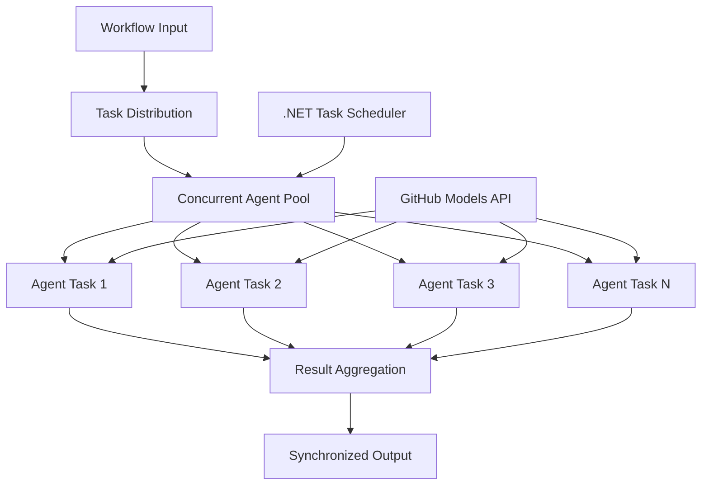

<!--
CO_OP_TRANSLATOR_METADATA:
{
  "original_hash": "b9c6e32c9b5f2fed20b6916984440d88",
  "translation_date": "2025-11-11T13:21:42+00:00",
  "source_file": "08-multi-agent/code_samples/workflows-agent-framework/dotNET/03.dotnet-agent-framework-workflow-ghmodel-concurrent.md",
  "language_code": "da"
}
-->
# ⚡ Samtidige Agentarbejdsgange med GitHub-modeller (.NET)

## 📋 Vejledning i højtydende parallel behandling

Denne notebook demonstrerer **samtidige arbejdsgangsmønstre** ved brug af Microsoft Agent Framework for .NET og GitHub-modeller. Du lærer, hvordan man bygger højtydende arbejdsgange med parallel behandling, der maksimerer gennemstrømningen ved at udføre flere AI-agenter samtidigt, mens man opretholder koordinering og datakonsistens.

## 🎯 Læringsmål

### 🚀 **Grundlæggende om samtidig behandling**
- **Parallel agentudførelse**: Kør flere AI-agenter samtidigt for maksimal ydeevne
- **Async/Await-mønstre**: Udnyt .NET's asynkrone programmeringsmodel for effektiv samtidighed
- **GitHub-modeller integration**: Koordiner flere samtidige kald til GitHubs AI-model inferenstjeneste
- **Ressourcestyring**: Effektiv styring af AI-modelressourcer på tværs af samtidige operationer

### 🏗️ **Avanceret samtidighedsarkitektur**
- **Opgavebaseret parallelisme**: Brug .NET Task Parallel Library til optimal samtidig udførelse
- **Synkroniseringsmønstre**: Koordiner samtidige agenter og undgå kapløbsbetingelser
- **Load Balancing**: Fordel arbejdet effektivt på tværs af tilgængelig kapacitet for samtidig behandling
- **Fejltolerance**: Håndter individuelle agentfejl uden at stoppe hele arbejdsgangen

### 🏢 **Samtidige applikationer til erhvervslivet**
- **Højvolumen dokumentbehandling**: Behandl flere dokumenter samtidigt
- **Realtidsindholdsanalyse**: Samtidig analyse af indkommende datastrømme
- **Batch-behandlingsoptimering**: Maksimer gennemstrømningen for storskala databehandlingsoperationer
- **Multimodal analyse**: Parallel behandling af forskellige indholdstyper og formater

## ⚙️ Forudsætninger og opsætning

### 📦 **Nødvendige NuGet-pakker**

Vigtige pakker til højtydende samtidige arbejdsgange:

```xml
<!-- Core AI Framework with Async Support -->
<PackageReference Include="Microsoft.Extensions.AI" Version="9.9.0" />

<!-- Client Model Abstractions for API Communication -->
<PackageReference Include="System.ClientModel" Version="1.6.1.0" />

<!-- Azure Identity and Async LINQ for Advanced Operations -->
<PackageReference Include="Azure.Identity" Version="1.15.0" />
<PackageReference Include="System.Linq.Async" Version="6.0.3" />

<!-- Local Agent Framework References -->
<!-- Microsoft.Agents.AI.dll - Core agent abstractions with async support -->
<!-- Microsoft.Agents.AI.OpenAI.dll - GitHub Models integration with concurrency -->
```

### 🔑 **GitHub-modeller konfiguration**

**Miljøopsætning (.env-fil):**
```env
GITHUB_TOKEN=your_github_personal_access_token
GITHUB_ENDPOINT=https://models.inference.ai.azure.com
GITHUB_MODEL_ID=gpt-4o-mini
```

**Overvejelser om samtidig behandling:**
```csharp
// Configure for concurrent operations
var clientOptions = new OpenAIClientOptions()
{
    Endpoint = new Uri(githubEndpoint),
    // Configure connection pooling for concurrent requests
    NetworkTimeout = TimeSpan.FromMinutes(5)
};
```

### 🏗️ **Arkitektur for samtidige arbejdsgange**



**Nøglekomponenter:**
- **Task Parallel Library**: .NET's indbyggede understøttelse af samtidige operationer
- **Agent Pool**: Flere agentinstanser til parallel behandling
- **Resultataggregation**: Koordinering og sammensmeltning af samtidige agentresultater
- **Synkroniseringspunkter**: Sikrer datakonsistens på tværs af samtidige operationer

## 🎨 **Designmønstre for samtidige arbejdsgange**

### 🔍 **Parallel forskning og analyse**
```
Research Topic → Concurrent Research Agents → Result Synthesis → Final Report
```

### 📊 **Multikilde databehandling**
```
Data Sources → Parallel Processing Agents → Data Integration → Unified Output
```

### 🎭 **Indholdsgenereringspipeline**
```
Content Requirements → Concurrent Content Generators → Quality Review → Final Content
```

### 🔄 **Fan-Out/Fan-In behandling**
```
Single Input → Multiple Concurrent Processors → Result Aggregation → Single Output
```

## 🏢 **Fordele ved erhvervsmæssig ydeevne**

### ⚡ **Gennemstrømning og skalerbarhed**
- **Lineær ydeevneskalering**: Tilføj flere samtidige agenter for at øge gennemstrømningen
- **Ressourceudnyttelse**: Maksimal effektivitet af tilgængelig AI-modelkapacitet
- **Reduceret behandlingstid**: Betydelig tidsreduktion gennem parallel udførelse
- **Elastisk skalering**: Juster dynamisk antallet af samtidige agenter baseret på arbejdsbyrde

### 🛡️ **Pålidelighed og robusthed**
- **Fejlisolering**: Individuelle agentfejl påvirker ikke andre samtidige operationer
- **Graciøs nedbrydning**: Systemet fortsætter med reduceret agentkapacitet
- **Fejlgenopretning**: Automatiske genforsøgsmekanismer for mislykkede samtidige operationer
- **Arbejdsfordeling**: Jævn fordeling af arbejde på tværs af tilgængelige agenter

### 📊 **Ydelsesovervågning**
- **Metrikker for samtidig udførelse**: Spor ydeevnen for alle parallelle operationer
- **Ressourcebrugsanalyse**: Overvåg CPU-, hukommelses- og netværksudnyttelse
- **Gennemstrømningsanalyse**: Mål effektivitetsgevinster fra samtidig behandling
- **Flaskehalsdetektion**: Identificer og løs ydeevnebegrænsninger

### 🔧 **Udvikling og drift**
- **Asynkron programmeringsmodel**: Udnyt .NET's modne async/await-mønstre
- **Opgavekoordinering**: Indbyggede opgavestyrings- og koordineringsfunktioner
- **Fejlhåndtering**: Omfattende fejlhåndtering for samtidige operationer
- **Debugging support**: Visual Studio debugging værktøjer til samtidige arbejdsgange

Lad os bygge højtydende samtidige AI-arbejdsgange med .NET! 🚀

## 💻 Kørsel af koden

Den komplette implementering findes i `03.dotnet-agent-framework-workflow-ghmodel-concurrent.cs`. Denne fil demonstrerer en **Fan-Out/Fan-In samtidig arbejdsgang** for rejseplanlægning:

### 🏗️ **Arbejdsgangsarkitektur**

```
User Request → ConcurrentStartExecutor → [Researcher Agent || Planner Agent] → ConcurrentAggregationExecutor → Final Output
```

**Nøglekomponenter:**

1. **ConcurrentStartExecutor**: Sender brugerens forespørgsel til alle agenter samtidigt
2. **Researcher Agent**: Analyserer destinationer og attraktioner samtidigt
3. **Planner Agent**: Opretter detaljerede rejseplaner samtidigt
4. **ConcurrentAggregationExecutor**: Indsamler og sammensmelter resultater fra begge agenter

### 🎯 **Fan-Out/Fan-In-mønster**

Denne arbejdsgang demonstrerer det klassiske **Fan-Out/Fan-In**-mønster:
- **Fan-Out**: En inputbesked sendes til flere agenter samtidigt
- **Samtidig behandling**: Flere agenter arbejder parallelt på samme opgave
- **Fan-In**: Resultater fra alle agenter indsamles og samles til en enkelt output

### 🚀 Kør eksemplet

```bash
# Make the script executable (Unix/Linux/macOS)
chmod +x 03.dotnet-agent-framework-workflow-ghmodel-concurrent.cs

# Run the concurrent workflow
./03.dotnet-agent-framework-workflow-ghmodel-concurrent.cs
```

Eller på Windows:
```powershell
dotnet run 03.dotnet-agent-framework-workflow-ghmodel-concurrent.cs
```

### 📝 Forventet output

Arbejdsgangen vil:
1. **Send forespørgsel**: Send "Planlæg en tur til Seattle i december" til begge agenter
2. **Samtidig behandling**: Begge agenter arbejder samtidigt:
   - Researcher identificerer attraktioner og detaljer
   - Planner opretter rejseplan og logistik
3. **Aggregation**: Kombiner begge svar til en omfattende output
4. **Vis resultater**: Vis den sammensmeltede rejseplan med alle oplysninger

### 🔧 Tilpasningsmuligheder

**Tilføj flere samtidige agenter:**
```csharp
// Create additional specialized agents
AIAgent budgetAgent = openAIClient.GetChatClient(github_model_id).CreateAIAgent(
    name: "Budget-Agent", instructions: "Calculate travel costs...");

// Add to fan-out
var workflow = new WorkflowBuilder(startExecutor)
    .AddFanOutEdge(startExecutor, targets: [researcherAgent, plannerAgent, budgetAgent])
    .AddFanInEdge(aggregationExecutor, sources: [researcherAgent, plannerAgent, budgetAgent])
    .WithOutputFrom(aggregationExecutor)
    .Build();

// Update aggregation count
if (this._messages.Count == 3) { ... }
```

**Ændr agentinstruktioner:**
```csharp
const string ResearcherAgentInstructions = "Your custom instructions for research...";
const string PlanAgentInstructions = "Your custom instructions for planning...";
```

**Ændr opgaven:**
```csharp
StreamingRun run = await InProcessExecution.StreamAsync(
    workflow, 
    "Plan a European vacation for 2 weeks in summer"
);
```

### 🎯 Virkelige anvendelser

Dette samtidige mønster er ideelt til:
- **Indholdsskabelse**: Flere skribenter, der skaber forskellige sektioner samtidigt
- **Kodegennemgang**: Flere gennemgåere analyserer kode fra forskellige perspektiver
- **Markedsundersøgelse**: Parallel analyse af forskellige markedssegmenter
- **Dokumentbehandling**: Samtidig udtrækning, analyse og validering
- **Multiperspektivanalyse**: Få forskellige synspunkter på samme input

### 🔍 Forståelse af brugerdefinerede eksekutorer

**ConcurrentStartExecutor:**
- Implementerer `IMessageHandler<string>` for at acceptere strenginput
- Sender beskeder til alle tilsluttede agenter
- Sender `TurnToken` for at udløse samtidig behandling

**ConcurrentAggregationExecutor:**
- Implementerer `IMessageHandler<ChatMessage>` for at modtage agentrespons
- Indsamler beskeder på en trådsikker måde
- Aggregerer, når alle forventede svar ankommer
- Leverer endelig output ved hjælp af `context.YieldOutputAsync()`

### ⚡ Ydelsesfordele

**Samtidig vs sekventiel:**
- Sekventiel: Agent1 (30s) → Agent2 (30s) = **60 sekunder i alt**
- Samtidig: Agent1 (30s) || Agent2 (30s) = **30 sekunder i alt**

**Gennemstrømningsforbedring**: Op til N× hurtigere for N samtidige agenter (afhængigt af arbejdsbyrde og ressourcer)

### 🛡️ Fejlhåndtering

Arbejdsgangen håndterer individuelle agentfejl graciøst:
- Hvis én agent fejler, fortsætter de andre med at behandle
- Aggregator kan implementere timeout-logik
- Delvise resultater kan returneres, hvis nødvendigt

### 📊 Avancerede funktioner

**Dynamisk antal agenter:**
Ændr aggregationslogikken for at understøtte variabelt antal agenter:

```csharp
private int _expectedAgentCount;
private readonly List<ChatMessage> _messages = [];

public async ValueTask HandleAsync(ChatMessage message, IWorkflowContext context)
{
    this._messages.Add(message);
    if (this._messages.Count == _expectedAgentCount)
    {
        // Process aggregation
    }
}
```

Dette samtidige arbejdsgangsmønster er essentielt for at bygge højtydende, skalerbare AI-agent-systemer!

---

<!-- CO-OP TRANSLATOR DISCLAIMER START -->
**Ansvarsfraskrivelse**:  
Dette dokument er blevet oversat ved hjælp af AI-oversættelsestjenesten [Co-op Translator](https://github.com/Azure/co-op-translator). Selvom vi bestræber os på nøjagtighed, skal det bemærkes, at automatiserede oversættelser kan indeholde fejl eller unøjagtigheder. Det originale dokument på dets oprindelige sprog bør betragtes som den autoritative kilde. For kritisk information anbefales professionel menneskelig oversættelse. Vi er ikke ansvarlige for eventuelle misforståelser eller fejltolkninger, der opstår som følge af brugen af denne oversættelse.
<!-- CO-OP TRANSLATOR DISCLAIMER END -->