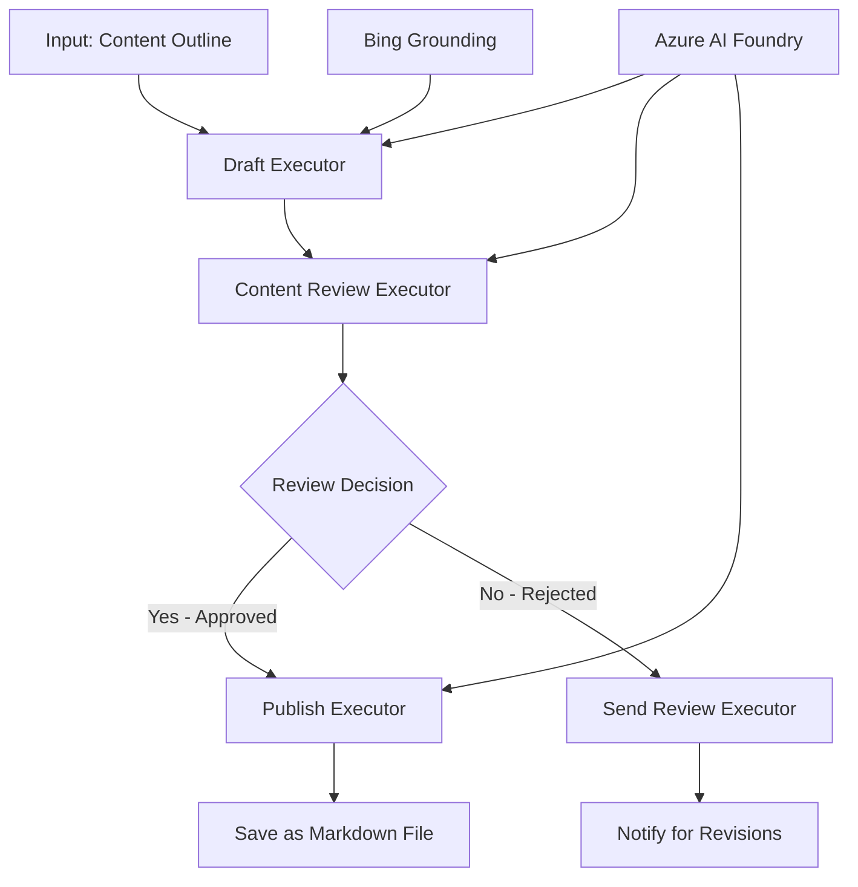

<!--
CO_OP_TRANSLATOR_METADATA:
{
  "original_hash": "8abd335151cee553293b637ee3d80d10",
  "translation_date": "2025-11-11T12:19:09+00:00",
  "source_file": "08-multi-agent/code_samples/workflows-agent-framework/dotNET/04.dotnet-agent-framework-workflow-aifoundry-condition.md",
  "language_code": "da"
}
-->
# 🔀 Betingede Agentarbejdsgange med Azure AI Foundry (.NET)

## 📋 Tutorial om Intelligent Beslutningsbaseret Arbejdsgang

Denne notebook demonstrerer **betingede arbejdsgangsmønstre** ved brug af Azure AI Foundry og Microsoft Agent Framework for .NET. Du lærer, hvordan man bygger avancerede, beslutningsdrevne arbejdsgange, der intelligent styrer processer baseret på AI-analyse, forretningsregler og dynamiske betingelser for automatisering i virksomhedsklasse.

## 🎯 Læringsmål

### 🧠 **Intelligent Beslutningsarkitektur**
- **Implementering af betinget logik**: Byg komplekse beslutningstræer med flere forgreninger
- **AI-drevet routing**: Brug Azure AI Foundry-modeller til at træffe intelligente routingbeslutninger
- **Dynamisk arbejdsgangstilpasning**: Ændr arbejdsgangsadfærd baseret på runtime-analyse og betingelser
- **Integration af virksomhedsregler**: Indarbejd forretningslogik og overholdelseskrav i arbejdsgange

### 🔀 **Avancerede betingede mønstre**
- **Beslutningstagning med flere kriterier**: Vurder flere faktorer for routingbeslutninger
- **Kontekstbevidst behandling**: Træf beslutninger baseret på akkumuleret arbejdsgangskontekst og historik
- **Adaptiv arbejdsgangstilpasning**: Juster behandlingsveje dynamisk baseret på realtidsbetingelser
- **Integration af regelmotor**: Implementer avancerede forretningsregelmotorer i arbejdsgange

### 🏢 **Betingede applikationer i virksomheder**
- **Dokumentklassificering og routing**: Klassificer og rout dokumenter automatisk til passende arbejdsgange
- **Kundeservice triage**: Intelligent routing af kundehenvendelser til specialiserede håndteringsteams
- **Overholdelse og risikobehandling**: Anvend forskellige validerings- og gennemgangsprocesser baseret på risikovurdering
- **Kvalitetssikringsarbejdsgange**: Rout indhold gennem passende gennemgangsprocesser baseret på kvalitetsmålinger

## ⚙️ Forudsætninger og opsætning

### 📦 **Påkrævede NuGet-pakker**

Avancerede pakker til betinget arbejdsgangsbehandling:

```xml
<!-- Core AI Framework -->
<PackageReference Include="Microsoft.Extensions.AI" Version="9.9.0" />

<!-- Azure AI Agents with Persistent State -->
<PackageReference Include="Azure.AI.Agents.Persistent" Version="1.2.0-beta.5" />

<!-- Azure Identity and Utilities -->
<PackageReference Include="Azure.Identity" Version="1.15.0" />
<PackageReference Include="System.Linq.Async" Version="6.0.3" />
<PackageReference Include="DotNetEnv" Version="3.1.1" />

<!-- Local Workflow Framework References -->
<!-- Microsoft.Agents.Workflows.dll - Advanced workflow orchestration -->
<!-- Microsoft.Agents.AI.AzureAI.dll - Azure AI Foundry integration -->
<!-- Microsoft.Agents.AI.dll - Core agent abstractions -->
```

### 🔑 **Azure AI Foundry-konfiguration**

**Påkrævede Azure-ressourcer:**
- Azure AI Foundry-arbejdsområde med modeller til betinget behandling
- Azure-abonnement med passende compute-kvoter og tilladelser
- Implementerede AI-modeller til beslutningstagning og indholdsanalyse
- (Valgfrit) Bing Search API-forbindelse til grounding-funktioner

**Miljøkonfiguration (.env-fil):**
```env
# Azure AI Foundry Configuration
AZURE_AI_PROJECT_ENDPOINT=https://your-project.cognitiveservices.azure.com/
BING_CONNECTION_ID=your-bing-connection-id
```

**Autentificeringsopsætning:**
```csharp
// Azure CLI or Managed Identity authentication
using Azure.Identity;
var credential = new AzureCliCredential();

// Load environment configuration
DotNetEnv.Env.Load("../../../.env");
```

### 🏗️ **Arkitektur for betinget arbejdsgang**



**Nøglekomponenter:**
- **Draft Executor**: AI-agent, der skaber indledende indholdsudkast fra outlines
- **Content Review Executor**: AI-agent, der vurderer udkastets kvalitet og overholdelse
- **Betinget routing**: Beslutningslogik, der rout baseret på gennemgangsresultater
- **Publicerings-/gennemgangsveje**: Separate behandlingsveje for godkendt vs afvist indhold
- **Tilstandsstyring**: Vedligeholder indholds- og gennemgangskontekst gennem hele arbejdsgangen

## 🎨 **Designmønstre for betinget arbejdsgang**

### 📋 **Indholdsproduktion med kvalitetskontrol**
```
Outline → Draft Creation → Quality Review → {Approve: Publish | Reject: Revise}
```

### 🎯 **Risikobaseret dokumentbehandling**
```
Document → Risk Assessment → {Low: Standard | High: Enhanced Review}
```

### 🔍 **Intelligent routing i kundeservice**
```
Customer Query → Analysis → {Simple: FAQ Bot | Complex: Human Agent}
```

### 💼 **Overholdelsesdrevne arbejdsgange**
```
Content → Compliance Check → {Pass: Publish | Fail: Legal Review}
```

## 🏢 **Fordele ved betingede arbejdsgange i virksomheder**

### 🎯 **Intelligent automatisering**
- **Smart beslutningstagning**: AI-drevne routingbeslutninger baseret på indholdsanalyse og kontekst
- **Adaptiv behandling**: Arbejdsgange, der automatisk tilpasser sig ændrede betingelser
- **Overholdelse af forretningsregler**: Automatisk anvendelse af komplekse forretningslogikker og politikker
- **Kontekstbevidst routing**: Beslutninger baseret på fuld arbejdsgangshistorik og akkumuleret kontekst

### 📈 **Operationel ekspertise**
- **Optimeret ressourceallokering**: Rout arbejde til de mest passende specialister og processer
- **Reduceret manuel indgriben**: Automatiseret beslutningstagning minimerer behovet for menneskelig routing
- **Hurtigere løsningstider**: Direkte routing til passende ekspertise og behandlingskapaciteter
- **Konsekvent anvendelse**: Ensartet anvendelse af forretningsregler og beslutningskriterier

### 🛡️ **Risikostyring og overholdelse**
- **Automatiseret risikovurdering**: AI-drevet evaluering af indhold og situationsrisikoniveauer
- **Overholdelsesstyring**: Automatisk routing gennem påkrævede regulatoriske processer
- **Anvendelse af sikkerhedsprotokoller**: Forbedrede sikkerhedsforanstaltninger anvendt baseret på risikovurdering
- **Vedligeholdelse af revisionsspor**: Komplet dokumentation af routingbeslutninger og begrundelser

### 📊 **Analyse og løbende forbedring**
- **Beslutningsanalyse**: Spor effektiviteten og nøjagtigheden af routingbeslutninger
- **Mønstergenkendelse**: Identificer tendenser og mønstre i routingbeslutninger over tid
- **Performanceoptimering**: Løbende forbedring af beslutningskriterier og routingeffektivitet
- **Forretningsintelligens**: Indsigt i indholdskarakteristika og behandlingskrav

### 🔧 **Teknisk ekspertise**
- **Vedvarende tilstandsstyring**: Vedligehold kompleks tilstand gennem arbejdsgangens udførelse
- **Skalerbar arkitektur**: Håndter krav til betinget behandling med høj volumen
- **Integrationsmuligheder**: Problemfri integration med eksisterende forretningssystemer og processer
- **Overvågning og synlighed**: Omfattende sporing af arbejdsgangsperformance og beslutninger

Lad os bygge intelligente, beslutningsdrevne arbejdsgange til virksomheder med .NET! 🚀

## 💻 Kørsel af koden

Den komplette implementering er tilgængelig i `04.dotnet-agent-framework-workflow-aifoundry-condition.cs`. Dette demonstrerer en **indholdsproduktionsarbejdsgang med kvalitetskontrol**:

### 🏗️ **Arkitektur for arbejdsgang**

```
Content Outline → Draft Creation → Quality Review → Conditional Routing:
                                                      ├─ Approved (>200 words) → Publish
                                                      └─ Rejected (<200 words) → Review Notification
```

**Agentroller i arbejdsgangen:**
1. **Evangelist Agent**: Skaber tutorial-udkast fra outlines med Bing-grounding
2. **Content Reviewer Agent**: Vurderer udkastets kvalitet (ordantal, fuldstændighed)
3. **Publisher Agent**: Gemmer godkendt indhold som tidsstemplet Markdown-filer

**Tilpassede eksekutorer:**
1. **DraftExecutor**: Orkestrerer udkastoprettelse
2. **ContentReviewExecutor**: Udfører kvalitetsvurdering
3. **PublishExecutor**: Håndterer publicering af godkendt indhold
4. **SendReviewExecutor**: Administrerer notifikationer om afvist indhold

### 🚀 Kør eksemplet

**Forudsætninger:**
- Konfigureret Azure AI Foundry-arbejdsområde
- Azure CLI-autentificering (`az login`)
- (Valgfrit) Bing Search-forbindelse til grounding

```bash
# Make the script executable (Unix/Linux/macOS)
chmod +x 04.dotnet-agent-framework-workflow-aifoundry-condition.cs

# Run the conditional workflow
./04.dotnet-agent-framework-workflow-aifoundry-condition.cs
```

Eller på Windows:
```powershell
dotnet run 04.dotnet-agent-framework-workflow-aifoundry-condition.cs
```

### 📝 Forventet output

Arbejdsgangen vil:
1. **Oprette agenter**: Initialisere tre specialiserede Azure AI Foundry-agenter
2. **Generere udkast**: Evangelist-agent skaber tutorial-udkast fra outline
3. **Gennemgå indhold**: Content Reviewer vurderer udkastets kvalitet
4. **Betinget routing**:
   - **Hvis godkendt (>200 ord)**: Publish Executor gemmer som Markdown-fil
   - **Hvis afvist (<200 ord)**: Send Review Executor sender anmeldelsesnotifikation
5. **Vis resultater**: Viser det endelige arbejdsgangsresultat

### 🔧 Tilpasningsmuligheder

**Ændre gennemgangskriterier:**
```csharp
const string ContentReviewerInstructions = @"
You are a content reviewer...
1. Check if content is more than 500 words (instead of 200)
2. Verify technical accuracy
3. Ensure proper formatting
...";
```

**Tilføj flere betingede veje:**
```csharp
var workflow = new WorkflowBuilder(draftExecutor)
    .AddEdge(draftExecutor, contentReviewerExecutor)
    .AddEdge(contentReviewerExecutor, publishExecutor, condition: GetCondition("Excellent"))
    .AddEdge(contentReviewerExecutor, editExecutor, condition: GetCondition("Good"))
    .AddEdge(contentReviewerExecutor, sendReviewerExecutor, condition: GetCondition("Poor"))
    .Build();
```

**Ændre indholdskrav:**
```csharp
string OUTLINE_Content = @"
# Your Custom Topic
## Section 1
https://your-reference-url
## Section 2
...
";
```

### 🎯 Anvendelser i den virkelige verden

Dette mønster for betinget arbejdsgang er ideelt til:
- **Indholdsstyringssystemer**: Automatiserede redaktionelle arbejdsgange med kvalitetskontrol
- **Dokumentbehandling**: Rout dokumenter baseret på klassificering og overholdelse
- **Kundesupport**: Intelligent billet-routing baseret på kompleksitet og hastende karakter
- **Juridisk gennemgang**: Rout kontrakter baseret på risikovurdering og værdi
- **HR-processer**: Rout ansøgninger gennem passende screeningsarbejdsgange

### 🔍 Forståelse af betinget logik

**Betingelsesfunktion:**
```csharp
public Func<object?, bool> GetCondition(string expectedResult) =>
    reviewResult => reviewResult is ReviewResult review && review.Result == expectedResult;
```

Denne funktion skaber en prædikat, der:
1. Kontrollerer, om resultatet er af typen `ReviewResult`
2. Sammenligner egenskaben `Result` med den forventede værdi
3. Returnerer sand/falsk for at bestemme routing

**Arbejdsgangskanter med betingelser:**
```csharp
.AddEdge(contentReviewerExecutor, publishExecutor, condition: GetCondition("Yes"))
.AddEdge(contentReviewerExecutor, sendReviewerExecutor, condition: GetCondition("No"))
```

### 📊 Avancerede funktioner

**JSON-schema-validering:**
Arbejdsgangen bruger JSON-schemas til at sikre strukturerede svar:

```csharp
// Define response structure
public class ReviewResult
{
    [JsonPropertyName("review_result")]
    public string Result { get; set; } = string.Empty;
    
    [JsonPropertyName("reason")]
    public string Reason { get; set; } = string.Empty;
    
    [JsonPropertyName("draft_content")]
    public string DraftContent { get; set; } = string.Empty;
}

// Apply to agent
ResponseFormat = ChatResponseFormat.ForJsonSchema(
    AIJsonUtilities.CreateJsonSchema(typeof(ReviewResult)), 
    "ReviewResult", 
    "Review Result From DraftContent"
)
```

**Bing-grounding-integration:**
Evangelist-agenten bruger Bing-grounding til at få adgang til realtidsinformation:

```csharp
var bingGroundingConfig = new BingGroundingSearchConfiguration(bing_conn_id);
BingGroundingToolDefinition bingGroundingTool = new(
    new BingGroundingSearchToolParameters([bingGroundingConfig])
);
```

Dette gør det muligt for agenten at følge URL'er i outline og udtrække aktuelle oplysninger.

### 🛡️ Fejlhåndtering

Arbejdsgangen inkluderer robust fejlhåndtering for afvist indhold:
- Gennemgangsfejl udløser den alternative vej
- Notifikationer giver klare afvisningsårsager
- Indhold bevares til revision

### 🔄 Udvidelse af arbejdsgangen

**Tilføj en revisionssløjfe:**
Opret en feedbacksløjfe, der automatisk genudarbejder indhold:

```csharp
.AddEdge(contentReviewerExecutor, publishExecutor, condition: GetCondition("Yes"))
.AddEdge(contentReviewerExecutor, draftExecutor, condition: GetCondition("No")) // Loop back
```

**Implementer flerniveaugennemgang:**
Tilføj flere gennemgangsstadier med forskellige kriterier:

```csharp
.AddEdge(draftExecutor, technicalReviewer)
.AddEdge(technicalReviewer, editorialReviewer, condition: GetCondition("TechPass"))
.AddEdge(editorialReviewer, publishExecutor, condition: GetCondition("EditPass"))
```

Dette mønster for betinget arbejdsgang giver fundamentet for at bygge avancerede, intelligente automatiseringssystemer til virksomheder! 🚀

---

<!-- CO-OP TRANSLATOR DISCLAIMER START -->
**Ansvarsfraskrivelse**:  
Dette dokument er blevet oversat ved hjælp af AI-oversættelsestjenesten [Co-op Translator](https://github.com/Azure/co-op-translator). Selvom vi bestræber os på nøjagtighed, skal du være opmærksom på, at automatiserede oversættelser kan indeholde fejl eller unøjagtigheder. Det originale dokument på dets oprindelige sprog bør betragtes som den autoritative kilde. For kritisk information anbefales professionel menneskelig oversættelse. Vi er ikke ansvarlige for eventuelle misforståelser eller fejltolkninger, der opstår som følge af brugen af denne oversættelse.
<!-- CO-OP TRANSLATOR DISCLAIMER END -->