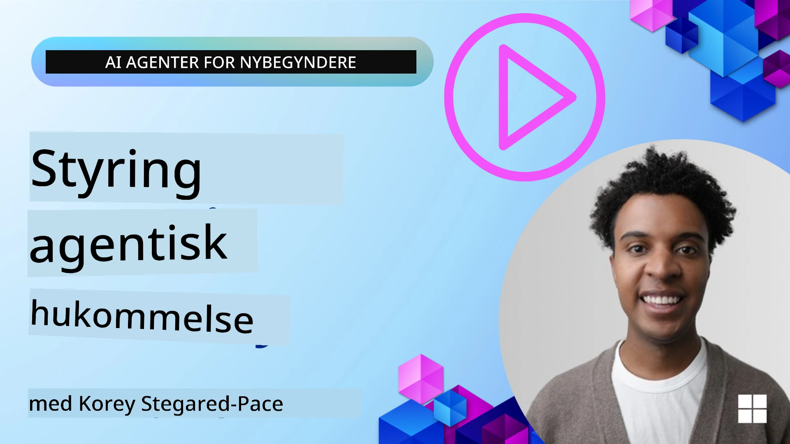

<!--
CO_OP_TRANSLATOR_METADATA:
{
  "original_hash": "a1d90991499ad697c4ad24decaf36968",
  "translation_date": "2025-12-09T12:26:05+00:00",
  "source_file": "13-agent-memory/README.md",
  "language_code": "da"
}
-->
# Hukommelse for AI-agenter 

Når man diskuterer de unikke fordele ved at skabe AI-agenter, er der to ting, der ofte nævnes: evnen til at bruge værktøjer til at udføre opgaver og evnen til at forbedre sig over tid. Hukommelse er fundamentet for at skabe selvforbedrende agenter, der kan levere bedre oplevelser for vores brugere.

I denne lektion vil vi se på, hvad hukommelse er for AI-agenter, og hvordan vi kan administrere og bruge den til fordel for vores applikationer.

## Introduktion

Denne lektion vil dække:

• **Forståelse af AI-agenters hukommelse**: Hvad hukommelse er, og hvorfor det er essentielt for agenter.

• **Implementering og lagring af hukommelse**: Praktiske metoder til at tilføje hukommelsesfunktioner til dine AI-agenter med fokus på kort- og langtidshukommelse.

• **At gøre AI-agenter selvforbedrende**: Hvordan hukommelse gør det muligt for agenter at lære af tidligere interaktioner og forbedre sig over tid.

## Tilgængelige implementeringer

Denne lektion inkluderer to omfattende notebook-tutorials:

• **[13-agent-memory.ipynb](./13-agent-memory.ipynb)**: Implementerer hukommelse ved hjælp af Mem0 og Azure AI Search med Semantic Kernel-rammen.

• **[13-agent-memory-cognee.ipynb](./13-agent-memory-cognee.ipynb)**: Implementerer struktureret hukommelse ved hjælp af Cognee, der automatisk opbygger en vidensgraf understøttet af embeddings, visualiserer grafen og muliggør intelligent søgning.

## Læringsmål

Efter at have gennemført denne lektion vil du vide, hvordan du:

• **Skelner mellem forskellige typer AI-agenters hukommelse**, herunder arbejdshukommelse, kort- og langtidshukommelse samt specialiserede former som persona- og episodisk hukommelse.

• **Implementerer og administrerer kort- og langtidshukommelse for AI-agenter** ved hjælp af Semantic Kernel-rammen, med værktøjer som Mem0, Cognee, Whiteboard-hukommelse og integration med Azure AI Search.

• **Forstår principperne bag selvforbedrende AI-agenter**, og hvordan robuste hukommelsessystemer bidrager til kontinuerlig læring og tilpasning.

## Forståelse af AI-agenters hukommelse

I sin kerne refererer **hukommelse for AI-agenter til de mekanismer, der gør det muligt for dem at gemme og genkalde information**. Denne information kan være specifikke detaljer om en samtale, brugerpræferencer, tidligere handlinger eller endda lærte mønstre.

Uden hukommelse er AI-applikationer ofte tilstandsløse, hvilket betyder, at hver interaktion starter fra bunden. Dette fører til en gentagende og frustrerende brugeroplevelse, hvor agenten "glemmer" tidligere kontekst eller præferencer.

### Hvorfor er hukommelse vigtig?

En agents intelligens er tæt forbundet med dens evne til at genkalde og bruge tidligere information. Hukommelse gør det muligt for agenter at være:

• **Reflekterende**: Lære af tidligere handlinger og resultater.

• **Interaktive**: Bevare kontekst i en igangværende samtale.

• **Proaktive og reaktive**: Forudse behov eller reagere passende baseret på historiske data.

• **Autonome**: Operere mere selvstændigt ved at trække på lagret viden.

Målet med at implementere hukommelse er at gøre agenter mere **pålidelige og kompetente**.

### Typer af hukommelse

#### Arbejdshukommelse

Tænk på dette som et stykke kladdepapir, som en agent bruger under en enkelt, igangværende opgave eller tankeproces. Det holder den umiddelbare information, der er nødvendig for at beregne det næste skridt.

For AI-agenter fanger arbejdshukommelse ofte de mest relevante oplysninger fra en samtale, selvom hele chat-historikken er lang eller afkortet. Den fokuserer på at udtrække nøgleelementer som krav, forslag, beslutninger og handlinger.

**Eksempel på arbejdshukommelse**

I en rejsebookingsagent kan arbejdshukommelsen fange brugerens aktuelle anmodning, såsom "Jeg vil gerne booke en rejse til Paris". Dette specifikke krav holdes i agentens umiddelbare kontekst for at styre den aktuelle interaktion.

#### Korttidshukommelse

Denne type hukommelse bevarer information i løbet af en enkelt samtale eller session. Det er konteksten for den aktuelle chat, der gør det muligt for agenten at referere til tidligere vendinger i dialogen.

**Eksempel på korttidshukommelse**

Hvis en bruger spørger, "Hvor meget koster en flybillet til Paris?" og derefter følger op med "Hvad med overnatning der?", sikrer korttidshukommelsen, at agenten ved, at "der" refererer til "Paris" inden for samme samtale.

#### Langtidshukommelse

Dette er information, der vedvarer på tværs af flere samtaler eller sessioner. Det gør det muligt for agenter at huske brugerpræferencer, historiske interaktioner eller generel viden over længere perioder. Dette er vigtigt for personalisering.

**Eksempel på langtidshukommelse**

En langtidshukommelse kan gemme, at "Ben nyder skiløb og udendørsaktiviteter, kan lide kaffe med udsigt til bjerge og ønsker at undgå avancerede skipister på grund af en tidligere skade". Denne information, lært fra tidligere interaktioner, påvirker anbefalinger i fremtidige rejseplanlægningssessioner og gør dem meget personlige.

#### Persona-hukommelse

Denne specialiserede hukommelsestype hjælper en agent med at udvikle en konsistent "personlighed" eller "persona". Det gør det muligt for agenten at huske detaljer om sig selv eller sin tiltænkte rolle, hvilket gør interaktioner mere flydende og fokuserede.

**Eksempel på persona-hukommelse**

Hvis rejseagenten er designet til at være en "ekspert i skiplanlægning", kan persona-hukommelsen forstærke denne rolle og påvirke dens svar, så de stemmer overens med en eksperts tone og viden.

#### Workflow/Episodisk hukommelse

Denne hukommelse gemmer rækkefølgen af trin, en agent tager under en kompleks opgave, inklusive succeser og fejl. Det er som at huske specifikke "episoder" eller tidligere oplevelser for at lære af dem.

**Eksempel på episodisk hukommelse**

Hvis agenten forsøgte at booke en specifik flyrejse, men det mislykkedes på grund af utilgængelighed, kunne den episodiske hukommelse registrere denne fejl, så agenten kan prøve alternative fly eller informere brugeren om problemet på en mere informeret måde under et efterfølgende forsøg.

#### Enhedshukommelse

Dette indebærer at udtrække og huske specifikke enheder (som personer, steder eller ting) og begivenheder fra samtaler. Det gør det muligt for agenten at opbygge en struktureret forståelse af nøgleelementer, der diskuteres.

**Eksempel på enhedshukommelse**

Fra en samtale om en tidligere rejse kan agenten udtrække "Paris", "Eiffeltårnet" og "middag på Le Chat Noir restaurant" som enheder. I en fremtidig interaktion kunne agenten huske "Le Chat Noir" og tilbyde at lave en ny reservation der.

#### Struktureret RAG (Retrieval Augmented Generation)

Mens RAG er en bredere teknik, fremhæves "Struktureret RAG" som en kraftfuld hukommelsesteknologi. Den udtrækker tæt, struktureret information fra forskellige kilder (samtaler, e-mails, billeder) og bruger det til at forbedre præcision, genkaldelse og hastighed i svar. I modsætning til klassisk RAG, der udelukkende er afhængig af semantisk lighed, arbejder Struktureret RAG med informationens iboende struktur.

**Eksempel på struktureret RAG**

I stedet for blot at matche nøgleord kunne Struktureret RAG analysere flyoplysninger (destination, dato, tid, flyselskab) fra en e-mail og gemme dem på en struktureret måde. Dette muliggør præcise forespørgsler som "Hvilket fly bookede jeg til Paris på tirsdag?"

## Implementering og lagring af hukommelse

Implementering af hukommelse for AI-agenter indebærer en systematisk proces med **hukommelsesstyring**, som inkluderer generering, lagring, hentning, integration, opdatering og endda "glemsel" (eller sletning) af information. Hentning er en særlig vigtig del.

### Specialiserede hukommelsesværktøjer

#### Mem0

En måde at lagre og administrere agenthukommelse på er ved hjælp af specialiserede værktøjer som Mem0. Mem0 fungerer som et vedvarende hukommelseslag, der gør det muligt for agenter at genkalde relevante interaktioner, gemme brugerpræferencer og faktuel kontekst samt lære af succeser og fejl over tid. Ideen her er, at tilstandsløse agenter bliver til tilstandsfulde.

Det fungerer gennem en **to-faset hukommelsespipeline: udtrækning og opdatering**. Først sendes meddelelser, der tilføjes til en agents tråd, til Mem0-tjenesten, som bruger en Large Language Model (LLM) til at opsummere samtalehistorik og udtrække nye minder. Derefter bestemmer en LLM-drevet opdateringsfase, om disse minder skal tilføjes, ændres eller slettes, og gemmer dem i en hybrid datalager, der kan inkludere vektor-, graf- og nøgle-værdidatabaser. Dette system understøtter også forskellige hukommelsestyper og kan inkorporere grafhukommelse til at administrere relationer mellem enheder.

#### Cognee

En anden kraftfuld tilgang er at bruge **Cognee**, en open-source semantisk hukommelse for AI-agenter, der transformerer strukturerede og ustrukturerede data til forespørgselsbare vidensgrafer understøttet af embeddings. Cognee tilbyder en **dual-store arkitektur**, der kombinerer vektorsimilaritetssøgning med grafrelationer, hvilket gør det muligt for agenter at forstå ikke kun, hvad information er lignende, men også hvordan begreber relaterer til hinanden.

Det udmærker sig ved **hybrid hentning**, der blander vektorsimilaritet, grafstruktur og LLM-reasoning - fra rå dataopslag til grafbevidst spørgsmål-svar. Systemet opretholder en **levende hukommelse**, der udvikler sig og vokser, mens den forbliver forespørgselsbar som én sammenhængende graf, der understøtter både kortvarig sessionskontekst og langvarig vedvarende hukommelse.

Cognee-notebook-tutorialen ([13-agent-memory-cognee.ipynb](./13-agent-memory-cognee.ipynb)) demonstrerer opbygningen af dette samlede hukommelseslag med praktiske eksempler på indtagelse af forskellige datakilder, visualisering af vidensgrafen og forespørgsler med forskellige søgestrategier skræddersyet til specifikke agentbehov.

### Lagring af hukommelse med RAG

Ud over specialiserede hukommelsesværktøjer som Mem0 kan du udnytte robuste søgetjenester som **Azure AI Search som backend til lagring og hentning af minder**, især for struktureret RAG.

Dette gør det muligt at forankre agentens svar med dine egne data og sikre mere relevante og præcise svar. Azure AI Search kan bruges til at lagre bruger-specifikke rejseminder, produktkataloger eller enhver anden domænespecifik viden.

Azure AI Search understøtter funktioner som **Struktureret RAG**, der udmærker sig ved at udtrække og hente tæt, struktureret information fra store datasæt som samtalehistorikker, e-mails eller endda billeder. Dette giver "supermenneskelig præcision og genkaldelse" sammenlignet med traditionelle tekstchunking- og embedding-tilgange.

## At gøre AI-agenter selvforbedrende

Et almindeligt mønster for selvforbedrende agenter indebærer introduktion af en **"vidensagent"**. Denne separate agent observerer hovedsamtalen mellem brugeren og den primære agent. Dens rolle er at:

1. **Identificere værdifuld information**: Bestemme, om nogen del af samtalen er værd at gemme som generel viden eller en specifik brugerpræference.

2. **Udtrække og opsummere**: Destillere den essentielle læring eller præference fra samtalen.

3. **Gem i en vidensbase**: Bevare denne udtrukne information, ofte i en vektordatabase, så den kan hentes senere.

4. **Forstærke fremtidige forespørgsler**: Når brugeren starter en ny forespørgsel, henter vidensagenten relevant lagret information og tilføjer det til brugerens prompt, hvilket giver vigtig kontekst til den primære agent (svarende til RAG).

### Optimeringer for hukommelse

• **Latensstyring**: For at undgå at bremse brugerinteraktioner kan en billigere, hurtigere model bruges først til hurtigt at tjekke, om information er værd at gemme eller hente, og kun aktivere den mere komplekse udtræknings-/hentningsproces, når det er nødvendigt.

• **Vedligeholdelse af vidensbase**: For en voksende vidensbase kan mindre hyppigt brugt information flyttes til "kold lagerplads" for at styre omkostninger.

## Har du flere spørgsmål om agenthukommelse?

Deltag i [Azure AI Foundry Discord](https://aka.ms/ai-agents/discord) for at møde andre lærende, deltage i kontortid og få svar på dine spørgsmål om AI-agenter.

---

<!-- CO-OP TRANSLATOR DISCLAIMER START -->
**Ansvarsfraskrivelse**:  
Dette dokument er blevet oversat ved hjælp af AI-oversættelsestjenesten [Co-op Translator](https://github.com/Azure/co-op-translator). Selvom vi bestræber os på nøjagtighed, skal det bemærkes, at automatiserede oversættelser kan indeholde fejl eller unøjagtigheder. Det originale dokument på dets oprindelige sprog bør betragtes som den autoritative kilde. For kritisk information anbefales professionel menneskelig oversættelse. Vi er ikke ansvarlige for eventuelle misforståelser eller fejltolkninger, der opstår som følge af brugen af denne oversættelse.
<!-- CO-OP TRANSLATOR DISCLAIMER END -->