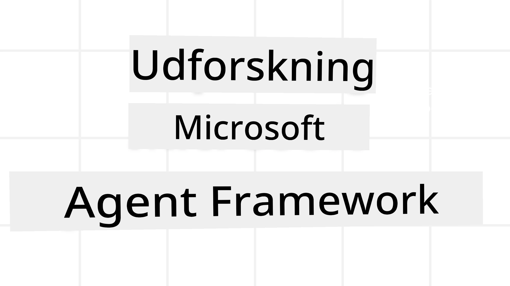
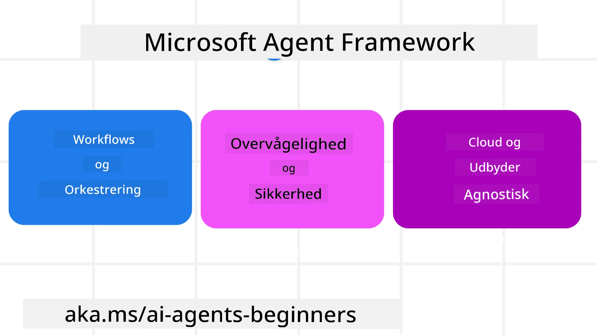
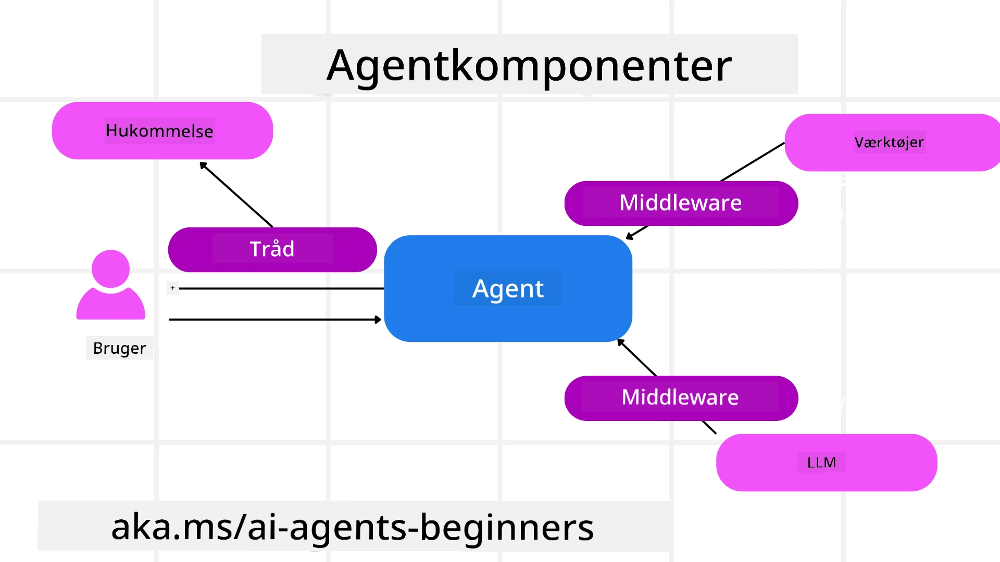

<!--
CO_OP_TRANSLATOR_METADATA:
{
  "original_hash": "19c4dab375acbc733855cc7f2f04edbc",
  "translation_date": "2025-10-02T15:44:06+00:00",
  "source_file": "14-microsoft-agent-framework/README.md",
  "language_code": "da"
}
-->
# Udforskning af Microsoft Agent Framework



### Introduktion

Denne lektion vil dække:

- Forståelse af Microsoft Agent Framework: Nøglefunktioner og værdi  
- Udforskning af nøglekoncepter i Microsoft Agent Framework
- Sammenligning af MAF med Semantic Kernel og AutoGen: Migrationsvejledning

## Læringsmål

Efter at have gennemført denne lektion vil du kunne:

- Bygge produktionsklare AI-agenter ved hjælp af Microsoft Agent Framework
- Anvende de centrale funktioner i Microsoft Agent Framework til dine agentbaserede brugsscenarier
- Migrere og integrere eksisterende agentbaserede frameworks og værktøjer  

## Kodeeksempler 

Kodeeksempler for [Microsoft Agent Framework (MAF)](https://aka.ms/ai-agents-beginners/agent-framewrok) kan findes i dette repository under filerne `xx-python-agent-framework` og `xx-dotnet-agent-framework`.

## Forståelse af Microsoft Agent Framework



[Microsoft Agent Framework (MAF)](https://aka.ms/ai-agents-beginners/agent-framewrok) bygger på erfaringer og læring fra Semantic Kernel og AutoGen. Det tilbyder fleksibilitet til at adressere en bred vifte af agentbaserede brugsscenarier, som ses både i produktions- og forskningsmiljøer, herunder:

- **Sekventiel agentorkestrering** i scenarier, hvor trin-for-trin arbejdsprocesser er nødvendige.
- **Samtidig orkestrering** i scenarier, hvor agenter skal udføre opgaver samtidig.
- **Gruppechat-orkestrering** i scenarier, hvor agenter kan samarbejde om én opgave.
- **Overdragelsesorkestrering** i scenarier, hvor agenter overdrager opgaven til hinanden, efterhånden som delopgaverne er fuldført.
- **Magnetisk orkestrering** i scenarier, hvor en lederagent opretter og ændrer en opgaveliste og koordinerer underagenter for at fuldføre opgaven.

For at levere AI-agenter i produktion inkluderer MAF også funktioner til:

- **Observabilitet** gennem brug af OpenTelemetry, hvor hver handling af AI-agenten, inklusive værktøjskald, orkestreringstrin, ræsonnement og ydelsesovervågning, kan spores via Azure AI Foundry-dashboards.
- **Sikkerhed** ved at hoste agenter direkte på Azure AI Foundry, som inkluderer sikkerhedskontroller såsom rollebaseret adgang, håndtering af private data og indbygget indholdssikkerhed.
- **Holdbarhed** da agenttråde og arbejdsprocesser kan pause, genoptage og komme sig efter fejl, hvilket muliggør længerevarende processer.
- **Kontrol** da arbejdsprocesser med menneskelig indblanding understøttes, hvor opgaver markeres som krævende menneskelig godkendelse.

Microsoft Agent Framework fokuserer også på at være interoperabel ved:

- **At være cloud-agnostisk** - Agenter kan køre i containere, lokalt og på tværs af forskellige clouds.
- **At være leverandør-agnostisk** - Agenter kan oprettes via din foretrukne SDK, inklusive Azure OpenAI og OpenAI.
- **Integration af åbne standarder** - Agenter kan anvende protokoller som Agent-to-Agent (A2A) og Model Context Protocol (MCP) til at opdage og bruge andre agenter og værktøjer.
- **Plugins og forbindelser** - Forbindelser kan oprettes til data- og hukommelsestjenester såsom Microsoft Fabric, SharePoint, Pinecone og Qdrant.

Lad os se på, hvordan disse funktioner anvendes på nogle af de centrale koncepter i Microsoft Agent Framework.

## Nøglekoncepter i Microsoft Agent Framework

### Agenter



**Oprettelse af agenter**

Agentoprettelse sker ved at definere inferenstjenesten (LLM-leverandør), et sæt instruktioner, som AI-agenten skal følge, og et tildelt `name`:

```python
agent = AzureOpenAIChatClient(credential=AzureCliCredential()).create_agent( instructions="You are good at recommending trips to customers based on their preferences.", name="TripRecommender" )
```

Ovenstående bruger `Azure OpenAI`, men agenter kan oprettes ved hjælp af en række tjenester, inklusive `Azure AI Foundry Agent Service`:

```python
AzureAIAgentClient(async_credential=credential).create_agent( name="HelperAgent", instructions="You are a helpful assistant." ) as agent
```

OpenAI `Responses`, `ChatCompletion` APIs

```python
agent = OpenAIResponsesClient().create_agent( name="WeatherBot", instructions="You are a helpful weather assistant.", )
```

```python
agent = OpenAIChatClient().create_agent( name="HelpfulAssistant", instructions="You are a helpful assistant.", )
```

eller fjernagenter ved hjælp af A2A-protokollen:

```python
agent = A2AAgent( name=agent_card.name, description=agent_card.description, agent_card=agent_card, url="https://your-a2a-agent-host" )
```

**Kørsel af agenter**

Agenter køres ved hjælp af metoderne `.run` eller `.run_stream` for enten ikke-streaming eller streaming svar.

```python
result = await agent.run("What are good places to visit in Amsterdam?")
print(result.text)
```

```python
async for update in agent.run_stream("What are the good places to visit in Amsterdam?"):
    if update.text:
        print(update.text, end="", flush=True)

```

Hver agentkørsel kan også have muligheder for at tilpasse parametre såsom `max_tokens`, som agenten bruger, `tools`, som agenten kan kalde, og endda den `model`, der bruges af agenten.

Dette er nyttigt i tilfælde, hvor specifikke modeller eller værktøjer er nødvendige for at fuldføre en brugers opgave.

**Værktøjer**

Værktøjer kan defineres både ved oprettelse af agenten:

```python
def get_attractions( location: Annotated[str, Field(description="The location to get the top tourist attractions for")], ) -> str: """Get the top tourist attractions for a given location.""" return f"The top attractions for {location} are." 


# When creating a ChatAgent directly 

agent = ChatAgent( chat_client=OpenAIChatClient(), instructions="You are a helpful assistant", tools=[get_attractions]

```

og også ved kørsel af agenten:

```python

result1 = await agent.run( "What's the best place to visit in Seattle?", tools=[get_attractions] # Tool provided for this run only )
```

**Agenttråde**

Agenttråde bruges til at håndtere samtaler med flere omgange. Tråde kan oprettes enten ved:

- Brug af `get_new_thread()`, som gør det muligt at gemme tråden over tid.
- Automatisk oprettelse af en tråd, når en agent køres, og kun have tråden aktiv under den aktuelle kørsel.

For at oprette en tråd ser koden sådan ud:

```python
# Create a new thread. 
thread = agent.get_new_thread() # Run the agent with the thread. 
response = await agent.run("Hello, I am here to help you book travel. Where would you like to go?", thread=thread)

```

Du kan derefter serialisere tråden for at gemme den til senere brug:

```python
# Create a new thread. 
thread = agent.get_new_thread() 

# Run the agent with the thread. 

response = await agent.run("Hello, how are you?", thread=thread) 

# Serialize the thread for storage. 

serialized_thread = await thread.serialize() 

# Deserialize the thread state after loading from storage. 

resumed_thread = await agent.deserialize_thread(serialized_thread)
```

**Agent Middleware**

Agenter interagerer med værktøjer og LLM'er for at fuldføre brugerens opgaver. I visse scenarier ønsker vi at udføre eller spore handlinger mellem disse interaktioner. Agent middleware gør det muligt for os at gøre dette gennem:

*Function Middleware*

Denne middleware giver os mulighed for at udføre en handling mellem agenten og en funktion/værktøj, som den vil kalde. Et eksempel på, hvornår dette ville blive brugt, er når du måske vil logge på funktionskaldet.

I koden nedenfor definerer `next`, om den næste middleware eller den faktiske funktion skal kaldes.

```python
async def logging_function_middleware(
    context: FunctionInvocationContext,
    next: Callable[[FunctionInvocationContext], Awaitable[None]],
) -> None:
    """Function middleware that logs function execution."""
    # Pre-processing: Log before function execution
    print(f"[Function] Calling {context.function.name}")

    # Continue to next middleware or function execution
    await next(context)

    # Post-processing: Log after function execution
    print(f"[Function] {context.function.name} completed")
```

*Chat Middleware*

Denne middleware giver os mulighed for at udføre eller logge en handling mellem agenten og anmodningerne mellem LLM.

Dette indeholder vigtig information såsom de `messages`, der sendes til AI-tjenesten.

```python
async def logging_chat_middleware(
    context: ChatContext,
    next: Callable[[ChatContext], Awaitable[None]],
) -> None:
    """Chat middleware that logs AI interactions."""
    # Pre-processing: Log before AI call
    print(f"[Chat] Sending {len(context.messages)} messages to AI")

    # Continue to next middleware or AI service
    await next(context)

    # Post-processing: Log after AI response
    print("[Chat] AI response received")

```

**Agenthukommelse**

Som dækket i lektionen `Agentic Memory` er hukommelse et vigtigt element for at gøre det muligt for agenten at operere over forskellige kontekster. MAF tilbyder flere forskellige typer hukommelse:

*In-Memory Storage*

Dette er hukommelsen, der gemmes i tråde under applikationens runtime.

```python
# Create a new thread. 
thread = agent.get_new_thread() # Run the agent with the thread. 
response = await agent.run("Hello, I am here to help you book travel. Where would you like to go?", thread=thread)
```

*Persistent Messages*

Denne hukommelse bruges, når samtalehistorik gemmes på tværs af forskellige sessioner. Den defineres ved hjælp af `chat_message_store_factory`:

```python
from agent_framework import ChatMessageStore

# Create a custom message store
def create_message_store():
    return ChatMessageStore()

agent = ChatAgent(
    chat_client=OpenAIChatClient(),
    instructions="You are a Travel assistant.",
    chat_message_store_factory=create_message_store
)

```

*Dynamisk hukommelse*

Denne hukommelse tilføjes til konteksten, før agenter køres. Disse hukommelser kan gemmes i eksterne tjenester såsom mem0:

```python
from agent_framework.mem0 import Mem0Provider

# Using Mem0 for advanced memory capabilities
memory_provider = Mem0Provider(
    api_key="your-mem0-api-key",
    user_id="user_123",
    application_id="my_app"
)

agent = ChatAgent(
    chat_client=OpenAIChatClient(),
    instructions="You are a helpful assistant with memory.",
    context_providers=memory_provider
)

```

**Agent Observabilitet**

Observabilitet er vigtigt for at bygge pålidelige og vedligeholdelige agentbaserede systemer. MAF integrerer med OpenTelemetry for at give tracing og målinger for bedre observabilitet.

```python
from agent_framework.observability import get_tracer, get_meter

tracer = get_tracer()
meter = get_meter()
with tracer.start_as_current_span("my_custom_span"):
    # do something
    pass
counter = meter.create_counter("my_custom_counter")
counter.add(1, {"key": "value"})
```

### Arbejdsprocesser

MAF tilbyder arbejdsprocesser, der er foruddefinerede trin til at fuldføre en opgave og inkluderer AI-agenter som komponenter i disse trin.

Arbejdsprocesser består af forskellige komponenter, der giver bedre kontrol over flowet. Arbejdsprocesser muliggør også **multi-agent orkestrering** og **checkpointing** for at gemme arbejdsprocesstatus.

De centrale komponenter i en arbejdsproces er:

**Executors**

Executors modtager inputmeddelelser, udfører deres tildelte opgaver og producerer derefter en outputmeddelelse. Dette driver arbejdsprocessen frem mod at fuldføre den større opgave. Executors kan enten være AI-agenter eller brugerdefineret logik.

**Edges**

Edges bruges til at definere flowet af meddelelser i en arbejdsproces. Disse kan være:

*Direct Edges* - Enkle en-til-en forbindelser mellem executors:

```python
from agent_framework import WorkflowBuilder

builder = WorkflowBuilder()
builder.add_edge(source_executor, target_executor)
builder.set_start_executor(source_executor)
workflow = builder.build()
```

*Conditional Edges* - Aktiveres, når en bestemt betingelse er opfyldt. For eksempel, når hotelværelser ikke er tilgængelige, kan en executor foreslå andre muligheder.

*Switch-case Edges* - Ruter meddelelser til forskellige executors baseret på definerede betingelser. For eksempel, hvis en rejsekunde har prioriteret adgang, vil deres opgaver blive håndteret gennem en anden arbejdsproces.

*Fan-out Edges* - Sender én meddelelse til flere mål.

*Fan-in Edges* - Samler flere meddelelser fra forskellige executors og sender dem til ét mål.

**Events**

For at give bedre observabilitet i arbejdsprocesser tilbyder MAF indbyggede events for eksekvering, herunder:

- `WorkflowStartedEvent`  - Arbejdsproceseksekvering begynder
- `WorkflowOutputEvent` - Arbejdsprocessen producerer et output
- `WorkflowErrorEvent` - Arbejdsprocessen støder på en fejl
- `ExecutorInvokeEvent`  - Executor begynder at behandle
- `ExecutorCompleteEvent`  -  Executor afslutter behandling
- `RequestInfoEvent` - En anmodning udstedes

## Migration fra andre frameworks (Semantic Kernel og AutoGen)

### Forskelle mellem MAF og Semantic Kernel

**Forenklet agentoprettelse**

Semantic Kernel kræver oprettelse af en Kernel-instans for hver agent. MAF bruger en forenklet tilgang ved at bruge udvidelser til de vigtigste leverandører.

```python
agent = AzureOpenAIChatClient(credential=AzureCliCredential()).create_agent( instructions="You are good at reccomending trips to customers based on their preferences.", name="TripRecommender" )
```

**Agenttrådoprettelse**

Semantic Kernel kræver, at tråde oprettes manuelt. I MAF tildeles agenten direkte en tråd.

```python
thread = agent.get_new_thread() # Run the agent with the thread. 
```

**Registrering af værktøjer**

I Semantic Kernel registreres værktøjer til Kernel, og Kernel overføres derefter til agenten. I MAF registreres værktøjer direkte under agentoprettelsesprocessen.

```python
agent = ChatAgent( chat_client=OpenAIChatClient(), instructions="You are a helpful assistant", tools=[get_attractions]
```

### Forskelle mellem MAF og AutoGen

**Teams vs Workflows**

`Teams` er strukturen for begivenhedsdrevet aktivitet med agenter i AutoGen. MAF bruger `Workflows`, der ruter data til executors gennem en grafbaseret arkitektur.

**Oprettelse af værktøjer**

AutoGen bruger `FunctionTool` til at pakke funktioner, som agenter kan kalde. MAF bruger @ai_function, som fungerer på samme måde, men også automatisk udleder skemaer for hver funktion.

**Agentadfærd**

Agenter er som standard enkelt-turn agenter i AutoGen, medmindre `max_tool_iterations` er sat til en højere værdi. I MAF er `ChatAgent` som standard multi-turn, hvilket betyder, at den fortsætter med at kalde værktøjer, indtil brugerens opgave er fuldført.

## Kodeeksempler 

Kodeeksempler for Microsoft Agent Framework kan findes i dette repository under filerne `xx-python-agent-framework` og `xx-dotnet-agent-framework`.

## Har du flere spørgsmål om Microsoft Agent Framework?

Deltag i [Azure AI Foundry Discord](https://aka.ms/ai-agents/discord) for at møde andre lærende, deltage i kontortid og få svar på dine spørgsmål om AI-agenter.

---

**Ansvarsfraskrivelse**:  
Dette dokument er blevet oversat ved hjælp af AI-oversættelsestjenesten [Co-op Translator](https://github.com/Azure/co-op-translator). Selvom vi bestræber os på at sikre nøjagtighed, skal det bemærkes, at automatiserede oversættelser kan indeholde fejl eller unøjagtigheder. Det originale dokument på dets oprindelige sprog bør betragtes som den autoritative kilde. For kritisk information anbefales professionel menneskelig oversættelse. Vi påtager os ikke ansvar for misforståelser eller fejltolkninger, der måtte opstå som følge af brugen af denne oversættelse.