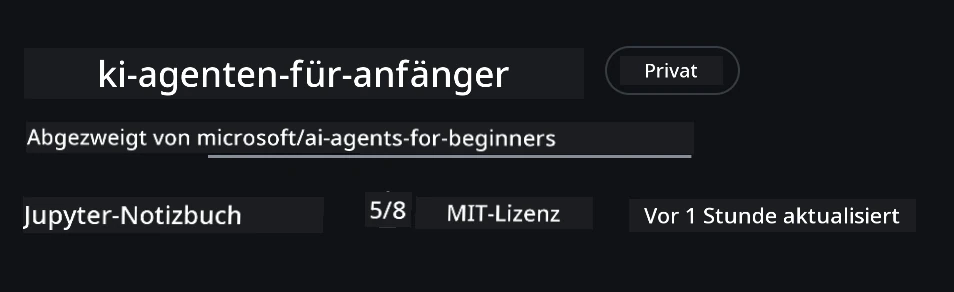
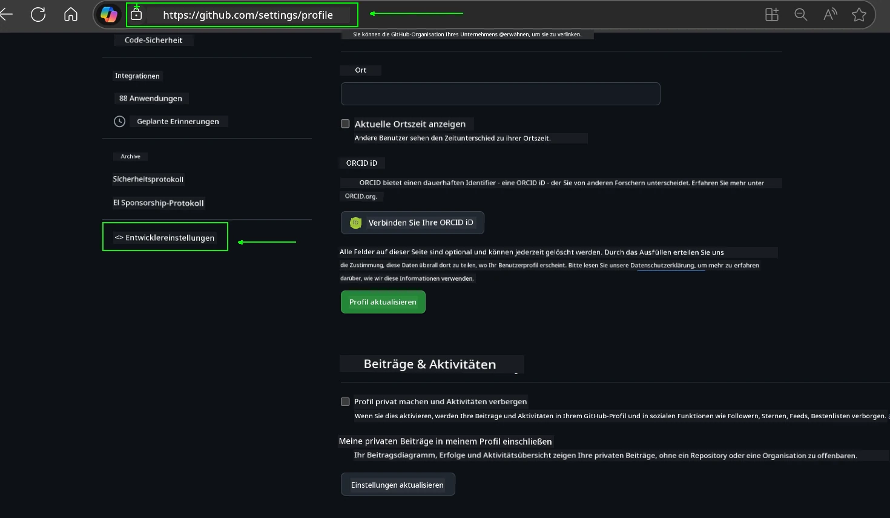
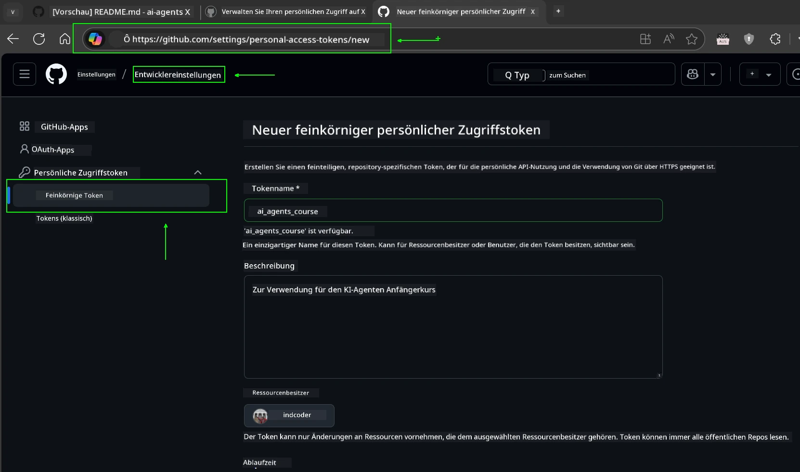
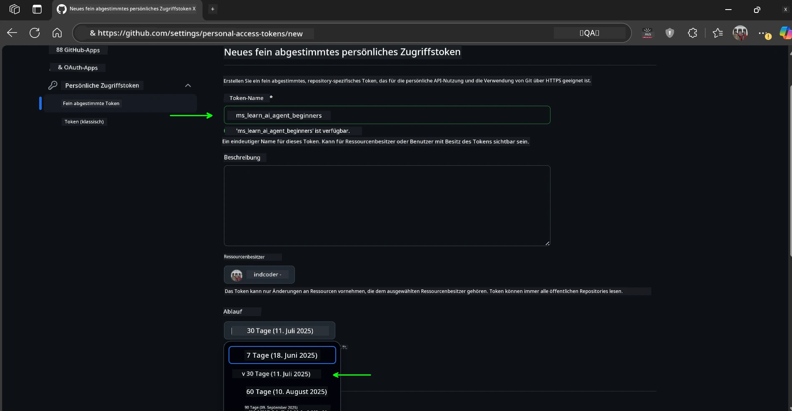
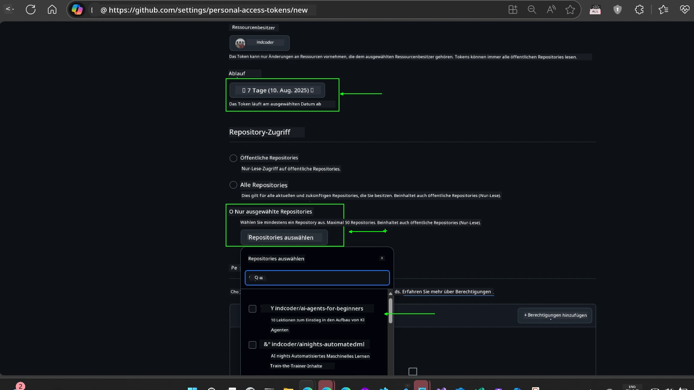
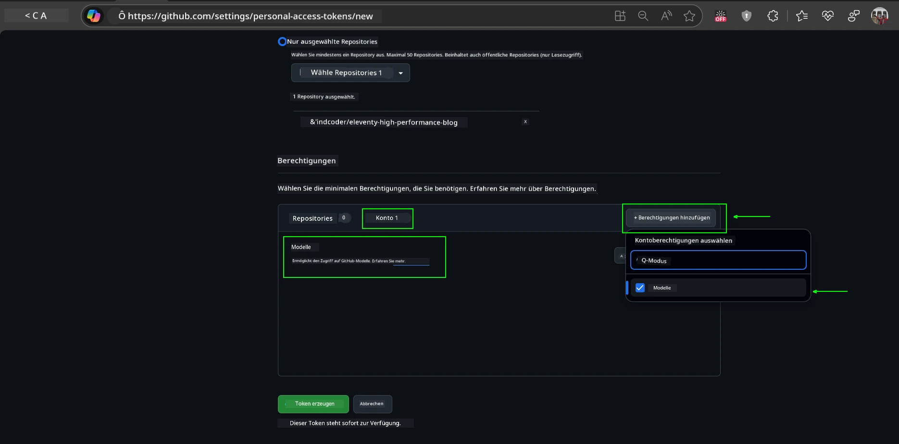
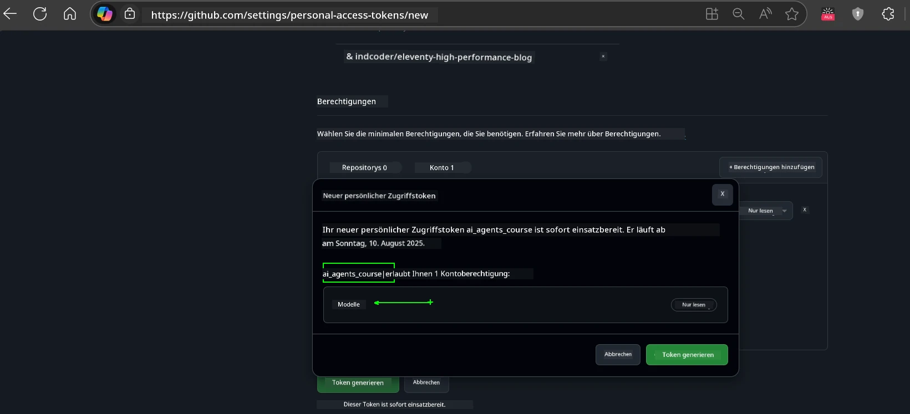
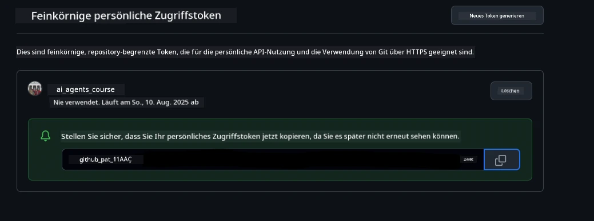
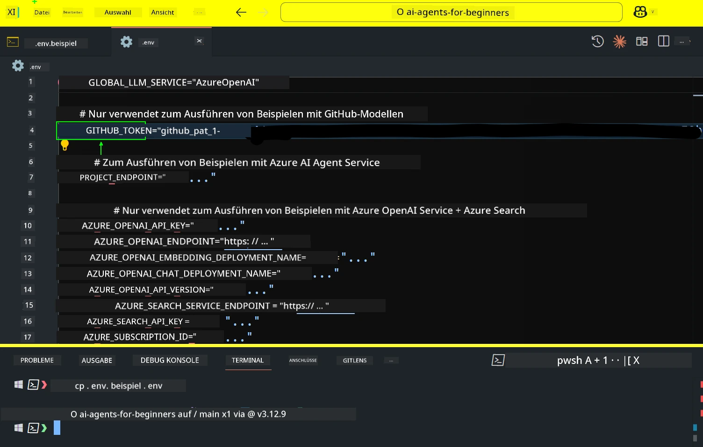
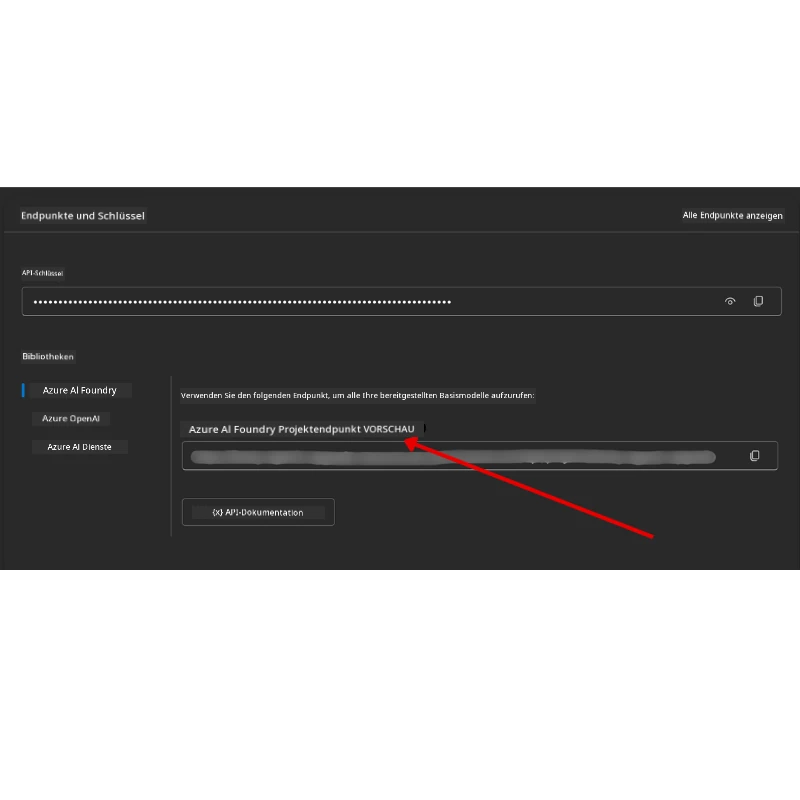

<!--
CO_OP_TRANSLATOR_METADATA:
{
  "original_hash": "63b1a8f6e840df15934935b728e569f0",
  "translation_date": "2025-12-03T13:44:21+00:00",
  "source_file": "00-course-setup/README.md",
  "language_code": "de"
}
-->
# Kursvorbereitung

## Einführung

In dieser Lektion erfahren Sie, wie Sie die Codebeispiele dieses Kurses ausführen können.

## Treten Sie anderen Lernenden bei und holen Sie sich Unterstützung

Bevor Sie Ihr Repository klonen, treten Sie dem [AI Agents For Beginners Discord-Kanal](https://aka.ms/ai-agents/discord) bei, um Hilfe bei der Einrichtung zu erhalten, Fragen zum Kurs zu stellen oder sich mit anderen Lernenden zu vernetzen.

## Klonen oder Forken dieses Repositories

Um zu beginnen, klonen oder forken Sie bitte das GitHub-Repository. Dadurch erhalten Sie Ihre eigene Version des Kursmaterials, mit der Sie den Code ausführen, testen und anpassen können!

Dies können Sie tun, indem Sie auf den Link klicken, um <a href="https://github.com/microsoft/ai-agents-for-beginners/fork" target="_blank">das Repository zu forken</a>.

Sie sollten nun Ihre eigene geforkte Version dieses Kurses unter folgendem Link haben:



### Shallow Clone (empfohlen für Workshops / Codespaces)

  >Das vollständige Repository kann groß sein (~3 GB), wenn Sie die gesamte Historie und alle Dateien herunterladen. Wenn Sie nur am Workshop teilnehmen oder nur einige Lektionen benötigen, vermeidet ein Shallow Clone (oder Sparse Clone) den Großteil des Downloads, indem die Historie gekürzt und/oder Blobs übersprungen werden.

#### Schnelles Shallow Clone — minimale Historie, alle Dateien

Ersetzen Sie `<your-username>` in den untenstehenden Befehlen durch Ihre Fork-URL (oder die Upstream-URL, falls bevorzugt).

Um nur die neueste Commit-Historie zu klonen (kleiner Download):

```bash|powershell
git clone --depth 1 https://github.com/<your-username>/ai-agents-for-beginners.git
```

Um einen bestimmten Branch zu klonen:

```bash|powershell
git clone --depth 1 --branch <branch-name> https://github.com/<your-username>/ai-agents-for-beginners.git
```

#### Partielles (Sparse) Clone — minimale Blobs + nur ausgewählte Ordner

Dies verwendet partielles Klonen und Sparse-Checkout (erfordert Git 2.25+ und wird mit moderner Git-Version mit Unterstützung für partielles Klonen empfohlen):

```bash|powershell
git clone --depth 1 --filter=blob:none --sparse https://github.com/<your-username>/ai-agents-for-beginners.git
```

Wechseln Sie in den Repository-Ordner:

```bash|powershell
cd ai-agents-for-beginners
```

Geben Sie dann die gewünschten Ordner an (Beispiel unten zeigt zwei Ordner):

```bash|powershell
git sparse-checkout set 00-course-setup 01-intro-to-ai-agents
```

Nachdem Sie die Dateien geklont und überprüft haben, können Sie, falls Sie nur Dateien benötigen und Speicherplatz freigeben möchten (keine Git-Historie), die Repository-Metadaten löschen (💀irreversibel — Sie verlieren alle Git-Funktionen: keine Commits, Pulls, Pushes oder Zugriff auf die Historie).

```bash
# zsh/bash
rm -rf .git
```

```powershell
# PowerShell
Remove-Item -Recurse -Force .git
```

#### Verwendung von GitHub Codespaces (empfohlen, um lokale große Downloads zu vermeiden)

- Erstellen Sie einen neuen Codespace für dieses Repository über die [GitHub-Benutzeroberfläche](https://github.com/codespaces).  

- Führen Sie im Terminal des neu erstellten Codespaces einen der oben genannten Shallow/Sparse Clone-Befehle aus, um nur die benötigten Lektionenordner in den Codespace-Arbeitsbereich zu bringen.
- Optional: Entfernen Sie nach dem Klonen innerhalb von Codespaces `.git`, um zusätzlichen Speicherplatz zurückzugewinnen (siehe obenstehende Löschbefehle).
- Hinweis: Wenn Sie das Repository direkt in Codespaces öffnen möchten (ohne zusätzliches Klonen), beachten Sie, dass Codespaces die Devcontainer-Umgebung erstellt und möglicherweise mehr als nötig bereitstellt. Das Klonen einer Shallow-Kopie innerhalb eines frischen Codespaces gibt Ihnen mehr Kontrolle über die Speichernutzung.

#### Tipps

- Ersetzen Sie immer die Klon-URL durch Ihre Fork, wenn Sie bearbeiten/committen möchten.
- Wenn Sie später mehr Historie oder Dateien benötigen, können Sie diese abrufen oder Sparse-Checkout anpassen, um zusätzliche Ordner einzuschließen.

## Ausführen des Codes

Dieser Kurs bietet eine Reihe von Jupyter Notebooks, die Sie ausführen können, um praktische Erfahrungen beim Erstellen von KI-Agenten zu sammeln.

Die Codebeispiele verwenden entweder:

**Erfordert GitHub-Konto - Kostenlos**:

1) Semantic Kernel Agent Framework + GitHub Models Marketplace. Beschriftet als (semantic-kernel.ipynb)
2) AutoGen Framework + GitHub Models Marketplace. Beschriftet als (autogen.ipynb)

**Erfordert Azure-Abonnement**:

3) Azure AI Foundry + Azure AI Agent Service. Beschriftet als (azureaiagent.ipynb)

Wir empfehlen Ihnen, alle drei Arten von Beispielen auszuprobieren, um herauszufinden, welche am besten für Sie geeignet ist.

Die von Ihnen gewählte Option bestimmt, welche Einrichtungsschritte Sie unten befolgen müssen:

## Anforderungen

- Python 3.12+
  - **HINWEIS**: Wenn Sie Python3.12 nicht installiert haben, stellen Sie sicher, dass Sie es installieren. Erstellen Sie dann Ihr venv mit python3.12, um sicherzustellen, dass die richtigen Versionen aus der requirements.txt-Datei installiert werden.
  
    >Beispiel

    Erstellen Sie ein Python venv-Verzeichnis:

    ```bash|powershell
    python -m venv venv
    ```

    Aktivieren Sie dann die venv-Umgebung für:

    ```bash
    # zsh/bash
    source venv/bin/activate
    ```
  
    ```dos
    # Command Prompt for Windows
    venv\Scripts\activate
    ```

- .NET 10+: Für die Beispielcodes, die .NET verwenden, stellen Sie sicher, dass Sie [.NET 10 SDK](https://dotnet.microsoft.com/download/dotnet/10.0) oder später installieren. Überprüfen Sie dann Ihre installierte .NET SDK-Version:

    ```bash|powershell
    dotnet --list-sdks
    ```

- Ein GitHub-Konto - Für den Zugriff auf den GitHub Models Marketplace
- Azure-Abonnement - Für den Zugriff auf Azure AI Foundry
- Azure AI Foundry-Konto - Für den Zugriff auf den Azure AI Agent Service

Wir haben eine `requirements.txt`-Datei im Stammverzeichnis dieses Repositories enthalten, die alle erforderlichen Python-Pakete enthält, um die Codebeispiele auszuführen.

Sie können sie installieren, indem Sie den folgenden Befehl in Ihrem Terminal im Stammverzeichnis des Repositories ausführen:

```bash|powershell
pip install -r requirements.txt
```

Wir empfehlen, eine Python-virtuelle Umgebung zu erstellen, um Konflikte und Probleme zu vermeiden.

## Einrichtung von VSCode

Stellen Sie sicher, dass Sie die richtige Python-Version in VSCode verwenden.


## Einrichtung für Beispiele mit GitHub-Modellen 

### Schritt 1: Abrufen Ihres GitHub Personal Access Token (PAT)

Dieser Kurs nutzt den GitHub Models Marketplace, der kostenlosen Zugang zu Large Language Models (LLMs) bietet, die Sie zum Erstellen von KI-Agenten verwenden werden.

Um die GitHub-Modelle zu verwenden, müssen Sie ein [GitHub Personal Access Token](https://docs.github.com/en/authentication/keeping-your-account-and-data-secure/managing-your-personal-access-tokens) erstellen.

Dies können Sie tun, indem Sie zu Ihren <a href="https://github.com/settings/personal-access-tokens" target="_blank">Einstellungen für persönliche Zugriffstoken</a> in Ihrem GitHub-Konto gehen.

Bitte folgen Sie dem [Prinzip der minimalen Rechtevergabe](https://docs.github.com/en/get-started/learning-to-code/storing-your-secrets-safely) beim Erstellen Ihres Tokens. Das bedeutet, dass Sie dem Token nur die Berechtigungen geben sollten, die es benötigt, um die Codebeispiele in diesem Kurs auszuführen.

1. Wählen Sie die Option `Fine-grained tokens` auf der linken Seite Ihres Bildschirms, indem Sie zu den **Entwicklereinstellungen** navigieren.

   

   Wählen Sie dann `Generate new token`.

   

2. Geben Sie einen beschreibenden Namen für Ihr Token ein, der seinen Zweck widerspiegelt, damit es später leicht identifiziert werden kann.

    🔐 Empfehlung für Token-Dauer

    Empfohlene Dauer: 30 Tage
    Für eine sicherere Haltung können Sie eine kürzere Dauer wählen – z. B. 7 Tage 🛡️
    Es ist eine großartige Möglichkeit, sich ein persönliches Ziel zu setzen und den Kurs abzuschließen, während Ihre Lernmotivation hoch ist 🚀.

    

3. Begrenzen Sie den Umfang des Tokens auf Ihren Fork dieses Repositories.

    

4. Beschränken Sie die Berechtigungen des Tokens: Unter **Permissions** klicken Sie auf die Registerkarte **Account** und dann auf die Schaltfläche "+ Add permissions". Es erscheint ein Dropdown-Menü. Suchen Sie nach **Models** und aktivieren Sie das Kontrollkästchen dafür.

    

5. Überprüfen Sie die erforderlichen Berechtigungen, bevor Sie das Token generieren. 

6. Bevor Sie das Token generieren, stellen Sie sicher, dass Sie bereit sind, das Token an einem sicheren Ort wie einem Passwort-Manager-Tresor zu speichern, da es nach der Erstellung nicht erneut angezeigt wird. 

Kopieren Sie Ihr neu erstelltes Token. Sie werden es nun Ihrer `.env`-Datei hinzufügen, die in diesem Kurs enthalten ist.

### Schritt 2: Erstellen Ihrer `.env`-Datei

Um Ihre `.env`-Datei zu erstellen, führen Sie den folgenden Befehl in Ihrem Terminal aus.

```bash
# zsh/bash
cp .env.example .env
```

```powershell
# PowerShell
Copy-Item .env.example .env
```

Dies kopiert die Beispieldatei und erstellt eine `.env`-Datei in Ihrem Verzeichnis, in der Sie die Werte für die Umgebungsvariablen ausfüllen.

Nachdem Sie Ihr Token kopiert haben, öffnen Sie die `.env`-Datei in Ihrem bevorzugten Texteditor und fügen Sie Ihr Token in das Feld `GITHUB_TOKEN` ein.



Sie sollten nun in der Lage sein, die Codebeispiele dieses Kurses auszuführen.

## Einrichtung für Beispiele mit Azure AI Foundry und Azure AI Agent Service

### Schritt 1: Abrufen Ihres Azure-Projektendpunkts

Befolgen Sie die Schritte zur Erstellung eines Hubs und Projekts in Azure AI Foundry, die hier zu finden sind: [Hub-Ressourcenübersicht](https://learn.microsoft.com/azure/ai-foundry/concepts/ai-resources)

Nachdem Sie Ihr Projekt erstellt haben, müssen Sie die Verbindungszeichenfolge für Ihr Projekt abrufen.

Dies können Sie tun, indem Sie zur **Übersicht**-Seite Ihres Projekts im Azure AI Foundry-Portal gehen.



### Schritt 2: Erstellen Ihrer `.env`-Datei

Um Ihre `.env`-Datei zu erstellen, führen Sie den folgenden Befehl in Ihrem Terminal aus.

```bash
# zsh/bash
cp .env.example .env
```

```powershell
# PowerShell
Copy-Item .env.example .env
```

Dies kopiert die Beispieldatei und erstellt eine `.env`-Datei in Ihrem Verzeichnis, in der Sie die Werte für die Umgebungsvariablen ausfüllen.

Nachdem Sie Ihr Token kopiert haben, öffnen Sie die `.env`-Datei in Ihrem bevorzugten Texteditor und fügen Sie Ihr Token in das Feld `PROJECT_ENDPOINT` ein.

### Schritt 3: Anmeldung bei Azure

Als Sicherheitsbest Practice verwenden wir [schlüssellose Authentifizierung](https://learn.microsoft.com/azure/developer/ai/keyless-connections?tabs=csharp%2Cazure-cli?WT.mc_id=academic-105485-koreyst), um sich mit Microsoft Entra ID bei Azure OpenAI zu authentifizieren. 

Öffnen Sie als Nächstes ein Terminal und führen Sie `az login --use-device-code` aus, um sich bei Ihrem Azure-Konto anzumelden.

Nachdem Sie sich angemeldet haben, wählen Sie Ihr Abonnement im Terminal aus.

## Zusätzliche Umgebungsvariablen - Azure Search und Azure OpenAI 

Für die Agentic RAG-Lektion - Lektion 5 - gibt es Beispiele, die Azure Search und Azure OpenAI verwenden.

Wenn Sie diese Beispiele ausführen möchten, müssen Sie die folgenden Umgebungsvariablen zu Ihrer `.env`-Datei hinzufügen:

### Übersichtsseite (Projekt)

- `AZURE_SUBSCRIPTION_ID` - Überprüfen Sie **Projektdetails** auf der **Übersicht**-Seite Ihres Projekts.

- `AZURE_AI_PROJECT_NAME` - Schauen Sie oben auf der **Übersicht**-Seite Ihres Projekts.

- `AZURE_OPENAI_SERVICE` - Finden Sie dies im Tab **Eingeschlossene Fähigkeiten** für **Azure OpenAI Service** auf der **Übersicht**-Seite.

### Management Center

- `AZURE_OPENAI_RESOURCE_GROUP` - Gehen Sie zu **Projekteigenschaften** auf der **Übersicht**-Seite des **Management Centers**.

- `GLOBAL_LLM_SERVICE` - Unter **Verbundene Ressourcen** finden Sie den Verbindungsnamen für **Azure AI Services**. Falls nicht aufgeführt, überprüfen Sie das **Azure-Portal** unter Ihrer Ressourcengruppe nach dem Ressourcennamen der AI Services.

### Modelle + Endpunkte-Seite

- `AZURE_OPENAI_EMBEDDING_DEPLOYMENT_NAME` - Wählen Sie Ihr Embedding-Modell (z. B. `text-embedding-ada-002`) und notieren Sie den **Bereitstellungsnamen** aus den Modelldetails.

- `AZURE_OPENAI_CHAT_DEPLOYMENT_NAME` - Wählen Sie Ihr Chat-Modell (z. B. `gpt-4o-mini`) und notieren Sie den **Bereitstellungsnamen** aus den Modelldetails.

### Azure-Portal

- `AZURE_OPENAI_ENDPOINT` - Suchen Sie nach **Azure AI Services**, klicken Sie darauf, gehen Sie dann zu **Ressourcenverwaltung**, **Schlüssel und Endpunkt**, scrollen Sie zu den "Azure OpenAI Endpunkten" und kopieren Sie denjenigen, der "Language APIs" sagt.

- `AZURE_OPENAI_API_KEY` - Kopieren Sie auf demselben Bildschirm SCHLÜSSEL 1 oder SCHLÜSSEL 2.

- `AZURE_SEARCH_SERVICE_ENDPOINT` - Finden Sie Ihre **Azure AI Search**-Ressource, klicken Sie darauf und sehen Sie **Übersicht**.

- `AZURE_SEARCH_API_KEY` - Gehen Sie dann zu **Einstellungen** und dann **Schlüssel**, um den primären oder sekundären Administratorschlüssel zu kopieren.

### Externe Webseite

- `AZURE_OPENAI_API_VERSION` - Besuchen Sie die Seite [API-Version-Lebenszyklus](https://learn.microsoft.com/azure/ai-services/openai/api-version-deprecation#latest-ga-api-release) unter **Neueste GA API-Version**.

### Einrichtung schlüsselloser Authentifizierung

Anstatt Ihre Anmeldeinformationen fest zu codieren, verwenden wir eine schlüssellose Verbindung mit Azure OpenAI. Dazu importieren wir `DefaultAzureCredential` und rufen später die Funktion `DefaultAzureCredential` auf, um die Anmeldeinformationen zu erhalten.

```python
# Python
from azure.identity import DefaultAzureCredential, InteractiveBrowserCredential
```

## Irgendwo festgefahren?
Wenn Sie Probleme mit diesem Setup haben, treten Sie unserem <a href="https://discord.gg/kzRShWzttr" target="_blank">Azure AI Community Discord</a> bei oder <a href="https://github.com/microsoft/ai-agents-for-beginners/issues?WT.mc_id=academic-105485-koreyst" target="_blank">erstellen Sie ein Issue</a>.

## Nächste Lektion

Sie sind jetzt bereit, den Code für diesen Kurs auszuführen. Viel Spaß beim Lernen über die Welt der KI-Agenten!

[Einführung in KI-Agenten und Anwendungsfälle von Agenten](../01-intro-to-ai-agents/README.md)

---

<!-- CO-OP TRANSLATOR DISCLAIMER START -->
**Haftungsausschluss**:  
Dieses Dokument wurde mit dem KI-Übersetzungsdienst [Co-op Translator](https://github.com/Azure/co-op-translator) übersetzt. Obwohl wir uns um Genauigkeit bemühen, beachten Sie bitte, dass automatisierte Übersetzungen Fehler oder Ungenauigkeiten enthalten können. Das Originaldokument in seiner ursprünglichen Sprache sollte als maßgebliche Quelle betrachtet werden. Für kritische Informationen wird eine professionelle menschliche Übersetzung empfohlen. Wir übernehmen keine Haftung für Missverständnisse oder Fehlinterpretationen, die sich aus der Nutzung dieser Übersetzung ergeben.
<!-- CO-OP TRANSLATOR DISCLAIMER END -->