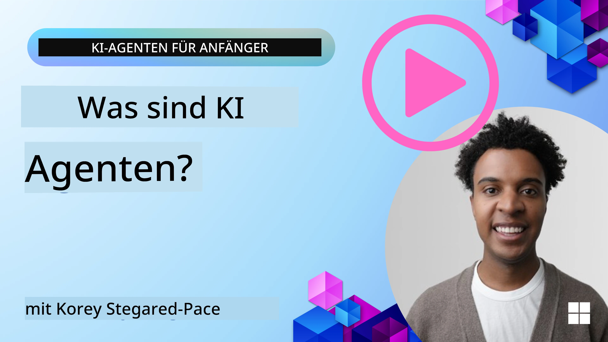
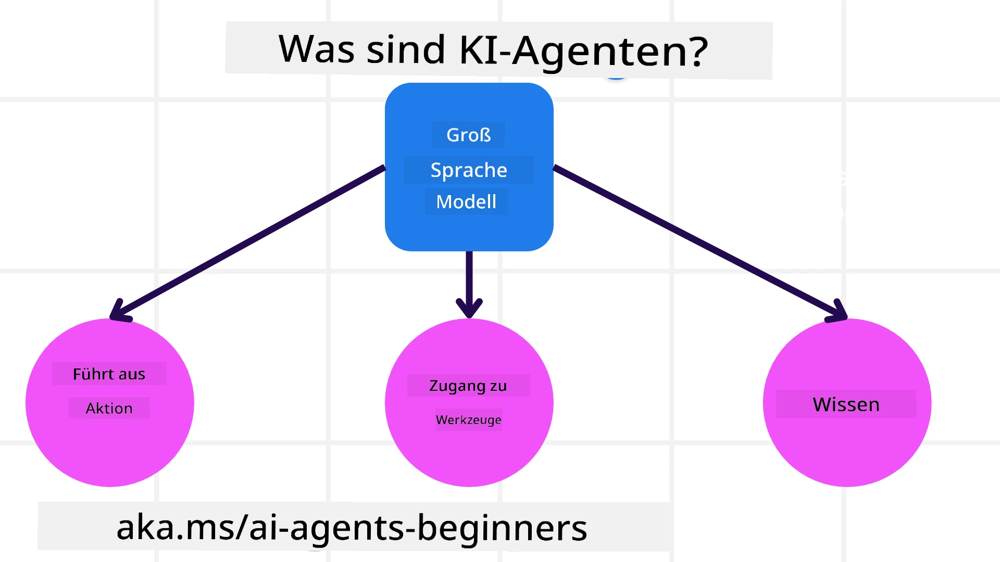
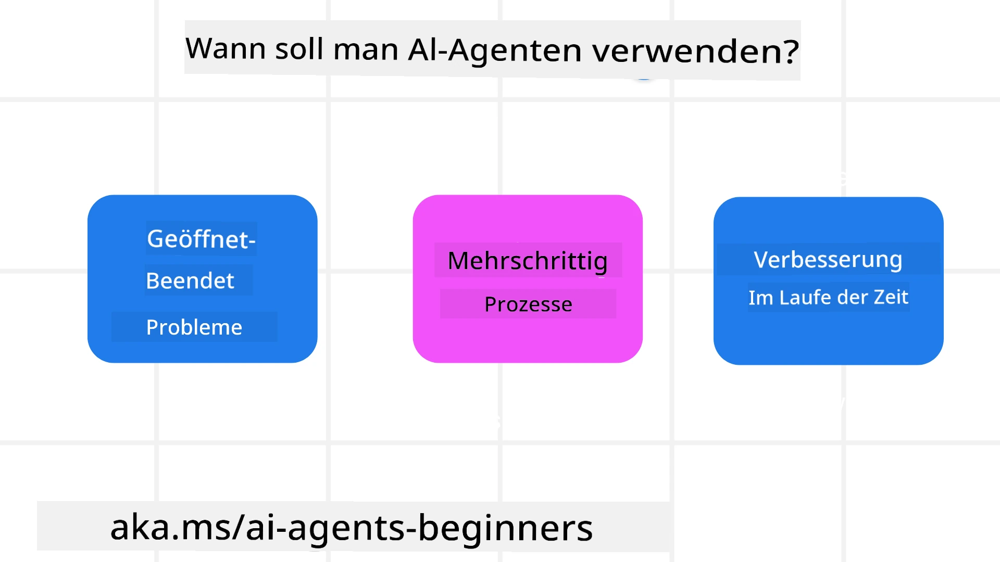

<!--
CO_OP_TRANSLATOR_METADATA:
{
  "original_hash": "cdd28bc00816d2773bb2b5968d782abc",
  "translation_date": "2025-11-11T10:48:55+00:00",
  "source_file": "01-intro-to-ai-agents/README.md",
  "language_code": "de"
}
-->

> _(Klicken Sie auf das Bild oben, um das Video zu dieser Lektion anzusehen)_

# Einführung in KI-Agenten und Anwendungsfälle für Agenten

Willkommen zum Kurs "KI-Agenten für Anfänger"! Dieser Kurs vermittelt grundlegendes Wissen und praktische Beispiele für den Aufbau von KI-Agenten.

Treten Sie der <a href="https://discord.gg/kzRShWzttr" target="_blank">Azure AI Discord Community</a> bei, um andere Lernende und Entwickler von KI-Agenten kennenzulernen und alle Fragen zu diesem Kurs zu stellen.

Um mit diesem Kurs zu beginnen, verschaffen wir uns zunächst ein besseres Verständnis davon, was KI-Agenten sind und wie wir sie in den Anwendungen und Arbeitsabläufen, die wir erstellen, einsetzen können.

## Einführung

Diese Lektion behandelt:

- Was sind KI-Agenten und welche verschiedenen Arten von Agenten gibt es?
- Welche Anwendungsfälle eignen sich am besten für KI-Agenten und wie können sie uns helfen?
- Was sind einige der grundlegenden Bausteine beim Entwerfen von agentischen Lösungen?

## Lernziele
Nach Abschluss dieser Lektion sollten Sie in der Lage sein:

- Die Konzepte von KI-Agenten zu verstehen und wie sie sich von anderen KI-Lösungen unterscheiden.
- KI-Agenten effizient anzuwenden.
- Agentische Lösungen produktiv für Benutzer und Kunden zu gestalten.

## Definition von KI-Agenten und Arten von KI-Agenten

### Was sind KI-Agenten?

KI-Agenten sind **Systeme**, die es **großen Sprachmodellen (LLMs)** ermöglichen, **Aktionen auszuführen**, indem sie ihre Fähigkeiten erweitern und ihnen **Zugriff auf Werkzeuge** und **Wissen** geben.

Lassen Sie uns diese Definition in kleinere Teile zerlegen:

- **System** - Es ist wichtig, Agenten nicht nur als einzelne Komponente zu betrachten, sondern als ein System aus vielen Komponenten. Auf der grundlegenden Ebene bestehen die Komponenten eines KI-Agenten aus:
  - **Umgebung** - Der definierte Raum, in dem der KI-Agent arbeitet. Zum Beispiel könnte die Umgebung eines Reisebuchungs-Agenten das Buchungssystem sein, das der Agent verwendet, um Aufgaben zu erledigen.
  - **Sensoren** - Umgebungen enthalten Informationen und geben Rückmeldungen. KI-Agenten nutzen Sensoren, um diese Informationen über den aktuellen Zustand der Umgebung zu sammeln und zu interpretieren. Im Beispiel des Reisebuchungs-Agenten könnte das Buchungssystem Informationen wie Hotelverfügbarkeit oder Flugpreise bereitstellen.
  - **Aktoren** - Sobald der KI-Agent den aktuellen Zustand der Umgebung erfasst hat, bestimmt er für die aktuelle Aufgabe, welche Aktion ausgeführt werden soll, um die Umgebung zu verändern. Für den Reisebuchungs-Agenten könnte dies bedeuten, ein verfügbares Zimmer für den Benutzer zu buchen.

**Große Sprachmodelle** - Das Konzept von Agenten existierte bereits vor der Entwicklung von LLMs. Der Vorteil beim Aufbau von KI-Agenten mit LLMs liegt in ihrer Fähigkeit, menschliche Sprache und Daten zu interpretieren. Diese Fähigkeit ermöglicht es LLMs, Umgebungsinformationen zu verstehen und einen Plan zur Veränderung der Umgebung zu erstellen.

**Aktionen ausführen** - Außerhalb von KI-Agenten-Systemen sind LLMs auf Situationen beschränkt, in denen die Aktion darin besteht, Inhalte oder Informationen basierend auf einer Benutzeranfrage zu generieren. Innerhalb von KI-Agenten-Systemen können LLMs Aufgaben erledigen, indem sie die Anfrage des Benutzers interpretieren und die in ihrer Umgebung verfügbaren Werkzeuge nutzen.

**Zugriff auf Werkzeuge** - Welche Werkzeuge dem LLM zur Verfügung stehen, wird durch 1) die Umgebung, in der es arbeitet, und 2) den Entwickler des KI-Agenten definiert. Im Beispiel des Reisebuchungs-Agenten sind die Werkzeuge des Agenten durch die im Buchungssystem verfügbaren Operationen begrenzt, und/oder der Entwickler kann den Zugriff des Agenten auf Werkzeuge wie Flüge einschränken.

**Gedächtnis+Wissen** - Das Gedächtnis kann kurzfristig im Kontext des Gesprächs zwischen Benutzer und Agent sein. Langfristig, außerhalb der von der Umgebung bereitgestellten Informationen, können KI-Agenten auch Wissen aus anderen Systemen, Diensten, Werkzeugen und sogar anderen Agenten abrufen. Im Beispiel des Reisebuchungs-Agenten könnte dieses Wissen Informationen über die Reisevorlieben des Benutzers aus einer Kundendatenbank sein.

### Die verschiedenen Arten von Agenten

Nachdem wir eine allgemeine Definition von KI-Agenten haben, schauen wir uns einige spezifische Agententypen an und wie sie auf einen Reisebuchungs-Agenten angewendet werden könnten.

| **Agententyp**                | **Beschreibung**                                                                                                                       | **Beispiel**                                                                                                                                                                                                                   |
| ----------------------------- | ------------------------------------------------------------------------------------------------------------------------------------- | ----------------------------------------------------------------------------------------------------------------------------------------------------------------------------------------------------------------------------- |
| **Einfache Reflex-Agenten**      | Führen sofortige Aktionen basierend auf vordefinierten Regeln aus.                                                                                  | Der Reiseagent interpretiert den Kontext einer E-Mail und leitet Beschwerden über Reisen an den Kundenservice weiter.                                                                                                                          |
| **Modellbasierte Reflex-Agenten** | Führen Aktionen basierend auf einem Modell der Welt und Änderungen an diesem Modell aus.                                                              | Der Reiseagent priorisiert Routen mit signifikanten Preisänderungen basierend auf Zugriff auf historische Preisdaten.                                                                                                             |
| **Zielbasierte Agenten**         | Erstellen Pläne, um spezifische Ziele zu erreichen, indem sie das Ziel interpretieren und Aktionen bestimmen, um es zu erreichen.                                  | Der Reiseagent bucht eine Reise, indem er notwendige Reisevorkehrungen (Auto, öffentliche Verkehrsmittel, Flüge) vom aktuellen Standort zum Zielort bestimmt.                                                                                |
| **Nutzenbasierte Agenten**      | Berücksichtigen Präferenzen und wägen numerisch Kompromisse ab, um zu bestimmen, wie Ziele erreicht werden können.                                               | Der Reiseagent maximiert den Nutzen, indem er Bequemlichkeit gegen Kosten abwägt, wenn er Reisen bucht.                                                                                                                                          |
| **Lernende Agenten**           | Verbessern sich im Laufe der Zeit, indem sie auf Feedback reagieren und ihre Aktionen entsprechend anpassen.                                                        | Der Reiseagent verbessert sich, indem er Kundenfeedback aus Umfragen nach der Reise nutzt, um Anpassungen für zukünftige Buchungen vorzunehmen.                                                                                                               |
| **Hierarchische Agenten**       | Bestehen aus mehreren Agenten in einem gestuften System, wobei höherstufige Agenten Aufgaben in Unteraufgaben für niedrigstufige Agenten aufteilen. | Der Reiseagent storniert eine Reise, indem er die Aufgabe in Unteraufgaben aufteilt (z. B. spezifische Buchungen stornieren) und niedrigstufige Agenten diese erledigen lässt, die dem höherstufigen Agenten Bericht erstatten.                                     |
| **Multi-Agenten-Systeme (MAS)** | Agenten erledigen Aufgaben unabhängig, entweder kooperativ oder wettbewerbsorientiert.                                                           | Kooperativ: Mehrere Agenten buchen spezifische Reisedienstleistungen wie Hotels, Flüge und Unterhaltung. Wettbewerbsorientiert: Mehrere Agenten verwalten und konkurrieren um einen gemeinsamen Hotelbuchungskalender, um Kunden im Hotel unterzubringen. |

## Wann sollten KI-Agenten eingesetzt werden?

Im vorherigen Abschnitt haben wir den Anwendungsfall des Reiseagenten verwendet, um zu erklären, wie die verschiedenen Arten von Agenten in unterschiedlichen Szenarien der Reisebuchung eingesetzt werden können. Wir werden diese Anwendung im gesamten Kurs weiter verwenden.

Schauen wir uns die Arten von Anwendungsfällen an, für die KI-Agenten am besten geeignet sind:

- **Offene Probleme** - Ermöglichen dem LLM, die notwendigen Schritte zur Erledigung einer Aufgabe zu bestimmen, da diese nicht immer in einen Workflow fest codiert werden können.
- **Mehrstufige Prozesse** - Aufgaben, die ein gewisses Maß an Komplexität erfordern, bei denen der KI-Agent Werkzeuge oder Informationen über mehrere Schritte hinweg nutzen muss, anstatt sie in einem einzigen Durchgang abzurufen.  
- **Verbesserung im Laufe der Zeit** - Aufgaben, bei denen der Agent sich im Laufe der Zeit durch Feedback entweder aus seiner Umgebung oder von Benutzern verbessern kann, um einen besseren Nutzen zu bieten.

Weitere Überlegungen zur Verwendung von KI-Agenten behandeln wir in der Lektion "Vertrauenswürdige KI-Agenten entwickeln".

## Grundlagen von agentischen Lösungen

### Agentenentwicklung

Der erste Schritt beim Entwerfen eines KI-Agenten-Systems besteht darin, die Werkzeuge, Aktionen und Verhaltensweisen zu definieren. In diesem Kurs konzentrieren wir uns auf die Verwendung des **Azure AI Agent Service**, um unsere Agenten zu definieren. Er bietet Funktionen wie:

- Auswahl offener Modelle wie OpenAI, Mistral und Llama
- Nutzung lizenzierter Daten durch Anbieter wie Tripadvisor
- Verwendung standardisierter OpenAPI 3.0-Werkzeuge

### Agentische Muster

Die Kommunikation mit LLMs erfolgt über Prompts. Aufgrund der halbautonomen Natur von KI-Agenten ist es nicht immer möglich oder erforderlich, das LLM nach einer Änderung der Umgebung manuell erneut zu prompten. Wir verwenden **agentische Muster**, die es uns ermöglichen, das LLM über mehrere Schritte hinweg auf skalierbare Weise zu prompten.

Dieser Kurs ist in einige der derzeit beliebten agentischen Muster unterteilt.

### Agentische Frameworks

Agentische Frameworks ermöglichen es Entwicklern, agentische Muster durch Code umzusetzen. Diese Frameworks bieten Vorlagen, Plugins und Werkzeuge für eine bessere Zusammenarbeit von KI-Agenten. Diese Vorteile bieten Möglichkeiten für bessere Beobachtbarkeit und Fehlerbehebung von KI-Agenten-Systemen.

In diesem Kurs werden wir das forschungsorientierte AutoGen-Framework und das produktionsreife Agent-Framework von Semantic Kernel erkunden.

## Beispielcodes

- Python: [Agent Framework](./code_samples/01-python-agent-framework.ipynb)
- .NET: [Agent Framework](./code_samples/01-dotnet-agent-framework.md)

## Haben Sie weitere Fragen zu KI-Agenten?

Treten Sie dem [Azure AI Foundry Discord](https://aka.ms/ai-agents/discord) bei, um andere Lernende zu treffen, an Sprechstunden teilzunehmen und Ihre Fragen zu KI-Agenten beantwortet zu bekommen.

## Vorherige Lektion

[Kurssetup](../00-course-setup/README.md)

## Nächste Lektion

[Erkundung von agentischen Frameworks](../02-explore-agentic-frameworks/README.md)

---

<!-- CO-OP TRANSLATOR DISCLAIMER START -->
**Haftungsausschluss**:  
Dieses Dokument wurde mit dem KI-Übersetzungsdienst [Co-op Translator](https://github.com/Azure/co-op-translator) übersetzt. Obwohl wir uns um Genauigkeit bemühen, beachten Sie bitte, dass automatisierte Übersetzungen Fehler oder Ungenauigkeiten enthalten können. Das Originaldokument in seiner ursprünglichen Sprache sollte als maßgebliche Quelle betrachtet werden. Für kritische Informationen wird eine professionelle menschliche Übersetzung empfohlen. Wir übernehmen keine Haftung für Missverständnisse oder Fehlinterpretationen, die sich aus der Nutzung dieser Übersetzung ergeben.
<!-- CO-OP TRANSLATOR DISCLAIMER END -->