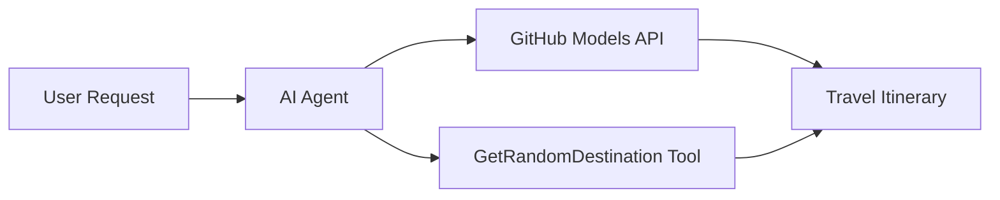

<!--
CO_OP_TRANSLATOR_METADATA:
{
  "original_hash": "5f351412e934f0833c8c821a0a60efaf",
  "translation_date": "2025-11-13T10:54:47+00:00",
  "source_file": "01-intro-to-ai-agents/code_samples/01-dotnet-agent-framework.md",
  "language_code": "de"
}
-->
# 🌍 KI-Reiseberater mit Microsoft Agent Framework (.NET)

## 📋 Szenarioübersicht

Dieses Beispiel zeigt, wie man einen intelligenten Reiseplanungs-Agenten mit dem Microsoft Agent Framework für .NET erstellt. Der Agent kann automatisch personalisierte Tagesausflugspläne für zufällige Reiseziele weltweit erstellen.

### Hauptfunktionen:

- 🎲 **Zufällige Zielauswahl**: Verwendet ein benutzerdefiniertes Tool, um Urlaubsorte auszuwählen
- 🗺️ **Intelligente Reiseplanung**: Erstellt detaillierte Tagespläne
- 🔄 **Echtzeit-Streaming**: Unterstützt sowohl sofortige als auch gestreamte Antworten
- 🛠️ **Integration benutzerdefinierter Tools**: Zeigt, wie die Fähigkeiten des Agenten erweitert werden können

## 🔧 Technische Architektur

### Kerntechnologien

- **Microsoft Agent Framework**: Neueste .NET-Implementierung für die Entwicklung von KI-Agenten
- **GitHub Models Integration**: Nutzt den Inferenzdienst von GitHub für KI-Modelle
- **OpenAI API-Kompatibilität**: Verwendet OpenAI-Clientbibliotheken mit benutzerdefinierten Endpunkten
- **Sichere Konfiguration**: API-Schlüsselverwaltung basierend auf Umgebungsvariablen

### Hauptkomponenten

1. **AIAgent**: Der Hauptorchestrator des Agenten, der den Gesprächsfluss steuert
2. **Benutzerdefinierte Tools**: Die Funktion `GetRandomDestination()` steht dem Agenten zur Verfügung
3. **Chat-Client**: Gesprächsschnittstelle, die von GitHub Models unterstützt wird
4. **Streaming-Unterstützung**: Echtzeit-Antwortgenerierung

### Integrationsmuster



## 🚀 Erste Schritte

### Voraussetzungen

- [.NET 10 SDK](https://dotnet.microsoft.com/download/dotnet/10.0) oder höher
- [GitHub Models API-Zugriffstoken](https://docs.github.com/github-models/github-models-at-scale/using-your-own-api-keys-in-github-models)

### Erforderliche Umgebungsvariablen

```bash
# zsh/bash
export GH_TOKEN=<your_github_token>
export GH_ENDPOINT=https://models.github.ai/inference
export GH_MODEL_ID=openai/gpt-5-mini
```

```powershell
# PowerShell
$env:GH_TOKEN = "<your_github_token>"
$env:GH_ENDPOINT = "https://models.github.ai/inference"
$env:GH_MODEL_ID = "openai/gpt-5-mini"
```

### Beispielcode

Um das Codebeispiel auszuführen,

```bash
# zsh/bash
chmod +x ./01-dotnet-agent-framework.cs
./01-dotnet-agent-framework.cs
```

Oder mit dem dotnet CLI:

```bash
dotnet run ./01-dotnet-agent-framework.cs
```

Siehe [`01-dotnet-agent-framework.cs`](../../../../01-intro-to-ai-agents/code_samples/01-dotnet-agent-framework.cs) für den vollständigen Code.

```csharp
#!/usr/bin/dotnet run

#:package Microsoft.Extensions.AI@9.*
#:package Microsoft.Agents.AI.OpenAI@1.*-*

using System.ClientModel;
using System.ComponentModel;

using Microsoft.Agents.AI;
using Microsoft.Extensions.AI;

using OpenAI;

// Tool Function: Random Destination Generator
// This static method will be available to the agent as a callable tool
// The [Description] attribute helps the AI understand when to use this function
// This demonstrates how to create custom tools for AI agents
[Description("Provides a random vacation destination.")]
static string GetRandomDestination()
{
    // List of popular vacation destinations around the world
    // The agent will randomly select from these options
    var destinations = new List<string>
    {
        "Paris, France",
        "Tokyo, Japan",
        "New York City, USA",
        "Sydney, Australia",
        "Rome, Italy",
        "Barcelona, Spain",
        "Cape Town, South Africa",
        "Rio de Janeiro, Brazil",
        "Bangkok, Thailand",
        "Vancouver, Canada"
    };

    // Generate random index and return selected destination
    // Uses System.Random for simple random selection
    var random = new Random();
    int index = random.Next(destinations.Count);
    return destinations[index];
}

// Extract configuration from environment variables
// Retrieve the GitHub Models API endpoint, defaults to https://models.github.ai/inference if not specified
// Retrieve the model ID, defaults to openai/gpt-5-mini if not specified
// Retrieve the GitHub token for authentication, throws exception if not specified
var github_endpoint = Environment.GetEnvironmentVariable("GH_ENDPOINT") ?? "https://models.github.ai/inference";
var github_model_id = Environment.GetEnvironmentVariable("GH_MODEL_ID") ?? "openai/gpt-5-mini";
var github_token = Environment.GetEnvironmentVariable("GH_TOKEN") ?? throw new InvalidOperationException("GH_TOKEN is not set.");

// Configure OpenAI Client Options
// Create configuration options to point to GitHub Models endpoint
// This redirects OpenAI client calls to GitHub's model inference service
var openAIOptions = new OpenAIClientOptions()
{
    Endpoint = new Uri(github_endpoint)
};

// Initialize OpenAI Client with GitHub Models Configuration
// Create OpenAI client using GitHub token for authentication
// Configure it to use GitHub Models endpoint instead of OpenAI directly
var openAIClient = new OpenAIClient(new ApiKeyCredential(github_token), openAIOptions);

// Create AI Agent with Travel Planning Capabilities
// Initialize OpenAI client, get chat client for specified model, and create AI agent
// Configure agent with travel planning instructions and random destination tool
// The agent can now plan trips using the GetRandomDestination function
AIAgent agent = openAIClient
    .GetChatClient(github_model_id)
    .CreateAIAgent(
        instructions: "You are a helpful AI Agent that can help plan vacations for customers at random destinations",
        tools: [AIFunctionFactory.Create(GetRandomDestination)]
    );

// Execute Agent: Plan a Day Trip
// Run the agent with streaming enabled for real-time response display
// Shows the agent's thinking and response as it generates the content
// Provides better user experience with immediate feedback
await foreach (var update in agent.RunStreamingAsync("Plan me a day trip"))
{
    await Task.Delay(10);
    Console.Write(update);
}
```

## 🎓 Wichtige Erkenntnisse

1. **Agentenarchitektur**: Das Microsoft Agent Framework bietet einen sauberen, typsicheren Ansatz zur Erstellung von KI-Agenten in .NET
2. **Tool-Integration**: Funktionen, die mit `[Description]`-Attributen versehen sind, werden als verfügbare Tools für den Agenten bereitgestellt
3. **Konfigurationsmanagement**: Umgebungsvariablen und sichere Anmeldeinformationen folgen den Best Practices von .NET
4. **OpenAI-Kompatibilität**: Die Integration von GitHub Models funktioniert nahtlos über OpenAI-kompatible APIs

## 🔗 Zusätzliche Ressourcen

- [Microsoft Agent Framework Dokumentation](https://learn.microsoft.com/agent-framework)
- [GitHub Models Marketplace](https://github.com/marketplace?type=models)
- [Microsoft.Extensions.AI](https://learn.microsoft.com/dotnet/ai/microsoft-extensions-ai)
- [.NET Single File Apps](https://devblogs.microsoft.com/dotnet/announcing-dotnet-run-app)

---

<!-- CO-OP TRANSLATOR DISCLAIMER START -->
**Haftungsausschluss**:  
Dieses Dokument wurde mit dem KI-Übersetzungsdienst [Co-op Translator](https://github.com/Azure/co-op-translator) übersetzt. Obwohl wir uns um Genauigkeit bemühen, beachten Sie bitte, dass automatisierte Übersetzungen Fehler oder Ungenauigkeiten enthalten können. Das Originaldokument in seiner ursprünglichen Sprache sollte als maßgebliche Quelle betrachtet werden. Für kritische Informationen wird eine professionelle menschliche Übersetzung empfohlen. Wir übernehmen keine Haftung für Missverständnisse oder Fehlinterpretationen, die sich aus der Nutzung dieser Übersetzung ergeben.
<!-- CO-OP TRANSLATOR DISCLAIMER END -->