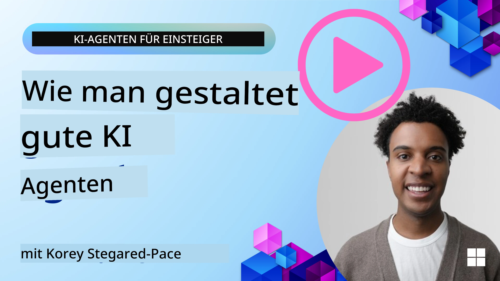
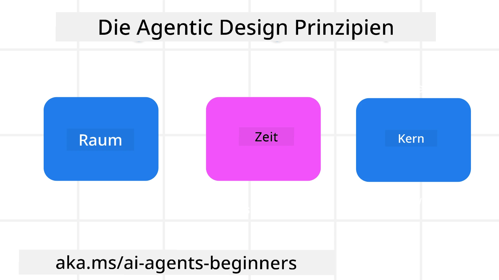

<!--
CO_OP_TRANSLATOR_METADATA:
{
  "original_hash": "d71524fe83a23829ae7a23b4031aaac8",
  "translation_date": "2025-11-13T10:57:20+00:00",
  "source_file": "03-agentic-design-patterns/README.md",
  "language_code": "de"
}
-->

> _(Klicken Sie auf das obige Bild, um das Video zu dieser Lektion anzusehen)_
# Prinzipien des agentischen Designs für KI

## Einführung

Es gibt viele Ansätze, um KI-Agentensysteme zu entwickeln. Da Mehrdeutigkeit in der Gestaltung generativer KI eher ein Merkmal als ein Fehler ist, fällt es Ingenieuren manchmal schwer, überhaupt einen Ausgangspunkt zu finden. Wir haben eine Reihe von nutzerzentrierten UX-Designprinzipien entwickelt, um Entwicklern zu ermöglichen, kundenorientierte Agentensysteme zu erstellen, die ihre geschäftlichen Anforderungen erfüllen. Diese Designprinzipien sind keine verbindliche Architektur, sondern ein Ausgangspunkt für Teams, die Agentenerfahrungen definieren und entwickeln.

Im Allgemeinen sollten Agenten:

- Menschliche Fähigkeiten erweitern und skalieren (Brainstorming, Problemlösung, Automatisierung usw.)
- Wissenslücken schließen (z. B. Einführung in Wissensbereiche, Übersetzungen usw.)
- Zusammenarbeit erleichtern und unterstützen, auf die Weise, wie wir als Individuen bevorzugt mit anderen arbeiten
- Uns zu besseren Versionen unserer selbst machen (z. B. Lebenscoach/Aufgabenmanager, Unterstützung beim Erlernen emotionaler Regulation und Achtsamkeitsfähigkeiten, Aufbau von Resilienz usw.)

## Diese Lektion behandelt

- Was sind die Prinzipien des agentischen Designs
- Welche Richtlinien sollten bei der Umsetzung dieser Designprinzipien beachtet werden
- Beispiele für die Anwendung der Designprinzipien

## Lernziele

Nach Abschluss dieser Lektion können Sie:

1. Erklären, was die Prinzipien des agentischen Designs sind
2. Die Richtlinien für die Anwendung der Prinzipien des agentischen Designs erläutern
3. Verstehen, wie man einen Agenten basierend auf den Prinzipien des agentischen Designs erstellt

## Die Prinzipien des agentischen Designs

### Agent (Raum)

Dies ist die Umgebung, in der der Agent agiert. Diese Prinzipien beeinflussen, wie wir Agenten für die Interaktion in physischen und digitalen Welten gestalten.

- **Verbinden, nicht ersetzen** – helfen, Menschen mit anderen Menschen, Ereignissen und umsetzbarem Wissen zu verbinden, um Zusammenarbeit und Verbindung zu ermöglichen.
- Agenten helfen, Ereignisse, Wissen und Menschen zu verknüpfen.
- Agenten bringen Menschen näher zusammen. Sie sind nicht dazu gedacht, Menschen zu ersetzen oder herabzusetzen.
- **Leicht zugänglich, aber gelegentlich unsichtbar** – der Agent agiert größtenteils im Hintergrund und gibt uns nur dann Hinweise, wenn es relevant und angemessen ist.
  - Der Agent ist für autorisierte Nutzer auf jedem Gerät oder jeder Plattform leicht auffindbar und zugänglich.
  - Der Agent unterstützt multimodale Eingaben und Ausgaben (Ton, Stimme, Text usw.).
  - Der Agent kann nahtlos zwischen Vordergrund und Hintergrund wechseln; zwischen proaktiv und reaktiv, je nach Wahrnehmung der Nutzerbedürfnisse.
  - Der Agent kann unsichtbar agieren, doch sein Hintergrundprozess und die Zusammenarbeit mit anderen Agenten sind für den Nutzer transparent und kontrollierbar.

### Agent (Zeit)

Dies beschreibt, wie der Agent über die Zeit hinweg agiert. Diese Prinzipien beeinflussen, wie wir Agenten gestalten, die über Vergangenheit, Gegenwart und Zukunft hinweg interagieren.

- **Vergangenheit**: Reflexion über die Geschichte, die sowohl Zustand als auch Kontext umfasst.
  - Der Agent liefert relevantere Ergebnisse basierend auf der Analyse umfangreicher historischer Daten, die über das Ereignis, die Personen oder Zustände hinausgehen.
  - Der Agent stellt Verbindungen zu vergangenen Ereignissen her und reflektiert aktiv Erinnerungen, um auf aktuelle Situationen einzugehen.
- **Jetzt**: Anstoßen statt nur benachrichtigen.
  - Der Agent verfolgt einen umfassenden Ansatz bei der Interaktion mit Menschen. Wenn ein Ereignis eintritt, geht der Agent über statische Benachrichtigungen oder andere formale Statis hinaus. Der Agent kann Abläufe vereinfachen oder dynamisch Hinweise generieren, um die Aufmerksamkeit des Nutzers im richtigen Moment zu lenken.
  - Der Agent liefert Informationen basierend auf dem Kontext der Umgebung, sozialen und kulturellen Veränderungen und abgestimmt auf die Absicht des Nutzers.
  - Die Interaktion mit dem Agenten kann schrittweise erfolgen, sich weiterentwickeln und an Komplexität zunehmen, um die Nutzer langfristig zu befähigen.
- **Zukunft**: Anpassen und Weiterentwickeln.
  - Der Agent passt sich an verschiedene Geräte, Plattformen und Modalitäten an.
  - Der Agent passt sich dem Verhalten der Nutzer, deren Barrierefreiheitsbedürfnissen an und ist frei anpassbar.
  - Der Agent wird durch kontinuierliche Nutzerinteraktion geformt und weiterentwickelt.

### Agent (Kern)

Dies sind die Schlüsselelemente im Kern des Designs eines Agenten.

- **Unsicherheit akzeptieren, aber Vertrauen schaffen**.
  - Ein gewisses Maß an Unsicherheit des Agenten wird erwartet. Unsicherheit ist ein Schlüsselelement des Agentendesigns.
  - Vertrauen und Transparenz sind grundlegende Schichten des Agentendesigns.
  - Menschen haben die Kontrolle darüber, wann der Agent ein- oder ausgeschaltet ist, und der Status des Agenten ist jederzeit klar sichtbar.

## Die Richtlinien zur Umsetzung dieser Prinzipien

Wenn Sie die oben genannten Designprinzipien anwenden, beachten Sie die folgenden Richtlinien:

1. **Transparenz**: Informieren Sie den Nutzer darüber, dass KI beteiligt ist, wie sie funktioniert (einschließlich vergangener Aktionen) und wie Feedback gegeben und das System angepasst werden kann.
2. **Kontrolle**: Ermöglichen Sie dem Nutzer, das System anzupassen, Präferenzen festzulegen und zu personalisieren sowie die Kontrolle über das System und seine Attribute zu haben (einschließlich der Möglichkeit, zu vergessen).
3. **Konsistenz**: Streben Sie konsistente, multimodale Erlebnisse über Geräte und Endpunkte hinweg an. Verwenden Sie, wo möglich, vertraute UI/UX-Elemente (z. B. Mikrofon-Symbol für Sprachinteraktion) und reduzieren Sie die kognitive Belastung des Nutzers so weit wie möglich (z. B. durch prägnante Antworten, visuelle Hilfsmittel und „Mehr erfahren“-Inhalte).

## Wie man einen Reiseagenten mit diesen Prinzipien und Richtlinien entwirft

Stellen Sie sich vor, Sie entwerfen einen Reiseagenten. So könnten Sie die Designprinzipien und Richtlinien anwenden:

1. **Transparenz** – Informieren Sie den Nutzer, dass der Reiseagent ein KI-gestützter Agent ist. Geben Sie grundlegende Anweisungen, wie man startet (z. B. eine „Hallo“-Nachricht, Beispielaufforderungen). Dokumentieren Sie dies klar auf der Produktseite. Zeigen Sie die Liste der Aufforderungen, die ein Nutzer in der Vergangenheit gestellt hat. Machen Sie deutlich, wie Feedback gegeben werden kann (Daumen hoch und runter, Feedback senden-Button usw.). Erklären Sie klar, ob der Agent Nutzungs- oder Themenbeschränkungen hat.
2. **Kontrolle** – Stellen Sie sicher, dass klar ist, wie der Nutzer den Agenten nach seiner Erstellung ändern kann, z. B. mit dem System-Prompt. Ermöglichen Sie dem Nutzer, zu wählen, wie ausführlich der Agent ist, seinen Schreibstil und eventuelle Einschränkungen, worüber der Agent nicht sprechen soll. Erlauben Sie dem Nutzer, alle zugehörigen Dateien oder Daten, Aufforderungen und vergangene Gespräche einzusehen und zu löschen.
3. **Konsistenz** – Stellen Sie sicher, dass die Symbole für „Aufforderung teilen“, „Datei oder Foto hinzufügen“ und „Jemanden oder etwas markieren“ standardisiert und erkennbar sind. Verwenden Sie das Büroklammer-Symbol, um das Hochladen/Teilen von Dateien mit dem Agenten anzuzeigen, und ein Bild-Symbol, um den Upload von Grafiken anzuzeigen.

## Beispielcodes

- Python: [Agent Framework](./code_samples/03-python-agent-framework.ipynb)
- .NET: [Agent Framework](./code_samples/03-dotnet-agent-framework.md)

## Haben Sie weitere Fragen zu agentischen Designmustern für KI?

Treten Sie dem [Azure AI Foundry Discord](https://aka.ms/ai-agents/discord) bei, um sich mit anderen Lernenden auszutauschen, Sprechstunden zu besuchen und Ihre Fragen zu KI-Agenten beantwortet zu bekommen.

## Zusätzliche Ressourcen

- <a href="https://openai.com" target="_blank">Praktiken zur Steuerung agentischer KI-Systeme | OpenAI</a>
- <a href="https://microsoft.com" target="_blank">Das HAX Toolkit-Projekt - Microsoft Research</a>
- <a href="https://responsibleaitoolbox.ai" target="_blank">Responsible AI Toolbox</a>

## Vorherige Lektion

[Erforschung agentischer Frameworks](../02-explore-agentic-frameworks/README.md)

## Nächste Lektion

[Designmuster für Werkzeugnutzung](../04-tool-use/README.md)

---

<!-- CO-OP TRANSLATOR DISCLAIMER START -->
**Haftungsausschluss**:  
Dieses Dokument wurde mit dem KI-Übersetzungsdienst [Co-op Translator](https://github.com/Azure/co-op-translator) übersetzt. Obwohl wir uns um Genauigkeit bemühen, beachten Sie bitte, dass automatisierte Übersetzungen Fehler oder Ungenauigkeiten enthalten können. Das Originaldokument in seiner ursprünglichen Sprache sollte als maßgebliche Quelle betrachtet werden. Für kritische Informationen wird eine professionelle menschliche Übersetzung empfohlen. Wir übernehmen keine Haftung für Missverständnisse oder Fehlinterpretationen, die sich aus der Nutzung dieser Übersetzung ergeben.
<!-- CO-OP TRANSLATOR DISCLAIMER END -->