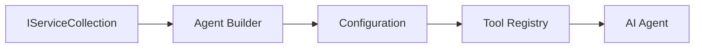

<!--
CO_OP_TRANSLATOR_METADATA:
{
  "original_hash": "bcc874e190347bd6a095aed56dc16de8",
  "translation_date": "2025-11-13T10:58:14+00:00",
  "source_file": "03-agentic-design-patterns/code_samples/03-dotnet-agent-framework.md",
  "language_code": "de"
}
-->
# 🎨 Agentische Designmuster mit GitHub-Modellen (.NET)

## 📋 Lernziele

Dieses Beispiel zeigt Designmuster auf Unternehmensniveau für den Aufbau intelligenter Agenten mit dem Microsoft Agent Framework in .NET und der Integration von GitHub-Modellen. Sie lernen professionelle Muster und architektonische Ansätze kennen, die Agenten produktionsbereit, wartbar und skalierbar machen.

### Designmuster für Unternehmen

- 🏭 **Factory Pattern**: Standardisierte Agentenerstellung mit Dependency Injection
- 🔧 **Builder Pattern**: Fließende Konfiguration und Einrichtung von Agenten
- 🧵 **Thread-Safe Patterns**: Verwaltung von parallelen Gesprächen
- 📋 **Repository Pattern**: Organisierte Verwaltung von Tools und Fähigkeiten

## 🎯 Architektonische Vorteile von .NET

### Unternehmensmerkmale

- **Starke Typisierung**: Validierung zur Kompilierungszeit und Unterstützung durch IntelliSense
- **Dependency Injection**: Integration eines eingebauten DI-Containers
- **Konfigurationsmanagement**: IConfiguration- und Options-Muster
- **Async/Await**: Erstklassige Unterstützung für asynchrones Programmieren

### Produktionsreife Muster

- **Logging-Integration**: Unterstützung von ILogger und strukturiertem Logging
- **Health Checks**: Eingebaute Überwachung und Diagnostik
- **Konfigurationsvalidierung**: Starke Typisierung mit Datenanmerkungen
- **Fehlerbehandlung**: Strukturierte Verwaltung von Ausnahmen

## 🔧 Technische Architektur

### Kernkomponenten von .NET

- **Microsoft.Extensions.AI**: Einheitliche Abstraktionen für KI-Dienste
- **Microsoft.Agents.AI**: Unternehmensframework für Agentenorchestrierung
- **GitHub Models Integration**: Hochleistungsfähige API-Client-Muster
- **Konfigurationssystem**: Integration von appsettings.json und Umgebungen

### Implementierung von Designmustern



## 🏗️ Demonstrierte Unternehmensmuster

### 1. **Erzeugungsmuster**

- **Agent Factory**: Zentralisierte Agentenerstellung mit konsistenter Konfiguration
- **Builder Pattern**: Fließende API für komplexe Agentenkonfiguration
- **Singleton Pattern**: Verwaltung gemeinsamer Ressourcen und Konfigurationen
- **Dependency Injection**: Lose Kopplung und Testbarkeit

### 2. **Verhaltensmuster**

- **Strategy Pattern**: Austauschbare Ausführungsstrategien für Tools
- **Command Pattern**: Kapselung von Agentenoperationen mit Undo/Redo
- **Observer Pattern**: Ereignisgesteuerte Verwaltung des Agentenlebenszyklus
- **Template Method**: Standardisierte Arbeitsabläufe für Agentenausführung

### 3. **Strukturmuster**

- **Adapter Pattern**: Integrationsschicht für die GitHub Models API
- **Decorator Pattern**: Erweiterung der Agentenfähigkeiten
- **Facade Pattern**: Vereinfachte Schnittstellen für die Agenteninteraktion
- **Proxy Pattern**: Lazy Loading und Caching für bessere Leistung

## 📚 .NET Designprinzipien

### SOLID-Prinzipien

- **Single Responsibility**: Jede Komponente hat einen klaren Zweck
- **Open/Closed**: Erweiterbar ohne Modifikation
- **Liskov Substitution**: Implementierungen basierend auf Schnittstellen
- **Interface Segregation**: Fokussierte, kohärente Schnittstellen
- **Dependency Inversion**: Abhängigkeit von Abstraktionen statt von konkreten Implementierungen

### Clean Architecture

- **Domain Layer**: Kernabstraktionen für Agenten und Tools
- **Application Layer**: Orchestrierung und Arbeitsabläufe von Agenten
- **Infrastructure Layer**: Integration von GitHub-Modellen und externen Diensten
- **Presentation Layer**: Benutzerinteraktion und Formatierung von Antworten

## 🔒 Überlegungen für Unternehmen

### Sicherheit

- **Credential Management**: Sichere Handhabung von API-Schlüsseln mit IConfiguration
- **Input Validation**: Starke Typisierung und Validierung durch Datenanmerkungen
- **Output Sanitization**: Sichere Verarbeitung und Filterung von Antworten
- **Audit Logging**: Umfassende Nachverfolgung von Operationen

### Leistung

- **Async Patterns**: Nicht blockierende I/O-Operationen
- **Connection Pooling**: Effiziente Verwaltung von HTTP-Clients
- **Caching**: Antwort-Caching für verbesserte Leistung
- **Resource Management**: Ordnungsgemäße Entsorgung und Bereinigung

### Skalierbarkeit

- **Thread Safety**: Unterstützung für parallele Agentenausführung
- **Resource Pooling**: Effiziente Ressourcennutzung
- **Load Management**: Ratenbegrenzung und Backpressure-Handling
- **Monitoring**: Leistungsmetriken und Gesundheitschecks

## 🚀 Produktionsbereitstellung

- **Konfigurationsmanagement**: Umgebungsspezifische Einstellungen
- **Logging-Strategie**: Strukturiertes Logging mit Korrelations-IDs
- **Fehlerbehandlung**: Globale Ausnahmebehandlung mit ordnungsgemäßer Wiederherstellung
- **Monitoring**: Application Insights und Leistungszähler
- **Testing**: Muster für Unit-Tests, Integrationstests und Lasttests

Bereit, intelligente Agenten auf Unternehmensniveau mit .NET zu erstellen? Lassen Sie uns etwas Robustes entwerfen! 🏢✨

## 🚀 Erste Schritte

### Voraussetzungen

- [.NET 10 SDK](https://dotnet.microsoft.com/download/dotnet/10.0) oder höher
- [GitHub Models API-Zugriffstoken](https://docs.github.com/github-models/github-models-at-scale/using-your-own-api-keys-in-github-models)

### Erforderliche Umgebungsvariablen

```bash
# zsh/bash
export GH_TOKEN=<your_github_token>
export GH_ENDPOINT=https://models.github.ai/inference
export GH_MODEL_ID=openai/gpt-5-mini
```

```powershell
# PowerShell
$env:GH_TOKEN = "<your_github_token>"
$env:GH_ENDPOINT = "https://models.github.ai/inference"
$env:GH_MODEL_ID = "openai/gpt-5-mini"
```

### Beispielcode

Um das Codebeispiel auszuführen,

```bash
# zsh/bash
chmod +x ./03-dotnet-agent-framework.cs
./03-dotnet-agent-framework.cs
```

Oder mit dem dotnet CLI:

```bash
dotnet run ./03-dotnet-agent-framework.cs
```

Siehe [`03-dotnet-agent-framework.cs`](../../../../03-agentic-design-patterns/code_samples/03-dotnet-agent-framework.cs) für den vollständigen Code.

```csharp
#!/usr/bin/dotnet run

#:package Microsoft.Extensions.AI@10.*
#:package Microsoft.Agents.AI.OpenAI@1.*-*

using System.ClientModel;
using System.ComponentModel;

using Microsoft.Agents.AI;
using Microsoft.Extensions.AI;

using OpenAI;

// Tool Function: Random Destination Generator
// This static method will be available to the agent as a callable tool
// The [Description] attribute helps the AI understand when to use this function
// This demonstrates how to create custom tools for AI agents
[Description("Provides a random vacation destination.")]
static string GetRandomDestination()
{
    // List of popular vacation destinations around the world
    // The agent will randomly select from these options
    var destinations = new List<string>
    {
        "Paris, France",
        "Tokyo, Japan",
        "New York City, USA",
        "Sydney, Australia",
        "Rome, Italy",
        "Barcelona, Spain",
        "Cape Town, South Africa",
        "Rio de Janeiro, Brazil",
        "Bangkok, Thailand",
        "Vancouver, Canada"
    };

    // Generate random index and return selected destination
    // Uses System.Random for simple random selection
    var random = new Random();
    int index = random.Next(destinations.Count);
    return destinations[index];
}

// Extract configuration from environment variables
// Retrieve the GitHub Models API endpoint, defaults to https://models.github.ai/inference if not specified
// Retrieve the model ID, defaults to openai/gpt-5-mini if not specified
// Retrieve the GitHub token for authentication, throws exception if not specified
var github_endpoint = Environment.GetEnvironmentVariable("GH_ENDPOINT") ?? "https://models.github.ai/inference";
var github_model_id = Environment.GetEnvironmentVariable("GH_MODEL_ID") ?? "openai/gpt-5-mini";
var github_token = Environment.GetEnvironmentVariable("GH_TOKEN") ?? throw new InvalidOperationException("GH_TOKEN is not set.");

// Configure OpenAI Client Options
// Create configuration options to point to GitHub Models endpoint
// This redirects OpenAI client calls to GitHub's model inference service
var openAIOptions = new OpenAIClientOptions()
{
    Endpoint = new Uri(github_endpoint)
};

// Initialize OpenAI Client with GitHub Models Configuration
// Create OpenAI client using GitHub token for authentication
// Configure it to use GitHub Models endpoint instead of OpenAI directly
var openAIClient = new OpenAIClient(new ApiKeyCredential(github_token), openAIOptions);

// Define Agent Identity and Comprehensive Instructions
// Agent name for identification and logging purposes
var AGENT_NAME = "TravelAgent";

// Detailed instructions that define the agent's personality, capabilities, and behavior
// This system prompt shapes how the agent responds and interacts with users
var AGENT_INSTRUCTIONS = """
You are a helpful AI Agent that can help plan vacations for customers.

Important: When users specify a destination, always plan for that location. Only suggest random destinations when the user hasn't specified a preference.

When the conversation begins, introduce yourself with this message:
"Hello! I'm your TravelAgent assistant. I can help plan vacations and suggest interesting destinations for you. Here are some things you can ask me:
1. Plan a day trip to a specific location
2. Suggest a random vacation destination
3. Find destinations with specific features (beaches, mountains, historical sites, etc.)
4. Plan an alternative trip if you don't like my first suggestion

What kind of trip would you like me to help you plan today?"

Always prioritize user preferences. If they mention a specific destination like "Bali" or "Paris," focus your planning on that location rather than suggesting alternatives.
""";

// Create AI Agent with Advanced Travel Planning Capabilities
// Initialize complete agent pipeline: OpenAI client → Chat client → AI agent
// Configure agent with name, detailed instructions, and available tools
// This demonstrates the .NET agent creation pattern with full configuration
AIAgent agent = openAIClient
    .GetChatClient(github_model_id)
    .CreateAIAgent(
        name: AGENT_NAME,
        instructions: AGENT_INSTRUCTIONS,
        tools: [AIFunctionFactory.Create(GetRandomDestination)]
    );

// Create New Conversation Thread for Context Management
// Initialize a new conversation thread to maintain context across multiple interactions
// Threads enable the agent to remember previous exchanges and maintain conversational state
// This is essential for multi-turn conversations and contextual understanding
AgentThread thread = agent.GetNewThread();

// Execute Agent: First Travel Planning Request
// Run the agent with an initial request that will likely trigger the random destination tool
// The agent will analyze the request, use the GetRandomDestination tool, and create an itinerary
// Using the thread parameter maintains conversation context for subsequent interactions
await foreach (var update in agent.RunStreamingAsync("Plan me a day trip", thread))
{
    await Task.Delay(10);
    Console.Write(update);
}

Console.WriteLine();

// Execute Agent: Follow-up Request with Context Awareness
// Demonstrate contextual conversation by referencing the previous response
// The agent remembers the previous destination suggestion and will provide an alternative
// This showcases the power of conversation threads and contextual understanding in .NET agents
await foreach (var update in agent.RunStreamingAsync("I don't like that destination. Plan me another vacation.", thread))
{
    await Task.Delay(10);
    Console.Write(update);
}
```

---

<!-- CO-OP TRANSLATOR DISCLAIMER START -->
**Haftungsausschluss**:  
Dieses Dokument wurde mit dem KI-Übersetzungsdienst [Co-op Translator](https://github.com/Azure/co-op-translator) übersetzt. Obwohl wir uns um Genauigkeit bemühen, beachten Sie bitte, dass automatisierte Übersetzungen Fehler oder Ungenauigkeiten enthalten können. Das Originaldokument in seiner ursprünglichen Sprache sollte als maßgebliche Quelle betrachtet werden. Für kritische Informationen wird eine professionelle menschliche Übersetzung empfohlen. Wir übernehmen keine Haftung für Missverständnisse oder Fehlinterpretationen, die sich aus der Nutzung dieser Übersetzung ergeben.
<!-- CO-OP TRANSLATOR DISCLAIMER END -->