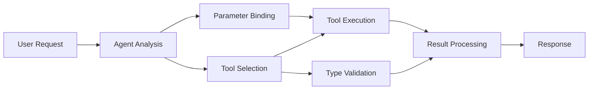

<!--
CO_OP_TRANSLATOR_METADATA:
{
  "original_hash": "91d6061e402489603f2ec8b528cae59b",
  "translation_date": "2025-11-18T16:33:03+00:00",
  "source_file": "04-tool-use/code_samples/04-dotnet-agent-framework.md",
  "language_code": "de"
}
-->
# 🛠️ Erweiterte Werkzeugnutzung mit GitHub-Modellen (.NET)

## 📋 Lernziele

Dieses Notebook zeigt Integrationsmuster für Unternehmenswerkzeuge mit dem Microsoft Agent Framework in .NET und GitHub-Modellen. Sie lernen, wie man anspruchsvolle Agenten mit mehreren spezialisierten Werkzeugen erstellt und dabei die starke Typisierung von C# sowie die Unternehmensfunktionen von .NET nutzt.

### Erweiterte Werkzeugfähigkeiten, die Sie beherrschen werden

- 🔧 **Multi-Tool-Architektur**: Aufbau von Agenten mit mehreren spezialisierten Fähigkeiten
- 🎯 **Typensichere Werkzeugausführung**: Nutzung der Kompilierungszeitvalidierung von C#
- 📊 **Unternehmenswerkzeugmuster**: Produktionsreife Werkzeuggestaltung und Fehlerbehandlung
- 🔗 **Werkzeugkomposition**: Kombination von Werkzeugen für komplexe Geschäftsabläufe

## 🎯 Vorteile der .NET-Werkzeugarchitektur

### Funktionen für Unternehmenswerkzeuge

- **Kompilierungszeitvalidierung**: Starke Typisierung gewährleistet die Korrektheit der Werkzeugparameter
- **Dependency Injection**: IoC-Container-Integration für Werkzeugverwaltung
- **Async/Await-Muster**: Nicht blockierende Werkzeugausführung mit ordnungsgemäßem Ressourcenmanagement
- **Strukturiertes Logging**: Integrierte Protokollierung zur Überwachung der Werkzeugausführung

### Produktionsreife Muster

- **Fehlerbehandlung**: Umfassendes Fehlermanagement mit typisierten Ausnahmen
- **Ressourcenmanagement**: Ordnungsgemäße Entsorgungsmuster und Speicherverwaltung
- **Leistungsüberwachung**: Eingebaute Metriken und Leistungszähler
- **Konfigurationsmanagement**: Typensichere Konfiguration mit Validierung

## 🔧 Technische Architektur

### Kernkomponenten der .NET-Werkzeuge

- **Microsoft.Extensions.AI**: Einheitliche Abstraktionsschicht für Werkzeuge
- **Microsoft.Agents.AI**: Unternehmensgerechte Werkzeugorchestrierung
- **GitHub Models Integration**: Hochleistungsfähiger API-Client mit Verbindungspooling

### Werkzeugausführungspipeline



## 🛠️ Werkzeugkategorien & Muster

### 1. **Datenverarbeitungswerkzeuge**

- **Eingabevalidierung**: Starke Typisierung mit Datenanmerkungen
- **Transformationsoperationen**: Typensichere Datenkonvertierung und -formatierung
- **Geschäftslogik**: Domänenspezifische Berechnungs- und Analysetools
- **Ausgabeformatierung**: Strukturierte Antwortgenerierung

### 2. **Integrationswerkzeuge**

- **API-Connectoren**: RESTful-Service-Integration mit HttpClient
- **Datenbankwerkzeuge**: Entity Framework-Integration für Datenzugriff
- **Dateioperationen**: Sichere Dateisystemoperationen mit Validierung
- **Externe Dienste**: Muster für die Integration von Drittanbieterdiensten

### 3. **Hilfswerkzeuge**

- **Textverarbeitung**: Zeichenkettenmanipulation und Formatierungswerkzeuge
- **Datum-/Zeitoperationen**: Kulturabhängige Berechnungen von Datum und Zeit
- **Mathematische Werkzeuge**: Präzisionsberechnungen und statistische Operationen
- **Validierungswerkzeuge**: Validierung von Geschäftsregeln und Datenüberprüfung

Bereit, Unternehmensagenten mit leistungsstarken, typensicheren Werkzeugfähigkeiten in .NET zu erstellen? Lassen Sie uns professionelle Lösungen entwickeln! 🏢⚡

## 🚀 Erste Schritte

### Voraussetzungen

- [.NET 10 SDK](https://dotnet.microsoft.com/download/dotnet/10.0) oder höher
- [GitHub Models API-Zugriffstoken](https://docs.github.com/github-models/github-models-at-scale/using-your-own-api-keys-in-github-models)

### Erforderliche Umgebungsvariablen

```bash
# zsh/bash
export GH_TOKEN=<your_github_token>
export GH_ENDPOINT=https://models.github.ai/inference
export GH_MODEL_ID=openai/gpt-5-mini
```

```powershell
# PowerShell
$env:GH_TOKEN = "<your_github_token>"
$env:GH_ENDPOINT = "https://models.github.ai/inference"
$env:GH_MODEL_ID = "openai/gpt-5-mini"
```

### Beispielcode

Um das Codebeispiel auszuführen,

```bash
# zsh/bash
chmod +x ./04-dotnet-agent-framework.cs
./04-dotnet-agent-framework.cs
```

Oder mit dem dotnet CLI:

```bash
dotnet run ./04-dotnet-agent-framework.cs
```

Siehe [`04-dotnet-agent-framework.cs`](../../../../04-tool-use/code_samples/04-dotnet-agent-framework.cs) für den vollständigen Code.

```csharp
#!/usr/bin/dotnet run

#:package Microsoft.Extensions.AI@10.*
#:package Microsoft.Agents.AI.OpenAI@1.*-*

using System.ClientModel;
using System.ComponentModel;

using Microsoft.Agents.AI;
using Microsoft.Extensions.AI;

using OpenAI;

// Tool Function: Random Destination Generator
// This static method will be available to the agent as a callable tool
// The [Description] attribute helps the AI understand when to use this function
// This demonstrates how to create custom tools for AI agents
[Description("Provides a random vacation destination.")]
static string GetRandomDestination()
{
    // List of popular vacation destinations around the world
    // The agent will randomly select from these options
    var destinations = new List<string>
    {
        "Paris, France",
        "Tokyo, Japan",
        "New York City, USA",
        "Sydney, Australia",
        "Rome, Italy",
        "Barcelona, Spain",
        "Cape Town, South Africa",
        "Rio de Janeiro, Brazil",
        "Bangkok, Thailand",
        "Vancouver, Canada"
    };

    // Generate random index and return selected destination
    // Uses System.Random for simple random selection
    var random = new Random();
    int index = random.Next(destinations.Count);
    return destinations[index];
}

// Extract configuration from environment variables
// Retrieve the GitHub Models API endpoint, defaults to https://models.github.ai/inference if not specified
// Retrieve the model ID, defaults to openai/gpt-5-mini if not specified
// Retrieve the GitHub token for authentication, throws exception if not specified
var github_endpoint = Environment.GetEnvironmentVariable("GH_ENDPOINT") ?? "https://models.github.ai/inference";
var github_model_id = Environment.GetEnvironmentVariable("GH_MODEL_ID") ?? "openai/gpt-5-mini";
var github_token = Environment.GetEnvironmentVariable("GH_TOKEN") ?? throw new InvalidOperationException("GH_TOKEN is not set.");

// Configure OpenAI Client Options
// Create configuration options to point to GitHub Models endpoint
// This redirects OpenAI client calls to GitHub's model inference service
var openAIOptions = new OpenAIClientOptions()
{
    Endpoint = new Uri(github_endpoint)
};

// Initialize OpenAI Client with GitHub Models Configuration
// Create OpenAI client using GitHub token for authentication
// Configure it to use GitHub Models endpoint instead of OpenAI directly
var openAIClient = new OpenAIClient(new ApiKeyCredential(github_token), openAIOptions);

// Define Agent Identity and Comprehensive Instructions
// Agent name for identification and logging purposes
var AGENT_NAME = "TravelAgent";

// Detailed instructions that define the agent's personality, capabilities, and behavior
// This system prompt shapes how the agent responds and interacts with users
var AGENT_INSTRUCTIONS = """
You are a helpful AI Agent that can help plan vacations for customers.

Important: When users specify a destination, always plan for that location. Only suggest random destinations when the user hasn't specified a preference.

When the conversation begins, introduce yourself with this message:
"Hello! I'm your TravelAgent assistant. I can help plan vacations and suggest interesting destinations for you. Here are some things you can ask me:
1. Plan a day trip to a specific location
2. Suggest a random vacation destination
3. Find destinations with specific features (beaches, mountains, historical sites, etc.)
4. Plan an alternative trip if you don't like my first suggestion

What kind of trip would you like me to help you plan today?"

Always prioritize user preferences. If they mention a specific destination like "Bali" or "Paris," focus your planning on that location rather than suggesting alternatives.
""";

// Create AI Agent with Advanced Travel Planning Capabilities
// Initialize complete agent pipeline: OpenAI client → Chat client → AI agent
// Configure agent with name, detailed instructions, and available tools
// This demonstrates the .NET agent creation pattern with full configuration
AIAgent agent = openAIClient
    .GetChatClient(github_model_id)
    .CreateAIAgent(
        name: AGENT_NAME,
        instructions: AGENT_INSTRUCTIONS,
        tools: [AIFunctionFactory.Create(GetRandomDestination)]
    );

// Create New Conversation Thread for Context Management
// Initialize a new conversation thread to maintain context across multiple interactions
// Threads enable the agent to remember previous exchanges and maintain conversational state
// This is essential for multi-turn conversations and contextual understanding
AgentThread thread = agent.GetNewThread();

// Execute Agent: First Travel Planning Request
// Run the agent with an initial request that will likely trigger the random destination tool
// The agent will analyze the request, use the GetRandomDestination tool, and create an itinerary
// Using the thread parameter maintains conversation context for subsequent interactions
await foreach (var update in agent.RunStreamingAsync("Plan me a day trip", thread))
{
    await Task.Delay(10);
    Console.Write(update);
}

Console.WriteLine();

// Execute Agent: Follow-up Request with Context Awareness
// Demonstrate contextual conversation by referencing the previous response
// The agent remembers the previous destination suggestion and will provide an alternative
// This showcases the power of conversation threads and contextual understanding in .NET agents
await foreach (var update in agent.RunStreamingAsync("I don't like that destination. Plan me another vacation.", thread))
{
    await Task.Delay(10);
    Console.Write(update);
}
```

---

<!-- CO-OP TRANSLATOR DISCLAIMER START -->
**Haftungsausschluss**:  
Dieses Dokument wurde mit dem KI-Übersetzungsdienst [Co-op Translator](https://github.com/Azure/co-op-translator) übersetzt. Obwohl wir uns um Genauigkeit bemühen, beachten Sie bitte, dass automatisierte Übersetzungen Fehler oder Ungenauigkeiten enthalten können. Das Originaldokument in seiner ursprünglichen Sprache sollte als maßgebliche Quelle betrachtet werden. Für kritische Informationen wird eine professionelle menschliche Übersetzung empfohlen. Wir übernehmen keine Haftung für Missverständnisse oder Fehlinterpretationen, die sich aus der Nutzung dieser Übersetzung ergeben.
<!-- CO-OP TRANSLATOR DISCLAIMER END -->