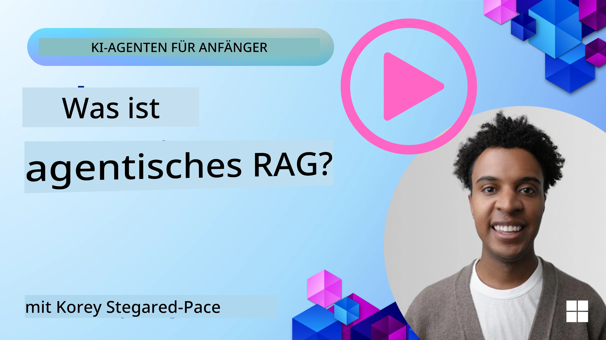
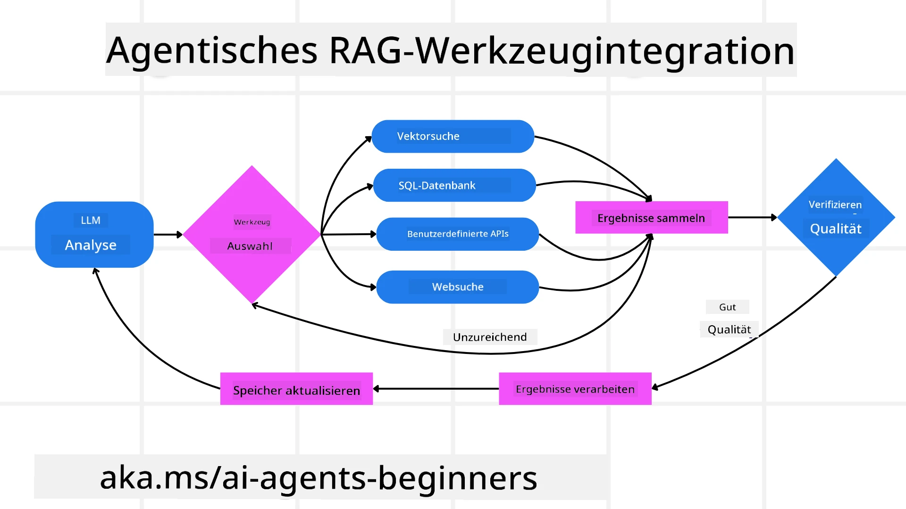
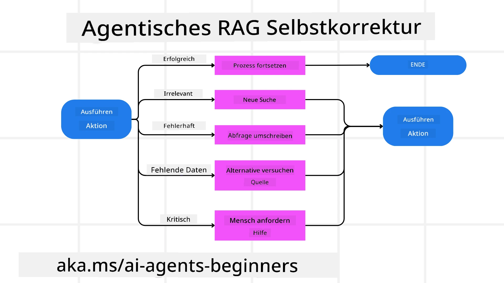
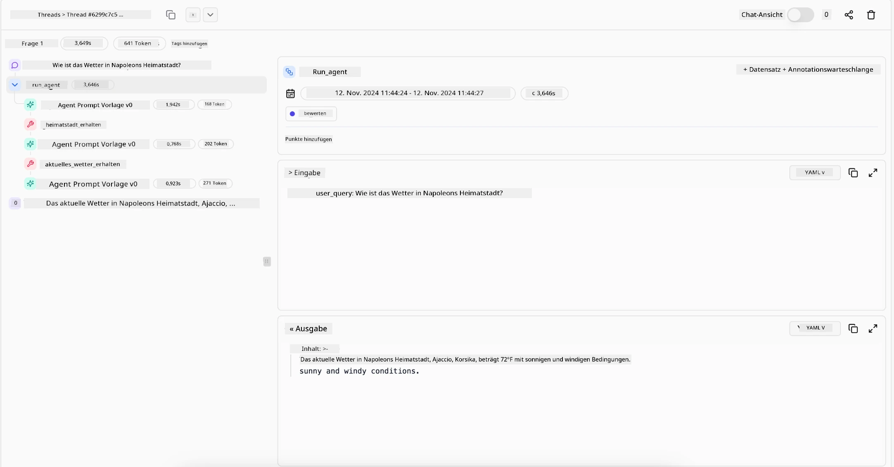

<!--
CO_OP_TRANSLATOR_METADATA:
{
  "original_hash": "0ebf6b2290db55dbf2d10cc49655523b",
  "translation_date": "2025-09-30T06:15:00+00:00",
  "source_file": "05-agentic-rag/README.md",
  "language_code": "de"
}
-->

> _(Klicken Sie auf das Bild oben, um das Video zu dieser Lektion anzusehen)_

# Agentic RAG

Diese Lektion bietet einen umfassenden Überblick über Agentic Retrieval-Augmented Generation (Agentic RAG), ein aufkommendes KI-Paradigma, bei dem große Sprachmodelle (LLMs) eigenständig ihre nächsten Schritte planen und dabei Informationen aus externen Quellen abrufen. Im Gegensatz zu statischen Mustern des Abrufens und Lesens umfasst Agentic RAG iterative Aufrufe des LLM, unterbrochen durch Werkzeug- oder Funktionsaufrufe und strukturierte Ausgaben. Das System bewertet Ergebnisse, verfeinert Abfragen, ruft bei Bedarf zusätzliche Werkzeuge auf und setzt diesen Zyklus fort, bis eine zufriedenstellende Lösung erreicht ist.

## Einführung

Diese Lektion behandelt:

- **Agentic RAG verstehen:** Lernen Sie das aufkommende Paradigma in der KI kennen, bei dem große Sprachmodelle (LLMs) eigenständig ihre nächsten Schritte planen und dabei Informationen aus externen Datenquellen abrufen.
- **Iterativer Maker-Checker-Stil:** Verstehen Sie die Schleife aus iterativen Aufrufen des LLM, unterbrochen durch Werkzeug- oder Funktionsaufrufe und strukturierte Ausgaben, die darauf abzielen, die Korrektheit zu verbessern und fehlerhafte Abfragen zu behandeln.
- **Praktische Anwendungen erkunden:** Identifizieren Sie Szenarien, in denen Agentic RAG besonders nützlich ist, wie z. B. in korrektheitsorientierten Umgebungen, komplexen Datenbankinteraktionen und erweiterten Arbeitsabläufen.

## Lernziele

Nach Abschluss dieser Lektion werden Sie wissen/verstehen:

- **Agentic RAG verstehen:** Lernen Sie das aufkommende Paradigma in der KI kennen, bei dem große Sprachmodelle (LLMs) eigenständig ihre nächsten Schritte planen und dabei Informationen aus externen Datenquellen abrufen.
- **Iterativer Maker-Checker-Stil:** Verstehen Sie das Konzept einer Schleife aus iterativen Aufrufen des LLM, unterbrochen durch Werkzeug- oder Funktionsaufrufe und strukturierte Ausgaben, die darauf abzielen, die Korrektheit zu verbessern und fehlerhafte Abfragen zu behandeln.
- **Den Denkprozess übernehmen:** Verstehen Sie die Fähigkeit des Systems, seinen Denkprozess zu übernehmen und Entscheidungen darüber zu treffen, wie Probleme angegangen werden sollen, ohne auf vordefinierte Pfade angewiesen zu sein.
- **Arbeitsablauf:** Verstehen Sie, wie ein agentisches Modell eigenständig Markttrendberichte abruft, Wettbewerberdaten identifiziert, interne Verkaufsmetriken korreliert, Erkenntnisse synthetisiert und die Strategie bewertet.
- **Iterative Schleifen, Werkzeugintegration und Gedächtnis:** Lernen Sie die Abhängigkeit des Systems von einem iterativen Interaktionsmuster kennen, das den Zustand und das Gedächtnis über die Schritte hinweg aufrechterhält, um wiederholte Schleifen zu vermeiden und fundierte Entscheidungen zu treffen.
- **Umgang mit Fehlern und Selbstkorrektur:** Erkunden Sie die robusten Selbstkorrekturmechanismen des Systems, einschließlich Iteration und erneuter Abfrage, Nutzung diagnostischer Werkzeuge und Rückgriff auf menschliche Aufsicht.
- **Grenzen der Eigenständigkeit:** Verstehen Sie die Einschränkungen von Agentic RAG, mit Fokus auf domänenspezifische Autonomie, Infrastrukturabhängigkeit und Einhaltung von Sicherheitsvorkehrungen.
- **Praktische Anwendungsfälle und Nutzen:** Identifizieren Sie Szenarien, in denen Agentic RAG besonders nützlich ist, wie z. B. in korrektheitsorientierten Umgebungen, komplexen Datenbankinteraktionen und erweiterten Arbeitsabläufen.
- **Governance, Transparenz und Vertrauen:** Lernen Sie die Bedeutung von Governance und Transparenz kennen, einschließlich erklärbarer Entscheidungsfindung, Kontrolle von Verzerrungen und menschlicher Aufsicht.

## Was ist Agentic RAG?

Agentic Retrieval-Augmented Generation (Agentic RAG) ist ein aufkommendes KI-Paradigma, bei dem große Sprachmodelle (LLMs) eigenständig ihre nächsten Schritte planen und dabei Informationen aus externen Quellen abrufen. Im Gegensatz zu statischen Mustern des Abrufens und Lesens umfasst Agentic RAG iterative Aufrufe des LLM, unterbrochen durch Werkzeug- oder Funktionsaufrufe und strukturierte Ausgaben. Das System bewertet Ergebnisse, verfeinert Abfragen, ruft bei Bedarf zusätzliche Werkzeuge auf und setzt diesen Zyklus fort, bis eine zufriedenstellende Lösung erreicht ist. Dieser iterative „Maker-Checker“-Stil verbessert die Korrektheit, behandelt fehlerhafte Abfragen und sorgt für hochwertige Ergebnisse.

Das System übernimmt aktiv seinen Denkprozess, schreibt fehlgeschlagene Abfragen um, wählt unterschiedliche Abrufmethoden und integriert mehrere Werkzeuge – wie Vektorsuche in Azure AI Search, SQL-Datenbanken oder benutzerdefinierte APIs – bevor es seine Antwort finalisiert. Die herausragende Eigenschaft eines agentischen Systems ist seine Fähigkeit, seinen Denkprozess zu übernehmen. Traditionelle RAG-Implementierungen verlassen sich auf vordefinierte Pfade, aber ein agentisches System bestimmt autonom die Abfolge der Schritte basierend auf der Qualität der gefundenen Informationen.

## Definition von Agentic Retrieval-Augmented Generation (Agentic RAG)

Agentic Retrieval-Augmented Generation (Agentic RAG) ist ein aufkommendes Paradigma in der KI-Entwicklung, bei dem LLMs nicht nur Informationen aus externen Datenquellen abrufen, sondern auch eigenständig ihre nächsten Schritte planen. Im Gegensatz zu statischen Mustern des Abrufens und Lesens oder sorgfältig geskripteten Prompt-Sequenzen umfasst Agentic RAG eine Schleife aus iterativen Aufrufen des LLM, unterbrochen durch Werkzeug- oder Funktionsaufrufe und strukturierte Ausgaben. In jeder Phase bewertet das System die erzielten Ergebnisse, entscheidet, ob es seine Abfragen verfeinern soll, ruft bei Bedarf zusätzliche Werkzeuge auf und setzt diesen Zyklus fort, bis es eine zufriedenstellende Lösung erreicht.

Dieser iterative „Maker-Checker“-Stil der Arbeitsweise ist darauf ausgelegt, die Korrektheit zu verbessern, fehlerhafte Abfragen an strukturierte Datenbanken (z. B. NL2SQL) zu behandeln und ausgewogene, hochwertige Ergebnisse zu gewährleisten. Anstatt sich ausschließlich auf sorgfältig konstruierte Prompt-Ketten zu verlassen, übernimmt das System aktiv seinen Denkprozess. Es kann fehlgeschlagene Abfragen umschreiben, unterschiedliche Abrufmethoden wählen und mehrere Werkzeuge integrieren – wie Vektorsuche in Azure AI Search, SQL-Datenbanken oder benutzerdefinierte APIs – bevor es seine Antwort finalisiert. Dies macht komplexe Orchestrierungsframeworks überflüssig. Stattdessen kann eine relativ einfache Schleife aus „LLM-Aufruf → Werkzeugnutzung → LLM-Aufruf → …“ zu anspruchsvollen und fundierten Ergebnissen führen.

## Den Denkprozess übernehmen

Die herausragende Eigenschaft, die ein System „agentisch“ macht, ist seine Fähigkeit, seinen Denkprozess zu übernehmen. Traditionelle RAG-Implementierungen hängen oft davon ab, dass Menschen einen Pfad für das Modell vordefinieren: eine Gedankenkette, die festlegt, was wann abgerufen werden soll.  
Aber wenn ein System wirklich agentisch ist, entscheidet es intern, wie es das Problem angehen soll. Es führt nicht einfach ein Skript aus, sondern bestimmt autonom die Abfolge der Schritte basierend auf der Qualität der gefundenen Informationen.  
Wenn es beispielsweise darum geht, eine Produktstartstrategie zu erstellen, verlässt es sich nicht ausschließlich auf einen Prompt, der den gesamten Forschungs- und Entscheidungsworkflow vorgibt. Stattdessen entscheidet das agentische Modell eigenständig:

1. Aktuelle Markttrendberichte mit Bing Web Grounding abrufen.
2. Relevante Wettbewerberdaten mit Azure AI Search identifizieren.
3. Historische interne Verkaufsmetriken mit Azure SQL Database korrelieren.
4. Die Erkenntnisse zu einer kohärenten Strategie synthetisieren, orchestriert über Azure OpenAI Service.
5. Die Strategie auf Lücken oder Inkonsistenzen bewerten und bei Bedarf eine weitere Runde des Abrufens einleiten.  

All diese Schritte – Abfragen verfeinern, Quellen auswählen, iterieren, bis die Antwort „zufriedenstellend“ ist – werden vom Modell entschieden und nicht von einem Menschen vorgeskriptet.

## Iterative Schleifen, Werkzeugintegration und Gedächtnis

Ein agentisches System basiert auf einem iterativen Interaktionsmuster:

- **Erster Aufruf:** Das Ziel des Nutzers (d. h. der Nutzer-Prompt) wird dem LLM präsentiert.
- **Werkzeugaufruf:** Wenn das Modell fehlende Informationen oder unklare Anweisungen erkennt, wählt es ein Werkzeug oder eine Abrufmethode – wie eine Vektordatenbankabfrage (z. B. Azure AI Search Hybrid-Suche über private Daten) oder einen strukturierten SQL-Aufruf – um mehr Kontext zu sammeln.
- **Bewertung & Verfeinerung:** Nach Überprüfung der zurückgegebenen Daten entscheidet das Modell, ob die Informationen ausreichen. Falls nicht, verfeinert es die Abfrage, versucht ein anderes Werkzeug oder passt seinen Ansatz an.
- **Wiederholen bis zufrieden:** Dieser Zyklus wird fortgesetzt, bis das Modell feststellt, dass es genügend Klarheit und Beweise hat, um eine endgültige, gut begründete Antwort zu liefern.
- **Gedächtnis & Zustand:** Da das System den Zustand und das Gedächtnis über die Schritte hinweg aufrechterhält, kann es sich an frühere Versuche und deren Ergebnisse erinnern, wiederholte Schleifen vermeiden und fundiertere Entscheidungen treffen, während es fortschreitet.

Im Laufe der Zeit entsteht so ein Gefühl von sich entwickelndem Verständnis, das es dem Modell ermöglicht, komplexe, mehrstufige Aufgaben zu bewältigen, ohne dass ein Mensch ständig eingreifen oder den Prompt umgestalten muss.

## Umgang mit Fehlern und Selbstkorrektur

Die Autonomie von Agentic RAG umfasst auch robuste Selbstkorrekturmechanismen. Wenn das System auf Sackgassen stößt – wie das Abrufen irrelevanter Dokumente oder das Auftreten fehlerhafter Abfragen – kann es:

- **Iterieren und erneut abfragen:** Anstatt minderwertige Antworten zurückzugeben, versucht das Modell neue Suchstrategien, schreibt Datenbankabfragen um oder betrachtet alternative Datensätze.
- **Diagnosetools verwenden:** Das System kann zusätzliche Funktionen aufrufen, die ihm helfen sollen, seine Denkprozesse zu debuggen oder die Korrektheit der abgerufenen Daten zu bestätigen. Tools wie Azure AI Tracing werden wichtig sein, um robuste Beobachtbarkeit und Überwachung zu ermöglichen.
- **Auf menschliche Aufsicht zurückgreifen:** In hochriskanten oder wiederholt scheiternden Szenarien könnte das Modell Unsicherheiten kennzeichnen und menschliche Anleitung anfordern. Sobald der Mensch korrigierendes Feedback gibt, kann das Modell diese Lektion in Zukunft einbeziehen.

Dieser iterative und dynamische Ansatz ermöglicht es dem Modell, sich kontinuierlich zu verbessern, sodass es nicht nur ein einmaliges System ist, sondern eines, das aus seinen Fehlern während einer Sitzung lernt.

## Grenzen der Eigenständigkeit

Trotz seiner Autonomie innerhalb einer Aufgabe ist Agentic RAG nicht mit künstlicher allgemeiner Intelligenz vergleichbar. Seine „agentischen“ Fähigkeiten sind auf die von menschlichen Entwicklern bereitgestellten Werkzeuge, Datenquellen und Richtlinien beschränkt. Es kann keine eigenen Werkzeuge erfinden oder die festgelegten Domänengrenzen überschreiten. Stattdessen glänzt es durch die dynamische Orchestrierung der verfügbaren Ressourcen.  
Wesentliche Unterschiede zu fortgeschritteneren KI-Formen umfassen:

1. **Domänenspezifische Autonomie:** Agentic RAG-Systeme konzentrieren sich darauf, benutzerdefinierte Ziele innerhalb einer bekannten Domäne zu erreichen, indem sie Strategien wie Abfrageumschreibung oder Werkzeugauswahl anwenden, um Ergebnisse zu verbessern.
2. **Infrastrukturabhängig:** Die Fähigkeiten des Systems hängen von den von Entwicklern integrierten Werkzeugen und Daten ab. Es kann diese Grenzen nicht ohne menschliches Eingreifen überschreiten.
3. **Einhaltung von Sicherheitsvorkehrungen:** Ethische Richtlinien, Compliance-Regeln und Geschäftspolitiken bleiben sehr wichtig. Die Freiheit des Agenten ist immer durch Sicherheitsmaßnahmen und Aufsichtsmechanismen eingeschränkt (hoffentlich?).

## Praktische Anwendungsfälle und Nutzen

Agentic RAG glänzt in Szenarien, die iterative Verfeinerung und Präzision erfordern:

1. **Korrektheitsorientierte Umgebungen:** Bei Compliance-Prüfungen, regulatorischen Analysen oder juristischen Recherchen kann das agentische Modell Fakten wiederholt überprüfen, mehrere Quellen konsultieren und Abfragen umschreiben, bis es eine gründlich geprüfte Antwort liefert.
2. **Komplexe Datenbankinteraktionen:** Beim Umgang mit strukturierten Daten, bei denen Abfragen häufig fehlschlagen oder angepasst werden müssen, kann das System seine Abfragen autonom mit Azure SQL oder Microsoft Fabric OneLake verfeinern, um sicherzustellen, dass der endgültige Abruf den Absichten des Nutzers entspricht.
3. **Erweiterte Arbeitsabläufe:** Länger laufende Sitzungen können sich weiterentwickeln, wenn neue Informationen auftauchen. Agentic RAG kann kontinuierlich neue Daten einbeziehen und Strategien anpassen, während es mehr über den Problemraum lernt.

## Governance, Transparenz und Vertrauen

Da diese Systeme in ihrer Entscheidungsfindung immer autonomer werden, sind Governance und Transparenz entscheidend:

- **Erklärbare Entscheidungsfindung:** Das Modell kann eine Prüfspur der von ihm durchgeführten Abfragen, der konsultierten Quellen und der Schritte seiner Entscheidungsfindung bereitstellen. Tools wie Azure AI Content Safety und Azure AI Tracing / GenAIOps können helfen, Transparenz zu gewährleisten und Risiken zu mindern.
- **Kontrolle von Verzerrungen und ausgewogener Abruf:** Entwickler können Abrufstrategien so abstimmen, dass ausgewogene, repräsentative Datenquellen berücksichtigt werden, und regelmäßig Ausgaben überprüfen, um Verzerrungen oder verzerrte Muster zu erkennen, indem sie benutzerdefinierte Modelle für fortgeschrittene Datenwissenschaftsorganisationen mit Azure Machine Learning verwenden.
- **Menschliche Aufsicht und Compliance:** Für sensible Aufgaben bleibt die menschliche Überprüfung unerlässlich. Agentic RAG ersetzt nicht das menschliche Urteilsvermögen bei hochriskanten Entscheidungen – es ergänzt es, indem es gründlich geprüfte Optionen liefert.

Werkzeuge, die eine klare Aufzeichnung der Aktionen bereitstellen, sind unerlässlich. Ohne sie kann das Debuggen eines mehrstufigen Prozesses sehr schwierig sein. Sehen Sie sich das folgende Beispiel von Literal AI (Unternehmen hinter Chainlit) für einen Agentenlauf an:

## Fazit

Agentic RAG stellt eine natürliche Weiterentwicklung dar, wie KI-Systeme komplexe, datenintensive Aufgaben bewältigen. Durch die Einführung eines iterativen Interaktionsmusters, die autonome Auswahl von Werkzeugen und die Verfeinerung von Abfragen bis zur Erzielung eines hochwertigen Ergebnisses bewegt sich das System über statisches Prompt-Folgen hinaus zu einem adaptiveren, kontextbewussten Entscheidungsträger. Obwohl es weiterhin durch menschlich definierte Infrastrukturen und ethische Richtlinien begrenzt ist, ermöglichen diese agentischen Fähigkeiten reichhaltigere, dynamischere und letztlich nützlichere KI-Interaktionen für Unternehmen und Endnutzer.

### Haben Sie weitere Fragen zu Agentic RAG?

Treten Sie dem [Azure AI Foundry Discord](https://aka.ms/ai-agents/discord) bei, um andere Lernende zu treffen, Sprechstunden zu besuchen und Ihre Fragen zu KI-Agenten beantwortet zu bekommen.

## Zusätzliche Ressourcen

- <a href="https://learn.microsoft.com/training/modules/use-own-data-azure-openai" target="_blank">Implementierung von Retrieval Augmented Generation (RAG) mit Azure OpenAI Service: Erfahren Sie, wie Sie Ihre eigenen Daten mit dem Azure OpenAI Service nutzen können. Dieses Microsoft Learn-Modul bietet eine umfassende Anleitung zur Implementierung von RAG</a>
- <a href="https://learn.microsoft.com/azure/ai-studio/concepts/evaluation-approach-gen-ai" target="_blank">Bewertung von generativen KI-Anwendungen mit Azure AI Foundry: Dieser Artikel behandelt die Bewertung und den Vergleich von Modellen anhand öffentlich verfügbarer Datensätze, einschließlich agentischer KI-Anwendungen und RAG-Architekturen</a>
- <a href="https://weaviate.io/blog/what-is-agentic-rag" target="_blank">Was ist Agentic RAG | Weaviate</a>
- <a href="https://ragaboutit.com/agentic-rag-a-complete-guide-to-agent-based-retrieval-augmented-generation/" target="_blank">Agentic RAG: Ein vollständiger Leitfaden zu agentenbasierter Retrieval-Augmented Generation – Neuigkeiten von Generation RAG</a>
- <a href="https://huggingface.co/learn/cookbook/agent_rag" target="_blank">Agentic RAG: Beschleunigen Sie Ihr RAG mit Abfrageumformulierung und Selbstabfrage! Hugging Face Open-Source AI Cookbook</a>
- <a href="https://youtu.be/aQ4yQXeB1Ss?si=2HUqBzHoeB5tR04U" target="_blank">Agentische Ebenen zu RAG hinzufügen</a>
- <a href="https://www.youtube.com/watch?v=zeAyuLc_f3Q&t=244s" target="_blank">Die Zukunft von Wissensassistenten: Jerry Liu</a>
- <a href="https://www.youtube.com/watch?v=AOSjiXP1jmQ" target="_blank">Wie man agentische RAG-Systeme entwickelt</a>
- <a href="https://ignite.microsoft.com/sessions/BRK102?source=sessions" target="_blank">Verwendung des Azure AI Foundry Agent Service zur Skalierung Ihrer KI-Agenten</a>

### Wissenschaftliche Arbeiten

- <a href="https://arxiv.org/abs/2303.17651" target="_blank">2303.17651 Self-Refine: Iterative Verfeinerung mit Selbst-Feedback</a>
- <a href="https://arxiv.org/abs/2303.11366" target="_blank">2303.11366 Reflexion: Sprachagenten mit verbalem Verstärkungslernen</a>
- <a href="https://arxiv.org/abs/2305.11738" target="_blank">2305.11738 CRITIC: Große Sprachmodelle können sich selbst korrigieren durch tool-interaktives Kritisieren</a>
- <a href="https://arxiv.org/abs/2501.09136" target="_blank">2501.09136 Agentic Retrieval-Augmented Generation: Eine Übersicht über agentisches RAG</a>

## Vorherige Lektion

[Tool Use Design Pattern](../04-tool-use/README.md)

## Nächste Lektion

[Vertrauenswürdige KI-Agenten entwickeln](../06-building-trustworthy-agents/README.md)

---

**Haftungsausschluss**:  
Dieses Dokument wurde mit dem KI-Übersetzungsdienst [Co-op Translator](https://github.com/Azure/co-op-translator) übersetzt. Obwohl wir uns um Genauigkeit bemühen, beachten Sie bitte, dass automatisierte Übersetzungen Fehler oder Ungenauigkeiten enthalten können. Das Originaldokument in seiner ursprünglichen Sprache sollte als maßgebliche Quelle betrachtet werden. Für kritische Informationen wird eine professionelle menschliche Übersetzung empfohlen. Wir übernehmen keine Haftung für Missverständnisse oder Fehlinterpretationen, die sich aus der Nutzung dieser Übersetzung ergeben.