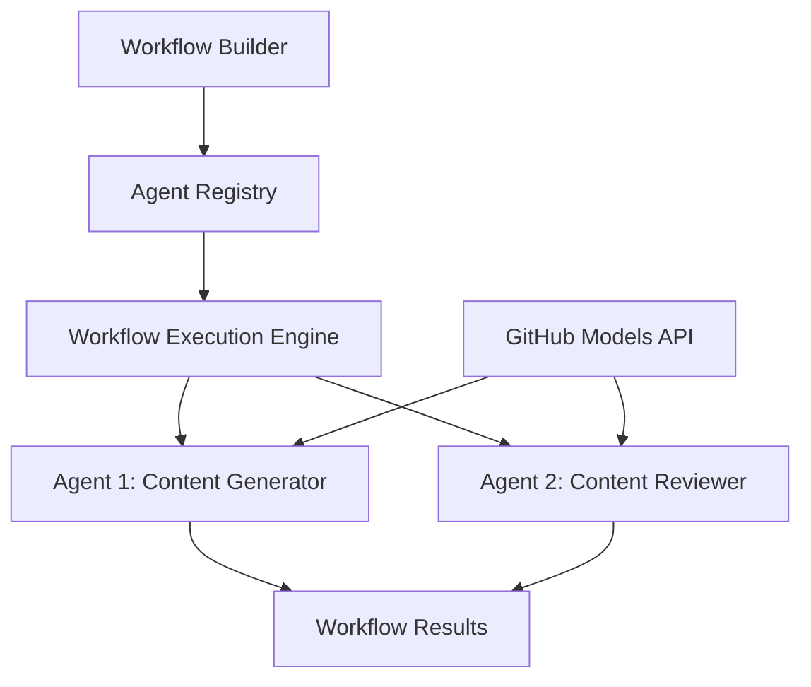

<!--
CO_OP_TRANSLATOR_METADATA:
{
  "original_hash": "034158688d0a45aae06dcbb21b0da5ae",
  "translation_date": "2025-11-11T12:39:30+00:00",
  "source_file": "08-multi-agent/code_samples/workflows-agent-framework/dotNET/01.dotnet-agent-framework-workflow-ghmodel-basic.md",
  "language_code": "de"
}
-->
# 🔄 Grundlegende Agenten-Workflows mit GitHub-Modellen (.NET)

## 📋 Tutorial zur Workflow-Orchestrierung

Dieses Notebook zeigt, wie man anspruchsvolle **Agenten-Workflows** mit dem Microsoft Agent Framework für .NET und GitHub-Modellen erstellt. Sie lernen, mehrstufige Geschäftsprozesse zu entwickeln, bei denen KI-Agenten zusammenarbeiten, um komplexe Aufgaben durch strukturierte Orchestrierungsmuster zu bewältigen.

## 🎯 Lernziele

### 🏗️ **Grundlagen der Workflow-Architektur**
- **Workflow Builder**: Entwerfen und orchestrieren komplexer mehrstufiger KI-Prozesse
- **Agenten-Koordination**: Koordination mehrerer spezialisierter Agenten innerhalb von Workflows
- **Integration von GitHub-Modellen**: Nutzung des KI-Modell-Inferenzdienstes von GitHub in Workflows
- **Visuelles Workflow-Design**: Erstellen und Visualisieren von Workflow-Strukturen für ein besseres Verständnis

### 🔄 **Prozess-Orchestrierungsmuster**
- **Sequenzielle Verarbeitung**: Verknüpfen mehrerer Agentenaufgaben in logischer Reihenfolge
- **Zustandsverwaltung**: Kontext- und Datenfluss über Workflow-Stufen hinweg aufrechterhalten
- **Fehlerbehandlung**: Robuste Fehlerbehebung und Workflow-Resilienz implementieren
- **Leistungsoptimierung**: Effiziente Workflows für Unternehmensanwendungen entwerfen

### 🏢 **Anwendungen für Unternehmens-Workflows**
- **Automatisierung von Geschäftsprozessen**: Automatisierung komplexer organisatorischer Workflows
- **Content-Produktionspipeline**: Redaktions-Workflows mit Überprüfungs- und Genehmigungsstufen
- **Automatisierung des Kundenservices**: Mehrstufige Bearbeitung von Kundenanfragen
- **Datenverarbeitungs-Workflows**: ETL-Workflows mit KI-gestützter Transformation

## ⚙️ Voraussetzungen & Einrichtung

### 📦 **Erforderliche NuGet-Pakete**

Diese Workflow-Demonstration verwendet mehrere wichtige .NET-Pakete:

```xml
<!-- Core AI Framework -->
<PackageReference Include="Microsoft.Extensions.AI" Version="9.9.0" />

<!-- Agent Framework (Local Development) -->
<!-- Microsoft.Agents.AI.dll - Core agent abstractions -->
<!-- Microsoft.Agents.AI.OpenAI.dll - OpenAI/GitHub Models integration -->

<!-- Configuration and Environment -->
<PackageReference Include="DotNetEnv" Version="3.1.1" />
```

### 🔑 **Konfiguration der GitHub-Modelle**

**Umgebungssetup (.env-Datei):**
```env
GITHUB_TOKEN=your_github_personal_access_token
GITHUB_ENDPOINT=https://models.inference.ai.azure.com
GITHUB_MODEL_ID=gpt-4o-mini
```

**Zugriff auf GitHub-Modelle:**
1. Melden Sie sich für GitHub-Modelle an (derzeit in der Vorschau)
2. Generieren Sie ein persönliches Zugriffstoken mit Berechtigungen für den Modellzugriff
3. Konfigurieren Sie die Umgebungsvariablen wie oben gezeigt

### 🏗️ **Überblick über die Workflow-Architektur**



**Wichtige Komponenten:**
- **WorkflowBuilder**: Haupt-Orchestrierungs-Engine für die Gestaltung von Workflows
- **AIAgent**: Einzelne spezialisierte Agenten mit spezifischen Fähigkeiten
- **GitHub Models Client**: Integration des KI-Modell-Inferenzdienstes
- **Execution Context**: Verwaltung von Zustand und Datenfluss zwischen Workflow-Stufen

## 🎨 **Designmuster für Unternehmens-Workflows**

### 📝 **Content-Produktions-Workflow**
```
User Request → Content Generation → Quality Review → Final Output
```

### 🔍 **Dokumentenverarbeitungspipeline**
```
Document Input → Analysis → Extraction → Validation → Structured Output
```

### 💼 **Business-Intelligence-Workflow**
```
Data Collection → Processing → Analysis → Report Generation → Distribution
```

### 🤝 **Automatisierung des Kundenservices**
```
Customer Inquiry → Classification → Processing → Response Generation → Follow-up
```

## 🏢 **Vorteile für Unternehmen**

### 🎯 **Zuverlässigkeit & Skalierbarkeit**
- **Deterministische Ausführung**: Konsistente, wiederholbare Workflow-Ergebnisse
- **Fehlerbehebung**: Elegante Handhabung von Fehlern in jeder Workflow-Stufe
- **Leistungsüberwachung**: Verfolgung von Ausführungsmetriken und Optimierungsmöglichkeiten
- **Ressourcenmanagement**: Effiziente Zuweisung und Nutzung von KI-Modell-Ressourcen

### 🔒 **Sicherheit & Compliance**
- **Sichere Authentifizierung**: Token-basierte Authentifizierung von GitHub für API-Zugriff
- **Audit-Trails**: Vollständige Protokollierung der Workflow-Ausführung und Entscheidungsprozesse
- **Zugriffskontrolle**: Granulare Berechtigungen für Workflow-Ausführung und Überwachung
- **Datenschutz**: Sichere Handhabung sensibler Informationen innerhalb von Workflows

### 📊 **Beobachtbarkeit & Management**
- **Visuelles Workflow-Design**: Klare Darstellung von Prozessabläufen und Abhängigkeiten
- **Ausführungsüberwachung**: Echtzeit-Verfolgung des Workflow-Fortschritts und der Leistung
- **Fehlerberichterstattung**: Detaillierte Fehleranalyse und Debugging-Funktionen
- **Leistungsanalysen**: Metriken für Optimierung und Kapazitätsplanung

Lassen Sie uns Ihren ersten unternehmensfähigen KI-Workflow erstellen! 🚀

## 💻 Code ausführen

Die vollständige Implementierung ist verfügbar in `01.dotnet-agent-framework-workflow-ghmodel-basic.cs`. Diese Datei zeigt:

1. **Umgebungskonfiguration** - Laden der GitHub-Modelle-Anmeldedaten aus der `.env`-Datei
2. **OpenAI-Client-Setup** - Konfiguration des Clients zur Nutzung des GitHub-Modelle-Endpunkts
3. **Agentenerstellung** - Definition spezialisierter Agenten (Front Desk und Concierge)
4. **Workflow Builder** - Erstellung eines mehrstufigen Agenten-Workflows mit sequenzieller Verarbeitung
5. **Workflow-Ausführung** - Ausführung des Workflows mit Streaming-Ergebnissen

### 🚀 Beispiel ausführen

```bash
# Make the script executable (Unix/Linux/macOS)
chmod +x 01.dotnet-agent-framework-workflow-ghmodel-basic.cs

# Run the workflow
./01.dotnet-agent-framework-workflow-ghmodel-basic.cs
```

Oder unter Windows:
```powershell
dotnet run 01.dotnet-agent-framework-workflow-ghmodel-basic.cs
```

### 📝 Erwartete Ausgabe

Der Workflow wird:
1. Ihre Reiseanfrage entgegennehmen ("Ich möchte nach Paris reisen")
2. Der Front Desk-Agent gibt eine erste Empfehlung
3. Der Concierge-Agent überprüft und verfeinert die Empfehlung
4. Die endgültige Ausgabe zeigt den vollständigen Gesprächsverlauf

### 🔧 Anpassung

Sie können den Workflow anpassen, indem Sie:
- Die Anweisungen der Agenten ändern, um deren Verhalten zu modifizieren
- Weitere Agenten hinzufügen, um komplexe mehrstufige Workflows zu erstellen
- Die Benutzeranfrage ändern, um verschiedene Szenarien zu testen
- Die Workflow-Kanten anpassen, um unterschiedliche Ausführungsmuster zu erstellen

---

<!-- CO-OP TRANSLATOR DISCLAIMER START -->
**Haftungsausschluss**:  
Dieses Dokument wurde mit dem KI-Übersetzungsdienst [Co-op Translator](https://github.com/Azure/co-op-translator) übersetzt. Obwohl wir uns um Genauigkeit bemühen, beachten Sie bitte, dass automatisierte Übersetzungen Fehler oder Ungenauigkeiten enthalten können. Das Originaldokument in seiner ursprünglichen Sprache sollte als maßgebliche Quelle betrachtet werden. Für kritische Informationen wird eine professionelle menschliche Übersetzung empfohlen. Wir übernehmen keine Haftung für Missverständnisse oder Fehlinterpretationen, die sich aus der Nutzung dieser Übersetzung ergeben.
<!-- CO-OP TRANSLATOR DISCLAIMER END -->