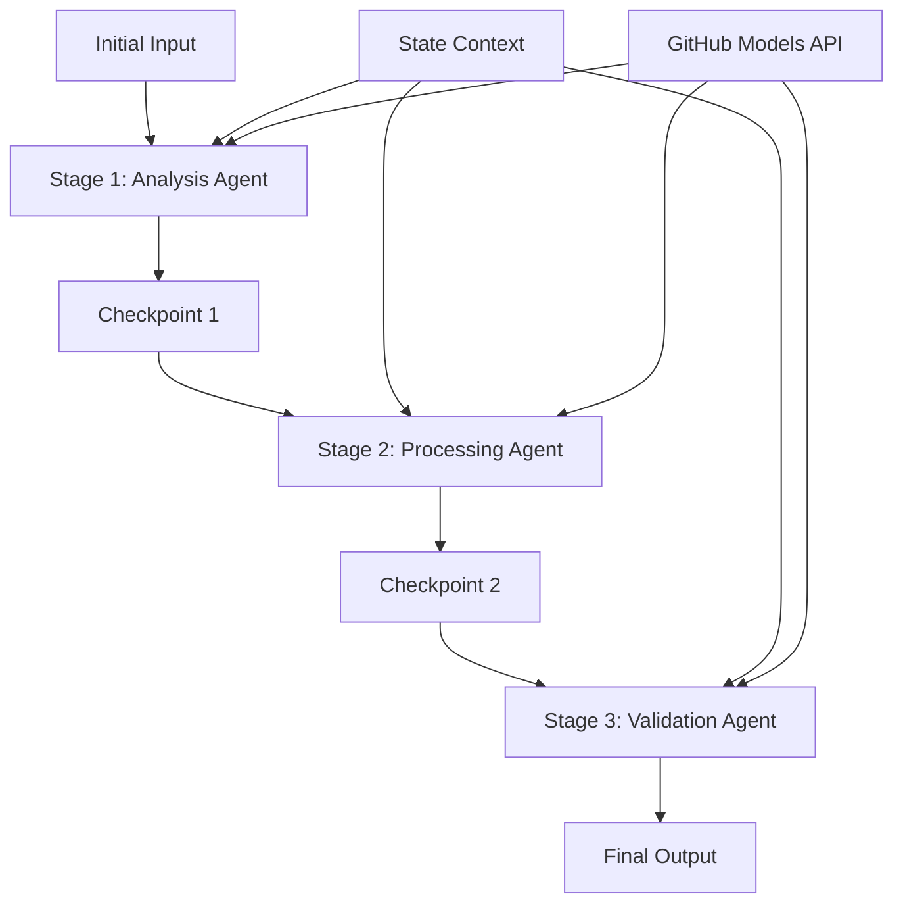

<!--
CO_OP_TRANSLATOR_METADATA:
{
  "original_hash": "1be9c8dcbd79a02d33d2c138684c1394",
  "translation_date": "2025-11-11T13:40:09+00:00",
  "source_file": "08-multi-agent/code_samples/workflows-agent-framework/dotNET/02.dotnet-agent-framework-workflow-ghmodel-sequential.md",
  "language_code": "de"
}
-->
# ⏩ Sequenzielle Agenten-Workflows mit GitHub-Modellen (.NET)

## 📋 Fortgeschrittenes Tutorial zur sequenziellen Verarbeitung

Dieses Notebook demonstriert **Muster für sequenzielle Workflows** mit dem Microsoft Agent Framework für .NET und GitHub-Modellen. Sie lernen, wie man anspruchsvolle, schrittweise Verarbeitungspipelines erstellt, bei denen Agenten in einer bestimmten Reihenfolge ausgeführt werden und jede Phase auf den Ergebnissen der vorherigen Phase aufbaut.

## 🎯 Lernziele

### 🔄 **Architektur der sequenziellen Verarbeitung**
- **Lineares Workflow-Design**: Erstellen Sie schrittweise Verarbeitungspipelines mit klaren Abhängigkeiten
- **Zustandsverwaltung**: Behalten Sie Kontext und Datenfluss über die Phasen des sequenziellen Workflows hinweg
- **Integration von GitHub-Modellen**: Nutzen Sie die KI-Modelle von GitHub in mehrstufigen .NET-Workflows
- **Enterprise-Pipeline-Muster**: Entwickeln Sie produktionsreife Systeme für die sequenzielle Verarbeitung

### 🏗️ **Fortgeschrittene sequenzielle Muster**
- **Stage-Gate-Verarbeitung**: Implementieren Sie Validierungspunkte zwischen den Workflow-Phasen
- **Kontextbewahrung**: Behalten Sie den Zustand und das angesammelte Wissen über alle Phasen hinweg
- **Fehlerweitergabe**: Behandeln Sie Fehler in sequenziellen Verarbeitungsketten elegant
- **Leistungsoptimierung**: Effiziente sequenzielle Ausführung mit minimalem Overhead

### 🏢 **Enterprise-sequenzielle Anwendungen**
- **Dokumentenverarbeitungspipeline**: Mehrstufige Dokumentenanalyse, -transformation und -validierung
- **Qualitätssicherungs-Workflows**: Sequenzielle Überprüfungs-, Validierungs- und Genehmigungsprozesse
- **Content-Produktionspipeline**: Recherche → Schreiben → Bearbeiten → Überprüfen → Veröffentlichen
- **Automatisierung von Geschäftsprozessen**: Mehrstufige Geschäftsworkflows mit klaren Phasenabhängigkeiten

## ⚙️ Voraussetzungen & Einrichtung

### 📦 **Erforderliche NuGet-Pakete**

Wesentliche Pakete für .NET-sequenzielle Workflows:

```xml
<!-- Core AI Framework -->
<PackageReference Include="Microsoft.Extensions.AI" Version="9.9.0" />

<!-- Client Model Abstractions -->
<PackageReference Include="System.ClientModel" Version="1.6.1.0" />

<!-- Azure Identity and Async LINQ Support -->
<PackageReference Include="Azure.Identity" Version="1.15.0" />
<PackageReference Include="System.Linq.Async" Version="6.0.3" />

<!-- Local Agent Framework References -->
<!-- Microsoft.Agents.AI.dll - Core agent abstractions -->
<!-- Microsoft.Agents.AI.OpenAI.dll - GitHub Models integration -->
```

### 🔑 **Konfiguration der GitHub-Modelle**

**Umgebungssetup (.env-Datei):**
```env
GITHUB_TOKEN=your_github_personal_access_token
GITHUB_ENDPOINT=https://models.inference.ai.azure.com
GITHUB_MODEL_ID=gpt-4o-mini
```

**Konfigurationsmanagement:**
```csharp
// Load environment variables securely
Env.Load("../../../.env");
var githubToken = Environment.GetEnvironmentVariable("GITHUB_TOKEN");
var githubEndpoint = Environment.GetEnvironmentVariable("GITHUB_ENDPOINT");
var modelId = Environment.GetEnvironmentVariable("GITHUB_MODEL_ID");
```

### 🏗️ **Architektur des sequenziellen Workflows**



**Wichtige Komponenten:**
- **Sequenzielle Agenten**: Spezialisierte Agenten für jede Verarbeitungsphase
- **Zustandskontext**: Beibehaltung angesammelter Daten und Entscheidungen über die Phasen hinweg
- **Checkpoints**: Validierungspunkte zwischen den Phasen zur Sicherstellung von Qualität und Konsistenz
- **GitHub Models Client**: Konsistenter Zugriff auf KI-Modelle über alle Workflow-Phasen hinweg

## 🎨 **Designmuster für sequenzielle Workflows**

### 📝 **Dokumentenverarbeitungspipeline**
```
Raw Document → Content Extraction → Analysis → Validation → Structured Output
```

### 🎯 **Content-Erstellungs-Workflow**
```
Brief/Requirements → Research → Content Creation → Review → Final Polish
```

### 🔍 **Qualitätssicherungspipeline**
```
Initial Review → Technical Validation → Compliance Check → Final Approval
```

### 💼 **Business-Intelligence-Workflow**
```
Data Collection → Processing → Analysis → Report Generation → Distribution
```

## 🏢 **Vorteile von Enterprise-sequenziellen Workflows**

### 🎯 **Zuverlässigkeit & Qualität**
- **Deterministische Verarbeitung**: Konsistente, wiederholbare Ergebnisse durch strukturierte Phasen
- **Qualitätskontrollen**: Validierungspunkte gewährleisten Qualität in jeder Phase
- **Fehlerisolierung**: Probleme in einer Phase wirken sich nicht auf nachfolgende Phasen aus
- **Audit-Trails**: Vollständige Nachverfolgung von Entscheidungen und Transformationen in jeder Phase

### 📈 **Skalierbarkeit & Leistung**
- **Modulares Design**: Jede Phase kann unabhängig optimiert werden
- **Ressourcenmanagement**: Effiziente Zuweisung von KI-Modellressourcen über die Phasen hinweg
- **Zustandsoptimierung**: Minimaler Zustandstransfer zwischen den Phasen für optimale Leistung
- **Parallele Phasengruppen**: Mehrere sequenzielle Workflows können parallel ausgeführt werden

### 🔒 **Sicherheit & Compliance**
- **Phasenbezogene Sicherheit**: Unterschiedliche Sicherheitsrichtlinien für verschiedene Verarbeitungsphasen
- **Datenvalidierung**: Sicherstellung der Datenintegrität und Compliance an jedem Kontrollpunkt
- **Zugriffskontrolle**: Granulare Berechtigungen für verschiedene Workflow-Phasen
- **Regulatorische Compliance**: Erfüllung gesetzlicher Anforderungen durch strukturierte Verarbeitung

### 📊 **Überwachung & Analytik**
- **Phasenbezogene Metriken**: Leistungsüberwachung für jede Workflow-Phase
- **Engpassidentifikation**: Identifizieren und Optimieren langsamer Phasen
- **Qualitätsmetriken**: Verfolgen von Qualität und Erfolgsraten in jeder Phase
- **Prozessoptimierung**: Kontinuierliche Verbesserung basierend auf phasenbezogenen Analysen

Lassen Sie uns robuste sequenzielle KI-Verarbeitungspipelines erstellen! 🚀

## 💻 Code ausführen

Die vollständige Implementierung ist verfügbar in `02.dotnet-agent-framework-workflow-ghmodel-sequential.cs`. Diese Datei demonstriert einen **dreistufigen Möbelanalyse-Workflow**:

1. **Phase 1 - Verkaufsagent**: Analysiert Möbelbilder und gibt Kaufvorschläge
2. **Phase 2 - Preisagent**: Liefert detaillierte Preisaufschlüsselungen und Budgetoptionen
3. **Phase 3 - Angebotsagent**: Erstellt ein professionelles Angebotsdokument im Markdown-Format

### 🏗️ **Workflow-Architektur**

```
Image Input → Sales Analysis → Price Estimation → Quote Generation → Final Output
```

Jeder Agent:
- Erhält die Ausgabe der vorherigen Phase als Kontext
- Baut auf vorherigen Analysen mit spezialisierter Expertise auf
- Beibehaltung der Workflow-Kontinuität durch Zustandsverwaltung

### 🚀 Beispiel ausführen

**Voraussetzungen:**
- Platzieren Sie ein Möbelbild unter `../imgs/home.png` (oder aktualisieren Sie die Variable `imgPath`)
- Konfigurieren Sie Ihre `.env`-Datei mit GitHub Models-Zugangsdaten

```bash
# Make the script executable (Unix/Linux/macOS)
chmod +x 02.dotnet-agent-framework-workflow-ghmodel-sequential.cs

# Run the sequential workflow
./02.dotnet-agent-framework-workflow-ghmodel-sequential.cs
```

Oder unter Windows:
```powershell
dotnet run 02.dotnet-agent-framework-workflow-ghmodel-sequential.cs
```

### 📝 Erwartete Ausgabe

Der Workflow wird:
1. **Verkaufsagent**: Möbelstücke aus dem Bild identifizieren und Empfehlungen geben
2. **Preisagent**: Detaillierte Preisanalyse mit Budgetstufen und Einkaufsempfehlungen hinzufügen
3. **Angebotsagent**: Ein formatiertes Angebotsdokument erstellen, das alle Informationen zusammenfasst

Die endgültige Ausgabe wird ein umfassendes, professionelles Möbelangebot basierend auf der Bildanalyse sein.

### 🔧 Anpassungsoptionen

**Agentenverhalten ändern:**
```csharp
// Adjust agent instructions to change their focus
const string SalesAgentInstructions = "Your custom instructions...";
```

**Sequenziellen Ablauf ändern:**
```csharp
// Add or reorder workflow stages
var workflow = new WorkflowBuilder(salesagent)
    .AddEdge(salesagent, priceagent)
    .AddEdge(priceagent, quoteagent)
    .AddEdge(quoteagent, newAgent)  // Add another stage
    .Build();
```

**Andere Eingaben verwenden:**
```csharp
// Process text instead of images
ChatMessage userMessage = new ChatMessage(ChatRole.User, [
    new TextContent("Analyze pricing for a modern living room set")
]);
```

### 🎯 Anwendungen in der Praxis

Dieses sequenzielle Muster eignet sich ideal für:
- **E-Commerce**: Produktanalyse → Preisgestaltung → Angebotserstellung
- **Immobilien**: Immobilienanalyse → Bewertung → Erstellung von Inseraten
- **Versicherungen**: Schadensanalyse → Bewertung → Angebotserstellung
- **Content-Erstellung**: Recherche → Schreiben → Bearbeiten → Veröffentlichen

### 🔍 Verständnis des Zustandsflusses

Jeder Agent in der Sequenz erhält:
- **Originaleingabe**: Die ursprüngliche Benutzeranfrage (Bild + Text)
- **Ausgaben vorheriger Agenten**: Alle vorherigen Agentenantworten in der Gesprächshistorie
- **Angesammelter Kontext**: Vollständiger Zustand, der während des gesamten Workflows beibehalten wird

Dies ermöglicht eine anspruchsvolle mehrstufige Verarbeitung, bei der jeder Agent auf umfassendem Kontext aus allen vorherigen Phasen aufbaut.

---

<!-- CO-OP TRANSLATOR DISCLAIMER START -->
**Haftungsausschluss**:  
Dieses Dokument wurde mit dem KI-Übersetzungsdienst [Co-op Translator](https://github.com/Azure/co-op-translator) übersetzt. Obwohl wir uns um Genauigkeit bemühen, beachten Sie bitte, dass automatisierte Übersetzungen Fehler oder Ungenauigkeiten enthalten können. Das Originaldokument in seiner ursprünglichen Sprache sollte als maßgebliche Quelle betrachtet werden. Für kritische Informationen wird eine professionelle menschliche Übersetzung empfohlen. Wir übernehmen keine Haftung für Missverständnisse oder Fehlinterpretationen, die sich aus der Nutzung dieser Übersetzung ergeben.
<!-- CO-OP TRANSLATOR DISCLAIMER END -->