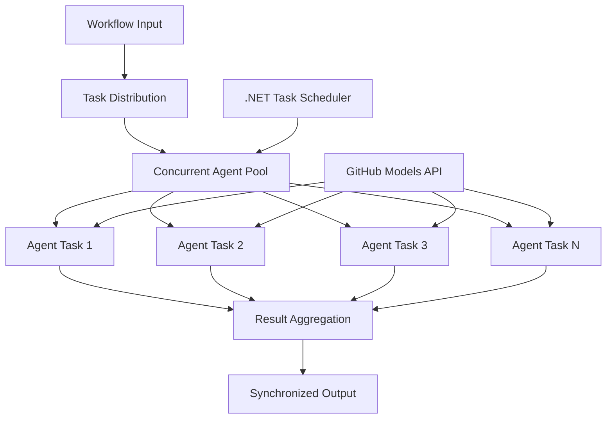

<!--
CO_OP_TRANSLATOR_METADATA:
{
  "original_hash": "b9c6e32c9b5f2fed20b6916984440d88",
  "translation_date": "2025-11-11T13:05:47+00:00",
  "source_file": "08-multi-agent/code_samples/workflows-agent-framework/dotNET/03.dotnet-agent-framework-workflow-ghmodel-concurrent.md",
  "language_code": "de"
}
-->
# ⚡ Gleichzeitige Agenten-Workflows mit GitHub-Modellen (.NET)

## 📋 Tutorial für Hochleistungs-Parallele Verarbeitung

Dieses Notebook demonstriert **gleichzeitige Workflow-Muster** mit dem Microsoft Agent Framework für .NET und GitHub-Modelle. Sie lernen, wie Sie Hochleistungs-Workflows für parallele Verarbeitung erstellen, die den Durchsatz maximieren, indem mehrere KI-Agenten gleichzeitig ausgeführt werden, während Koordination und Datenkonsistenz erhalten bleiben.

## 🎯 Lernziele

### 🚀 **Grundlagen der gleichzeitigen Verarbeitung**
- **Parallele Agentenausführung**: Mehrere KI-Agenten gleichzeitig ausführen für maximale Leistung
- **Async/Await-Muster**: Nutzung des asynchronen Programmiermodells von .NET für effiziente Gleichzeitigkeit
- **Integration von GitHub-Modellen**: Koordination mehrerer gleichzeitiger Anfragen an den Inferenzdienst von GitHub-Modellen
- **Ressourcenmanagement**: Effiziente Verwaltung von KI-Modellressourcen über gleichzeitige Operationen hinweg

### 🏗️ **Fortgeschrittene Architektur für Gleichzeitigkeit**
- **Task-basierte Parallelität**: Nutzung der .NET Task Parallel Library für optimale gleichzeitige Ausführung
- **Synchronisationsmuster**: Koordination gleichzeitiger Agenten unter Vermeidung von Race Conditions
- **Lastverteilung**: Effiziente Verteilung der Arbeit über die verfügbare gleichzeitige Verarbeitungskapazität
- **Fehlertoleranz**: Umgang mit Ausfällen einzelner Agenten, ohne den gesamten Workflow zu stoppen

### 🏢 **Gleichzeitige Anwendungen für Unternehmen**
- **Hochvolumige Dokumentenverarbeitung**: Mehrere Dokumente gleichzeitig verarbeiten
- **Echtzeit-Inhaltsanalyse**: Gleichzeitige Analyse eingehender Datenströme
- **Optimierung der Batch-Verarbeitung**: Maximierung des Durchsatzes bei großflächigen Datenverarbeitungsoperationen
- **Multimodale Analyse**: Parallele Verarbeitung verschiedener Inhaltstypen und Formate

## ⚙️ Voraussetzungen & Einrichtung

### 📦 **Erforderliche NuGet-Pakete**

Wesentliche Pakete für Hochleistungs-Workflows mit Gleichzeitigkeit:

```xml
<!-- Core AI Framework with Async Support -->
<PackageReference Include="Microsoft.Extensions.AI" Version="9.9.0" />

<!-- Client Model Abstractions for API Communication -->
<PackageReference Include="System.ClientModel" Version="1.6.1.0" />

<!-- Azure Identity and Async LINQ for Advanced Operations -->
<PackageReference Include="Azure.Identity" Version="1.15.0" />
<PackageReference Include="System.Linq.Async" Version="6.0.3" />

<!-- Local Agent Framework References -->
<!-- Microsoft.Agents.AI.dll - Core agent abstractions with async support -->
<!-- Microsoft.Agents.AI.OpenAI.dll - GitHub Models integration with concurrency -->
```

### 🔑 **Konfiguration der GitHub-Modelle**

**Umgebungssetup (.env-Datei):**
```env
GITHUB_TOKEN=your_github_personal_access_token
GITHUB_ENDPOINT=https://models.inference.ai.azure.com
GITHUB_MODEL_ID=gpt-4o-mini
```

**Überlegungen zur gleichzeitigen Verarbeitung:**
```csharp
// Configure for concurrent operations
var clientOptions = new OpenAIClientOptions()
{
    Endpoint = new Uri(githubEndpoint),
    // Configure connection pooling for concurrent requests
    NetworkTimeout = TimeSpan.FromMinutes(5)
};
```

### 🏗️ **Architektur des gleichzeitigen Workflows**



**Wichtige Komponenten:**
- **Task Parallel Library**: Eingebaute Unterstützung von .NET für gleichzeitige Operationen
- **Agenten-Pool**: Mehrere Agenteninstanzen für parallele Verarbeitung
- **Ergebnisaggregation**: Koordination und Zusammenführung der Ergebnisse gleichzeitiger Agenten
- **Synchronisationspunkte**: Sicherstellung der Datenkonsistenz über gleichzeitige Operationen hinweg

## 🎨 **Designmuster für gleichzeitige Workflows**

### 🔍 **Parallele Forschung & Analyse**
```
Research Topic → Concurrent Research Agents → Result Synthesis → Final Report
```

### 📊 **Datenverarbeitung aus mehreren Quellen**
```
Data Sources → Parallel Processing Agents → Data Integration → Unified Output
```

### 🎭 **Inhaltsgenerierungspipeline**
```
Content Requirements → Concurrent Content Generators → Quality Review → Final Content
```

### 🔄 **Fan-Out/Fan-In-Verarbeitung**
```
Single Input → Multiple Concurrent Processors → Result Aggregation → Single Output
```

## 🏢 **Leistungssteigerungen für Unternehmen**

### ⚡ **Durchsatz & Skalierbarkeit**
- **Lineare Leistungsskalierung**: Mehr gleichzeitige Agenten hinzufügen, um den Durchsatz zu erhöhen
- **Ressourcennutzung**: Maximale Effizienz der verfügbaren KI-Modellkapazität
- **Reduzierte Verarbeitungszeit**: Deutliche Zeitersparnis durch parallele Ausführung
- **Elastische Skalierung**: Dynamische Anpassung der Anzahl gleichzeitiger Agenten basierend auf der Arbeitslast

### 🛡️ **Zuverlässigkeit & Widerstandsfähigkeit**
- **Fehlerisolierung**: Ausfälle einzelner Agenten beeinträchtigen andere gleichzeitige Operationen nicht
- **Sanfte Degradierung**: System arbeitet mit reduzierter Agentenkapazität weiter
- **Fehlerbehebung**: Automatische Wiederholungsmechanismen für fehlgeschlagene gleichzeitige Operationen
- **Lastverteilung**: Gleichmäßige Verteilung der Arbeit über verfügbare Agenten

### 📊 **Leistungsüberwachung**
- **Metriken für gleichzeitige Ausführung**: Leistung aller parallelen Operationen verfolgen
- **Ressourcennutzungsanalyse**: CPU-, Speicher- und Netzwerkauslastung überwachen
- **Durchsatzanalyse**: Effizienzgewinne durch gleichzeitige Verarbeitung messen
- **Engpasserkennung**: Leistungsbeschränkungen identifizieren und beheben

### 🔧 **Entwicklung & Betrieb**
- **Asynchrones Programmiermodell**: Nutzung der ausgereiften Async/Await-Muster von .NET
- **Task-Koordination**: Eingebaute Task-Management- und Koordinierungsfunktionen
- **Fehlerbehandlung**: Umfassende Fehlerbehandlung für gleichzeitige Operationen
- **Debugging-Unterstützung**: Debugging-Tools von Visual Studio für gleichzeitige Workflows

Lassen Sie uns Hochleistungs-KI-Workflows mit .NET erstellen! 🚀

## 💻 Code ausführen

Die vollständige Implementierung ist verfügbar in `03.dotnet-agent-framework-workflow-ghmodel-concurrent.cs`. Diese Datei demonstriert einen **Fan-Out/Fan-In-Workflow** für Reiseplanung:

### 🏗️ **Workflow-Architektur**

```
User Request → ConcurrentStartExecutor → [Researcher Agent || Planner Agent] → ConcurrentAggregationExecutor → Final Output
```

**Wichtige Komponenten:**

1. **ConcurrentStartExecutor**: Sendet die Benutzeranfrage gleichzeitig an alle Agenten
2. **Researcher Agent**: Analysiert Reiseziele und Attraktionen parallel
3. **Planner Agent**: Erstellt detaillierte Reisepläne parallel
4. **ConcurrentAggregationExecutor**: Sammelt und kombiniert Ergebnisse von beiden Agenten

### 🎯 **Fan-Out/Fan-In-Muster**

Dieser Workflow demonstriert das klassische **Fan-Out/Fan-In-Muster**:
- **Fan-Out**: Eine Eingabenachricht wird gleichzeitig an mehrere Agenten gesendet
- **Gleichzeitige Verarbeitung**: Mehrere Agenten arbeiten parallel an derselben Aufgabe
- **Fan-In**: Ergebnisse aller Agenten werden gesammelt und zu einer einzigen Ausgabe zusammengeführt

### 🚀 Beispiel ausführen

```bash
# Make the script executable (Unix/Linux/macOS)
chmod +x 03.dotnet-agent-framework-workflow-ghmodel-concurrent.cs

# Run the concurrent workflow
./03.dotnet-agent-framework-workflow-ghmodel-concurrent.cs
```

Oder unter Windows:
```powershell
dotnet run 03.dotnet-agent-framework-workflow-ghmodel-concurrent.cs
```

### 📝 Erwartete Ausgabe

Der Workflow wird:
1. **Anfrage senden**: "Plane eine Reise nach Seattle im Dezember" an beide Agenten senden
2. **Gleichzeitige Verarbeitung**: Beide Agenten arbeiten gleichzeitig:
   - Der Researcher identifiziert Attraktionen und Details
   - Der Planner erstellt eine Reiseroute und Logistik
3. **Aggregation**: Beide Antworten zu einer umfassenden Ausgabe kombinieren
4. **Ergebnisse anzeigen**: Den zusammengeführten Reiseplan mit allen Informationen anzeigen

### 🔧 Anpassungsoptionen

**Mehr gleichzeitige Agenten hinzufügen:**
```csharp
// Create additional specialized agents
AIAgent budgetAgent = openAIClient.GetChatClient(github_model_id).CreateAIAgent(
    name: "Budget-Agent", instructions: "Calculate travel costs...");

// Add to fan-out
var workflow = new WorkflowBuilder(startExecutor)
    .AddFanOutEdge(startExecutor, targets: [researcherAgent, plannerAgent, budgetAgent])
    .AddFanInEdge(aggregationExecutor, sources: [researcherAgent, plannerAgent, budgetAgent])
    .WithOutputFrom(aggregationExecutor)
    .Build();

// Update aggregation count
if (this._messages.Count == 3) { ... }
```

**Agentenanweisungen ändern:**
```csharp
const string ResearcherAgentInstructions = "Your custom instructions for research...";
const string PlanAgentInstructions = "Your custom instructions for planning...";
```

**Aufgabe ändern:**
```csharp
StreamingRun run = await InProcessExecution.StreamAsync(
    workflow, 
    "Plan a European vacation for 2 weeks in summer"
);
```

### 🎯 Anwendungen in der Praxis

Dieses gleichzeitige Muster eignet sich ideal für:
- **Inhaltsgenerierung**: Mehrere Autoren erstellen gleichzeitig verschiedene Abschnitte
- **Code-Review**: Mehrere Reviewer analysieren Code aus unterschiedlichen Perspektiven
- **Marktforschung**: Parallele Analyse verschiedener Marktsegmente
- **Dokumentenverarbeitung**: Gleichzeitige Extraktion, Analyse und Validierung
- **Analyse aus mehreren Perspektiven**: Verschiedene Standpunkte zur gleichen Eingabe erhalten

### 🔍 Verständnis von benutzerdefinierten Executoren

**ConcurrentStartExecutor:**
- Implementiert `IMessageHandler<string>` zur Annahme von String-Eingaben
- Sendet Nachrichten an alle verbundenen Agenten
- Sendet `TurnToken`, um gleichzeitige Verarbeitung auszulösen

**ConcurrentAggregationExecutor:**
- Implementiert `IMessageHandler<ChatMessage>` zur Annahme von Agentenantworten
- Sammelt Nachrichten auf thread-sichere Weise
- Aggregiert, wenn alle erwarteten Antworten eingegangen sind
- Gibt die endgültige Ausgabe mit `context.YieldOutputAsync()` zurück

### ⚡ Leistungssteigerungen

**Gleichzeitig vs. Sequentiell:**
- Sequentiell: Agent1 (30s) → Agent2 (30s) = **60 Sekunden insgesamt**
- Gleichzeitig: Agent1 (30s) || Agent2 (30s) = **30 Sekunden insgesamt**

**Durchsatzverbesserung**: Bis zu N× schneller für N gleichzeitige Agenten (abhängig von Arbeitslast und Ressourcen)

### 🛡️ Fehlerbehandlung

Der Workflow behandelt Ausfälle einzelner Agenten problemlos:
- Wenn ein Agent ausfällt, arbeiten andere weiter
- Der Aggregator kann Timeout-Logik implementieren
- Teilweise Ergebnisse können bei Bedarf zurückgegeben werden

### 📊 Erweiterte Funktionen

**Dynamische Agentenzahl:**
Die Aggregationslogik anpassen, um variable Agentenzahlen zu unterstützen:

```csharp
private int _expectedAgentCount;
private readonly List<ChatMessage> _messages = [];

public async ValueTask HandleAsync(ChatMessage message, IWorkflowContext context)
{
    this._messages.Add(message);
    if (this._messages.Count == _expectedAgentCount)
    {
        // Process aggregation
    }
}
```

Dieses Muster für gleichzeitige Workflows ist entscheidend für den Aufbau leistungsstarker, skalierbarer KI-Agentensysteme!

---

<!-- CO-OP TRANSLATOR DISCLAIMER START -->
**Haftungsausschluss**:  
Dieses Dokument wurde mit dem KI-Übersetzungsdienst [Co-op Translator](https://github.com/Azure/co-op-translator) übersetzt. Obwohl wir uns um Genauigkeit bemühen, beachten Sie bitte, dass automatisierte Übersetzungen Fehler oder Ungenauigkeiten enthalten können. Das Originaldokument in seiner ursprünglichen Sprache sollte als maßgebliche Quelle betrachtet werden. Für kritische Informationen wird eine professionelle menschliche Übersetzung empfohlen. Wir übernehmen keine Haftung für Missverständnisse oder Fehlinterpretationen, die sich aus der Nutzung dieser Übersetzung ergeben.
<!-- CO-OP TRANSLATOR DISCLAIMER END -->