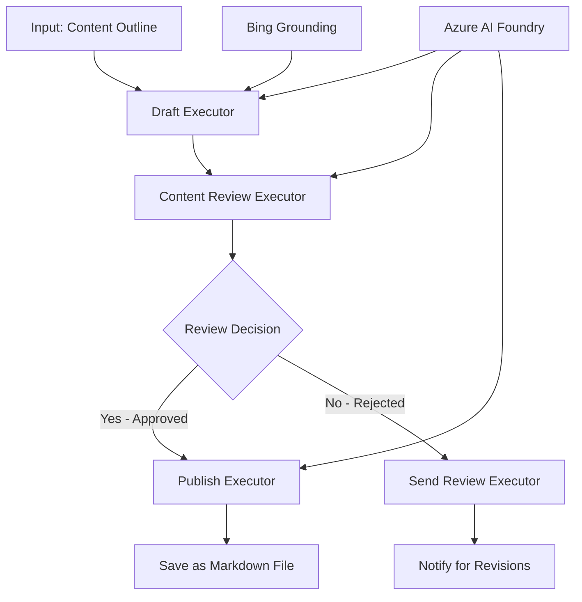

<!--
CO_OP_TRANSLATOR_METADATA:
{
  "original_hash": "8abd335151cee553293b637ee3d80d10",
  "translation_date": "2025-11-11T12:01:06+00:00",
  "source_file": "08-multi-agent/code_samples/workflows-agent-framework/dotNET/04.dotnet-agent-framework-workflow-aifoundry-condition.md",
  "language_code": "de"
}
-->
# 🔀 Bedingte Agenten-Workflows mit Azure AI Foundry (.NET)

## 📋 Tutorial für intelligente, entscheidungsbasierte Workflows

Dieses Notebook demonstriert **bedingte Workflow-Muster** mit Azure AI Foundry und dem Microsoft Agent Framework für .NET. Sie lernen, wie man komplexe, entscheidungsgetriebene Workflows erstellt, die die Verarbeitung basierend auf KI-Analysen, Geschäftsregeln und dynamischen Bedingungen intelligent steuern, um Automatisierung auf Unternehmensniveau zu ermöglichen.

## 🎯 Lernziele

### 🧠 **Architektur für intelligente Entscheidungen**
- **Implementierung von bedingter Logik**: Erstellen Sie komplexe Entscheidungsbäume mit mehreren Verzweigungspunkten
- **KI-gesteuerte Steuerung**: Nutzen Sie Azure AI Foundry-Modelle, um intelligente Routing-Entscheidungen zu treffen
- **Dynamische Workflow-Anpassung**: Ändern Sie das Workflow-Verhalten basierend auf Laufzeitanalysen und Bedingungen
- **Integration von Unternehmensregeln**: Integrieren Sie Geschäftslogik und Compliance-Anforderungen in Workflows

### 🔀 **Fortgeschrittene bedingte Muster**
- **Entscheidungen basierend auf mehreren Kriterien**: Bewerten Sie mehrere Faktoren für Routing-Entscheidungen
- **Kontextbewusste Verarbeitung**: Treffen Sie Entscheidungen basierend auf angesammeltem Workflow-Kontext und Historie
- **Adaptive Workflow-Modifikation**: Passen Sie Verarbeitungswege dynamisch basierend auf Echtzeitbedingungen an
- **Regel-Engine-Integration**: Implementieren Sie komplexe Geschäftsregel-Engines innerhalb von Workflows

### 🏢 **Bedingte Anwendungen im Unternehmen**
- **Dokumentenklassifikation und -routing**: Klassifizieren und leiten Sie Dokumente automatisch zu den entsprechenden Workflows
- **Kundenservice-Triage**: Intelligentes Routing von Kundenanfragen an spezialisierte Teams
- **Compliance- und Risikoverarbeitung**: Wenden Sie unterschiedliche Validierungs- und Überprüfungsprozesse basierend auf Risikobewertungen an
- **Qualitätssicherungs-Workflows**: Leiten Sie Inhalte basierend auf Qualitätsmetriken durch geeignete Überprüfungsprozesse

## ⚙️ Voraussetzungen & Einrichtung

### 📦 **Erforderliche NuGet-Pakete**

Erweiterte Pakete für bedingte Workflow-Verarbeitung:

```xml
<!-- Core AI Framework -->
<PackageReference Include="Microsoft.Extensions.AI" Version="9.9.0" />

<!-- Azure AI Agents with Persistent State -->
<PackageReference Include="Azure.AI.Agents.Persistent" Version="1.2.0-beta.5" />

<!-- Azure Identity and Utilities -->
<PackageReference Include="Azure.Identity" Version="1.15.0" />
<PackageReference Include="System.Linq.Async" Version="6.0.3" />
<PackageReference Include="DotNetEnv" Version="3.1.1" />

<!-- Local Workflow Framework References -->
<!-- Microsoft.Agents.Workflows.dll - Advanced workflow orchestration -->
<!-- Microsoft.Agents.AI.AzureAI.dll - Azure AI Foundry integration -->
<!-- Microsoft.Agents.AI.dll - Core agent abstractions -->
```

### 🔑 **Azure AI Foundry-Konfiguration**

**Erforderliche Azure-Ressourcen:**
- Azure AI Foundry-Arbeitsbereich mit Modellen für bedingte Verarbeitung
- Azure-Abonnement mit entsprechenden Compute-Kontingenten und Berechtigungen
- Bereitgestellte KI-Modelle für Entscheidungsfindung und Inhaltsanalyse
- (Optional) Bing Search API-Verbindung für Grounding-Funktionen

**Umgebungskonfiguration (.env-Datei):**
```env
# Azure AI Foundry Configuration
AZURE_AI_PROJECT_ENDPOINT=https://your-project.cognitiveservices.azure.com/
BING_CONNECTION_ID=your-bing-connection-id
```

**Authentifizierungseinrichtung:**
```csharp
// Azure CLI or Managed Identity authentication
using Azure.Identity;
var credential = new AzureCliCredential();

// Load environment configuration
DotNetEnv.Env.Load("../../../.env");
```

### 🏗️ **Architektur für bedingte Workflows**



**Wichtige Komponenten:**
- **Draft Executor**: KI-Agent, der erste Inhaltsentwürfe aus Gliederungen erstellt
- **Content Review Executor**: KI-Agent, der die Qualität und Compliance von Entwürfen bewertet
- **Bedingtes Routing**: Entscheidungslogik, die basierend auf Überprüfungsergebnissen steuert
- **Veröffentlichungs-/Überprüfungspfade**: Separate Verarbeitungswege für genehmigte vs. abgelehnte Inhalte
- **Zustandsverwaltung**: Beibehaltung des Inhalts- und Überprüfungskontexts während des Workflows

## 🎨 **Designmuster für bedingte Workflows**

### 📋 **Inhaltsproduktion mit Qualitätskontrollen**
```
Outline → Draft Creation → Quality Review → {Approve: Publish | Reject: Revise}
```

### 🎯 **Risikobasierte Dokumentenverarbeitung**
```
Document → Risk Assessment → {Low: Standard | High: Enhanced Review}
```

### 🔍 **Intelligentes Kundenservice-Routing**
```
Customer Query → Analysis → {Simple: FAQ Bot | Complex: Human Agent}
```

### 💼 **Compliance-gesteuerte Workflows**
```
Content → Compliance Check → {Pass: Publish | Fail: Legal Review}
```

## 🏢 **Vorteile bedingter Workflows im Unternehmen**

### 🎯 **Intelligente Automatisierung**
- **Intelligente Entscheidungsfindung**: KI-gesteuerte Routing-Entscheidungen basierend auf Inhaltsanalyse und Kontext
- **Adaptive Verarbeitung**: Workflows, die sich automatisch an sich ändernde Bedingungen anpassen
- **Durchsetzung von Geschäftsregeln**: Automatische Anwendung komplexer Geschäftslogik und Richtlinien
- **Kontextbewusstes Routing**: Entscheidungen basierend auf vollständiger Workflow-Historie und angesammeltem Kontext

### 📈 **Betriebliche Exzellenz**
- **Optimierte Ressourcenzuweisung**: Leiten Sie Arbeit an die am besten geeigneten Spezialisten und Prozesse weiter
- **Reduzierter manueller Eingriff**: Automatisierte Entscheidungsfindung minimiert den Bedarf an menschlichem Routing
- **Schnellere Bearbeitungszeiten**: Direkte Weiterleitung an geeignete Fachkenntnisse und Verarbeitungskapazitäten
- **Einheitliche Anwendung**: Einheitliche Anwendung von Geschäftsregeln und Entscheidungskriterien

### 🛡️ **Risikomanagement & Compliance**
- **Automatisierte Risikobewertung**: KI-gesteuerte Bewertung von Inhalts- und Situationsrisiken
- **Durchsetzung von Compliance**: Automatisches Routing durch erforderliche regulatorische Prozesse
- **Anwendung von Sicherheitsprotokollen**: Verbesserte Sicherheitsmaßnahmen basierend auf Risikobewertungen
- **Wartung von Audit-Trails**: Vollständige Dokumentation von Routing-Entscheidungen und deren Begründung

### 📊 **Analytik & kontinuierliche Verbesserung**
- **Entscheidungsanalytik**: Verfolgen Sie die Effektivität und Genauigkeit von Routing-Entscheidungen
- **Mustererkennung**: Identifizieren Sie Trends und Muster in Routing-Entscheidungen im Laufe der Zeit
- **Leistungsoptimierung**: Kontinuierliche Verbesserung der Entscheidungskriterien und Routing-Effizienz
- **Business Intelligence**: Erkenntnisse zu Inhaltsmerkmalen und Verarbeitungsanforderungen

### 🔧 **Technische Exzellenz**
- **Persistente Zustandsverwaltung**: Behalten Sie komplexe Zustände während der Workflow-Ausführung bei
- **Skalierbare Architektur**: Bewältigen Sie Anforderungen an die bedingte Verarbeitung bei hohem Volumen
- **Integrationsfähigkeiten**: Nahtlose Integration in bestehende Geschäftssysteme und -prozesse
- **Überwachung & Beobachtbarkeit**: Umfassende Verfolgung der Workflow-Leistung und Entscheidungen

Lassen Sie uns intelligente, entscheidungsgetriebene Unternehmens-Workflows mit .NET erstellen! 🚀

## 💻 Code ausführen

Die vollständige Implementierung ist verfügbar in `04.dotnet-agent-framework-workflow-aifoundry-condition.cs`. Dies demonstriert einen **Inhaltsproduktions-Workflow mit Qualitätskontrollen**:

### 🏗️ **Workflow-Architektur**

```
Content Outline → Draft Creation → Quality Review → Conditional Routing:
                                                      ├─ Approved (>200 words) → Publish
                                                      └─ Rejected (<200 words) → Review Notification
```

**Agenten im Workflow:**
1. **Evangelist Agent**: Erstellt Tutorial-Entwürfe aus Gliederungen mit Bing-Grounding
2. **Content Reviewer Agent**: Bewertet die Qualität des Entwurfs (Wortanzahl, Vollständigkeit)
3. **Publisher Agent**: Speichert genehmigte Inhalte als Markdown-Dateien mit Zeitstempel

**Benutzerdefinierte Executor:**
1. **DraftExecutor**: Koordiniert die Erstellung von Entwürfen
2. **ContentReviewExecutor**: Führt Qualitätsbewertungen durch
3. **PublishExecutor**: Veröffentlicht genehmigte Inhalte
4. **SendReviewExecutor**: Verwalten von Benachrichtigungen bei abgelehnten Inhalten

### 🚀 Beispiel ausführen

**Voraussetzungen:**
- Konfigurierter Azure AI Foundry-Arbeitsbereich
- Azure CLI-Authentifizierung (`az login`)
- (Optional) Bing Search-Verbindung für Grounding

```bash
# Make the script executable (Unix/Linux/macOS)
chmod +x 04.dotnet-agent-framework-workflow-aifoundry-condition.cs

# Run the conditional workflow
./04.dotnet-agent-framework-workflow-aifoundry-condition.cs
```

Oder unter Windows:
```powershell
dotnet run 04.dotnet-agent-framework-workflow-aifoundry-condition.cs
```

### 📝 Erwartete Ausgabe

Der Workflow wird:
1. **Agenten erstellen**: Drei spezialisierte Azure AI Foundry-Agenten initialisieren
2. **Entwurf erstellen**: Evangelist Agent erstellt Tutorial-Entwurf aus Gliederung
3. **Inhalt überprüfen**: Content Reviewer bewertet die Qualität des Entwurfs
4. **Bedingtes Routing**:
   - **Wenn genehmigt (>200 Wörter)**: Publish Executor speichert als Markdown-Datei
   - **Wenn abgelehnt (<200 Wörter)**: Send Review Executor sendet Benachrichtigung
5. **Ergebnisse anzeigen**: Zeigt das endgültige Workflow-Ergebnis an

### 🔧 Anpassungsoptionen

**Überprüfungskriterien ändern:**
```csharp
const string ContentReviewerInstructions = @"
You are a content reviewer...
1. Check if content is more than 500 words (instead of 200)
2. Verify technical accuracy
3. Ensure proper formatting
...";
```

**Weitere bedingte Pfade hinzufügen:**
```csharp
var workflow = new WorkflowBuilder(draftExecutor)
    .AddEdge(draftExecutor, contentReviewerExecutor)
    .AddEdge(contentReviewerExecutor, publishExecutor, condition: GetCondition("Excellent"))
    .AddEdge(contentReviewerExecutor, editExecutor, condition: GetCondition("Good"))
    .AddEdge(contentReviewerExecutor, sendReviewerExecutor, condition: GetCondition("Poor"))
    .Build();
```

**Inhaltsanforderungen ändern:**
```csharp
string OUTLINE_Content = @"
# Your Custom Topic
## Section 1
https://your-reference-url
## Section 2
...
";
```

### 🎯 Anwendungen in der Praxis

Dieses bedingte Workflow-Muster eignet sich ideal für:
- **Content-Management-Systeme**: Automatisierte redaktionelle Workflows mit Qualitätskontrollen
- **Dokumentenverarbeitung**: Dokumente basierend auf Klassifikation und Compliance routen
- **Kundensupport**: Intelligentes Ticket-Routing basierend auf Komplexität und Dringlichkeit
- **Rechtsprüfung**: Verträge basierend auf Risikobewertung und Wert routen
- **HR-Prozesse**: Bewerbungen durch geeignete Screening-Workflows leiten

### 🔍 Verständnis der bedingten Logik

**Bedingungsfunktion:**
```csharp
public Func<object?, bool> GetCondition(string expectedResult) =>
    reviewResult => reviewResult is ReviewResult review && review.Result == expectedResult;
```

Diese Funktion erstellt ein Prädikat, das:
1. Überprüft, ob das Ergebnis vom Typ `ReviewResult` ist
2. Die Eigenschaft `Result` mit dem erwarteten Wert vergleicht
3. True/False zurückgibt, um das Routing zu bestimmen

**Workflow-Kanten mit Bedingungen:**
```csharp
.AddEdge(contentReviewerExecutor, publishExecutor, condition: GetCondition("Yes"))
.AddEdge(contentReviewerExecutor, sendReviewerExecutor, condition: GetCondition("No"))
```

### 📊 Erweiterte Funktionen

**JSON-Schema-Validierung:**
Der Workflow verwendet JSON-Schemas, um strukturierte Antworten sicherzustellen:

```csharp
// Define response structure
public class ReviewResult
{
    [JsonPropertyName("review_result")]
    public string Result { get; set; } = string.Empty;
    
    [JsonPropertyName("reason")]
    public string Reason { get; set; } = string.Empty;
    
    [JsonPropertyName("draft_content")]
    public string DraftContent { get; set; } = string.Empty;
}

// Apply to agent
ResponseFormat = ChatResponseFormat.ForJsonSchema(
    AIJsonUtilities.CreateJsonSchema(typeof(ReviewResult)), 
    "ReviewResult", 
    "Review Result From DraftContent"
)
```

**Bing-Grounding-Integration:**
Der Evangelist Agent nutzt Bing-Grounding, um auf Echtzeitinformationen zuzugreifen:

```csharp
var bingGroundingConfig = new BingGroundingSearchConfiguration(bing_conn_id);
BingGroundingToolDefinition bingGroundingTool = new(
    new BingGroundingSearchToolParameters([bingGroundingConfig])
);
```

Dies ermöglicht es dem Agenten, URLs in der Gliederung zu folgen und aktuelle Informationen zu extrahieren.

### 🛡️ Fehlerbehandlung

Der Workflow enthält robuste Fehlerbehandlungsmechanismen für abgelehnte Inhalte:
- Überprüfungsfehler lösen den alternativen Pfad aus
- Benachrichtigungen bieten klare Ablehnungsgründe
- Inhalte werden für Überarbeitungen erhalten

### 🔄 Erweiterung des Workflows

**Feedback-Schleife hinzufügen:**
Erstellen Sie eine Feedback-Schleife, die Inhalte automatisch neu entwirft:

```csharp
.AddEdge(contentReviewerExecutor, publishExecutor, condition: GetCondition("Yes"))
.AddEdge(contentReviewerExecutor, draftExecutor, condition: GetCondition("No")) // Loop back
```

**Mehrstufige Überprüfung implementieren:**
Fügen Sie mehrere Überprüfungsstufen mit unterschiedlichen Kriterien hinzu:

```csharp
.AddEdge(draftExecutor, technicalReviewer)
.AddEdge(technicalReviewer, editorialReviewer, condition: GetCondition("TechPass"))
.AddEdge(editorialReviewer, publishExecutor, condition: GetCondition("EditPass"))
```

Dieses bedingte Workflow-Muster bietet die Grundlage für den Aufbau komplexer, intelligenter Automatisierungssysteme für Unternehmen! 🚀

---

<!-- CO-OP TRANSLATOR DISCLAIMER START -->
**Haftungsausschluss**:  
Dieses Dokument wurde mit dem KI-Übersetzungsdienst [Co-op Translator](https://github.com/Azure/co-op-translator) übersetzt. Obwohl wir uns um Genauigkeit bemühen, beachten Sie bitte, dass automatisierte Übersetzungen Fehler oder Ungenauigkeiten enthalten können. Das Originaldokument in seiner ursprünglichen Sprache sollte als maßgebliche Quelle betrachtet werden. Für kritische Informationen wird eine professionelle menschliche Übersetzung empfohlen. Wir übernehmen keine Haftung für Missverständnisse oder Fehlinterpretationen, die sich aus der Nutzung dieser Übersetzung ergeben.
<!-- CO-OP TRANSLATOR DISCLAIMER END -->