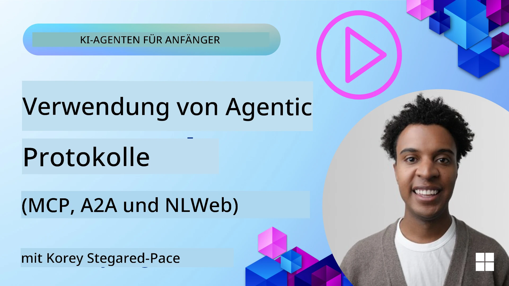
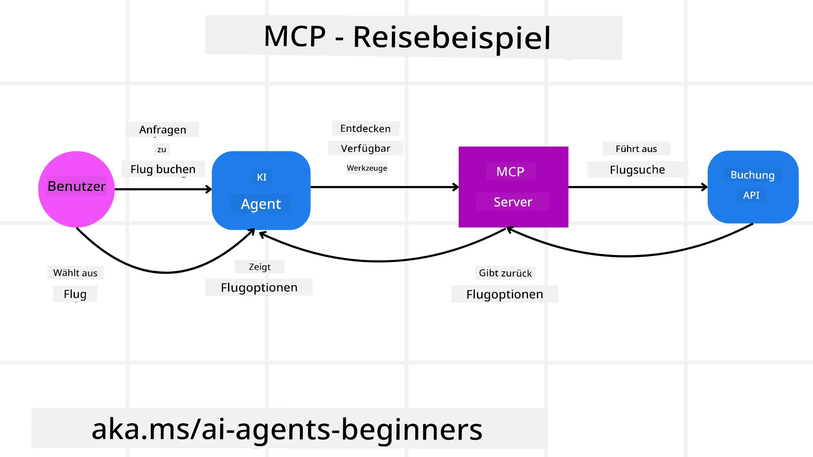
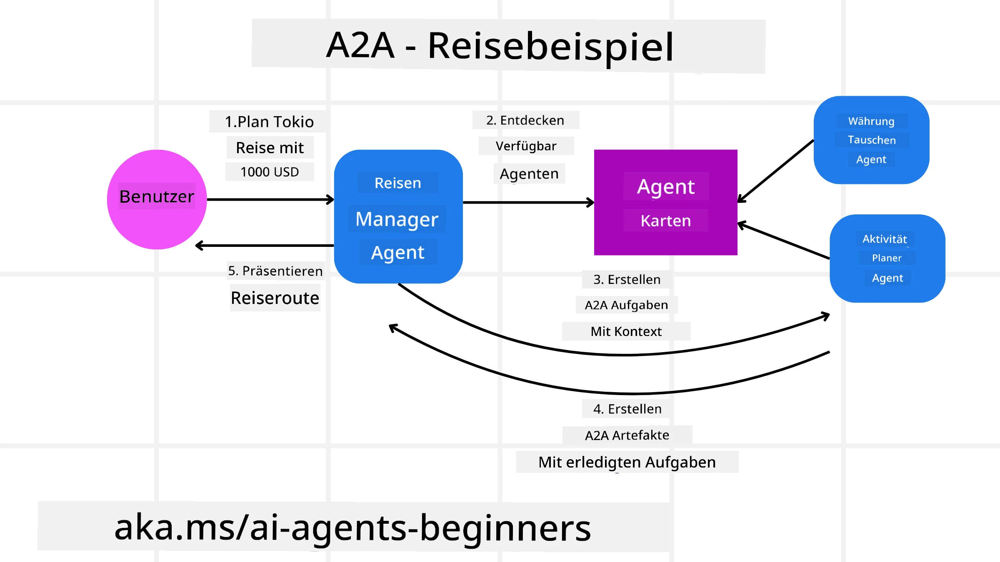
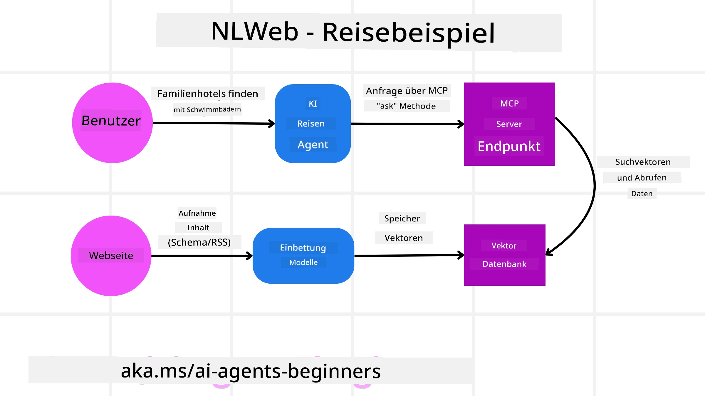

<!--
CO_OP_TRANSLATOR_METADATA:
{
  "original_hash": "aff92c6f019b4627ca9399c6e3882e17",
  "translation_date": "2025-09-18T14:05:42+00:00",
  "source_file": "11-agentic-protocols/README.md",
  "language_code": "de"
}
-->
# Verwendung von Agentenprotokollen (MCP, A2A und NLWeb)

> _(Klicken Sie auf das Bild oben, um das Video zu dieser Lektion anzusehen)_

Mit der zunehmenden Nutzung von KI-Agenten wächst auch der Bedarf an Protokollen, die Standardisierung, Sicherheit und offene Innovation unterstützen. In dieser Lektion behandeln wir drei Protokolle, die diesen Bedarf decken sollen: Model Context Protocol (MCP), Agent to Agent (A2A) und Natural Language Web (NLWeb).

## Einführung

In dieser Lektion behandeln wir:

• Wie **MCP** KI-Agenten ermöglicht, externe Tools und Daten zu nutzen, um Benutzeraufgaben zu erledigen.

• Wie **A2A** die Kommunikation und Zusammenarbeit zwischen verschiedenen KI-Agenten erleichtert.

• Wie **NLWeb** natürliche Sprachschnittstellen auf jeder Website bereitstellt, sodass KI-Agenten Inhalte entdecken und mit ihnen interagieren können.

## Lernziele

• **Identifizieren** Sie den Hauptzweck und die Vorteile von MCP, A2A und NLWeb im Kontext von KI-Agenten.

• **Erklären** Sie, wie jedes Protokoll die Kommunikation und Interaktion zwischen LLMs, Tools und anderen Agenten erleichtert.

• **Erkennen** Sie die unterschiedlichen Rollen, die jedes Protokoll beim Aufbau komplexer agentenbasierter Systeme spielt.

## Model Context Protocol

Das **Model Context Protocol (MCP)** ist ein offener Standard, der eine standardisierte Methode bietet, mit der Anwendungen Kontext und Tools für LLMs bereitstellen können. Dies ermöglicht einen "universellen Adapter" für verschiedene Datenquellen und Tools, mit denen KI-Agenten konsistent verbunden werden können.

Schauen wir uns die Komponenten von MCP, die Vorteile im Vergleich zur direkten API-Nutzung und ein Beispiel an, wie KI-Agenten einen MCP-Server verwenden könnten.

### MCP-Kernkomponenten

MCP basiert auf einer **Client-Server-Architektur**, und die Kernkomponenten sind:

• **Hosts** sind LLM-Anwendungen (zum Beispiel ein Code-Editor wie VSCode), die die Verbindungen zu einem MCP-Server initiieren.

• **Clients** sind Komponenten innerhalb der Host-Anwendung, die Einzelverbindungen zu Servern aufrechterhalten.

• **Server** sind leichtgewichtige Programme, die spezifische Funktionen bereitstellen.

Das Protokoll umfasst drei Kernprimitive, die die Fähigkeiten eines MCP-Servers darstellen:

• **Tools**: Dies sind diskrete Aktionen oder Funktionen, die ein KI-Agent aufrufen kann, um eine Aufgabe auszuführen. Beispielsweise könnte ein Wetterdienst ein "Wetter abrufen"-Tool bereitstellen, oder ein E-Commerce-Server könnte ein "Produkt kaufen"-Tool anbieten. MCP-Server geben den Namen, die Beschreibung und das Ein-/Ausgabe-Schema jedes Tools in ihrer Fähigkeitenliste an.

• **Ressourcen**: Dies sind schreibgeschützte Datenobjekte oder Dokumente, die ein MCP-Server bereitstellen kann und die Clients bei Bedarf abrufen können. Beispiele sind Dateiinhalte, Datenbankeinträge oder Protokolldateien. Ressourcen können Text (wie Code oder JSON) oder binär (wie Bilder oder PDFs) sein.

• **Prompts**: Dies sind vordefinierte Vorlagen, die vorgeschlagene Eingaben bereitstellen und komplexere Workflows ermöglichen.

### Vorteile von MCP

MCP bietet erhebliche Vorteile für KI-Agenten:

• **Dynamische Tool-Erkennung**: Agenten können dynamisch eine Liste verfügbarer Tools von einem Server erhalten, zusammen mit Beschreibungen ihrer Funktionen. Dies steht im Gegensatz zu traditionellen APIs, die oft statisches Codieren für Integrationen erfordern, was bedeutet, dass jede API-Änderung Code-Updates erfordert. MCP bietet einen "einmal integrieren"-Ansatz, der zu größerer Anpassungsfähigkeit führt.

• **Interoperabilität zwischen LLMs**: MCP funktioniert mit verschiedenen LLMs und bietet die Flexibilität, Kernmodelle zu wechseln, um eine bessere Leistung zu evaluieren.

• **Standardisierte Sicherheit**: MCP enthält eine standardisierte Authentifizierungsmethode, die die Skalierbarkeit beim Hinzufügen von Zugriff auf zusätzliche MCP-Server verbessert. Dies ist einfacher als die Verwaltung unterschiedlicher Schlüssel und Authentifizierungstypen für verschiedene traditionelle APIs.

### MCP-Beispiel

Stellen Sie sich vor, ein Benutzer möchte mit einem KI-Assistenten, der MCP verwendet, einen Flug buchen.

1. **Verbindung**: Der KI-Assistent (der MCP-Client) verbindet sich mit einem MCP-Server, der von einer Fluggesellschaft bereitgestellt wird.

2. **Tool-Erkennung**: Der Client fragt den MCP-Server der Fluggesellschaft: "Welche Tools stehen zur Verfügung?" Der Server antwortet mit Tools wie "Flüge suchen" und "Flüge buchen".

3. **Tool-Aufruf**: Sie bitten den KI-Assistenten: "Bitte suchen Sie einen Flug von Portland nach Honolulu." Der KI-Assistent identifiziert mithilfe seines LLM, dass er das Tool "Flüge suchen" aufrufen muss, und übergibt die relevanten Parameter (Abflugort, Zielort) an den MCP-Server.

4. **Ausführung und Antwort**: Der MCP-Server, der als Wrapper fungiert, führt den eigentlichen Aufruf der internen Buchungs-API der Fluggesellschaft aus. Er erhält die Fluginformationen (z. B. JSON-Daten) und sendet sie zurück an den KI-Assistenten.

5. **Weitere Interaktion**: Der KI-Assistent präsentiert die Flugoptionen. Sobald Sie einen Flug auswählen, könnte der Assistent das Tool "Flüge buchen" auf demselben MCP-Server aufrufen und die Buchung abschließen.

## Agent-to-Agent-Protokoll (A2A)

Während MCP sich darauf konzentriert, LLMs mit Tools zu verbinden, geht das **Agent-to-Agent (A2A)-Protokoll** einen Schritt weiter, indem es die Kommunikation und Zusammenarbeit zwischen verschiedenen KI-Agenten ermöglicht. A2A verbindet KI-Agenten über verschiedene Organisationen, Umgebungen und Technologiestacks hinweg, um eine gemeinsame Aufgabe zu erfüllen.

Wir werden die Komponenten und Vorteile von A2A sowie ein Beispiel für dessen Anwendung in unserer Reiseanwendung untersuchen.

### A2A-Kernkomponenten

A2A konzentriert sich darauf, die Kommunikation zwischen Agenten zu ermöglichen und sie zusammenarbeiten zu lassen, um eine Teilaufgabe des Benutzers zu erledigen. Jede Komponente des Protokolls trägt dazu bei:

#### Agentenkarte

Ähnlich wie ein MCP-Server eine Liste von Tools teilt, enthält eine Agentenkarte:
- Den Namen des Agenten.
- Eine **Beschreibung der allgemeinen Aufgaben**, die er erledigt.
- Eine **Liste spezifischer Fähigkeiten** mit Beschreibungen, die anderen Agenten (oder sogar menschlichen Benutzern) helfen, zu verstehen, wann und warum sie diesen Agenten aufrufen sollten.
- Die **aktuelle Endpunkt-URL** des Agenten.
- Die **Version** und **Fähigkeiten** des Agenten, wie Streaming-Antworten und Push-Benachrichtigungen.

#### Agenten-Executor

Der Agenten-Executor ist dafür verantwortlich, **den Kontext des Benutzerchats an den entfernten Agenten weiterzugeben**, damit dieser die Aufgabe versteht, die erledigt werden muss. In einem A2A-Server verwendet ein Agent sein eigenes Large Language Model (LLM), um eingehende Anfragen zu analysieren und Aufgaben mit seinen eigenen internen Tools auszuführen.

#### Artefakt

Sobald ein entfernter Agent die angeforderte Aufgabe abgeschlossen hat, wird sein Arbeitsergebnis als Artefakt erstellt. Ein Artefakt **enthält das Ergebnis der Arbeit des Agenten**, eine **Beschreibung dessen, was erledigt wurde**, und den **Textkontext**, der über das Protokoll gesendet wurde. Nachdem das Artefakt gesendet wurde, wird die Verbindung zum entfernten Agenten geschlossen, bis sie erneut benötigt wird.

#### Ereigniswarteschlange

Diese Komponente wird verwendet, um **Updates zu verwalten und Nachrichten zu übermitteln**. Sie ist besonders wichtig in Produktionsumgebungen für agentenbasierte Systeme, um zu verhindern, dass die Verbindung zwischen Agenten geschlossen wird, bevor eine Aufgabe abgeschlossen ist, insbesondere wenn die Bearbeitungszeit länger dauern kann.

### Vorteile von A2A

• **Verbesserte Zusammenarbeit**: Es ermöglicht Agenten von verschiedenen Anbietern und Plattformen, miteinander zu interagieren, Kontext zu teilen und zusammenzuarbeiten, wodurch eine nahtlose Automatisierung über traditionell getrennte Systeme hinweg erleichtert wird.

• **Flexibilität bei der Modellauswahl**: Jeder A2A-Agent kann entscheiden, welches LLM er für die Bearbeitung seiner Anfragen verwendet, wodurch optimierte oder feinabgestimmte Modelle pro Agent ermöglicht werden, im Gegensatz zu einer einzigen LLM-Verbindung in einigen MCP-Szenarien.

• **Integrierte Authentifizierung**: Die Authentifizierung ist direkt in das A2A-Protokoll integriert und bietet einen robusten Sicherheitsrahmen für die Interaktionen zwischen Agenten.

### A2A-Beispiel

Erweitern wir unser Reisebuchungsszenario, diesmal mit A2A.

1. **Benutzeranfrage an Multi-Agenten**: Ein Benutzer interagiert mit einem "Reiseagenten" A2A-Client/Agenten, indem er beispielsweise sagt: "Bitte buchen Sie eine komplette Reise nach Honolulu für nächste Woche, einschließlich Flügen, eines Hotels und eines Mietwagens."

2. **Orchestrierung durch Reiseagenten**: Der Reiseagent erhält diese komplexe Anfrage. Er verwendet sein LLM, um über die Aufgabe nachzudenken und festzustellen, dass er mit anderen spezialisierten Agenten interagieren muss.

3. **Inter-Agenten-Kommunikation**: Der Reiseagent verwendet das A2A-Protokoll, um sich mit nachgelagerten Agenten zu verbinden, wie einem "Fluggesellschaft-Agenten", einem "Hotel-Agenten" und einem "Mietwagen-Agenten", die von verschiedenen Unternehmen erstellt wurden.

4. **Delegierte Aufgabenbearbeitung**: Der Reiseagent sendet spezifische Aufgaben an diese spezialisierten Agenten (z. B. "Flüge nach Honolulu finden", "Hotel buchen", "Auto mieten"). Jeder dieser spezialisierten Agenten, der seine eigenen LLMs und Tools verwendet (die selbst MCP-Server sein könnten), führt seinen spezifischen Teil der Buchung aus.

5. **Konsolidierte Antwort**: Sobald alle nachgelagerten Agenten ihre Aufgaben abgeschlossen haben, kompiliert der Reiseagent die Ergebnisse (Flugdaten, Hotelbestätigung, Mietwagenbuchung) und sendet eine umfassende, chatartige Antwort zurück an den Benutzer.

## Natural Language Web (NLWeb)

Websites sind seit langem der primäre Weg, über den Benutzer Informationen und Daten im Internet abrufen können.

Schauen wir uns die verschiedenen Komponenten von NLWeb, die Vorteile von NLWeb und ein Beispiel an, wie NLWeb in unserer Reiseanwendung funktioniert.

### Komponenten von NLWeb

- **NLWeb-Anwendung (Kernservice-Code)**: Das System, das natürliche Sprachfragen verarbeitet. Es verbindet die verschiedenen Teile der Plattform, um Antworten zu erstellen. Sie können es sich als den **Motor vorstellen, der die natürlichen Sprachfunktionen** einer Website antreibt.

- **NLWeb-Protokoll**: Dies ist ein **grundlegender Satz von Regeln für die natürliche Sprachinteraktion** mit einer Website. Es sendet Antworten im JSON-Format zurück (oft unter Verwendung von Schema.org). Ziel ist es, eine einfache Grundlage für das „KI-Web“ zu schaffen, ähnlich wie HTML das Teilen von Dokumenten online ermöglicht hat.

- **MCP-Server (Model Context Protocol-Endpunkt)**: Jede NLWeb-Installation funktioniert auch als **MCP-Server**. Das bedeutet, dass sie **Tools (wie eine „ask“-Methode) und Daten** mit anderen KI-Systemen teilen kann. In der Praxis macht dies die Inhalte und Fähigkeiten der Website für KI-Agenten nutzbar, sodass die Website Teil des größeren „Agenten-Ökosystems“ wird.

- **Embedding-Modelle**: Diese Modelle werden verwendet, um **Website-Inhalte in numerische Darstellungen, sogenannte Vektoren**, umzuwandeln (Embeddings). Diese Vektoren erfassen Bedeutungen auf eine Weise, die Computer vergleichen und durchsuchen können. Sie werden in einer speziellen Datenbank gespeichert, und Benutzer können auswählen, welches Embedding-Modell sie verwenden möchten.

- **Vektordatenbank (Abrufmechanismus)**: Diese Datenbank **speichert die Embeddings der Website-Inhalte**. Wenn jemand eine Frage stellt, überprüft NLWeb die Vektordatenbank, um schnell die relevantesten Informationen zu finden. Es liefert eine schnelle Liste möglicher Antworten, sortiert nach Ähnlichkeit. NLWeb arbeitet mit verschiedenen Vektorspeichersystemen wie Qdrant, Snowflake, Milvus, Azure AI Search und Elasticsearch.

### NLWeb am Beispiel

Betrachten wir unsere Reisebuchungs-Website erneut, diesmal jedoch mit NLWeb.

1. **Datenaufnahme**: Die bestehenden Produktkataloge der Reise-Website (z. B. Flugangebote, Hotelbeschreibungen, Reisepakete) werden mit Schema.org formatiert oder über RSS-Feeds geladen. Die Tools von NLWeb nehmen diese strukturierten Daten auf, erstellen Embeddings und speichern sie in einer lokalen oder entfernten Vektordatenbank.

2. **Natürliche Sprachabfrage (Mensch)**: Ein Benutzer besucht die Website und gibt statt über Menüs zu navigieren in eine Chat-Oberfläche ein: "Finden Sie ein familienfreundliches Hotel in Honolulu mit Pool für nächste Woche."

3. **NLWeb-Verarbeitung**: Die NLWeb-Anwendung erhält diese Anfrage. Sie sendet die Anfrage an ein LLM zur Interpretation und durchsucht gleichzeitig ihre Vektordatenbank nach relevanten Hotelangeboten.

4. **Präzise Ergebnisse**: Das LLM hilft, die Suchergebnisse aus der Datenbank zu interpretieren, die besten Übereinstimmungen basierend auf den Kriterien "familienfreundlich", "Pool" und "Honolulu" zu identifizieren und eine Antwort in natürlicher Sprache zu formatieren. Wichtig ist, dass die Antwort sich auf tatsächliche Hotels aus dem Katalog der Website bezieht und keine erfundenen Informationen enthält.

5. **Interaktion mit KI-Agenten**: Da NLWeb als MCP-Server fungiert, könnte ein externer KI-Reiseagent auch eine Verbindung zur NLWeb-Instanz dieser Website herstellen. Der KI-Agent könnte dann die `ask`-MCP-Methode verwenden, um die Website direkt abzufragen: `ask("Gibt es vegane Restaurants in der Nähe von Honolulu, die vom Hotel empfohlen werden?")`. Die NLWeb-Instanz würde dies verarbeiten, ihre Datenbank mit Restaurantinformationen (falls geladen) nutzen und eine strukturierte JSON-Antwort zurückgeben.

### Noch Fragen zu MCP/A2A/NLWeb?

Treten Sie dem [Azure AI Foundry Discord](https://aka.ms/ai-agents/discord) bei, um andere Lernende zu treffen, Sprechstunden zu besuchen und Ihre Fragen zu KI-Agenten beantwortet zu bekommen.

## Ressourcen

- [MCP für Anfänger](https://aka.ms/mcp-for-beginners)  
- [MCP-Dokumentation](https://github.com/microsoft/semantic-kernel/tree/main/python/semantic-kernel/semantic_kernel/connectors/mcp)
- [NLWeb-Repo](https://github.com/nlweb-ai/NLWeb)
- [Semantic Kernel Guides](https://learn.microsoft.com/semantic-kernel/)

---

**Haftungsausschluss**:  
Dieses Dokument wurde mit dem KI-Übersetzungsdienst [Co-op Translator](https://github.com/Azure/co-op-translator) übersetzt. Obwohl wir uns um Genauigkeit bemühen, beachten Sie bitte, dass automatisierte Übersetzungen Fehler oder Ungenauigkeiten enthalten können. Das Originaldokument in seiner ursprünglichen Sprache sollte als maßgebliche Quelle betrachtet werden. Für kritische Informationen wird eine professionelle menschliche Übersetzung empfohlen. Wir übernehmen keine Haftung für Missverständnisse oder Fehlinterpretationen, die sich aus der Nutzung dieser Übersetzung ergeben.