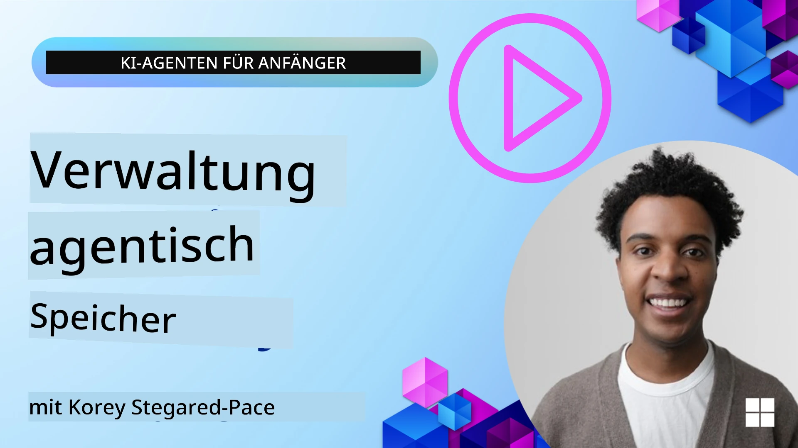

<!--
CO_OP_TRANSLATOR_METADATA:
{
  "original_hash": "a1d90991499ad697c4ad24decaf36968",
  "translation_date": "2025-12-09T11:48:12+00:00",
  "source_file": "13-agent-memory/README.md",
  "language_code": "de"
}
-->
# Speicher für KI-Agenten 

Wenn es um die einzigartigen Vorteile der Erstellung von KI-Agenten geht, werden hauptsächlich zwei Dinge diskutiert: die Fähigkeit, Werkzeuge zur Erledigung von Aufgaben aufzurufen, und die Fähigkeit, sich im Laufe der Zeit zu verbessern. Speicher bildet die Grundlage für die Erstellung selbstverbessernder Agenten, die bessere Erlebnisse für unsere Nutzer schaffen können.

In dieser Lektion werden wir uns ansehen, was Speicher für KI-Agenten bedeutet und wie wir ihn verwalten und für unsere Anwendungen nutzen können.

## Einführung

Diese Lektion behandelt:

• **Verständnis des Speichers von KI-Agenten**: Was Speicher ist und warum er für Agenten essenziell ist.

• **Implementierung und Speicherung von Speicher**: Praktische Methoden, um Speicherfunktionen zu Ihren KI-Agenten hinzuzufügen, mit Fokus auf Kurzzeit- und Langzeitspeicher.

• **Selbstverbesserung von KI-Agenten**: Wie Speicher es Agenten ermöglicht, aus vergangenen Interaktionen zu lernen und sich im Laufe der Zeit zu verbessern.

## Verfügbare Implementierungen

Diese Lektion enthält zwei umfassende Notebook-Tutorials:

• **[13-agent-memory.ipynb](./13-agent-memory.ipynb)**: Implementiert Speicher mit Mem0 und Azure AI Search unter Verwendung des Semantic Kernel Frameworks.

• **[13-agent-memory-cognee.ipynb](./13-agent-memory-cognee.ipynb)**: Implementiert strukturierten Speicher mit Cognee, erstellt automatisch Wissensgraphen basierend auf Embeddings, visualisiert den Graphen und ermöglicht intelligentes Abrufen.

## Lernziele

Nach Abschluss dieser Lektion werden Sie wissen, wie man:

• **Zwischen verschiedenen Arten von KI-Agenten-Speicher unterscheidet**, einschließlich Arbeits-, Kurzzeit- und Langzeitspeicher sowie spezialisierter Formen wie Persona- und episodischer Speicher.

• **Kurzzeit- und Langzeitspeicher für KI-Agenten implementiert und verwaltet**, unter Verwendung des Semantic Kernel Frameworks und Tools wie Mem0, Cognee, Whiteboard-Speicher sowie der Integration mit Azure AI Search.

• **Die Prinzipien hinter selbstverbessernden KI-Agenten versteht** und wie robuste Speichermanagementsysteme zu kontinuierlichem Lernen und Anpassung beitragen.

## Verständnis des Speichers von KI-Agenten

Im Kern bezieht sich **Speicher für KI-Agenten auf Mechanismen, die es ihnen ermöglichen, Informationen zu speichern und abzurufen**. Diese Informationen können spezifische Details über ein Gespräch, Nutzerpräferenzen, vergangene Aktionen oder sogar erlernte Muster sein.

Ohne Speicher sind KI-Anwendungen oft zustandslos, was bedeutet, dass jede Interaktion von vorne beginnt. Dies führt zu einer sich wiederholenden und frustrierenden Nutzererfahrung, bei der der Agent den vorherigen Kontext oder die Präferenzen "vergisst".

### Warum ist Speicher wichtig?

Die Intelligenz eines Agenten hängt stark von seiner Fähigkeit ab, vergangene Informationen abzurufen und zu nutzen. Speicher ermöglicht es Agenten, folgende Eigenschaften zu entwickeln:

• **Reflexion**: Lernen aus vergangenen Aktionen und Ergebnissen.

• **Interaktivität**: Beibehaltung des Kontexts während eines laufenden Gesprächs.

• **Proaktivität und Reaktivität**: Bedürfnisse antizipieren oder angemessen auf Basis historischer Daten reagieren.

• **Autonomie**: Unabhängiger agieren, indem gespeichertes Wissen genutzt wird.

Das Ziel der Implementierung von Speicher ist es, Agenten **zuverlässiger und leistungsfähiger** zu machen.

### Arten von Speicher

#### Arbeitsspeicher

Stellen Sie sich dies wie ein Notizblatt vor, das ein Agent während einer einzelnen, laufenden Aufgabe oder eines Denkprozesses verwendet. Es enthält unmittelbare Informationen, die für die nächste Aktion benötigt werden.

Für KI-Agenten erfasst der Arbeitsspeicher oft die relevantesten Informationen aus einem Gespräch, selbst wenn der vollständige Chatverlauf lang oder gekürzt ist. Der Fokus liegt auf der Extraktion von Schlüsselelementen wie Anforderungen, Vorschlägen, Entscheidungen und Aktionen.

**Beispiel für Arbeitsspeicher**

In einem Reisebuchungs-Agenten könnte der Arbeitsspeicher die aktuelle Anfrage des Nutzers erfassen, wie z. B. "Ich möchte eine Reise nach Paris buchen". Diese spezifische Anforderung wird im unmittelbaren Kontext des Agenten gehalten, um die aktuelle Interaktion zu leiten.

#### Kurzzeitspeicher

Dieser Speichertyp bewahrt Informationen für die Dauer eines einzelnen Gesprächs oder einer Sitzung. Es ist der Kontext des aktuellen Chats, der es dem Agenten ermöglicht, auf vorherige Gesprächsbeiträge Bezug zu nehmen.

**Beispiel für Kurzzeitspeicher**

Wenn ein Nutzer fragt: "Wie viel würde ein Flug nach Paris kosten?" und dann nachfragt: "Was ist mit einer Unterkunft dort?", stellt der Kurzzeitspeicher sicher, dass der Agent weiß, dass sich "dort" auf "Paris" bezieht.

#### Langzeitspeicher

Dies sind Informationen, die über mehrere Gespräche oder Sitzungen hinweg bestehen bleiben. Sie ermöglichen es Agenten, Nutzerpräferenzen, historische Interaktionen oder allgemeines Wissen über längere Zeiträume hinweg zu speichern. Dies ist wichtig für die Personalisierung.

**Beispiel für Langzeitspeicher**

Ein Langzeitspeicher könnte speichern, dass "Ben gerne Ski fährt und Outdoor-Aktivitäten mag, Kaffee mit Bergblick bevorzugt und aufgrund einer früheren Verletzung fortgeschrittene Skipisten vermeiden möchte". Diese Informationen, die aus früheren Interaktionen gelernt wurden, beeinflussen zukünftige Reiseempfehlungen und machen sie hochgradig personalisiert.

#### Persona-Speicher

Dieser spezialisierte Speichertyp hilft einem Agenten, eine konsistente "Persönlichkeit" oder "Rolle" zu entwickeln. Er ermöglicht es dem Agenten, Details über sich selbst oder seine beabsichtigte Rolle zu speichern, was die Interaktionen flüssiger und fokussierter macht.

**Beispiel für Persona-Speicher**

Wenn der Reiseagent als "Experte für Skiplanung" konzipiert ist, könnte der Persona-Speicher diese Rolle verstärken und die Antworten des Agenten so beeinflussen, dass sie dem Ton und Wissen eines Experten entsprechen.

#### Workflow-/Episodenspeicher

Dieser Speicher speichert die Abfolge von Schritten, die ein Agent während einer komplexen Aufgabe unternimmt, einschließlich Erfolgen und Misserfolgen. Es ist wie das Erinnern an spezifische "Episoden" oder vergangene Erfahrungen, um daraus zu lernen.

**Beispiel für Episodenspeicher**

Wenn der Agent versucht hat, einen bestimmten Flug zu buchen, dies jedoch aufgrund von Nichtverfügbarkeit scheiterte, könnte der Episodenspeicher diesen Misserfolg aufzeichnen. Dadurch kann der Agent alternative Flüge ausprobieren oder den Nutzer bei einem erneuten Versuch besser über das Problem informieren.

#### Entitätenspeicher

Hierbei geht es darum, spezifische Entitäten (wie Personen, Orte oder Dinge) und Ereignisse aus Gesprächen zu extrahieren und zu speichern. Dies ermöglicht es dem Agenten, ein strukturiertes Verständnis der besprochenen Schlüsselelemente aufzubauen.

**Beispiel für Entitätenspeicher**

Aus einem Gespräch über eine vergangene Reise könnte der Agent "Paris", "Eiffelturm" und "Abendessen im Restaurant Le Chat Noir" als Entitäten extrahieren. In einer zukünftigen Interaktion könnte der Agent sich an "Le Chat Noir" erinnern und anbieten, dort eine neue Reservierung vorzunehmen.

#### Strukturierter RAG (Retrieval Augmented Generation)

Während RAG eine breitere Technik ist, wird "strukturierter RAG" als leistungsstarke Speichertechnologie hervorgehoben. Es extrahiert dichte, strukturierte Informationen aus verschiedenen Quellen (Gesprächen, E-Mails, Bildern) und nutzt sie, um Präzision, Abruf und Geschwindigkeit bei Antworten zu verbessern. Im Gegensatz zu klassischem RAG, das sich ausschließlich auf semantische Ähnlichkeit stützt, arbeitet strukturierter RAG mit der inhärenten Struktur von Informationen.

**Beispiel für strukturierten RAG**

Anstatt nur Schlüsselwörter abzugleichen, könnte strukturierter RAG Flugdaten (Ziel, Datum, Uhrzeit, Fluggesellschaft) aus einer E-Mail analysieren und strukturiert speichern. Dies ermöglicht präzise Abfragen wie "Welchen Flug habe ich am Dienstag nach Paris gebucht?"

## Implementierung und Speicherung von Speicher

Die Implementierung von Speicher für KI-Agenten erfordert einen systematischen Prozess des **Speichermanagements**, der das Generieren, Speichern, Abrufen, Integrieren, Aktualisieren und sogar das "Vergessen" (oder Löschen) von Informationen umfasst. Besonders wichtig ist der Abruf.

### Spezialisierte Speicherwerkzeuge

#### Mem0

Eine Möglichkeit, Agentenspeicher zu speichern und zu verwalten, ist die Verwendung spezialisierter Werkzeuge wie Mem0. Mem0 fungiert als persistente Speicherschicht, die es Agenten ermöglicht, relevante Interaktionen abzurufen, Nutzerpräferenzen und faktischen Kontext zu speichern und aus Erfolgen und Misserfolgen im Laufe der Zeit zu lernen. Die Idee dahinter ist, zustandslose Agenten in zustandsbehaftete zu verwandeln.

Es funktioniert durch eine **zweiphasige Speicherpipeline: Extraktion und Aktualisierung**. Zunächst werden Nachrichten, die einem Agenten-Thread hinzugefügt werden, an den Mem0-Dienst gesendet, der ein Large Language Model (LLM) verwendet, um den Gesprächsverlauf zusammenzufassen und neue Erinnerungen zu extrahieren. Anschließend bestimmt eine LLM-gesteuerte Aktualisierungsphase, ob diese Erinnerungen hinzugefügt, geändert oder gelöscht werden sollen, und speichert sie in einem hybriden Datenspeicher, der Vektor-, Graph- und Schlüssel-Wert-Datenbanken umfassen kann. Dieses System unterstützt auch verschiedene Speichertypen und kann Graph-Speicher für die Verwaltung von Beziehungen zwischen Entitäten einbeziehen.

#### Cognee

Ein weiterer leistungsstarker Ansatz ist die Verwendung von **Cognee**, einem Open-Source-Semantik-Speicher für KI-Agenten, der strukturierte und unstrukturierte Daten in abfragbare Wissensgraphen umwandelt, die durch Embeddings unterstützt werden. Cognee bietet eine **Dual-Store-Architektur**, die Vektorähnlichkeitssuche mit Graph-Beziehungen kombiniert, sodass Agenten nicht nur verstehen, welche Informationen ähnlich sind, sondern auch, wie Konzepte miteinander in Beziehung stehen.

Es zeichnet sich durch **hybrides Abrufen** aus, das Vektorähnlichkeit, Graphstruktur und LLM-Logik kombiniert – von der Suche nach Rohdaten bis hin zu graphbewussten Antworten auf Fragen. Das System pflegt einen **lebendigen Speicher**, der sich weiterentwickelt und wächst, während er als ein zusammenhängender Graph abfragbar bleibt. Es unterstützt sowohl den kurzfristigen Sitzungs-Kontext als auch den langfristigen persistenten Speicher.

Das Cognee-Notebook-Tutorial ([13-agent-memory-cognee.ipynb](./13-agent-memory-cognee.ipynb)) zeigt, wie diese einheitliche Speicherschicht aufgebaut wird, mit praktischen Beispielen zum Einlesen verschiedener Datenquellen, Visualisieren des Wissensgraphen und Abfragen mit unterschiedlichen Suchstrategien, die auf spezifische Agentenbedürfnisse zugeschnitten sind.

### Speicherung von Speicher mit RAG

Neben spezialisierten Speicherwerkzeugen wie Mem0 können Sie robuste Suchdienste wie **Azure AI Search als Backend für die Speicherung und den Abruf von Erinnerungen** nutzen, insbesondere für strukturiertes RAG.

Dies ermöglicht es Ihnen, die Antworten Ihres Agenten mit Ihren eigenen Daten zu untermauern und so relevantere und genauere Antworten zu gewährleisten. Azure AI Search kann verwendet werden, um nutzerspezifische Reiseerinnerungen, Produktkataloge oder jedes andere domänenspezifische Wissen zu speichern.

Azure AI Search unterstützt Funktionen wie **strukturiertes RAG**, das sich durch das Extrahieren und Abrufen dichter, strukturierter Informationen aus großen Datensätzen wie Gesprächsverläufen, E-Mails oder sogar Bildern auszeichnet. Dies bietet "übermenschliche Präzision und Abruf" im Vergleich zu herkömmlichen Textchunking- und Embedding-Ansätzen.

## Selbstverbesserung von KI-Agenten

Ein gängiges Muster für selbstverbessernde Agenten besteht darin, einen **"Wissensagenten"** einzuführen. Dieser separate Agent beobachtet das Hauptgespräch zwischen dem Nutzer und dem primären Agenten. Seine Aufgabe ist es:

1. **Wertvolle Informationen zu identifizieren**: Festzustellen, ob ein Teil des Gesprächs es wert ist, als allgemeines Wissen oder spezifische Nutzerpräferenz gespeichert zu werden.

2. **Extrahieren und Zusammenfassen**: Die wesentlichen Erkenntnisse oder Präferenzen aus dem Gespräch destillieren.

3. **In einer Wissensdatenbank speichern**: Diese extrahierten Informationen dauerhaft speichern, oft in einer Vektordatenbank, damit sie später abgerufen werden können.

4. **Zukünftige Abfragen erweitern**: Wenn der Nutzer eine neue Abfrage startet, ruft der Wissensagent relevante gespeicherte Informationen ab und fügt sie der Nutzeranfrage hinzu, um dem primären Agenten entscheidenden Kontext zu liefern (ähnlich wie RAG).

### Optimierungen für Speicher

• **Latenzmanagement**: Um Verzögerungen bei Nutzerinteraktionen zu vermeiden, kann zunächst ein günstigeres, schnelleres Modell verwendet werden, um schnell zu prüfen, ob Informationen es wert sind, gespeichert oder abgerufen zu werden. Der komplexere Extraktions-/Abrufprozess wird nur bei Bedarf aufgerufen.

• **Wartung der Wissensdatenbank**: Für eine wachsende Wissensdatenbank können weniger häufig genutzte Informationen in einen "Kältespeicher" verschoben werden, um Kosten zu verwalten.

## Noch Fragen zum Agentenspeicher?

Treten Sie dem [Azure AI Foundry Discord](https://aka.ms/ai-agents/discord) bei, um sich mit anderen Lernenden auszutauschen, Sprechstunden zu besuchen und Ihre Fragen zu KI-Agenten beantwortet zu bekommen.

---

<!-- CO-OP TRANSLATOR DISCLAIMER START -->
**Haftungsausschluss**:  
Dieses Dokument wurde mit dem KI-Übersetzungsdienst [Co-op Translator](https://github.com/Azure/co-op-translator) übersetzt. Obwohl wir uns um Genauigkeit bemühen, beachten Sie bitte, dass automatisierte Übersetzungen Fehler oder Ungenauigkeiten enthalten können. Das Originaldokument in seiner ursprünglichen Sprache sollte als maßgebliche Quelle betrachtet werden. Für kritische Informationen wird eine professionelle menschliche Übersetzung empfohlen. Wir übernehmen keine Haftung für Missverständnisse oder Fehlinterpretationen, die sich aus der Nutzung dieser Übersetzung ergeben.
<!-- CO-OP TRANSLATOR DISCLAIMER END -->