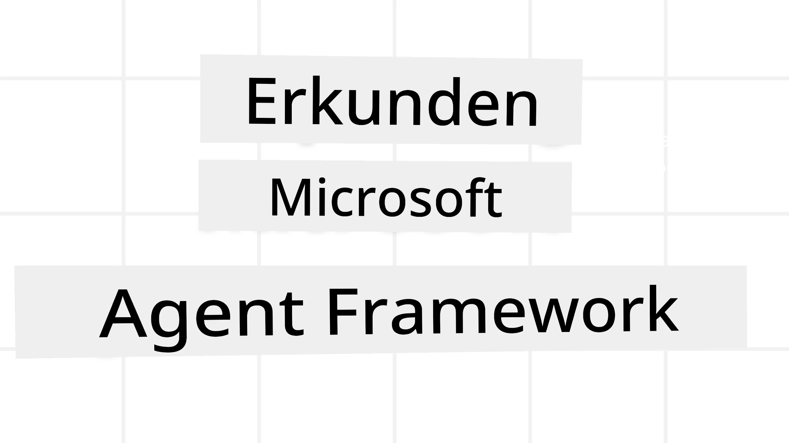
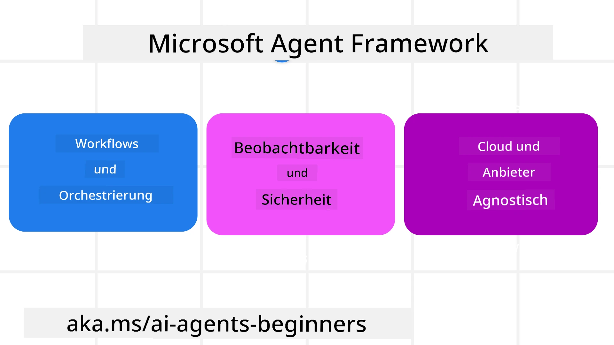
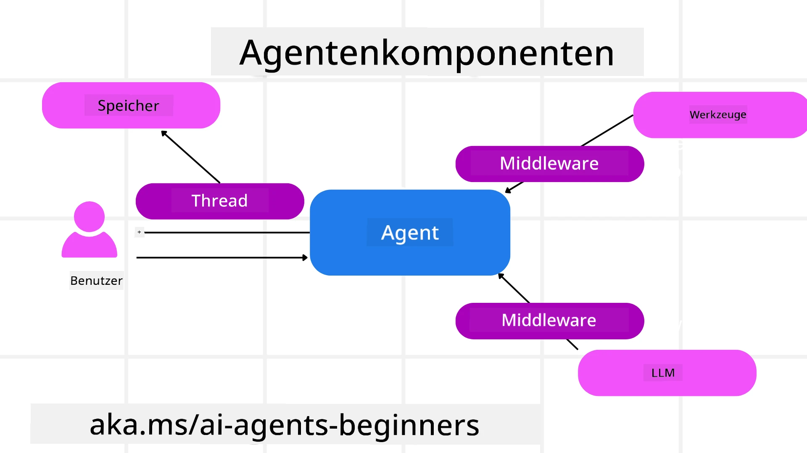

<!--
CO_OP_TRANSLATOR_METADATA:
{
  "original_hash": "19c4dab375acbc733855cc7f2f04edbc",
  "translation_date": "2025-10-01T21:42:13+00:00",
  "source_file": "14-microsoft-agent-framework/README.md",
  "language_code": "de"
}
-->
# Erkundung des Microsoft Agent Frameworks



### Einführung

In dieser Lektion behandeln wir:

- Verständnis des Microsoft Agent Frameworks: Hauptmerkmale und Nutzen  
- Erkundung der Schlüsselkonzepte des Microsoft Agent Frameworks
- Vergleich von MAF mit Semantic Kernel und AutoGen: Migrationsleitfaden

## Lernziele

Nach Abschluss dieser Lektion können Sie:

- Produktionsreife KI-Agenten mit dem Microsoft Agent Framework erstellen
- Die Kernfunktionen des Microsoft Agent Frameworks auf Ihre agentischen Anwendungsfälle anwenden
- Bestehende agentische Frameworks und Tools migrieren und integrieren  

## Codebeispiele 

Codebeispiele für das [Microsoft Agent Framework (MAF)](https://aka.ms/ai-agents-beginners/agent-framewrok) finden Sie in diesem Repository unter den Dateien `xx-python-agent-framework` und `xx-dotnet-agent-framework`.

## Verständnis des Microsoft Agent Frameworks



Das [Microsoft Agent Framework (MAF)](https://aka.ms/ai-agents-beginners/agent-framewrok) baut auf den Erfahrungen und Erkenntnissen aus Semantic Kernel und AutoGen auf. Es bietet die Flexibilität, eine Vielzahl von agentischen Anwendungsfällen in Produktions- und Forschungsumgebungen zu adressieren, darunter:

- **Sequenzielle Agenten-Orchestrierung** in Szenarien, in denen schrittweise Workflows erforderlich sind.
- **Gleichzeitige Orchestrierung** in Szenarien, in denen Agenten Aufgaben gleichzeitig erledigen müssen.
- **Gruppenchat-Orchestrierung** in Szenarien, in denen Agenten gemeinsam an einer Aufgabe arbeiten können.
- **Übergabe-Orchestrierung** in Szenarien, in denen Agenten Aufgaben aneinander übergeben, sobald die Teilaufgaben abgeschlossen sind.
- **Magnetische Orchestrierung** in Szenarien, in denen ein Manager-Agent eine Aufgabenliste erstellt und modifiziert und die Koordination von Unteragenten zur Erledigung der Aufgabe übernimmt.

Um KI-Agenten in der Produktion bereitzustellen, bietet MAF auch Funktionen für:

- **Beobachtbarkeit** durch die Nutzung von OpenTelemetry, bei der jede Aktion des KI-Agenten, einschließlich Toolaufrufen, Orchestrierungsschritten, Argumentationsflüssen und Leistungsüberwachung, über Azure AI Foundry-Dashboards verfolgt wird.
- **Sicherheit** durch das native Hosting von Agenten auf Azure AI Foundry, das Sicherheitskontrollen wie rollenbasierte Zugriffsrechte, den Umgang mit privaten Daten und integrierte Inhaltsicherheit umfasst.
- **Dauerhaftigkeit**, da Agenten-Threads und Workflows pausieren, fortsetzen und Fehler beheben können, was längere Prozesse ermöglicht.
- **Kontrolle**, da menschliche Eingriffe in Workflows unterstützt werden, bei denen Aufgaben als genehmigungspflichtig markiert sind.

Das Microsoft Agent Framework ist außerdem darauf ausgelegt, interoperabel zu sein, indem es:

- **Cloud-unabhängig** ist - Agenten können in Containern, vor Ort und über verschiedene Clouds hinweg betrieben werden.
- **Anbieterunabhängig** ist - Agenten können über das bevorzugte SDK erstellt werden, einschließlich Azure OpenAI und OpenAI.
- **Offene Standards integriert** - Agenten können Protokolle wie Agent-to-Agent (A2A) und Model Context Protocol (MCP) nutzen, um andere Agenten und Tools zu entdecken und zu verwenden.
- **Plugins und Konnektoren** - Verbindungen können zu Daten- und Speicherdiensten wie Microsoft Fabric, SharePoint, Pinecone und Qdrant hergestellt werden.

Schauen wir uns an, wie diese Funktionen auf einige der Kernkonzepte des Microsoft Agent Frameworks angewendet werden.

## Schlüsselkonzepte des Microsoft Agent Frameworks

### Agenten



**Erstellen von Agenten**

Die Erstellung von Agenten erfolgt durch die Definition des Inferenzdienstes (LLM-Anbieter), eines Satzes von Anweisungen, denen der KI-Agent folgen soll, und eines zugewiesenen `Namens`:

```python
agent = AzureOpenAIChatClient(credential=AzureCliCredential()).create_agent( instructions="You are good at recommending trips to customers based on their preferences.", name="TripRecommender" )
```

Das obige Beispiel verwendet `Azure OpenAI`, aber Agenten können mit einer Vielzahl von Diensten erstellt werden, einschließlich `Azure AI Foundry Agent Service`:

```python
AzureAIAgentClient(async_credential=credential).create_agent( name="HelperAgent", instructions="You are a helpful assistant." ) as agent
```

OpenAI `Responses`, `ChatCompletion` APIs

```python
agent = OpenAIResponsesClient().create_agent( name="WeatherBot", instructions="You are a helpful weather assistant.", )
```

```python
agent = OpenAIChatClient().create_agent( name="HelpfulAssistant", instructions="You are a helpful assistant.", )
```

oder Remote-Agenten mit dem A2A-Protokoll:

```python
agent = A2AAgent( name=agent_card.name, description=agent_card.description, agent_card=agent_card, url="https://your-a2a-agent-host" )
```

**Ausführen von Agenten**

Agenten werden mit den Methoden `.run` oder `.run_stream` für nicht-streaming oder streaming Antworten ausgeführt.

```python
result = await agent.run("What are good places to visit in Amsterdam?")
print(result.text)
```

```python
async for update in agent.run_stream("What are the good places to visit in Amsterdam?"):
    if update.text:
        print(update.text, end="", flush=True)

```

Jeder Agentenlauf kann auch Optionen enthalten, um Parameter wie `max_tokens`, die vom Agenten verwendet werden, `tools`, die der Agent aufrufen kann, und sogar das `model` selbst, das für den Agenten verwendet wird, anzupassen.

Dies ist nützlich in Fällen, in denen spezifische Modelle oder Tools erforderlich sind, um die Aufgabe eines Benutzers zu erfüllen.

**Tools**

Tools können sowohl bei der Definition des Agenten:

```python
def get_attractions( location: Annotated[str, Field(description="The location to get the top tourist attractions for")], ) -> str: """Get the top tourist attractions for a given location.""" return f"The top attractions for {location} are." 


# When creating a ChatAgent directly 

agent = ChatAgent( chat_client=OpenAIChatClient(), instructions="You are a helpful assistant", tools=[get_attractions]

```

als auch beim Ausführen des Agenten definiert werden:

```python

result1 = await agent.run( "What's the best place to visit in Seattle?", tools=[get_attractions] # Tool provided for this run only )
```

**Agenten-Threads**

Agenten-Threads werden verwendet, um mehrstufige Gespräche zu führen. Threads können entweder durch:

- Verwendung von `get_new_thread()`, wodurch der Thread über die Zeit gespeichert werden kann
- Automatische Erstellung eines Threads beim Ausführen eines Agenten, wobei der Thread nur während des aktuellen Laufs bestehen bleibt.

Um einen Thread zu erstellen, sieht der Code wie folgt aus:

```python
# Create a new thread. 
thread = agent.get_new_thread() # Run the agent with the thread. 
response = await agent.run("Hello, I am here to help you book travel. Where would you like to go?", thread=thread)

```

Sie können den Thread dann serialisieren, um ihn später zu speichern:

```python
# Create a new thread. 
thread = agent.get_new_thread() 

# Run the agent with the thread. 

response = await agent.run("Hello, how are you?", thread=thread) 

# Serialize the thread for storage. 

serialized_thread = await thread.serialize() 

# Deserialize the thread state after loading from storage. 

resumed_thread = await agent.deserialize_thread(serialized_thread)
```

**Agenten-Middleware**

Agenten interagieren mit Tools und LLMs, um die Aufgaben der Benutzer zu erfüllen. In bestimmten Szenarien möchten wir zwischen diesen Interaktionen Aktionen ausführen oder verfolgen. Agenten-Middleware ermöglicht uns dies durch:

*Funktions-Middleware*

Diese Middleware ermöglicht es uns, eine Aktion zwischen dem Agenten und einer Funktion/einem Tool auszuführen, das er aufrufen wird. Ein Beispiel, wann dies verwendet werden könnte, ist, wenn Sie eine Protokollierung des Funktionsaufrufs durchführen möchten.

Im folgenden Code definiert `next`, ob die nächste Middleware oder die eigentliche Funktion aufgerufen werden soll.

```python
async def logging_function_middleware(
    context: FunctionInvocationContext,
    next: Callable[[FunctionInvocationContext], Awaitable[None]],
) -> None:
    """Function middleware that logs function execution."""
    # Pre-processing: Log before function execution
    print(f"[Function] Calling {context.function.name}")

    # Continue to next middleware or function execution
    await next(context)

    # Post-processing: Log after function execution
    print(f"[Function] {context.function.name} completed")
```

*Chat-Middleware*

Diese Middleware ermöglicht es uns, eine Aktion zwischen dem Agenten und den Anfragen zwischen dem LLM auszuführen oder zu protokollieren.

Dies enthält wichtige Informationen wie die `messages`, die an den KI-Dienst gesendet werden.

```python
async def logging_chat_middleware(
    context: ChatContext,
    next: Callable[[ChatContext], Awaitable[None]],
) -> None:
    """Chat middleware that logs AI interactions."""
    # Pre-processing: Log before AI call
    print(f"[Chat] Sending {len(context.messages)} messages to AI")

    # Continue to next middleware or AI service
    await next(context)

    # Post-processing: Log after AI response
    print("[Chat] AI response received")

```

**Agenten-Speicher**

Wie in der Lektion `Agentic Memory` behandelt, ist Speicher ein wichtiges Element, um dem Agenten zu ermöglichen, in verschiedenen Kontexten zu arbeiten. MAF bietet mehrere verschiedene Arten von Speicher:

*Speicher im Arbeitsspeicher*

Dies ist der Speicher, der während der Laufzeit der Anwendung in Threads gespeichert wird.

```python
# Create a new thread. 
thread = agent.get_new_thread() # Run the agent with the thread. 
response = await agent.run("Hello, I am here to help you book travel. Where would you like to go?", thread=thread)
```

*Persistente Nachrichten*

Dieser Speicher wird verwendet, wenn Gesprächsverläufe über verschiedene Sitzungen hinweg gespeichert werden. Er wird mit der `chat_message_store_factory` definiert:

```python
from agent_framework import ChatMessageStore

# Create a custom message store
def create_message_store():
    return ChatMessageStore()

agent = ChatAgent(
    chat_client=OpenAIChatClient(),
    instructions="You are a Travel assistant.",
    chat_message_store_factory=create_message_store
)

```

*Dynamischer Speicher*

Dieser Speicher wird dem Kontext hinzugefügt, bevor Agenten ausgeführt werden. Diese Speicher können in externen Diensten wie mem0 gespeichert werden:

```python
from agent_framework.mem0 import Mem0Provider

# Using Mem0 for advanced memory capabilities
memory_provider = Mem0Provider(
    api_key="your-mem0-api-key",
    user_id="user_123",
    application_id="my_app"
)

agent = ChatAgent(
    chat_client=OpenAIChatClient(),
    instructions="You are a helpful assistant with memory.",
    context_providers=memory_provider
)

```

**Agenten-Beobachtbarkeit**

Beobachtbarkeit ist wichtig, um zuverlässige und wartbare agentische Systeme zu erstellen. MAF integriert sich mit OpenTelemetry, um Tracing und Metriken für eine bessere Beobachtbarkeit bereitzustellen.

```python
from agent_framework.observability import get_tracer, get_meter

tracer = get_tracer()
meter = get_meter()
with tracer.start_as_current_span("my_custom_span"):
    # do something
    pass
counter = meter.create_counter("my_custom_counter")
counter.add(1, {"key": "value"})
```

### Workflows

MAF bietet Workflows, die vordefinierte Schritte zur Erledigung einer Aufgabe enthalten und KI-Agenten als Komponenten in diesen Schritten einbeziehen.

Workflows bestehen aus verschiedenen Komponenten, die eine bessere Steuerung des Ablaufs ermöglichen. Workflows ermöglichen auch **Multi-Agenten-Orchestrierung** und **Checkpointing**, um Workflow-Zustände zu speichern.

Die Kernkomponenten eines Workflows sind:

**Ausführende**

Ausführende erhalten Eingabenachrichten, führen ihre zugewiesenen Aufgaben aus und erzeugen dann eine Ausgabenachricht. Dies bringt den Workflow näher an die Erledigung der größeren Aufgabe. Ausführende können entweder KI-Agenten oder benutzerdefinierte Logik sein.

**Kanten**

Kanten werden verwendet, um den Nachrichtenfluss in einem Workflow zu definieren. Diese können sein:

*Direkte Kanten* - Einfache Eins-zu-Eins-Verbindungen zwischen Ausführenden:

```python
from agent_framework import WorkflowBuilder

builder = WorkflowBuilder()
builder.add_edge(source_executor, target_executor)
builder.set_start_executor(source_executor)
workflow = builder.build()
```

*Bedingte Kanten* - Aktiviert, nachdem eine bestimmte Bedingung erfüllt ist. Zum Beispiel, wenn Hotelzimmer nicht verfügbar sind, kann ein Ausführender andere Optionen vorschlagen.

*Switch-Case-Kanten* - Leiten Nachrichten basierend auf definierten Bedingungen an verschiedene Ausführende weiter. Zum Beispiel, wenn ein Reisekunde Prioritätszugang hat und seine Aufgaben durch einen anderen Workflow bearbeitet werden.

*Fan-out-Kanten* - Senden eine Nachricht an mehrere Ziele.

*Fan-in-Kanten* - Sammeln mehrere Nachrichten von verschiedenen Ausführenden und senden sie an ein Ziel.

**Ereignisse**

Um eine bessere Beobachtbarkeit in Workflows zu bieten, bietet MAF integrierte Ereignisse für die Ausführung, einschließlich:

- `WorkflowStartedEvent`  - Workflow-Ausführung beginnt
- `WorkflowOutputEvent` - Workflow erzeugt eine Ausgabe
- `WorkflowErrorEvent` - Workflow stößt auf einen Fehler
- `ExecutorInvokeEvent`  - Ausführender beginnt mit der Verarbeitung
- `ExecutorCompleteEvent`  -  Ausführender beendet die Verarbeitung
- `RequestInfoEvent` - Eine Anfrage wird gestellt

## Migration von anderen Frameworks (Semantic Kernel und AutoGen)

### Unterschiede zwischen MAF und Semantic Kernel

**Vereinfachte Agentenerstellung**

Semantic Kernel erfordert die Erstellung einer Kernel-Instanz für jeden Agenten. MAF verwendet einen vereinfachten Ansatz durch Erweiterungen für die Hauptanbieter.

```python
agent = AzureOpenAIChatClient(credential=AzureCliCredential()).create_agent( instructions="You are good at reccomending trips to customers based on their preferences.", name="TripRecommender" )
```

**Erstellung von Agenten-Threads**

Semantic Kernel erfordert, dass Threads manuell erstellt werden. In MAF wird dem Agenten direkt ein Thread zugewiesen.

```python
thread = agent.get_new_thread() # Run the agent with the thread. 
```

**Tool-Registrierung**

In Semantic Kernel werden Tools beim Kernel registriert, und der Kernel wird dann an den Agenten übergeben. In MAF werden Tools direkt während des Agentenerstellungsprozesses registriert.

```python
agent = ChatAgent( chat_client=OpenAIChatClient(), instructions="You are a helpful assistant", tools=[get_attractions]
```

### Unterschiede zwischen MAF und AutoGen

**Teams vs Workflows**

`Teams` sind die Ereignisstruktur für ereignisgesteuerte Aktivitäten mit Agenten in AutoGen. MAF verwendet `Workflows`, die Daten durch eine graphbasierte Architektur an Ausführende weiterleiten.

**Tool-Erstellung**

AutoGen verwendet `FunctionTool`, um Funktionen für Agenten aufzurufen. MAF verwendet @ai_function, das ähnlich funktioniert, aber auch die Schemas automatisch für jede Funktion ableitet.

**Agentenverhalten**

Agenten sind standardmäßig Einzelturn-Agenten in AutoGen, es sei denn, `max_tool_iterations` wird auf einen höheren Wert gesetzt. Innerhalb von MAF ist der `ChatAgent` standardmäßig mehrturnfähig, was bedeutet, dass er weiterhin Tools aufruft, bis die Aufgabe des Benutzers abgeschlossen ist.

## Codebeispiele 

Codebeispiele für das Microsoft Agent Framework finden Sie in diesem Repository unter den Dateien `xx-python-agent-framework` und `xx-dotnet-agent-framework`.

## Haben Sie weitere Fragen zum Microsoft Agent Framework?

Treten Sie dem [Azure AI Foundry Discord](https://aka.ms/ai-agents/discord) bei, um andere Lernende zu treffen, Sprechstunden zu besuchen und Ihre Fragen zu KI-Agenten beantwortet zu bekommen.

---

**Haftungsausschluss**:  
Dieses Dokument wurde mit dem KI-Übersetzungsdienst [Co-op Translator](https://github.com/Azure/co-op-translator) übersetzt. Obwohl wir uns um Genauigkeit bemühen, beachten Sie bitte, dass automatisierte Übersetzungen Fehler oder Ungenauigkeiten enthalten können. Das Originaldokument in seiner ursprünglichen Sprache sollte als maßgebliche Quelle betrachtet werden. Für kritische Informationen wird eine professionelle menschliche Übersetzung empfohlen. Wir übernehmen keine Haftung für Missverständnisse oder Fehlinterpretationen, die sich aus der Nutzung dieser Übersetzung ergeben.