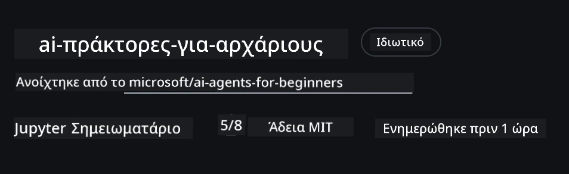
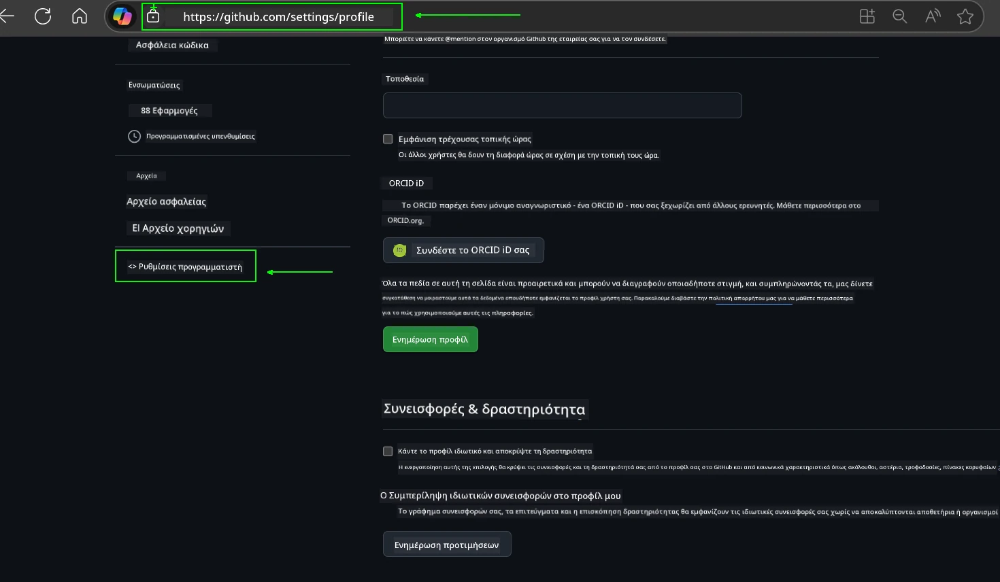
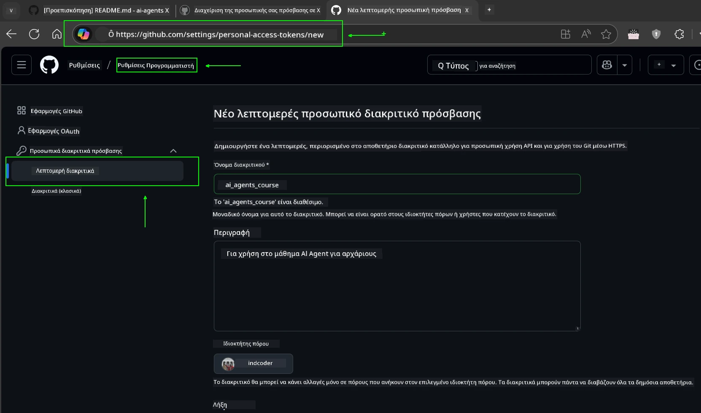
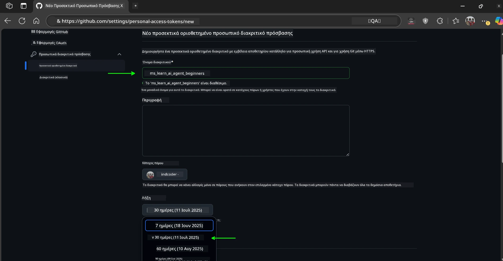
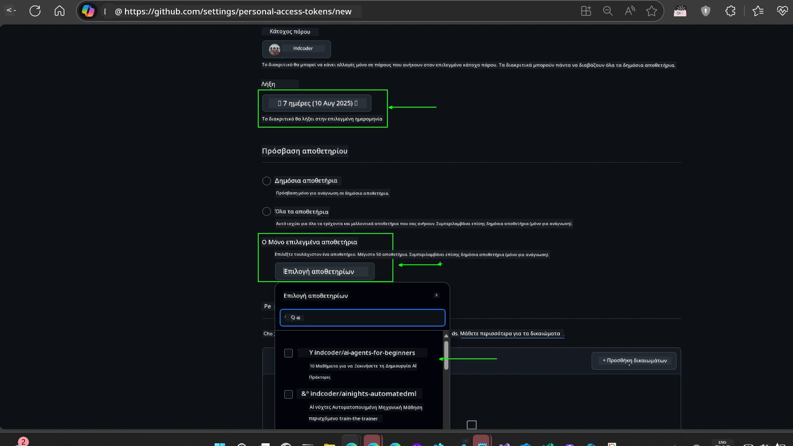
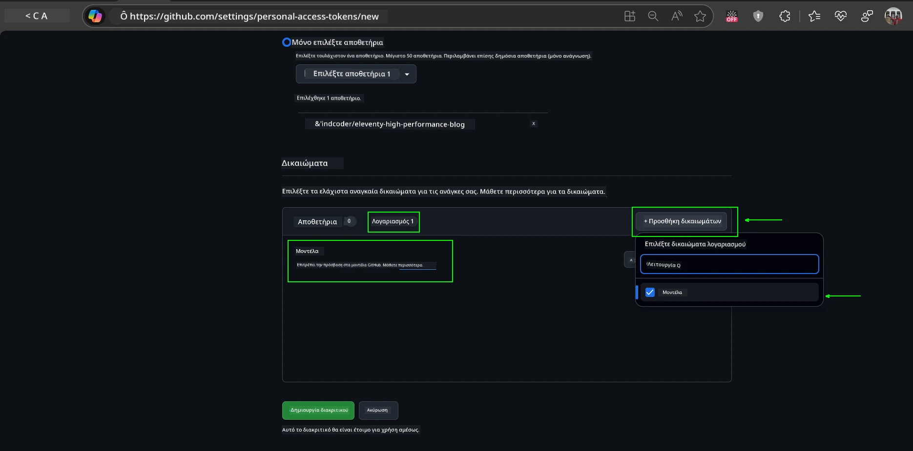
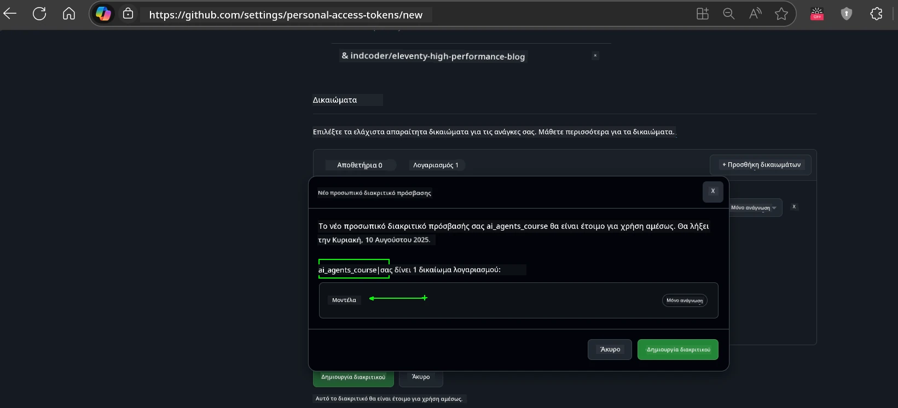
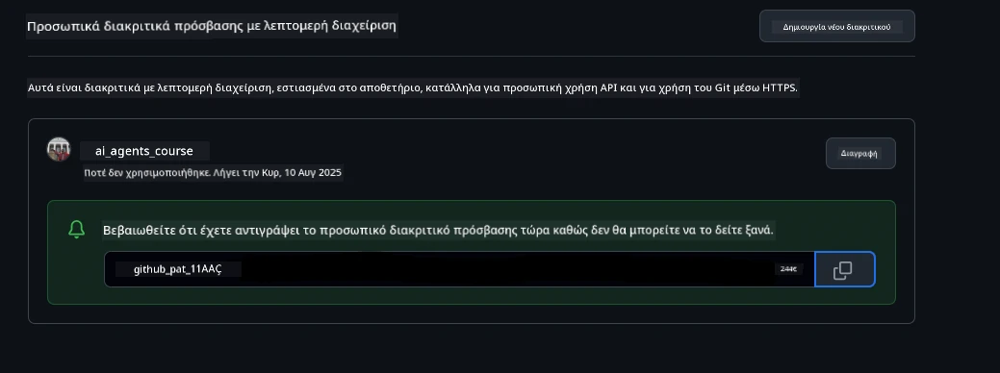
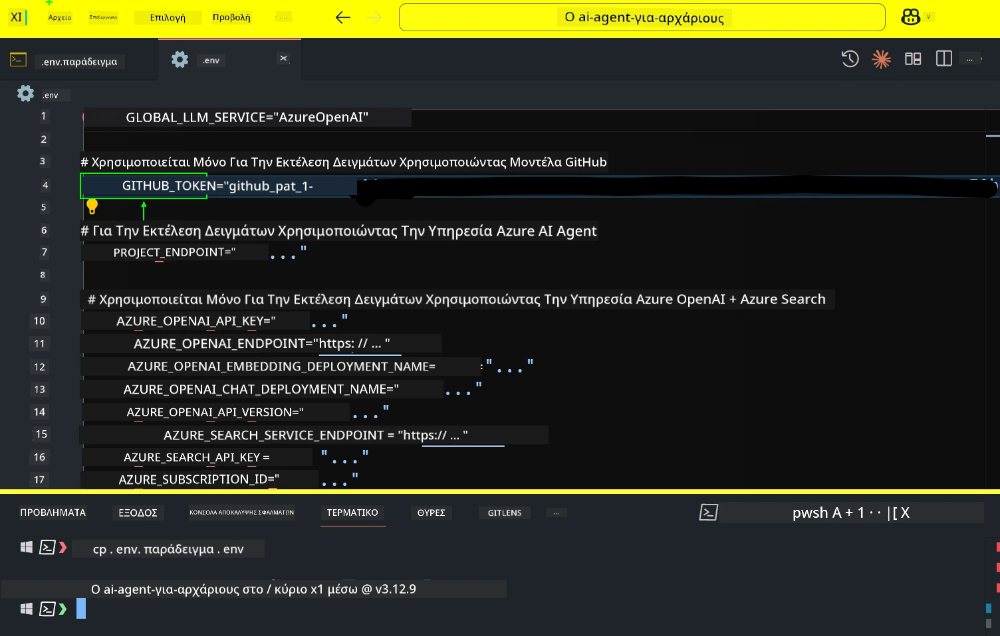
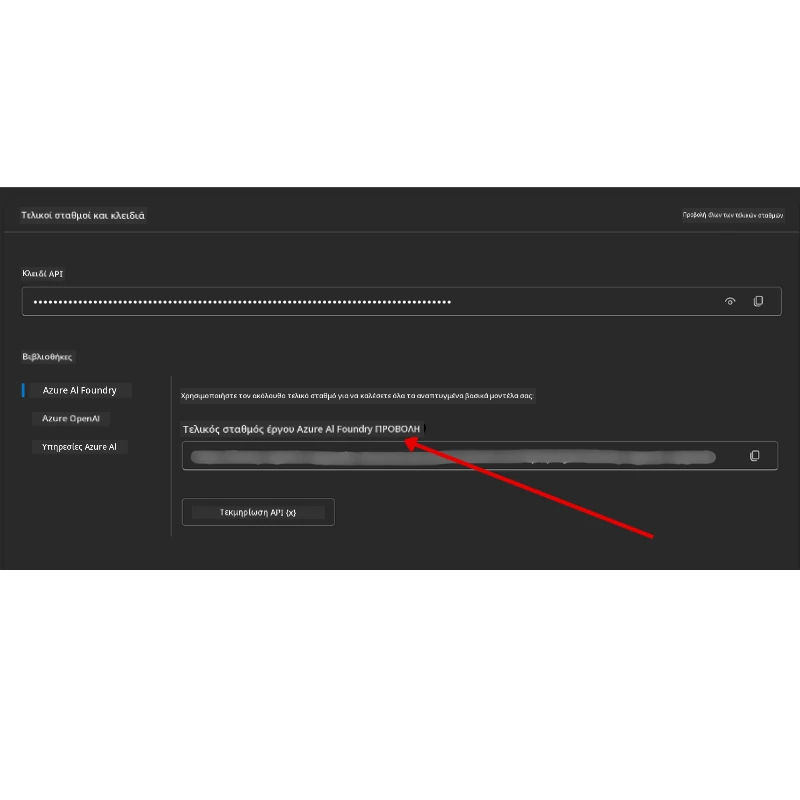

<!--
CO_OP_TRANSLATOR_METADATA:
{
  "original_hash": "63b1a8f6e840df15934935b728e569f0",
  "translation_date": "2025-12-03T14:26:13+00:00",
  "source_file": "00-course-setup/README.md",
  "language_code": "el"
}
-->
# Ρύθμιση Μαθήματος

## Εισαγωγή

Αυτό το μάθημα θα καλύψει πώς να εκτελέσετε τα παραδείγματα κώδικα αυτού του μαθήματος.

## Εγγραφείτε με Άλλους Μαθητές και Λάβετε Βοήθεια

Πριν ξεκινήσετε να κλωνοποιείτε το αποθετήριο σας, εγγραφείτε στο [κανάλι Discord για Αρχάριους AI Agents](https://aka.ms/ai-agents/discord) για να λάβετε βοήθεια με τη ρύθμιση, να κάνετε ερωτήσεις σχετικά με το μάθημα ή να συνδεθείτε με άλλους μαθητές.

## Κλωνοποιήστε ή Δημιουργήστε Fork σε αυτό το Αποθετήριο

Για να ξεκινήσετε, παρακαλώ κλωνοποιήστε ή δημιουργήστε fork στο GitHub Repository. Αυτό θα δημιουργήσει τη δική σας έκδοση του υλικού του μαθήματος, ώστε να μπορείτε να εκτελέσετε, να δοκιμάσετε και να τροποποιήσετε τον κώδικα!

Αυτό μπορεί να γίνει κάνοντας κλικ στον σύνδεσμο για <a href="https://github.com/microsoft/ai-agents-for-beginners/fork" target="_blank">δημιουργία fork στο αποθετήριο</a>.

Θα πρέπει τώρα να έχετε τη δική σας έκδοση fork αυτού του μαθήματος στον παρακάτω σύνδεσμο:



### Ρηχή Κλωνοποίηση (συνιστάται για εργαστήρια / Codespaces)

  >Το πλήρες αποθετήριο μπορεί να είναι μεγάλο (~3 GB) όταν κατεβάζετε όλο το ιστορικό και όλα τα αρχεία. Εάν παρακολουθείτε μόνο το εργαστήριο ή χρειάζεστε μόνο μερικούς φακέλους μαθημάτων, μια ρηχή κλωνοποίηση (ή μια αραιή κλωνοποίηση) αποφεύγει το μεγαλύτερο μέρος αυτής της λήψης, περιορίζοντας το ιστορικό και/ή παραλείποντας blobs.

#### Γρήγορη ρηχή κλωνοποίηση — ελάχιστο ιστορικό, όλα τα αρχεία

Αντικαταστήστε το `<your-username>` στις παρακάτω εντολές με το URL του fork σας (ή το upstream URL αν προτιμάτε).

Για να κλωνοποιήσετε μόνο το πιο πρόσφατο ιστορικό commit (μικρή λήψη):

```bash|powershell
git clone --depth 1 https://github.com/<your-username>/ai-agents-for-beginners.git
```

Για να κλωνοποιήσετε ένα συγκεκριμένο branch:

```bash|powershell
git clone --depth 1 --branch <branch-name> https://github.com/<your-username>/ai-agents-for-beginners.git
```

#### Μερική (αραιή) κλωνοποίηση — ελάχιστα blobs + μόνο επιλεγμένοι φάκελοι

Αυτό χρησιμοποιεί μερική κλωνοποίηση και sparse-checkout (απαιτεί Git 2.25+ και συνιστάται σύγχρονο Git με υποστήριξη μερικής κλωνοποίησης):

```bash|powershell
git clone --depth 1 --filter=blob:none --sparse https://github.com/<your-username>/ai-agents-for-beginners.git
```

Μεταβείτε στον φάκελο του αποθετηρίου:

```bash|powershell
cd ai-agents-for-beginners
```

Στη συνέχεια, καθορίστε ποιους φακέλους θέλετε (το παράδειγμα παρακάτω δείχνει δύο φακέλους):

```bash|powershell
git sparse-checkout set 00-course-setup 01-intro-to-ai-agents
```

Αφού κλωνοποιήσετε και επαληθεύσετε τα αρχεία, αν χρειάζεστε μόνο τα αρχεία και θέλετε να ελευθερώσετε χώρο (χωρίς ιστορικό git), διαγράψτε τα μεταδεδομένα του αποθετηρίου (💀μη αναστρέψιμο — θα χάσετε όλη τη λειτουργικότητα του Git: καμία δυνατότητα commits, pulls, pushes ή πρόσβασης στο ιστορικό).

```bash
# zsh/bash
rm -rf .git
```

```powershell
# PowerShell
Remove-Item -Recurse -Force .git
```

#### Χρήση GitHub Codespaces (συνιστάται για αποφυγή μεγάλων τοπικών λήψεων)

- Δημιουργήστε ένα νέο Codespace για αυτό το αποθετήριο μέσω του [GitHub UI](https://github.com/codespaces).  

- Στο τερματικό του νέου codespace, εκτελέστε μία από τις εντολές ρηχής/αραιής κλωνοποίησης παραπάνω για να φέρετε μόνο τους φακέλους μαθημάτων που χρειάζεστε στον χώρο εργασίας του Codespace.
- Προαιρετικό: μετά την κλωνοποίηση μέσα στο Codespaces, αφαιρέστε το .git για να ανακτήσετε επιπλέον χώρο (δείτε τις εντολές αφαίρεσης παραπάνω).
- Σημείωση: Αν προτιμάτε να ανοίξετε το αποθετήριο απευθείας στο Codespaces (χωρίς επιπλέον κλωνοποίηση), να γνωρίζετε ότι το Codespaces θα κατασκευάσει το περιβάλλον devcontainer και μπορεί να προμηθεύσει περισσότερα από όσα χρειάζεστε. Η κλωνοποίηση μιας ρηχής αντιγραφής μέσα σε ένα νέο Codespace σας δίνει περισσότερο έλεγχο στη χρήση του δίσκου.

#### Συμβουλές

- Πάντα αντικαταστήστε το URL κλωνοποίησης με το fork σας αν θέλετε να επεξεργαστείτε/κάνετε commit.
- Αν αργότερα χρειαστείτε περισσότερο ιστορικό ή αρχεία, μπορείτε να τα ανακτήσετε ή να προσαρμόσετε το sparse-checkout για να συμπεριλάβετε επιπλέον φακέλους.

## Εκτέλεση του Κώδικα

Αυτό το μάθημα προσφέρει μια σειρά από Jupyter Notebooks που μπορείτε να εκτελέσετε για να αποκτήσετε πρακτική εμπειρία στη δημιουργία AI Agents.

Τα παραδείγματα κώδικα χρησιμοποιούν είτε:

**Απαιτεί Λογαριασμό GitHub - Δωρεάν**:

1) Semantic Kernel Agent Framework + GitHub Models Marketplace. Ετικέτα ως (semantic-kernel.ipynb)
2) AutoGen Framework + GitHub Models Marketplace. Ετικέτα ως (autogen.ipynb)

**Απαιτεί Συνδρομή Azure**:

3) Azure AI Foundry + Azure AI Agent Service. Ετικέτα ως (azureaiagent.ipynb)

Σας ενθαρρύνουμε να δοκιμάσετε και τους τρεις τύπους παραδειγμάτων για να δείτε ποιος λειτουργεί καλύτερα για εσάς.

Όποια επιλογή και αν επιλέξετε, αυτή θα καθορίσει ποια βήματα ρύθμισης πρέπει να ακολουθήσετε παρακάτω:

## Απαιτήσεις

- Python 3.12+
  - **ΣΗΜΕΙΩΣΗ**: Αν δεν έχετε εγκατεστημένο το Python3.12, βεβαιωθείτε ότι το εγκαταστήσατε. Στη συνέχεια, δημιουργήστε το venv σας χρησιμοποιώντας python3.12 για να διασφαλίσετε ότι οι σωστές εκδόσεις εγκαθίστανται από το αρχείο requirements.txt.
  
    >Παράδειγμα

    Δημιουργήστε κατάλογο Python venv:

    ```bash|powershell
    python -m venv venv
    ```

    Στη συνέχεια, ενεργοποιήστε το περιβάλλον venv για:

    ```bash
    # zsh/bash
    source venv/bin/activate
    ```
  
    ```dos
    # Command Prompt for Windows
    venv\Scripts\activate
    ```

- .NET 10+: Για τα παραδείγματα κώδικα που χρησιμοποιούν .NET, βεβαιωθείτε ότι έχετε εγκαταστήσει το [.NET 10 SDK](https://dotnet.microsoft.com/download/dotnet/10.0) ή νεότερο. Στη συνέχεια, ελέγξτε την εγκατεστημένη έκδοση του .NET SDK:

    ```bash|powershell
    dotnet --list-sdks
    ```

- Λογαριασμός GitHub - Για πρόσβαση στο GitHub Models Marketplace
- Συνδρομή Azure - Για πρόσβαση στο Azure AI Foundry
- Λογαριασμός Azure AI Foundry - Για πρόσβαση στην Υπηρεσία Azure AI Agent

Έχουμε συμπεριλάβει ένα αρχείο `requirements.txt` στη ρίζα αυτού του αποθετηρίου που περιέχει όλα τα απαραίτητα πακέτα Python για την εκτέλεση των παραδειγμάτων κώδικα.

Μπορείτε να τα εγκαταστήσετε εκτελώντας την παρακάτω εντολή στο τερματικό σας στη ρίζα του αποθετηρίου:

```bash|powershell
pip install -r requirements.txt
```

Συνιστούμε τη δημιουργία ενός εικονικού περιβάλλοντος Python για να αποφύγετε τυχόν συγκρούσεις και προβλήματα.

## Ρύθμιση VSCode

Βεβαιωθείτε ότι χρησιμοποιείτε τη σωστή έκδοση Python στο VSCode.


## Ρύθμιση για Παραδείγματα που Χρησιμοποιούν GitHub Models 

### Βήμα 1: Ανάκτηση του Προσωπικού Access Token (PAT) του GitHub

Αυτό το μάθημα χρησιμοποιεί το GitHub Models Marketplace, παρέχοντας δωρεάν πρόσβαση σε Μεγάλα Γλωσσικά Μοντέλα (LLMs) που θα χρησιμοποιήσετε για να δημιουργήσετε AI Agents.

Για να χρησιμοποιήσετε τα GitHub Models, θα χρειαστεί να δημιουργήσετε ένα [Προσωπικό Access Token GitHub](https://docs.github.com/en/authentication/keeping-your-account-and-data-secure/managing-your-personal-access-tokens).

Αυτό μπορεί να γίνει πηγαίνοντας στις <a href="https://github.com/settings/personal-access-tokens" target="_blank">ρυθμίσεις Προσωπικών Access Tokens</a> στον λογαριασμό σας στο GitHub.

Παρακαλώ ακολουθήστε την [Αρχή της Ελάχιστης Προνομιακής Πρόσβασης](https://docs.github.com/en/get-started/learning-to-code/storing-your-secrets-safely) κατά τη δημιουργία του token σας. Αυτό σημαίνει ότι θα πρέπει να δώσετε στο token μόνο τα δικαιώματα που χρειάζεται για να εκτελέσει τα παραδείγματα κώδικα αυτού του μαθήματος.

1. Επιλέξτε την επιλογή `Fine-grained tokens` στην αριστερή πλευρά της οθόνης σας πηγαίνοντας στις **Ρυθμίσεις Προγραμματιστή**

   

   Στη συνέχεια, επιλέξτε `Generate new token`.

   

2. Εισάγετε ένα περιγραφικό όνομα για το token σας που να αντικατοπτρίζει τον σκοπό του, ώστε να είναι εύκολο να το αναγνωρίσετε αργότερα.

    🔐 Σύσταση Διάρκειας Token

    Συνιστώμενη διάρκεια: 30 ημέρες
    Για πιο ασφαλή στάση, μπορείτε να επιλέξετε μικρότερη περίοδο—όπως 7 ημέρες 🛡️
    Είναι ένας εξαιρετικός τρόπος να θέσετε έναν προσωπικό στόχο και να ολοκληρώσετε το μάθημα ενώ η μαθησιακή σας ορμή είναι υψηλή 🚀.

    

3. Περιορίστε το εύρος του token στο fork σας αυτού του αποθετηρίου.

    

4. Περιορίστε τα δικαιώματα του token: Στην καρτέλα **Permissions**, κάντε κλικ στην καρτέλα **Account** και πατήστε το κουμπί "+ Add permissions". Θα εμφανιστεί ένα αναδυόμενο μενού. Αναζητήστε **Models** και επιλέξτε το κουτάκι.

    

5. Επαληθεύστε τα απαιτούμενα δικαιώματα πριν δημιουργήσετε το token. 

6. Πριν δημιουργήσετε το token, βεβαιωθείτε ότι είστε έτοιμοι να αποθηκεύσετε το token σε ασφαλές μέρος, όπως ένα θησαυροφυλάκιο διαχείρισης κωδικών πρόσβασης, καθώς δεν θα εμφανιστεί ξανά μετά τη δημιουργία του. 

Αντιγράψτε το νέο token που μόλις δημιουργήσατε. Θα το προσθέσετε τώρα στο αρχείο `.env` που περιλαμβάνεται σε αυτό το μάθημα.

### Βήμα 2: Δημιουργία του Αρχείου `.env`

Για να δημιουργήσετε το αρχείο `.env`, εκτελέστε την παρακάτω εντολή στο τερματικό σας.

```bash
# zsh/bash
cp .env.example .env
```

```powershell
# PowerShell
Copy-Item .env.example .env
```

Αυτό θα αντιγράψει το αρχείο παραδείγματος και θα δημιουργήσει ένα `.env` στον κατάλογό σας, όπου θα συμπληρώσετε τις τιμές για τις μεταβλητές περιβάλλοντος.

Με το token σας αντιγραμμένο, ανοίξτε το αρχείο `.env` στον αγαπημένο σας επεξεργαστή κειμένου και επικολλήστε το token στο πεδίο `GITHUB_TOKEN`.



Θα πρέπει τώρα να μπορείτε να εκτελέσετε τα παραδείγματα κώδικα αυτού του μαθήματος.

## Ρύθμιση για Παραδείγματα που Χρησιμοποιούν Azure AI Foundry και Azure AI Agent Service

### Βήμα 1: Ανάκτηση του Endpoint του Έργου Azure

Ακολουθήστε τα βήματα για τη δημιουργία ενός hub και ενός έργου στο Azure AI Foundry που βρίσκονται εδώ: [Επισκόπηση πόρων Hub](https://learn.microsoft.com/azure/ai-foundry/concepts/ai-resources)

Αφού δημιουργήσετε το έργο σας, θα χρειαστεί να ανακτήσετε τη συμβολοσειρά σύνδεσης για το έργο σας.

Αυτό μπορεί να γίνει πηγαίνοντας στη σελίδα **Επισκόπηση** του έργου σας στην πύλη Azure AI Foundry.



### Βήμα 2: Δημιουργία του Αρχείου `.env`

Για να δημιουργήσετε το αρχείο `.env`, εκτελέστε την παρακάτω εντολή στο τερματικό σας.

```bash
# zsh/bash
cp .env.example .env
```

```powershell
# PowerShell
Copy-Item .env.example .env
```

Αυτό θα αντιγράψει το αρχείο παραδείγματος και θα δημιουργήσει ένα `.env` στον κατάλογό σας, όπου θα συμπληρώσετε τις τιμές για τις μεταβλητές περιβάλλοντος.

Με το token σας αντιγραμμένο, ανοίξτε το αρχείο `.env` στον αγαπημένο σας επεξεργαστή κειμένου και επικολλήστε το token στο πεδίο `PROJECT_ENDPOINT`.

### Βήμα 3: Σύνδεση στο Azure

Ως βέλτιστη πρακτική ασφαλείας, θα χρησιμοποιήσουμε [αυθεντικοποίηση χωρίς κλειδί](https://learn.microsoft.com/azure/developer/ai/keyless-connections?tabs=csharp%2Cazure-cli?WT.mc_id=academic-105485-koreyst) για να συνδεθούμε στο Azure OpenAI με το Microsoft Entra ID. 

Στη συνέχεια, ανοίξτε ένα τερματικό και εκτελέστε `az login --use-device-code` για να συνδεθείτε στον λογαριασμό σας στο Azure.

Αφού συνδεθείτε, επιλέξτε τη συνδρομή σας στο τερματικό.

## Πρόσθετες Μεταβλητές Περιβάλλοντος - Azure Search και Azure OpenAI 

Για το μάθημα Agentic RAG - Μάθημα 5 - υπάρχουν παραδείγματα που χρησιμοποιούν Azure Search και Azure OpenAI.

Αν θέλετε να εκτελέσετε αυτά τα παραδείγματα, θα χρειαστεί να προσθέσετε τις παρακάτω μεταβλητές περιβάλλοντος στο αρχείο `.env` σας:

### Σελίδα Επισκόπησης (Έργο)

- `AZURE_SUBSCRIPTION_ID` - Ελέγξτε τις **Λεπτομέρειες Έργου** στη σελίδα **Επισκόπηση** του έργου σας.

- `AZURE_AI_PROJECT_NAME` - Δείτε την κορυφή της σελίδας **Επισκόπηση** για το έργο σας.

- `AZURE_OPENAI_SERVICE` - Βρείτε το στην καρτέλα **Συμπεριλαμβανόμενες δυνατότητες** για την **Υπηρεσία Azure OpenAI** στη σελίδα **Επισκόπηση**.

### Κέντρο Διαχείρισης

- `AZURE_OPENAI_RESOURCE_GROUP` - Μεταβείτε στις **Ιδιότητες Έργου** στη σελίδα **Επισκόπηση** του **Κέντρου Διαχείρισης**.

- `GLOBAL_LLM_SERVICE` - Στην ενότητα **Συνδεδεμένοι πόροι**, βρείτε το όνομα σύνδεσης **Azure AI Services**. Αν δεν αναφέρεται, ελέγξτε την **πύλη Azure** στην ομάδα πόρων σας για το όνομα του πόρου AI Services.

### Σελίδα Μοντέλων + Endpoints

- `AZURE_OPENAI_EMBEDDING_DEPLOYMENT_NAME` - Επιλέξτε το μοντέλο ενσωμάτωσης σας (π.χ., `text-embedding-ada-002`) και σημειώστε το **Όνομα Ανάπτυξης** από τις λεπτομέρειες του μοντέλου.

- `AZURE_OPENAI_CHAT_DEPLOYMENT_NAME` - Επιλέξτε το μοντέλο συνομιλίας σας (π.χ., `gpt-4o-mini`) και σημειώστε το **Όνομα Ανάπτυξης** από τις λεπτομέρειες του μοντέλου.

### Πύλη
Αν αντιμετωπίσετε οποιοδήποτε πρόβλημα με αυτήν τη ρύθμιση, μπείτε στο <a href="https://discord.gg/kzRShWzttr" target="_blank">Azure AI Community Discord</a> ή <a href="https://github.com/microsoft/ai-agents-for-beginners/issues?WT.mc_id=academic-105485-koreyst" target="_blank">δημιουργήστε ένα ζήτημα</a>.

## Επόμενο Μάθημα

Είστε πλέον έτοιμοι να εκτελέσετε τον κώδικα για αυτό το μάθημα. Καλή συνέχεια στην εκμάθηση για τον κόσμο των Πρακτόρων Τεχνητής Νοημοσύνης!

[Εισαγωγή στους Πράκτορες Τεχνητής Νοημοσύνης και τις Χρήσεις τους](../01-intro-to-ai-agents/README.md)

---

<!-- CO-OP TRANSLATOR DISCLAIMER START -->
**Αποποίηση ευθυνών**:  
Αυτό το έγγραφο έχει μεταφραστεί χρησιμοποιώντας την υπηρεσία αυτόματης μετάφρασης [Co-op Translator](https://github.com/Azure/co-op-translator). Παρόλο που καταβάλλουμε προσπάθειες για ακρίβεια, παρακαλούμε να έχετε υπόψη ότι οι αυτόματες μεταφράσεις ενδέχεται να περιέχουν λάθη ή ανακρίβειες. Το πρωτότυπο έγγραφο στη μητρική του γλώσσα θα πρέπει να θεωρείται η αυθεντική πηγή. Για κρίσιμες πληροφορίες, συνιστάται επαγγελματική ανθρώπινη μετάφραση. Δεν φέρουμε ευθύνη για τυχόν παρεξηγήσεις ή εσφαλμένες ερμηνείες που προκύπτουν από τη χρήση αυτής της μετάφρασης.
<!-- CO-OP TRANSLATOR DISCLAIMER END -->