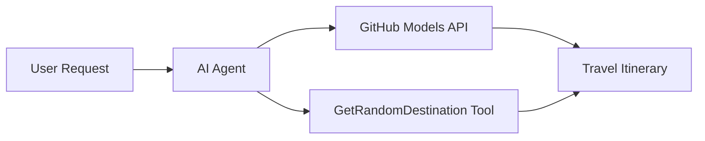

<!--
CO_OP_TRANSLATOR_METADATA:
{
  "original_hash": "5f351412e934f0833c8c821a0a60efaf",
  "translation_date": "2025-11-13T12:28:19+00:00",
  "source_file": "01-intro-to-ai-agents/code_samples/01-dotnet-agent-framework.md",
  "language_code": "el"
}
-->
# 🌍 Πράκτορας Ταξιδιών AI με το Microsoft Agent Framework (.NET)

## 📋 Επισκόπηση Σεναρίου

Αυτό το παράδειγμα δείχνει πώς να δημιουργήσετε έναν έξυπνο πράκτορα σχεδιασμού ταξιδιών χρησιμοποιώντας το Microsoft Agent Framework για .NET. Ο πράκτορας μπορεί να δημιουργήσει αυτόματα εξατομικευμένα δρομολόγια ημερήσιων εκδρομών για τυχαίους προορισμούς σε όλο τον κόσμο.

### Βασικές Δυνατότητες:

- 🎲 **Τυχαία Επιλογή Προορισμού**: Χρησιμοποιεί ένα προσαρμοσμένο εργαλείο για την επιλογή προορισμών διακοπών
- 🗺️ **Έξυπνος Σχεδιασμός Ταξιδιών**: Δημιουργεί λεπτομερή δρομολόγια ημέρας-προς-ημέρα
- 🔄 **Ροή σε Πραγματικό Χρόνο**: Υποστηρίζει άμεσες και συνεχείς απαντήσεις
- 🛠️ **Ενσωμάτωση Προσαρμοσμένων Εργαλείων**: Δείχνει πώς να επεκτείνετε τις δυνατότητες του πράκτορα

## 🔧 Τεχνική Αρχιτεκτονική

### Βασικές Τεχνολογίες

- **Microsoft Agent Framework**: Η πιο πρόσφατη υλοποίηση .NET για ανάπτυξη AI πρακτόρων
- **Ενσωμάτωση Μοντέλων GitHub**: Χρησιμοποιεί την υπηρεσία εξαγωγής μοντέλων AI του GitHub
- **Συμβατότητα με OpenAI API**: Αξιοποιεί τις βιβλιοθήκες πελατών OpenAI με προσαρμοσμένα endpoints
- **Ασφαλής Διαμόρφωση**: Διαχείριση κλειδιών API βάσει περιβάλλοντος

### Βασικά Συστατικά

1. **AIAgent**: Ο κύριος συντονιστής πράκτορα που διαχειρίζεται τη ροή συνομιλίας
2. **Προσαρμοσμένα Εργαλεία**: Η λειτουργία `GetRandomDestination()` διαθέσιμη στον πράκτορα
3. **Πελάτης Συνομιλίας**: Διεπαφή συνομιλίας που υποστηρίζεται από τα μοντέλα του GitHub
4. **Υποστήριξη Ροής**: Δυνατότητες δημιουργίας απαντήσεων σε πραγματικό χρόνο

### Μοτίβο Ενσωμάτωσης



## 🚀 Ξεκινώντας

### Προαπαιτούμενα

- [.NET 10 SDK](https://dotnet.microsoft.com/download/dotnet/10.0) ή νεότερο
- [Κλειδί πρόσβασης API για τα μοντέλα GitHub](https://docs.github.com/github-models/github-models-at-scale/using-your-own-api-keys-in-github-models)

### Απαιτούμενες Μεταβλητές Περιβάλλοντος

```bash
# zsh/bash
export GH_TOKEN=<your_github_token>
export GH_ENDPOINT=https://models.github.ai/inference
export GH_MODEL_ID=openai/gpt-5-mini
```

```powershell
# PowerShell
$env:GH_TOKEN = "<your_github_token>"
$env:GH_ENDPOINT = "https://models.github.ai/inference"
$env:GH_MODEL_ID = "openai/gpt-5-mini"
```

### Παράδειγμα Κώδικα

Για να εκτελέσετε το παράδειγμα κώδικα,

```bash
# zsh/bash
chmod +x ./01-dotnet-agent-framework.cs
./01-dotnet-agent-framework.cs
```

Ή χρησιμοποιώντας το dotnet CLI:

```bash
dotnet run ./01-dotnet-agent-framework.cs
```

Δείτε το [`01-dotnet-agent-framework.cs`](../../../../01-intro-to-ai-agents/code_samples/01-dotnet-agent-framework.cs) για τον πλήρη κώδικα.

```csharp
#!/usr/bin/dotnet run

#:package Microsoft.Extensions.AI@9.*
#:package Microsoft.Agents.AI.OpenAI@1.*-*

using System.ClientModel;
using System.ComponentModel;

using Microsoft.Agents.AI;
using Microsoft.Extensions.AI;

using OpenAI;

// Tool Function: Random Destination Generator
// This static method will be available to the agent as a callable tool
// The [Description] attribute helps the AI understand when to use this function
// This demonstrates how to create custom tools for AI agents
[Description("Provides a random vacation destination.")]
static string GetRandomDestination()
{
    // List of popular vacation destinations around the world
    // The agent will randomly select from these options
    var destinations = new List<string>
    {
        "Paris, France",
        "Tokyo, Japan",
        "New York City, USA",
        "Sydney, Australia",
        "Rome, Italy",
        "Barcelona, Spain",
        "Cape Town, South Africa",
        "Rio de Janeiro, Brazil",
        "Bangkok, Thailand",
        "Vancouver, Canada"
    };

    // Generate random index and return selected destination
    // Uses System.Random for simple random selection
    var random = new Random();
    int index = random.Next(destinations.Count);
    return destinations[index];
}

// Extract configuration from environment variables
// Retrieve the GitHub Models API endpoint, defaults to https://models.github.ai/inference if not specified
// Retrieve the model ID, defaults to openai/gpt-5-mini if not specified
// Retrieve the GitHub token for authentication, throws exception if not specified
var github_endpoint = Environment.GetEnvironmentVariable("GH_ENDPOINT") ?? "https://models.github.ai/inference";
var github_model_id = Environment.GetEnvironmentVariable("GH_MODEL_ID") ?? "openai/gpt-5-mini";
var github_token = Environment.GetEnvironmentVariable("GH_TOKEN") ?? throw new InvalidOperationException("GH_TOKEN is not set.");

// Configure OpenAI Client Options
// Create configuration options to point to GitHub Models endpoint
// This redirects OpenAI client calls to GitHub's model inference service
var openAIOptions = new OpenAIClientOptions()
{
    Endpoint = new Uri(github_endpoint)
};

// Initialize OpenAI Client with GitHub Models Configuration
// Create OpenAI client using GitHub token for authentication
// Configure it to use GitHub Models endpoint instead of OpenAI directly
var openAIClient = new OpenAIClient(new ApiKeyCredential(github_token), openAIOptions);

// Create AI Agent with Travel Planning Capabilities
// Initialize OpenAI client, get chat client for specified model, and create AI agent
// Configure agent with travel planning instructions and random destination tool
// The agent can now plan trips using the GetRandomDestination function
AIAgent agent = openAIClient
    .GetChatClient(github_model_id)
    .CreateAIAgent(
        instructions: "You are a helpful AI Agent that can help plan vacations for customers at random destinations",
        tools: [AIFunctionFactory.Create(GetRandomDestination)]
    );

// Execute Agent: Plan a Day Trip
// Run the agent with streaming enabled for real-time response display
// Shows the agent's thinking and response as it generates the content
// Provides better user experience with immediate feedback
await foreach (var update in agent.RunStreamingAsync("Plan me a day trip"))
{
    await Task.Delay(10);
    Console.Write(update);
}
```

## 🎓 Βασικά Συμπεράσματα

1. **Αρχιτεκτονική Πράκτορα**: Το Microsoft Agent Framework παρέχει μια καθαρή, ασφαλή ως προς τους τύπους προσέγγιση για τη δημιουργία AI πρακτόρων στο .NET
2. **Ενσωμάτωση Εργαλείων**: Λειτουργίες με διακοσμητικά `[Description]` γίνονται διαθέσιμα εργαλεία για τον πράκτορα
3. **Διαχείριση Διαμόρφωσης**: Οι μεταβλητές περιβάλλοντος και η ασφαλής διαχείριση διαπιστευτηρίων ακολουθούν τις βέλτιστες πρακτικές του .NET
4. **Συμβατότητα με OpenAI**: Η ενσωμάτωση των μοντέλων GitHub λειτουργεί απρόσκοπτα μέσω APIs συμβατών με OpenAI

## 🔗 Πρόσθετοι Πόροι

- [Τεκμηρίωση Microsoft Agent Framework](https://learn.microsoft.com/agent-framework)
- [Αγορά Μοντέλων GitHub](https://github.com/marketplace?type=models)
- [Microsoft.Extensions.AI](https://learn.microsoft.com/dotnet/ai/microsoft-extensions-ai)
- [.NET Single File Apps](https://devblogs.microsoft.com/dotnet/announcing-dotnet-run-app)

---

<!-- CO-OP TRANSLATOR DISCLAIMER START -->
**Αποποίηση ευθυνών**:  
Αυτό το έγγραφο έχει μεταφραστεί χρησιμοποιώντας την υπηρεσία αυτόματης μετάφρασης [Co-op Translator](https://github.com/Azure/co-op-translator). Παρόλο που καταβάλλουμε προσπάθειες για ακρίβεια, παρακαλούμε να έχετε υπόψη ότι οι αυτόματες μεταφράσεις ενδέχεται να περιέχουν λάθη ή ανακρίβειες. Το πρωτότυπο έγγραφο στη μητρική του γλώσσα θα πρέπει να θεωρείται η αυθεντική πηγή. Για κρίσιμες πληροφορίες, συνιστάται επαγγελματική ανθρώπινη μετάφραση. Δεν φέρουμε ευθύνη για τυχόν παρεξηγήσεις ή εσφαλμένες ερμηνείες που προκύπτουν από τη χρήση αυτής της μετάφρασης.
<!-- CO-OP TRANSLATOR DISCLAIMER END -->