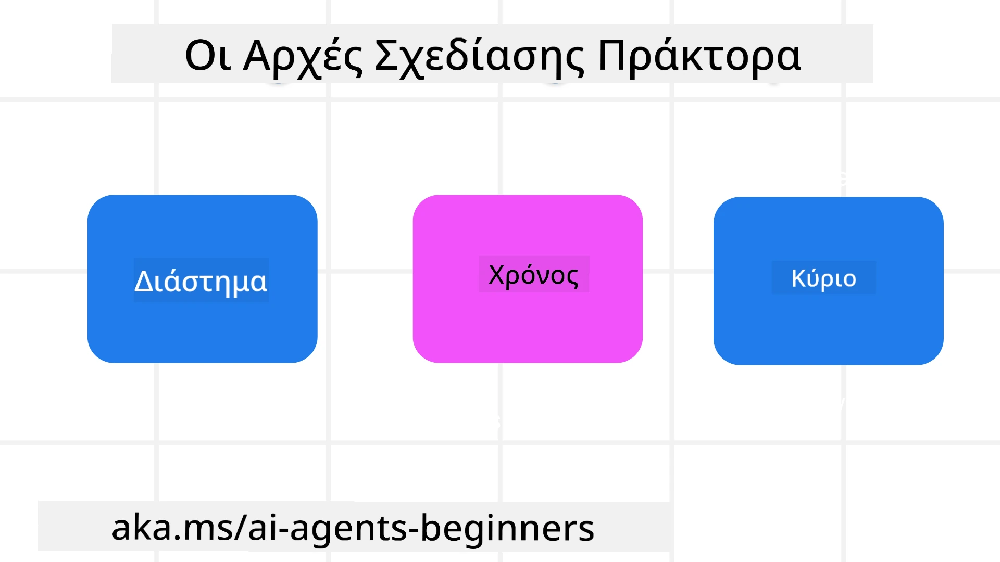

<!--
CO_OP_TRANSLATOR_METADATA:
{
  "original_hash": "d71524fe83a23829ae7a23b4031aaac8",
  "translation_date": "2025-11-13T12:32:19+00:00",
  "source_file": "03-agentic-design-patterns/README.md",
  "language_code": "el"
}
-->

> _(Κάντε κλικ στην παραπάνω εικόνα για να παρακολουθήσετε το βίντεο αυτού του μαθήματος)_
# Αρχές Σχεδιασμού Πρακτόρων AI

## Εισαγωγή

Υπάρχουν πολλοί τρόποι να σκεφτούμε τη δημιουργία Συστημάτων Πρακτόρων AI. Δεδομένου ότι η αμφισημία είναι χαρακτηριστικό και όχι πρόβλημα στο σχεδιασμό Γενετικής Τεχνητής Νοημοσύνης, είναι μερικές φορές δύσκολο για τους μηχανικούς να καταλάβουν από πού να ξεκινήσουν. Έχουμε δημιουργήσει ένα σύνολο αρχών σχεδιασμού UX με επίκεντρο τον άνθρωπο για να βοηθήσουμε τους προγραμματιστές να δημιουργήσουν συστήματα πρακτόρων με επίκεντρο τον πελάτη, ώστε να καλύψουν τις επιχειρηματικές τους ανάγκες. Αυτές οι αρχές σχεδιασμού δεν αποτελούν μια προκαθορισμένη αρχιτεκτονική, αλλά ένα σημείο εκκίνησης για ομάδες που ορίζουν και αναπτύσσουν εμπειρίες πρακτόρων.

Γενικά, οι πράκτορες θα πρέπει:

- Να διευρύνουν και να επεκτείνουν τις ανθρώπινες δυνατότητες (καταιγισμός ιδεών, επίλυση προβλημάτων, αυτοματοποίηση κ.λπ.)
- Να καλύπτουν κενά γνώσης (να με ενημερώνουν για τομείς γνώσης, μετάφραση κ.λπ.)
- Να διευκολύνουν και να υποστηρίζουν τη συνεργασία με τρόπους που προτιμούμε να δουλεύουμε με άλλους
- Να μας κάνουν καλύτερες εκδοχές του εαυτού μας (π.χ., προπονητής ζωής/διαχειριστής εργασιών, να μας βοηθούν να μάθουμε δεξιότητες συναισθηματικής ρύθμισης και ενσυνειδητότητας, να χτίζουν ανθεκτικότητα κ.λπ.)

## Τι Θα Καλύψει Αυτό το Μάθημα

- Τι είναι οι Αρχές Σχεδιασμού Πρακτόρων
- Ποιες είναι κάποιες κατευθυντήριες γραμμές για την εφαρμογή αυτών των αρχών σχεδιασμού
- Ποια είναι κάποια παραδείγματα χρήσης των αρχών σχεδιασμού

## Στόχοι Μάθησης

Μετά την ολοκλήρωση αυτού του μαθήματος, θα μπορείτε να:

1. Εξηγήσετε τι είναι οι Αρχές Σχεδιασμού Πρακτόρων
2. Εξηγήσετε τις κατευθυντήριες γραμμές για τη χρήση των Αρχών Σχεδιασμού Πρακτόρων
3. Κατανοήσετε πώς να δημιουργήσετε έναν πράκτορα χρησιμοποιώντας τις Αρχές Σχεδιασμού Πρακτόρων

## Οι Αρχές Σχεδιασμού Πρακτόρων

### Πράκτορας (Χώρος)

Αυτό είναι το περιβάλλον στο οποίο λειτουργεί ο πράκτορας. Αυτές οι αρχές καθοδηγούν πώς σχεδιάζουμε πράκτορες για να συμμετέχουν σε φυσικούς και ψηφιακούς κόσμους.

- **Σύνδεση, όχι κατάρρευση** – βοηθήστε να συνδέονται οι άνθρωποι με άλλους ανθρώπους, γεγονότα και χρήσιμη γνώση για να διευκολύνεται η συνεργασία και η σύνδεση.
- Οι πράκτορες βοηθούν στη σύνδεση γεγονότων, γνώσης και ανθρώπων.
- Οι πράκτορες φέρνουν τους ανθρώπους πιο κοντά. Δεν έχουν σχεδιαστεί για να αντικαθιστούν ή να υποτιμούν τους ανθρώπους.
- **Εύκολα προσβάσιμοι αλλά περιστασιακά αόρατοι** – ο πράκτορας λειτουργεί κυρίως στο παρασκήνιο και μας ειδοποιεί μόνο όταν είναι σχετικό και κατάλληλο.
  - Ο πράκτορας είναι εύκολα ανιχνεύσιμος και προσβάσιμος για εξουσιοδοτημένους χρήστες σε οποιαδήποτε συσκευή ή πλατφόρμα.
  - Ο πράκτορας υποστηρίζει πολυτροπικές εισόδους και εξόδους (ήχος, φωνή, κείμενο κ.λπ.).
  - Ο πράκτορας μπορεί να μεταβαίνει απρόσκοπτα μεταξύ προσκηνίου και παρασκηνίου, μεταξύ προληπτικής και αντιδραστικής λειτουργίας, ανάλογα με την αίσθηση των αναγκών του χρήστη.
  - Ο πράκτορας μπορεί να λειτουργεί σε αόρατη μορφή, αλλά η διαδρομή της διαδικασίας του στο παρασκήνιο και η συνεργασία του με άλλους πράκτορες είναι διαφανής και ελεγχόμενη από τον χρήστη.

### Πράκτορας (Χρόνος)

Αυτό είναι το πώς λειτουργεί ο πράκτορας με την πάροδο του χρόνου. Αυτές οι αρχές καθοδηγούν πώς σχεδιάζουμε πράκτορες που αλληλεπιδρούν με το παρελθόν, το παρόν και το μέλλον.

- **Παρελθόν**: Αντανάκλαση της ιστορίας που περιλαμβάνει τόσο την κατάσταση όσο και το πλαίσιο.
  - Ο πράκτορας παρέχει πιο σχετικές απαντήσεις βασισμένες στην ανάλυση πλουσιότερων ιστορικών δεδομένων πέρα από το γεγονός, τους ανθρώπους ή τις καταστάσεις.
  - Ο πράκτορας δημιουργεί συνδέσεις από παρελθόντα γεγονότα και ενεργά αναστοχάζεται στη μνήμη για να εμπλακεί με τρέχουσες καταστάσεις.
- **Τώρα**: Υποδείξεις αντί για ειδοποιήσεις.
  - Ο πράκτορας ενσωματώνει μια ολοκληρωμένη προσέγγιση στην αλληλεπίδραση με τους ανθρώπους. Όταν συμβαίνει ένα γεγονός, ο πράκτορας πηγαίνει πέρα από στατικές ειδοποιήσεις ή άλλες στατικές τυπικότητες. Μπορεί να απλοποιήσει ροές ή να δημιουργήσει δυναμικά υποδείξεις για να κατευθύνει την προσοχή του χρήστη τη σωστή στιγμή.
  - Ο πράκτορας παρέχει πληροφορίες βασισμένες στο περιβάλλον, τις κοινωνικές και πολιτιστικές αλλαγές και προσαρμοσμένες στην πρόθεση του χρήστη.
  - Η αλληλεπίδραση με τον πράκτορα μπορεί να είναι σταδιακή, εξελισσόμενη/αυξανόμενη σε πολυπλοκότητα για να ενδυναμώσει τους χρήστες μακροπρόθεσμα.
- **Μέλλον**: Προσαρμογή και εξέλιξη.
  - Ο πράκτορας προσαρμόζεται σε διάφορες συσκευές, πλατφόρμες και τρόπους λειτουργίας.
  - Ο πράκτορας προσαρμόζεται στη συμπεριφορά του χρήστη, στις ανάγκες προσβασιμότητας και είναι ελεύθερα προσαρμόσιμος.
  - Ο πράκτορας διαμορφώνεται και εξελίσσεται μέσω συνεχούς αλληλεπίδρασης με τον χρήστη.

### Πράκτορας (Πυρήνας)

Αυτά είναι τα βασικά στοιχεία στον πυρήνα του σχεδιασμού ενός πράκτορα.

- **Αποδοχή της αβεβαιότητας αλλά καθιέρωση εμπιστοσύνης**.
  - Ένα ορισμένο επίπεδο αβεβαιότητας του πράκτορα είναι αναμενόμενο. Η αβεβαιότητα είναι βασικό στοιχείο του σχεδιασμού πρακτόρων.
  - Η εμπιστοσύνη και η διαφάνεια είναι θεμελιώδη στρώματα του σχεδιασμού πρακτόρων.
  - Οι άνθρωποι έχουν τον έλεγχο του πότε ο πράκτορας είναι ενεργοποιημένος/απενεργοποιημένος και η κατάσταση του πράκτορα είναι πάντα σαφώς ορατή.

## Οι Κατευθυντήριες Γραμμές για την Εφαρμογή Αυτών των Αρχών

Όταν χρησιμοποιείτε τις παραπάνω αρχές σχεδιασμού, ακολουθήστε τις εξής κατευθυντήριες γραμμές:

1. **Διαφάνεια**: Ενημερώστε τον χρήστη ότι εμπλέκεται AI, πώς λειτουργεί (συμπεριλαμβανομένων των προηγούμενων ενεργειών) και πώς να δώσει ανατροφοδότηση και να τροποποιήσει το σύστημα.
2. **Έλεγχος**: Δώστε τη δυνατότητα στον χρήστη να προσαρμόσει, να καθορίσει προτιμήσεις και να προσωποποιήσει, και να έχει έλεγχο στο σύστημα και τα χαρακτηριστικά του (συμπεριλαμβανομένης της δυνατότητας να ξεχάσει).
3. **Συνέπεια**: Στοχεύστε σε συνεπείς, πολυτροπικές εμπειρίες σε συσκευές και σημεία επαφής. Χρησιμοποιήστε οικεία στοιχεία UI/UX όπου είναι δυνατόν (π.χ., εικονίδιο μικροφώνου για φωνητική αλληλεπίδραση) και μειώστε όσο το δυνατόν περισσότερο το γνωστικό φορτίο του πελάτη (π.χ., στοχεύστε σε συνοπτικές απαντήσεις, οπτικά βοηθήματα και περιεχόμενο «Μάθετε Περισσότερα»).

## Πώς να Σχεδιάσετε έναν Ταξιδιωτικό Πράκτορα χρησιμοποιώντας Αυτές τις Αρχές και Κατευθυντήριες Γραμμές

Φανταστείτε ότι σχεδιάζετε έναν Ταξιδιωτικό Πράκτορα, εδώ είναι πώς θα μπορούσατε να σκεφτείτε τη χρήση των Αρχών Σχεδιασμού και Κατευθυντήριων Γραμμών:

1. **Διαφάνεια** – Ενημερώστε τον χρήστη ότι ο Ταξιδιωτικός Πράκτορας είναι ένας πράκτορας με δυνατότητες AI. Παρέχετε κάποιες βασικές οδηγίες για το πώς να ξεκινήσει (π.χ., ένα μήνυμα «Γεια σας», παραδείγματα προτροπών). Τεκμηριώστε αυτό σαφώς στη σελίδα του προϊόντος. Δείξτε τη λίστα των προτροπών που έχει ζητήσει ο χρήστης στο παρελθόν. Κάντε σαφές πώς να δώσει ανατροφοδότηση (αντίχειρες πάνω και κάτω, κουμπί Αποστολή Ανατροφοδότησης κ.λπ.). Εξηγήστε σαφώς αν ο Πράκτορας έχει περιορισμούς χρήσης ή θεμάτων.
2. **Έλεγχος** – Βεβαιωθείτε ότι είναι σαφές πώς ο χρήστης μπορεί να τροποποιήσει τον Πράκτορα αφού έχει δημιουργηθεί, με πράγματα όπως το Σύστημα Προτροπής. Δώστε τη δυνατότητα στον χρήστη να επιλέξει πόσο αναλυτικός είναι ο Πράκτορας, το στυλ γραφής του και οποιεσδήποτε επιφυλάξεις για το τι δεν πρέπει να συζητά ο Πράκτορας. Επιτρέψτε στον χρήστη να δει και να διαγράψει οποιαδήποτε συνδεδεμένα αρχεία ή δεδομένα, προτροπές και προηγούμενες συνομιλίες.
3. **Συνέπεια** – Βεβαιωθείτε ότι τα εικονίδια για Κοινή Χρήση Προτροπής, προσθήκη αρχείου ή φωτογραφίας και επισήμανση κάποιου ή κάτι είναι τυποποιημένα και αναγνωρίσιμα. Χρησιμοποιήστε το εικονίδιο συνδετήρα για να υποδείξετε την αποστολή/κοινή χρήση αρχείων με τον Πράκτορα και το εικονίδιο εικόνας για να υποδείξετε την αποστολή γραφικών.

## Δείγματα Κώδικα

- Python: [Πλαίσιο Πράκτορα](./code_samples/03-python-agent-framework.ipynb)
- .NET: [Πλαίσιο Πράκτορα](./code_samples/03-dotnet-agent-framework.md)

## Έχετε Περισσότερες Ερωτήσεις για τα Μοτίβα Σχεδιασμού Πρακτόρων AI;

Γίνετε μέλος στο [Azure AI Foundry Discord](https://aka.ms/ai-agents/discord) για να συναντήσετε άλλους μαθητές, να παρακολουθήσετε ώρες γραφείου και να λάβετε απαντήσεις στις ερωτήσεις σας για τους Πράκτορες AI.

## Πρόσθετοι Πόροι

- <a href="https://openai.com" target="_blank">Πρακτικές για τη Διακυβέρνηση Συστημάτων Πρακτόρων AI | OpenAI</a>
- <a href="https://microsoft.com" target="_blank">Το Έργο HAX Toolkit - Microsoft Research</a>
- <a href="https://responsibleaitoolbox.ai" target="_blank">Εργαλειοθήκη Υπεύθυνης AI</a>

## Προηγούμενο Μάθημα

[Εξερεύνηση Πλαισίων Πρακτόρων](../02-explore-agentic-frameworks/README.md)

## Επόμενο Μάθημα

[Μοτίβο Σχεδιασμού Χρήσης Εργαλείων](../04-tool-use/README.md)

---

<!-- CO-OP TRANSLATOR DISCLAIMER START -->
**Αποποίηση ευθύνης**:  
Αυτό το έγγραφο έχει μεταφραστεί χρησιμοποιώντας την υπηρεσία αυτόματης μετάφρασης [Co-op Translator](https://github.com/Azure/co-op-translator). Παρόλο που καταβάλλουμε προσπάθειες για ακρίβεια, παρακαλούμε να έχετε υπόψη ότι οι αυτόματες μεταφράσεις ενδέχεται να περιέχουν λάθη ή ανακρίβειες. Το πρωτότυπο έγγραφο στη μητρική του γλώσσα θα πρέπει να θεωρείται η αυθεντική πηγή. Για κρίσιμες πληροφορίες, συνιστάται επαγγελματική ανθρώπινη μετάφραση. Δεν φέρουμε ευθύνη για τυχόν παρεξηγήσεις ή εσφαλμένες ερμηνείες που προκύπτουν από τη χρήση αυτής της μετάφρασης.
<!-- CO-OP TRANSLATOR DISCLAIMER END -->