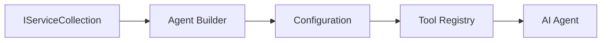

<!--
CO_OP_TRANSLATOR_METADATA:
{
  "original_hash": "bcc874e190347bd6a095aed56dc16de8",
  "translation_date": "2025-11-13T12:34:00+00:00",
  "source_file": "03-agentic-design-patterns/code_samples/03-dotnet-agent-framework.md",
  "language_code": "el"
}
-->
# 🎨 Σχέδια Σχεδίασης Πρακτόρων με Μοντέλα GitHub (.NET)

## 📋 Στόχοι Μάθησης

Αυτό το παράδειγμα παρουσιάζει σχέδια σχεδίασης επιπέδου επιχείρησης για τη δημιουργία έξυπνων πρακτόρων χρησιμοποιώντας το Microsoft Agent Framework σε .NET με ενσωμάτωση Μοντέλων GitHub. Θα μάθετε επαγγελματικά σχέδια και αρχιτεκτονικές προσεγγίσεις που καθιστούν τους πράκτορες έτοιμους για παραγωγή, συντηρήσιμους και επεκτάσιμους.

### Σχέδια Σχεδίασης Επιπέδου Επιχείρησης

- 🏭 **Factory Pattern**: Τυποποιημένη δημιουργία πρακτόρων με εξάρτηση από injection
- 🔧 **Builder Pattern**: Ρευστή διαμόρφωση και ρύθμιση πρακτόρων
- 🧵 **Thread-Safe Patterns**: Διαχείριση συνομιλιών με ταυτόχρονη εκτέλεση
- 📋 **Repository Pattern**: Οργανωμένη διαχείριση εργαλείων και δυνατοτήτων

## 🎯 Αρχιτεκτονικά Οφέλη του .NET

### Χαρακτηριστικά Επιπέδου Επιχείρησης

- **Ισχυρή Τυποποίηση**: Επικύρωση κατά τη μεταγλώττιση και υποστήριξη IntelliSense
- **Dependency Injection**: Ενσωμάτωση ενσωματωμένου DI container
- **Διαχείριση Διαμόρφωσης**: Μοτίβα IConfiguration και Options
- **Async/Await**: Υποστήριξη ασύγχρονου προγραμματισμού πρώτης κατηγορίας

### Μοτίβα Έτοιμα για Παραγωγή

- **Ενσωμάτωση Καταγραφής**: Υποστήριξη ILogger και δομημένης καταγραφής
- **Έλεγχοι Υγείας**: Ενσωματωμένη παρακολούθηση και διαγνωστικά
- **Επικύρωση Διαμόρφωσης**: Ισχυρή τυποποίηση με σχολιασμούς δεδομένων
- **Διαχείριση Σφαλμάτων**: Δομημένη διαχείριση εξαιρέσεων

## 🔧 Τεχνική Αρχιτεκτονική

### Κύρια Συστατικά του .NET

- **Microsoft.Extensions.AI**: Ενοποιημένες αφαιρέσεις υπηρεσιών AI
- **Microsoft.Agents.AI**: Πλαίσιο ορχήστρας πρακτόρων επιπέδου επιχείρησης
- **Ενσωμάτωση Μοντέλων GitHub**: Μοτίβα API πελάτη υψηλής απόδοσης
- **Σύστημα Διαμόρφωσης**: Ενσωμάτωση appsettings.json και περιβάλλοντος

### Υλοποίηση Σχεδίων Σχεδίασης



## 🏗️ Επιδεικνυόμενα Σχέδια Επιπέδου Επιχείρησης

### 1. **Δημιουργικά Σχέδια**

- **Agent Factory**: Κεντρική δημιουργία πρακτόρων με συνεπή διαμόρφωση
- **Builder Pattern**: Ρευστό API για σύνθετη διαμόρφωση πρακτόρων
- **Singleton Pattern**: Διαχείριση κοινών πόρων και διαμόρφωσης
- **Dependency Injection**: Χαλαρή σύζευξη και δυνατότητα δοκιμών

### 2. **Συμπεριφορικά Σχέδια**

- **Strategy Pattern**: Εναλλάξιμες στρατηγικές εκτέλεσης εργαλείων
- **Command Pattern**: Ενθυλακωμένες λειτουργίες πρακτόρων με undo/redo
- **Observer Pattern**: Διαχείριση κύκλου ζωής πρακτόρων με βάση τα γεγονότα
- **Template Method**: Τυποποιημένες ροές εργασίας εκτέλεσης πρακτόρων

### 3. **Δομικά Σχέδια**

- **Adapter Pattern**: Επίπεδο ενσωμάτωσης API Μοντέλων GitHub
- **Decorator Pattern**: Ενίσχυση δυνατοτήτων πρακτόρων
- **Facade Pattern**: Απλοποιημένες διεπαφές αλληλεπίδρασης πρακτόρων
- **Proxy Pattern**: Lazy loading και caching για απόδοση

## 📚 Αρχές Σχεδίασης .NET

### Αρχές SOLID

- **Single Responsibility**: Κάθε συστατικό έχει έναν σαφή σκοπό
- **Open/Closed**: Επεκτάσιμο χωρίς τροποποίηση
- **Liskov Substitution**: Υλοποιήσεις εργαλείων βασισμένες σε διεπαφές
- **Interface Segregation**: Εστιασμένες, συνεκτικές διεπαφές
- **Dependency Inversion**: Εξάρτηση από αφαιρέσεις, όχι από συγκεκριμένα

### Καθαρή Αρχιτεκτονική

- **Επίπεδο Τομέα**: Βασικές αφαιρέσεις πρακτόρων και εργαλείων
- **Επίπεδο Εφαρμογής**: Ορχήστρα πρακτόρων και ροές εργασίας
- **Επίπεδο Υποδομής**: Ενσωμάτωση Μοντέλων GitHub και εξωτερικών υπηρεσιών
- **Επίπεδο Παρουσίασης**: Αλληλεπίδραση χρήστη και μορφοποίηση απαντήσεων

## 🔒 Σκέψεις Επιπέδου Επιχείρησης

### Ασφάλεια

- **Διαχείριση Διαπιστευτηρίων**: Ασφαλής χειρισμός API key με IConfiguration
- **Επικύρωση Εισόδου**: Ισχυρή τυποποίηση και επικύρωση σχολιασμών δεδομένων
- **Καθαρισμός Εξόδου**: Ασφαλής επεξεργασία και φιλτράρισμα απαντήσεων
- **Καταγραφή Ελέγχου**: Ολοκληρωμένη παρακολούθηση λειτουργιών

### Απόδοση

- **Ασύγχρονα Μοτίβα**: Μη μπλοκαρισμένες λειτουργίες I/O
- **Pooling Συνδέσεων**: Αποτελεσματική διαχείριση HTTP client
- **Caching**: Cache απαντήσεων για βελτιωμένη απόδοση
- **Διαχείριση Πόρων**: Σωστή διάθεση και καθαρισμός

### Επεκτασιμότητα

- **Ασφάλεια Νημάτων**: Υποστήριξη ταυτόχρονης εκτέλεσης πρακτόρων
- **Pooling Πόρων**: Αποτελεσματική αξιοποίηση πόρων
- **Διαχείριση Φορτίου**: Περιορισμός ρυθμού και διαχείριση πίεσης
- **Παρακολούθηση**: Μετρήσεις απόδοσης και έλεγχοι υγείας

## 🚀 Ανάπτυξη σε Παραγωγή

- **Διαχείριση Διαμόρφωσης**: Ρυθμίσεις συγκεκριμένες για το περιβάλλον
- **Στρατηγική Καταγραφής**: Δομημένη καταγραφή με αναγνωριστικά συσχέτισης
- **Διαχείριση Σφαλμάτων**: Παγκόσμια διαχείριση εξαιρέσεων με σωστή ανάκτηση
- **Παρακολούθηση**: Application insights και μετρητές απόδοσης
- **Δοκιμές**: Μοτίβα μονάδων, ολοκλήρωσης και δοκιμών φόρτωσης

Έτοιμοι να δημιουργήσετε έξυπνους πράκτορες επιπέδου επιχείρησης με .NET; Ας σχεδιάσουμε κάτι ανθεκτικό! 🏢✨

## 🚀 Ξεκινώντας

### Προαπαιτούμενα

- [.NET 10 SDK](https://dotnet.microsoft.com/download/dotnet/10.0) ή νεότερο
- [GitHub Models API access token](https://docs.github.com/github-models/github-models-at-scale/using-your-own-api-keys-in-github-models)

### Απαιτούμενες Μεταβλητές Περιβάλλοντος

```bash
# zsh/bash
export GH_TOKEN=<your_github_token>
export GH_ENDPOINT=https://models.github.ai/inference
export GH_MODEL_ID=openai/gpt-5-mini
```

```powershell
# PowerShell
$env:GH_TOKEN = "<your_github_token>"
$env:GH_ENDPOINT = "https://models.github.ai/inference"
$env:GH_MODEL_ID = "openai/gpt-5-mini"
```

### Παράδειγμα Κώδικα

Για να εκτελέσετε το παράδειγμα κώδικα,

```bash
# zsh/bash
chmod +x ./03-dotnet-agent-framework.cs
./03-dotnet-agent-framework.cs
```

Ή χρησιμοποιώντας το dotnet CLI:

```bash
dotnet run ./03-dotnet-agent-framework.cs
```

Δείτε το [`03-dotnet-agent-framework.cs`](../../../../03-agentic-design-patterns/code_samples/03-dotnet-agent-framework.cs) για τον πλήρη κώδικα.

```csharp
#!/usr/bin/dotnet run

#:package Microsoft.Extensions.AI@10.*
#:package Microsoft.Agents.AI.OpenAI@1.*-*

using System.ClientModel;
using System.ComponentModel;

using Microsoft.Agents.AI;
using Microsoft.Extensions.AI;

using OpenAI;

// Tool Function: Random Destination Generator
// This static method will be available to the agent as a callable tool
// The [Description] attribute helps the AI understand when to use this function
// This demonstrates how to create custom tools for AI agents
[Description("Provides a random vacation destination.")]
static string GetRandomDestination()
{
    // List of popular vacation destinations around the world
    // The agent will randomly select from these options
    var destinations = new List<string>
    {
        "Paris, France",
        "Tokyo, Japan",
        "New York City, USA",
        "Sydney, Australia",
        "Rome, Italy",
        "Barcelona, Spain",
        "Cape Town, South Africa",
        "Rio de Janeiro, Brazil",
        "Bangkok, Thailand",
        "Vancouver, Canada"
    };

    // Generate random index and return selected destination
    // Uses System.Random for simple random selection
    var random = new Random();
    int index = random.Next(destinations.Count);
    return destinations[index];
}

// Extract configuration from environment variables
// Retrieve the GitHub Models API endpoint, defaults to https://models.github.ai/inference if not specified
// Retrieve the model ID, defaults to openai/gpt-5-mini if not specified
// Retrieve the GitHub token for authentication, throws exception if not specified
var github_endpoint = Environment.GetEnvironmentVariable("GH_ENDPOINT") ?? "https://models.github.ai/inference";
var github_model_id = Environment.GetEnvironmentVariable("GH_MODEL_ID") ?? "openai/gpt-5-mini";
var github_token = Environment.GetEnvironmentVariable("GH_TOKEN") ?? throw new InvalidOperationException("GH_TOKEN is not set.");

// Configure OpenAI Client Options
// Create configuration options to point to GitHub Models endpoint
// This redirects OpenAI client calls to GitHub's model inference service
var openAIOptions = new OpenAIClientOptions()
{
    Endpoint = new Uri(github_endpoint)
};

// Initialize OpenAI Client with GitHub Models Configuration
// Create OpenAI client using GitHub token for authentication
// Configure it to use GitHub Models endpoint instead of OpenAI directly
var openAIClient = new OpenAIClient(new ApiKeyCredential(github_token), openAIOptions);

// Define Agent Identity and Comprehensive Instructions
// Agent name for identification and logging purposes
var AGENT_NAME = "TravelAgent";

// Detailed instructions that define the agent's personality, capabilities, and behavior
// This system prompt shapes how the agent responds and interacts with users
var AGENT_INSTRUCTIONS = """
You are a helpful AI Agent that can help plan vacations for customers.

Important: When users specify a destination, always plan for that location. Only suggest random destinations when the user hasn't specified a preference.

When the conversation begins, introduce yourself with this message:
"Hello! I'm your TravelAgent assistant. I can help plan vacations and suggest interesting destinations for you. Here are some things you can ask me:
1. Plan a day trip to a specific location
2. Suggest a random vacation destination
3. Find destinations with specific features (beaches, mountains, historical sites, etc.)
4. Plan an alternative trip if you don't like my first suggestion

What kind of trip would you like me to help you plan today?"

Always prioritize user preferences. If they mention a specific destination like "Bali" or "Paris," focus your planning on that location rather than suggesting alternatives.
""";

// Create AI Agent with Advanced Travel Planning Capabilities
// Initialize complete agent pipeline: OpenAI client → Chat client → AI agent
// Configure agent with name, detailed instructions, and available tools
// This demonstrates the .NET agent creation pattern with full configuration
AIAgent agent = openAIClient
    .GetChatClient(github_model_id)
    .CreateAIAgent(
        name: AGENT_NAME,
        instructions: AGENT_INSTRUCTIONS,
        tools: [AIFunctionFactory.Create(GetRandomDestination)]
    );

// Create New Conversation Thread for Context Management
// Initialize a new conversation thread to maintain context across multiple interactions
// Threads enable the agent to remember previous exchanges and maintain conversational state
// This is essential for multi-turn conversations and contextual understanding
AgentThread thread = agent.GetNewThread();

// Execute Agent: First Travel Planning Request
// Run the agent with an initial request that will likely trigger the random destination tool
// The agent will analyze the request, use the GetRandomDestination tool, and create an itinerary
// Using the thread parameter maintains conversation context for subsequent interactions
await foreach (var update in agent.RunStreamingAsync("Plan me a day trip", thread))
{
    await Task.Delay(10);
    Console.Write(update);
}

Console.WriteLine();

// Execute Agent: Follow-up Request with Context Awareness
// Demonstrate contextual conversation by referencing the previous response
// The agent remembers the previous destination suggestion and will provide an alternative
// This showcases the power of conversation threads and contextual understanding in .NET agents
await foreach (var update in agent.RunStreamingAsync("I don't like that destination. Plan me another vacation.", thread))
{
    await Task.Delay(10);
    Console.Write(update);
}
```

---

<!-- CO-OP TRANSLATOR DISCLAIMER START -->
**Αποποίηση ευθυνών**:  
Αυτό το έγγραφο έχει μεταφραστεί χρησιμοποιώντας την υπηρεσία αυτόματης μετάφρασης AI [Co-op Translator](https://github.com/Azure/co-op-translator). Παρόλο που καταβάλλουμε προσπάθειες για ακρίβεια, παρακαλούμε να έχετε υπόψη ότι οι αυτόματες μεταφράσεις ενδέχεται να περιέχουν λάθη ή ανακρίβειες. Το πρωτότυπο έγγραφο στη μητρική του γλώσσα θα πρέπει να θεωρείται η αυθεντική πηγή. Για κρίσιμες πληροφορίες, συνιστάται επαγγελματική ανθρώπινη μετάφραση. Δεν φέρουμε ευθύνη για τυχόν παρεξηγήσεις ή εσφαλμένες ερμηνείες που προκύπτουν από τη χρήση αυτής της μετάφρασης.
<!-- CO-OP TRANSLATOR DISCLAIMER END -->