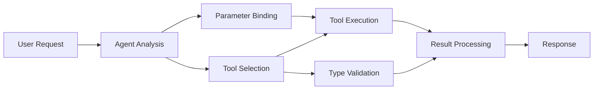

<!--
CO_OP_TRANSLATOR_METADATA:
{
  "original_hash": "91d6061e402489603f2ec8b528cae59b",
  "translation_date": "2025-11-18T17:32:40+00:00",
  "source_file": "04-tool-use/code_samples/04-dotnet-agent-framework.md",
  "language_code": "el"
}
-->
# 🛠️ Προχωρημένη Χρήση Εργαλείων με Μοντέλα GitHub (.NET)

## 📋 Στόχοι Μάθησης

Αυτό το σημειωματάριο παρουσιάζει πρότυπα ενσωμάτωσης εργαλείων επιχειρηματικής κλάσης χρησιμοποιώντας το Microsoft Agent Framework σε .NET με Μοντέλα GitHub. Θα μάθετε να δημιουργείτε εξελιγμένους πράκτορες με πολλαπλά εξειδικευμένα εργαλεία, αξιοποιώντας την ισχυρή τυποποίηση της C# και τις δυνατότητες επιχειρηματικής κλάσης του .NET.

### Προχωρημένες Δυνατότητες Εργαλείων που θα Κατακτήσετε

- 🔧 **Αρχιτεκτονική Πολλαπλών Εργαλείων**: Δημιουργία πρακτόρων με πολλαπλές εξειδικευμένες δυνατότητες
- 🎯 **Εκτέλεση Εργαλείων με Ασφάλεια Τύπου**: Αξιοποίηση της επαλήθευσης χρόνου μεταγλώττισης της C#
- 📊 **Πρότυπα Εργαλείων Επιχειρηματικής Κλάσης**: Σχεδιασμός εργαλείων έτοιμων για παραγωγή και διαχείριση σφαλμάτων
- 🔗 **Σύνθεση Εργαλείων**: Συνδυασμός εργαλείων για σύνθετες επιχειρηματικές ροές εργασίας

## 🎯 Οφέλη Αρχιτεκτονικής Εργαλείων .NET

### Χαρακτηριστικά Εργαλείων Επιχειρηματικής Κλάσης

- **Επαλήθευση Χρόνου Μεταγλώττισης**: Η ισχυρή τυποποίηση εξασφαλίζει την ορθότητα των παραμέτρων εργαλείων
- **Εισαγωγή Εξαρτήσεων**: Ενσωμάτωση IoC container για διαχείριση εργαλείων
- **Πρότυπα Async/Await**: Εκτέλεση εργαλείων χωρίς αποκλεισμό με σωστή διαχείριση πόρων
- **Δομημένη Καταγραφή**: Ενσωματωμένη καταγραφή για παρακολούθηση εκτέλεσης εργαλείων

### Πρότυπα Έτοιμα για Παραγωγή

- **Διαχείριση Εξαιρέσεων**: Ολοκληρωμένη διαχείριση σφαλμάτων με τυποποιημένες εξαιρέσεις
- **Διαχείριση Πόρων**: Σωστά πρότυπα διάθεσης και διαχείρισης μνήμης
- **Παρακολούθηση Απόδοσης**: Ενσωματωμένες μετρήσεις και μετρητές απόδοσης
- **Διαχείριση Ρυθμίσεων**: Τυποποιημένη διαμόρφωση με επαλήθευση

## 🔧 Τεχνική Αρχιτεκτονική

### Βασικά Στοιχεία Εργαλείων .NET

- **Microsoft.Extensions.AI**: Ενιαίο επίπεδο αφαίρεσης εργαλείων
- **Microsoft.Agents.AI**: Οργάνωση εργαλείων επιχειρηματικής κλάσης
- **Ενσωμάτωση Μοντέλων GitHub**: Πελάτης API υψηλής απόδοσης με pooling συνδέσεων

### Αγωγός Εκτέλεσης Εργαλείων



## 🛠️ Κατηγορίες & Πρότυπα Εργαλείων

### 1. **Εργαλεία Επεξεργασίας Δεδομένων**

- **Επαλήθευση Εισόδου**: Ισχυρή τυποποίηση με σχολιασμούς δεδομένων
- **Λειτουργίες Μετασχηματισμού**: Τυποποιημένη μετατροπή και μορφοποίηση δεδομένων
- **Επιχειρηματική Λογική**: Εργαλεία υπολογισμού και ανάλυσης ειδικά για τον τομέα
- **Μορφοποίηση Εξόδου**: Δημιουργία δομημένων απαντήσεων

### 2. **Εργαλεία Ενσωμάτωσης**

- **Συνδέσεις API**: Ενσωμάτωση υπηρεσιών RESTful με HttpClient
- **Εργαλεία Βάσεων Δεδομένων**: Ενσωμάτωση Entity Framework για πρόσβαση σε δεδομένα
- **Λειτουργίες Αρχείων**: Ασφαλείς λειτουργίες συστήματος αρχείων με επαλήθευση
- **Εξωτερικές Υπηρεσίες**: Πρότυπα ενσωμάτωσης τρίτων υπηρεσιών

### 3. **Εργαλεία Βοηθητικά**

- **Επεξεργασία Κειμένου**: Χειρισμός και μορφοποίηση συμβολοσειρών
- **Λειτουργίες Ημερομηνίας/Ώρας**: Υπολογισμοί ημερομηνίας/ώρας με πολιτισμική ευαισθησία
- **Μαθηματικά Εργαλεία**: Ακριβείς υπολογισμοί και στατιστικές λειτουργίες
- **Εργαλεία Επαλήθευσης**: Επαλήθευση επιχειρηματικών κανόνων και δεδομένων

Έτοιμοι να δημιουργήσετε πράκτορες επιχειρηματικής κλάσης με ισχυρές, τυποποιημένες δυνατότητες εργαλείων σε .NET; Ας σχεδιάσουμε επαγγελματικές λύσεις! 🏢⚡

## 🚀 Ξεκινώντας

### Προαπαιτούμενα

- [.NET 10 SDK](https://dotnet.microsoft.com/download/dotnet/10.0) ή νεότερο
- [GitHub Models API access token](https://docs.github.com/github-models/github-models-at-scale/using-your-own-api-keys-in-github-models)

### Απαιτούμενες Μεταβλητές Περιβάλλοντος

```bash
# zsh/bash
export GH_TOKEN=<your_github_token>
export GH_ENDPOINT=https://models.github.ai/inference
export GH_MODEL_ID=openai/gpt-5-mini
```

```powershell
# PowerShell
$env:GH_TOKEN = "<your_github_token>"
$env:GH_ENDPOINT = "https://models.github.ai/inference"
$env:GH_MODEL_ID = "openai/gpt-5-mini"
```

### Παράδειγμα Κώδικα

Για να εκτελέσετε το παράδειγμα κώδικα,

```bash
# zsh/bash
chmod +x ./04-dotnet-agent-framework.cs
./04-dotnet-agent-framework.cs
```

Ή χρησιμοποιώντας το dotnet CLI:

```bash
dotnet run ./04-dotnet-agent-framework.cs
```

Δείτε το [`04-dotnet-agent-framework.cs`](../../../../04-tool-use/code_samples/04-dotnet-agent-framework.cs) για τον πλήρη κώδικα.

```csharp
#!/usr/bin/dotnet run

#:package Microsoft.Extensions.AI@10.*
#:package Microsoft.Agents.AI.OpenAI@1.*-*

using System.ClientModel;
using System.ComponentModel;

using Microsoft.Agents.AI;
using Microsoft.Extensions.AI;

using OpenAI;

// Tool Function: Random Destination Generator
// This static method will be available to the agent as a callable tool
// The [Description] attribute helps the AI understand when to use this function
// This demonstrates how to create custom tools for AI agents
[Description("Provides a random vacation destination.")]
static string GetRandomDestination()
{
    // List of popular vacation destinations around the world
    // The agent will randomly select from these options
    var destinations = new List<string>
    {
        "Paris, France",
        "Tokyo, Japan",
        "New York City, USA",
        "Sydney, Australia",
        "Rome, Italy",
        "Barcelona, Spain",
        "Cape Town, South Africa",
        "Rio de Janeiro, Brazil",
        "Bangkok, Thailand",
        "Vancouver, Canada"
    };

    // Generate random index and return selected destination
    // Uses System.Random for simple random selection
    var random = new Random();
    int index = random.Next(destinations.Count);
    return destinations[index];
}

// Extract configuration from environment variables
// Retrieve the GitHub Models API endpoint, defaults to https://models.github.ai/inference if not specified
// Retrieve the model ID, defaults to openai/gpt-5-mini if not specified
// Retrieve the GitHub token for authentication, throws exception if not specified
var github_endpoint = Environment.GetEnvironmentVariable("GH_ENDPOINT") ?? "https://models.github.ai/inference";
var github_model_id = Environment.GetEnvironmentVariable("GH_MODEL_ID") ?? "openai/gpt-5-mini";
var github_token = Environment.GetEnvironmentVariable("GH_TOKEN") ?? throw new InvalidOperationException("GH_TOKEN is not set.");

// Configure OpenAI Client Options
// Create configuration options to point to GitHub Models endpoint
// This redirects OpenAI client calls to GitHub's model inference service
var openAIOptions = new OpenAIClientOptions()
{
    Endpoint = new Uri(github_endpoint)
};

// Initialize OpenAI Client with GitHub Models Configuration
// Create OpenAI client using GitHub token for authentication
// Configure it to use GitHub Models endpoint instead of OpenAI directly
var openAIClient = new OpenAIClient(new ApiKeyCredential(github_token), openAIOptions);

// Define Agent Identity and Comprehensive Instructions
// Agent name for identification and logging purposes
var AGENT_NAME = "TravelAgent";

// Detailed instructions that define the agent's personality, capabilities, and behavior
// This system prompt shapes how the agent responds and interacts with users
var AGENT_INSTRUCTIONS = """
You are a helpful AI Agent that can help plan vacations for customers.

Important: When users specify a destination, always plan for that location. Only suggest random destinations when the user hasn't specified a preference.

When the conversation begins, introduce yourself with this message:
"Hello! I'm your TravelAgent assistant. I can help plan vacations and suggest interesting destinations for you. Here are some things you can ask me:
1. Plan a day trip to a specific location
2. Suggest a random vacation destination
3. Find destinations with specific features (beaches, mountains, historical sites, etc.)
4. Plan an alternative trip if you don't like my first suggestion

What kind of trip would you like me to help you plan today?"

Always prioritize user preferences. If they mention a specific destination like "Bali" or "Paris," focus your planning on that location rather than suggesting alternatives.
""";

// Create AI Agent with Advanced Travel Planning Capabilities
// Initialize complete agent pipeline: OpenAI client → Chat client → AI agent
// Configure agent with name, detailed instructions, and available tools
// This demonstrates the .NET agent creation pattern with full configuration
AIAgent agent = openAIClient
    .GetChatClient(github_model_id)
    .CreateAIAgent(
        name: AGENT_NAME,
        instructions: AGENT_INSTRUCTIONS,
        tools: [AIFunctionFactory.Create(GetRandomDestination)]
    );

// Create New Conversation Thread for Context Management
// Initialize a new conversation thread to maintain context across multiple interactions
// Threads enable the agent to remember previous exchanges and maintain conversational state
// This is essential for multi-turn conversations and contextual understanding
AgentThread thread = agent.GetNewThread();

// Execute Agent: First Travel Planning Request
// Run the agent with an initial request that will likely trigger the random destination tool
// The agent will analyze the request, use the GetRandomDestination tool, and create an itinerary
// Using the thread parameter maintains conversation context for subsequent interactions
await foreach (var update in agent.RunStreamingAsync("Plan me a day trip", thread))
{
    await Task.Delay(10);
    Console.Write(update);
}

Console.WriteLine();

// Execute Agent: Follow-up Request with Context Awareness
// Demonstrate contextual conversation by referencing the previous response
// The agent remembers the previous destination suggestion and will provide an alternative
// This showcases the power of conversation threads and contextual understanding in .NET agents
await foreach (var update in agent.RunStreamingAsync("I don't like that destination. Plan me another vacation.", thread))
{
    await Task.Delay(10);
    Console.Write(update);
}
```

---

<!-- CO-OP TRANSLATOR DISCLAIMER START -->
**Αποποίηση ευθυνών**:  
Αυτό το έγγραφο έχει μεταφραστεί χρησιμοποιώντας την υπηρεσία αυτόματης μετάφρασης [Co-op Translator](https://github.com/Azure/co-op-translator). Παρόλο που καταβάλλουμε προσπάθειες για ακρίβεια, παρακαλούμε να έχετε υπόψη ότι οι αυτόματες μεταφράσεις ενδέχεται να περιέχουν λάθη ή ανακρίβειες. Το πρωτότυπο έγγραφο στη μητρική του γλώσσα θα πρέπει να θεωρείται η αυθεντική πηγή. Για κρίσιμες πληροφορίες, συνιστάται επαγγελματική ανθρώπινη μετάφραση. Δεν φέρουμε ευθύνη για τυχόν παρεξηγήσεις ή εσφαλμένες ερμηνείες που προκύπτουν από τη χρήση αυτής της μετάφρασης.
<!-- CO-OP TRANSLATOR DISCLAIMER END -->