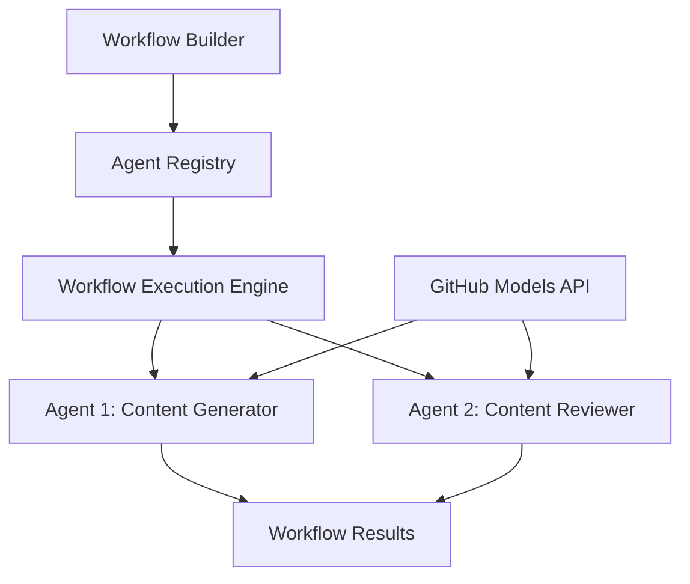

<!--
CO_OP_TRANSLATOR_METADATA:
{
  "original_hash": "034158688d0a45aae06dcbb21b0da5ae",
  "translation_date": "2025-11-11T12:49:51+00:00",
  "source_file": "08-multi-agent/code_samples/workflows-agent-framework/dotNET/01.dotnet-agent-framework-workflow-ghmodel-basic.md",
  "language_code": "el"
}
-->
# 🔄 Βασικές Ροές Εργασίας Πρακτόρων με Μοντέλα GitHub (.NET)

## 📋 Εκμάθηση Ορχήστρωσης Ροής Εργασίας

Αυτό το σημειωματάριο δείχνει πώς να δημιουργήσετε εξελιγμένες **ροές εργασίας πρακτόρων** χρησιμοποιώντας το Microsoft Agent Framework για .NET και τα Μοντέλα GitHub. Θα μάθετε να δημιουργείτε πολυβήματα επιχειρηματικών διαδικασιών όπου οι πράκτορες AI συνεργάζονται για να ολοκληρώσουν σύνθετες εργασίες μέσω δομημένων μοτίβων ορχήστρωσης.

## 🎯 Στόχοι Εκμάθησης

### 🏗️ **Βασικές Αρχές Αρχιτεκτονικής Ροής Εργασίας**
- **Δημιουργός Ροής Εργασίας**: Σχεδιάστε και οργανώστε σύνθετες πολυβήτες διαδικασίες AI
- **Συντονισμός Πρακτόρων**: Συντονίστε πολλούς εξειδικευμένους πράκτορες μέσα στις ροές εργασίας
- **Ενσωμάτωση Μοντέλων GitHub**: Χρησιμοποιήστε την υπηρεσία πρόβλεψης μοντέλων AI του GitHub στις ροές εργασίας
- **Οπτικός Σχεδιασμός Ροής Εργασίας**: Δημιουργήστε και οπτικοποιήστε δομές ροής εργασίας για καλύτερη κατανόηση

### 🔄 **Μοτίβα Ορχήστρωσης Διαδικασιών**
- **Διαδοχική Επεξεργασία**: Συνδέστε πολλαπλές εργασίες πρακτόρων σε λογική σειρά
- **Διαχείριση Κατάστασης**: Διατηρήστε το πλαίσιο και τη ροή δεδομένων μεταξύ των σταδίων της ροής εργασίας
- **Διαχείριση Σφαλμάτων**: Εφαρμόστε ανθεκτική ανάκτηση σφαλμάτων και αντοχή της ροής εργασίας
- **Βελτιστοποίηση Απόδοσης**: Σχεδιάστε αποδοτικές ροές εργασίας για λειτουργίες σε κλίμακα επιχειρήσεων

### 🏢 **Εφαρμογές Ροής Εργασίας Επιχειρήσεων**
- **Αυτοματοποίηση Επιχειρηματικών Διαδικασιών**: Αυτοματοποιήστε σύνθετες οργανωτικές ροές εργασίας
- **Παραγωγή Περιεχομένου**: Συντακτικές ροές εργασίας με στάδια αναθεώρησης και έγκρισης
- **Αυτοματοποίηση Εξυπηρέτησης Πελατών**: Πολυβήτες διαδικασίες επίλυσης αιτημάτων πελατών
- **Ροές Επεξεργασίας Δεδομένων**: Ροές ETL με μετασχηματισμό που υποστηρίζεται από AI

## ⚙️ Προαπαιτούμενα & Ρύθμιση

### 📦 **Απαραίτητα Πακέτα NuGet**

Αυτή η επίδειξη ροής εργασίας χρησιμοποιεί αρκετά βασικά πακέτα .NET:

```xml
<!-- Core AI Framework -->
<PackageReference Include="Microsoft.Extensions.AI" Version="9.9.0" />

<!-- Agent Framework (Local Development) -->
<!-- Microsoft.Agents.AI.dll - Core agent abstractions -->
<!-- Microsoft.Agents.AI.OpenAI.dll - OpenAI/GitHub Models integration -->

<!-- Configuration and Environment -->
<PackageReference Include="DotNetEnv" Version="3.1.1" />
```

### 🔑 **Ρύθμιση Μοντέλων GitHub**

**Ρύθμιση Περιβάλλοντος (.env file):**
```env
GITHUB_TOKEN=your_github_personal_access_token
GITHUB_ENDPOINT=https://models.inference.ai.azure.com
GITHUB_MODEL_ID=gpt-4o-mini
```

**Πρόσβαση στα Μοντέλα GitHub:**
1. Εγγραφείτε στα Μοντέλα GitHub (αυτή τη στιγμή σε προεπισκόπηση)
2. Δημιουργήστε ένα προσωπικό διακριτικό πρόσβασης με δικαιώματα πρόσβασης στα μοντέλα
3. Ρυθμίστε τις μεταβλητές περιβάλλοντος όπως φαίνεται παραπάνω

### 🏗️ **Επισκόπηση Αρχιτεκτονικής Ροής Εργασίας**



**Βασικά Στοιχεία:**
- **WorkflowBuilder**: Κύρια μηχανή ορχήστρωσης για το σχεδιασμό ροών εργασίας
- **AIAgent**: Εξειδικευμένοι πράκτορες με συγκεκριμένες δυνατότητες
- **GitHub Models Client**: Ενσωμάτωση υπηρεσίας πρόβλεψης μοντέλων AI
- **Execution Context**: Διαχειρίζεται την κατάσταση και τη ροή δεδομένων μεταξύ των σταδίων της ροής εργασίας

## 🎨 **Μοτίβα Σχεδιασμού Ροής Εργασίας Επιχειρήσεων**

### 📝 **Ροή Εργασίας Παραγωγής Περιεχομένου**
```
User Request → Content Generation → Quality Review → Final Output
```

### 🔍 **Αγωγός Επεξεργασίας Εγγράφων**
```
Document Input → Analysis → Extraction → Validation → Structured Output
```

### 💼 **Ροή Εργασίας Επιχειρηματικής Ευφυΐας**
```
Data Collection → Processing → Analysis → Report Generation → Distribution
```

### 🤝 **Αυτοματοποίηση Εξυπηρέτησης Πελατών**
```
Customer Inquiry → Classification → Processing → Response Generation → Follow-up
```

## 🏢 **Οφέλη για Επιχειρήσεις**

### 🎯 **Αξιοπιστία & Κλιμακωσιμότητα**
- **Ντετερμινιστική Εκτέλεση**: Συνεπή, επαναλαμβανόμενα αποτελέσματα ροής εργασίας
- **Ανάκτηση Σφαλμάτων**: Ομαλή διαχείριση αποτυχιών σε οποιοδήποτε στάδιο της ροής εργασίας
- **Παρακολούθηση Απόδοσης**: Παρακολούθηση μετρήσεων εκτέλεσης και ευκαιριών βελτιστοποίησης
- **Διαχείριση Πόρων**: Αποδοτική κατανομή και χρήση πόρων μοντέλων AI

### 🔒 **Ασφάλεια & Συμμόρφωση**
- **Ασφαλής Πιστοποίηση**: Πιστοποίηση με βάση διακριτικά GitHub για πρόσβαση στο API
- **Ιχνηλάτηση Ελέγχου**: Πλήρης καταγραφή εκτέλεσης ροής εργασίας και σημείων απόφασης
- **Έλεγχος Πρόσβασης**: Λεπτομερή δικαιώματα για εκτέλεση και παρακολούθηση ροών εργασίας
- **Ιδιωτικότητα Δεδομένων**: Ασφαλής διαχείριση ευαίσθητων πληροφοριών σε όλη τη ροή εργασίας

### 📊 **Παρατηρησιμότητα & Διαχείριση**
- **Οπτικός Σχεδιασμός Ροής Εργασίας**: Καθαρή αναπαράσταση ροών διαδικασιών και εξαρτήσεων
- **Παρακολούθηση Εκτέλεσης**: Παρακολούθηση σε πραγματικό χρόνο της προόδου και της απόδοσης της ροής εργασίας
- **Αναφορά Σφαλμάτων**: Λεπτομερής ανάλυση σφαλμάτων και δυνατότητες αποσφαλμάτωσης
- **Αναλυτικά Απόδοσης**: Μετρήσεις για βελτιστοποίηση και σχεδιασμό χωρητικότητας

Ας δημιουργήσουμε την πρώτη σας ροή εργασίας AI έτοιμη για επιχειρήσεις! 🚀

## 💻 Εκτέλεση του Κώδικα

Η πλήρης υλοποίηση είναι διαθέσιμη στο `01.dotnet-agent-framework-workflow-ghmodel-basic.cs`. Αυτό το αρχείο δείχνει:

1. **Ρύθμιση Περιβάλλοντος** - Φόρτωση διαπιστευτηρίων Μοντέλων GitHub από το αρχείο `.env`
2. **Ρύθμιση Πελάτη OpenAI** - Ρύθμιση του πελάτη για χρήση του τερματικού GitHub Models
3. **Δημιουργία Πρακτόρων** - Ορισμός εξειδικευμένων πρακτόρων (Front Desk και Concierge)
4. **Δημιουργός Ροής Εργασίας** - Δημιουργία ροής εργασίας πολλαπλών πρακτόρων με διαδοχική επεξεργασία
5. **Εκτέλεση Ροής Εργασίας** - Εκτέλεση της ροής εργασίας με αποτελέσματα σε ροή

### 🚀 Εκτέλεση του Παραδείγματος

```bash
# Make the script executable (Unix/Linux/macOS)
chmod +x 01.dotnet-agent-framework-workflow-ghmodel-basic.cs

# Run the workflow
./01.dotnet-agent-framework-workflow-ghmodel-basic.cs
```

Ή στα Windows:
```powershell
dotnet run 01.dotnet-agent-framework-workflow-ghmodel-basic.cs
```

### 📝 Αναμενόμενο Αποτέλεσμα

Η ροή εργασίας θα:
1. Δεχτεί το αίτημα προορισμού ταξιδιού σας ("Θα ήθελα να πάω στο Παρίσι")
2. Ο πράκτορας Front Desk παρέχει μια αρχική πρόταση
3. Ο πράκτορας Concierge αναθεωρεί και βελτιώνει την πρόταση
4. Το τελικό αποτέλεσμα εμφανίζει την πλήρη ροή συνομιλίας

### 🔧 Προσαρμογή

Μπορείτε να προσαρμόσετε τη ροή εργασίας:
- Τροποποιώντας τις οδηγίες των πρακτόρων για να αλλάξετε τη συμπεριφορά τους
- Προσθέτοντας περισσότερους πράκτορες για να δημιουργήσετε σύνθετες πολυβήτες ροές εργασίας
- Αλλάζοντας το μήνυμα χρήστη για να δοκιμάσετε διαφορετικά σενάρια
- Προσαρμόζοντας τις ακμές της ροής εργασίας για να δημιουργήσετε διαφορετικά μοτίβα εκτέλεσης

---

<!-- CO-OP TRANSLATOR DISCLAIMER START -->
**Αποποίηση ευθύνης**:  
Αυτό το έγγραφο έχει μεταφραστεί χρησιμοποιώντας την υπηρεσία αυτόματης μετάφρασης [Co-op Translator](https://github.com/Azure/co-op-translator). Παρόλο που καταβάλλουμε προσπάθειες για ακρίβεια, παρακαλούμε να έχετε υπόψη ότι οι αυτόματες μεταφράσεις ενδέχεται να περιέχουν λάθη ή ανακρίβειες. Το πρωτότυπο έγγραφο στη μητρική του γλώσσα θα πρέπει να θεωρείται η αυθεντική πηγή. Για κρίσιμες πληροφορίες, συνιστάται επαγγελματική ανθρώπινη μετάφραση. Δεν φέρουμε ευθύνη για τυχόν παρεξηγήσεις ή εσφαλμένες ερμηνείες που προκύπτουν από τη χρήση αυτής της μετάφρασης.
<!-- CO-OP TRANSLATOR DISCLAIMER END -->